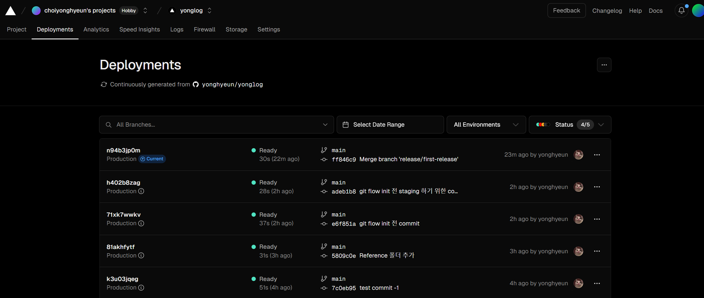

# 프로젝트 생성 및 깃허브 등록하기

---

프로젝트를 시작하기 전 가장 먼저 해야하는 깃허브 레파지토리 등록 및 프로젝트를 생성해주었다.


```dotnetcli
`npx create-next-app app --ts`

Need to install the following packages:
create-next-app@14.2.3
Ok to proceed? (y) y
√ Would you like to use ESLint? ... No / Yes
√ Would you like to use Tailwind CSS? ... No / Yes
√ Would you like to use `src/` directory? ... No / Yes
√ Would you like to use App Router? (recommended) ... No / Yes
√ Would you like to customize the default import alias (@/*)? ... No / Yes
Creating a new Next.js app in C:\Users\ttddc\OneDrive\바탕 화면\github\YongHyeunLog\app.

Using npm.

Initializing project with template: app-tw


Installing dependencies:
- react
- react-dom
- next

Installing devDependencies:
- typescript
- @types/node
- @types/react
- @types/react-dom
- postcss
- tailwindcss
- eslint
- eslint-config-next
```

두구두구 드디어 시작하자

# `CI/CD` 란 무엇일까 ?

---


부끄럽게도 나는 웹앱을 공부하면서 `CI/CD` 의 개념에 대해 알지 못했다.

공부를 위해 웹앱을 만들어보기만 했을 뿐 배포까지 생각해보지 않았기 때문이다.

그래서 이번 기회에 `CI/CD` 를 공부해보았다.

> 소프트웨어 공학에서 CI/CD는 지속적 통합(영어: continuous integration)과 지속적 배포(영어: continuous delivery, CD)가 결합한 사례를 의미한다. CI/CD는 소프트웨어의 개발, 테스트와 배포를 모두 통합함으로써 소프트웨어 버그를 쉽게 찾아낼 수 있으며, 더 빠른 배포 주기를 가질 수 있게 만들어 준다.
> _🪢 <a href = 'https://ko.wikipedia.org/wiki/CI/CD'>위키백과 CI/CD</a>_

`CI/CD` 란 소프트웨어의 개발 및 테스트 배포 과정을 통합한 파이프라인을 칭한다.

## 통합과 배포

---

개발자는 배포 하기 위한 `main branch` 를 생성하고 개발 환경에서 사용할 `dev branch` 를 만들어 해당 `branch` 에서 개발한다.

이후 `dev branch` 에서 완료된 프로덕트를 `main branch` 에 `merge` 하기 위해 테스트 코드를 이용하여 프로덕트에 사용될 코드를 합친다.

이러한 과정을 통합과정이라 한다.

개발자는 통합된 `main branch` 에 존재하는 프로덕트를 배포하기 위해 `main branch` 에 존재하는 코드를 `build` 하고 배포가 잘 되었는지 확인한다.

이러한 과정을 배포과정이라 한다.

## 지속적 통합과 지속적 배포 (`CI/CD`)

---

위의 통합과 배포 과정은 모든 통합과 배포 과정을 사람이 일일이 하나하나 해야 한다는 불편함을 겪는다.

또 , 일일이 하는 행위 자체가 불편할뿐더러 휴먼 에러가 발생해 예기치 못한 오류를 발견하고 해당 오류를 해결하기 위해 불필요한 에너지를 쏟아야 할 수도 있다.

이에 **`CI/CD` 방법론에선 통합과 배포 과정을 자동화하여 편리함과 휴먼에러를 줄여주도록 한다.**

그렇다면 지속적 통합과 지속적 배포를 어떤 식으로 사용 할지 계획해보자

# 지속적 통합 (`Continuous Intergrate`)

---

이름에서 알 수 있듯 `CI` 단계는 배포를 위해 사용될 `main branch` 와 개발을 위해 사용될 `dev branch` 들을 통합할 때 사용할 파이프라인을 의미한다.

`CI` 파이프라인을 만드는 목적은 다음과 같다.

- 통합 과정에서 수행되어야 하는 로직들을 자동화하자
  - 통합 과정에서 어떤 조건을 만족한다면 문제 없이 통합하자
  - 통합 과정에서 어떤 조건을 만족하지 못한다면 통합시키지 말자

`CI` 파이프라인을 만들기 위해선 다음과 같은 것들을 계획해야 한다.

- `branch` 들을 어떤 식으로 나누고 사용 할 것인지
- `branch` 를 통합하는 과정에서 어떤 과정을 거칠 것인지

## `branch` 전략이 왜 필요할까 ?

---

`branch` 전략을 구성하기 전, `branch` 가 왜 필요한지를 생각해보자

> _또 부끄러운 얘기지만 나는 모든 작업을 `main branch` 에서 사용했었다.._

`branch` 들을 분기시키는 행위는 작업 단위를 나눠주는 행위와 같다.

`branch` 를 분기시킴으로서 작업단위를 나눠 각 작업 단위의 목적에 맞게 관리하고 , 특정 작업 단위의 작업이 다른 작업 단위에 영향을 미치지 않을 수 있게 관리 할 수 있다.

만약 `branch` 를 사용하지 않고 `main branch` 만 사용 할 때 발생 할 수 있는 문제들을 생각해보자

**1. 작업들 하나하나가 배포에 영향을 줄 수 있다.**

만약 현재 `main branch` 를 이용해 배포중이고 `main branch` 에서 작업중이라 해보자

이 때 중간 중간 저장을 위해 `main branch` 에 중간 작업 과정을 `commit , push` 했을 때 나의 중간 작업이 치명적인 오류를 발생시켰다고 해보자

그렇다면 배포된 나의 사이트는 오류가 해결될 때 까지 배포가 중단되는 문제가 발생한다.

**2. 배포 버전을 추적하기가 어렵다.**

`main branch` 에서 배포와 작업을 모두 한다면 다양한 커밋 메시지들이 함께 섞여 사용될 것이다.

배포를 위한 커밋과 작업 단위를 저장하기 위한 커밋들이 모두 섞여 사용된다.

그렇다면 배포와 관련된 커밋을 확인하기 위해 수 많은 커밋 메시지들을 뚫어져라 쳐다봐야 한다.

위 예시들은 단순히 배포와 작업을 함께 나누지 않았을 때 발생 할 수 있는 기본적인 문제들을 이야기 한다.

그렇다면 이번엔 `branch` 들을 나누되 적절하지 않은 전략으로 나눴을 때 발생 할 수 있는 문제들을 생각해보자

배포를 위한 `main branch` , 작업을 위한 `dev branch` 로 나눠 사용중이라 생각해보자. `dev branch` 에서 작업된 작업이 `main branch` 로 통합되는 구조이다.

**1. `dev branch` 가 무거워진다.**

개발 시엔 다양한 기능들을 개발 할 수 있는데 다양한 기능들이 모두 하나의 `dev branch` 에서 관리되게 되면 너무 무거워진다.

또 다양한 기능 별의 작업 단위를 추적하는 것이 어렵다.

**2. 버그가 발생했을 때는 어떻게 관리해야 할까**

`dev branch` 도 원활한 작업을 위해 `main branch` 와 같이 오류가 존재하지 않는 무결한 `branch` 여야 한다.

그렇다면 만약 `main branch` 에서 오류가 발생했을 땐 어떤 `branch` 에서 작업해야 할까 ?

오류를 해결하기 위해 해당 코드를 `dev branch` 에서 작업하게 되면 이 또한 완전해야 하는 `dev branch` 를 깨는 행위이기 때문에 적절하지 않다.

이에 `branch` 들을 목적에 맞게 적절히 나누는 전략이 필요하다.

## `branch` 들을 어떻게 나눌까 ?

---

다양한 전략이 존재하는데 나는 `git-flow` 전략을 이용하기로 하였다.


_🪢 <a href = 'https://inpa.tistory.com/entry/GIT-%E2%9A%A1%EF%B8%8F-github-flow-git-flow-%F0%9F%93%88-%EB%B8%8C%EB%9E%9C%EC%B9%98-%EC%A0%84%EB%9E%B5'>[GIT] 📈 깃 브랜치 전략 정리 - Github Flow / Git Flow
출처: https://inpa.tistory.com/entry/GIT-⚡️-github-flow-git-flow-📈-브랜치-전략 [Inpa Dev 👨‍💻]</a>
_

`Git Flow` 전략은 `Main branch` 와 `Sub branch` 로 나눔으로서 `branch` 를 크게 나누고 각 `Main , Sub branch` 들 간에도 목적에 맞게 `branch` 를 나누는 전략이다.

### `Main Brach`

---

`Main Branch` 는 두 가지가 존재한다.

- 배포를 위한 `main branch`
- 개발을 위한 `dev branch`

각 `branch` 의 특징은 다음과 같다.

**`main branch`**

- `main branch` 는 항상 완전하고 무결한 상태로 존재해야 한다.
- `main branch` 는 `dev branch` 에서의 작업을 병합하여 생성된다.
- `dev branch` 에서 충분히 테스트가 완료된 작업물을 담고 있다.
- `main branch` 에서 오류가 발생한 경우엔 `Sub branch` 를 생성하여 해당 `branch` 에서 버그를 해결한 후 통합한다.

**`dev branch`**

- `dev branch` 는 항상 완전하고 무결한 상태로 존재해야 한다.
- `dev branch` 는 배포 되기 전 상태의 , `main branch` 에 통합되기 전 작업들을 저장하고 있다.
- `dev branch` 는 작업을 시작 할 때 `dev branch` 에서 작업하는 것이 아닌 다른 `branch` 를 생성하여 `Sub branch` 들에서 작업 및 통합하여 생성된다.

즉 쉽게 말해 `main brnach` 는 항상 최종 배포된 버전들의 작업 단위만 담고 있고 `dev branch` 는 최종 배포 되기 를 기다리는 작업 단위들을 담고 있다.

### `Sub branch or Feature branch`

---

`sub branch` 는 목적에 따라 생성되는 `branch` 들로 실질적인 코드 작업이 일어나는 작업 공간이다.

`Sub brnach` 들은 다음과 같은 `branch` 들을 가지고 있다.

- `hotfix branch` : `main branch` 에서 발생한 오류를 해결하기 위한 `branch` , 완료된 작업은 `main branch` 에 통합된다.
- `feature branch` : `dev branch` 에서 분기된 `branch` 로 특정 단위의 작업을 시행하기 위해 생성된다. 이후 완료된 작업은 `dev branch` 에 통합된다.
- `realse branch` : `dev branch` 에서 분기된 `branch` 로 작업들을 배포하기 위해 존재하는 `branch` 이다. 작업 단위들을 테스트 하고 테스트가 통과되면 `main branch , dev branch` 에 통합된다.

## `git flow brnach` 준비하기

---

### `git flow init`

---

깃허브에선 `git flow` 과정을 자동화 해둔 커맨드들이 존재한다. 야무지게 써주도록 하자

```dotnetcli
git flow init
```

```
Which branch should be used for bringing forth production releases?
   - main
Branch name for production releases: [main]
Branch name for "next release" development: [develop]

How to name your supporting branch prefixes?
Feature branches? [feature/]
Bugfix branches? [bugfix/]
Release branches? [release/]
Hotfix branches? [hotfix/]
Support branches? [support/]
Version tag prefix? []
Hooks and filters directory? [C:/Users/ttddc/OneDrive/바탕 화면/github/yonglog/.git/hooks]
```

클론해둔 레파지토리 폴더의 터미널에서 다음과 같은 명령어를 입력하면 위에서 설명한 `Main branch` 들은 자동으로 생성되어 있다.

```dotnetcli
$ git branch

* develop
  main
```

이렇게 자동으로 `branch` 가 생성되어 있고 현재 `develop branch` 에 `checkout` 되어 있는 모습을 볼 수 있다.

### `feature branch` 생성하기

---

오케이 지금 `develop branch` 에 있으니 `feature branch` 를 생성해서 작업을 해보도록 하자

```dotnetcli
$ git flow feature start first-feature-test
```

새로운 `feature branch` 를 만드는 커맨드는 `git flow feature start <branch name>` 이다.

나는 `first-feature-test` 라는 `branch` 를 만들었다.

```dotnetcli
Switched to a new branch 'feature/first-feature-test'
M       "docs/02. CI CD \355\214\214\354\235\264\355\224\204\353\235\274\354\235\270 \353\247\214\353\223\244\352\270\260/readme.md"

Summary of actions:
- A new branch 'feature/first-feature-test' was created, based on 'develop'
- You are now on branch 'feature/first-feature-test'

Now, start committing on your feature. When done, use:

     git flow feature finish first-feature-test
```

이렇게 실행해주고 나면 `feature/first-feature-test` 라는 `brach` 가 생성되고 자동으로 해당 브랜치로 이동된다.

```dotnetcli
PS C:\Users\ttddc\OneDrive\바탕 화면\github\yonglog\app> git branch
  develop
* feature/first-feature-test
  main
```

이후 해당 `branch` 에서 작업 후 작업 단위를 `add , commit` 해주자

```dotnetcli
PS C:\Users\ttddc\OneDrive\바탕 화면\github\yonglog\app> git add .
warning: in the working copy of 'app/src/app/page.tsx', LF will be replaced by CRLF the next time Git touches it

PS C:\Users\ttddc\OneDrive\바탕 화면\github\yonglog\app> git commit -m 'Home 문구 수정'
[feature/first-feature-test 7951880] Home 문구 수정
 1 file changed, 1 insertion(+), 3 deletions(-)
```

이렇게 수정된 사항들이 `feature branch` 에 작업되어 커밋되었다.

이러한 커밋 사항은 현재까지 `main branch , dev branch` 에는 영향을 미치지 않는다.

```dotnetcli
PS C:\Users\ttddc\OneDrive\바탕 화면\github\yonglog\app> git push
fatal: The current branch feature/first-feature-test has no upstream branch.
To push the current branch and set the remote as upstream, use

   git push --set-upstream origin feature/first-feature-test

To have this happen automatically for branches without a tracking
upstream, see 'push.autoSetupRemote' in 'git help config'.
```

옳지 않은 방법이지만 습관적으로 `git push` 를 입력했더니 다음과 같은 에러가 발생했다.

현재의 브랜치는 원격 저장소와 호환되는 브랜치가 아니기 때문에 이런 일이 발생한 것이다.

원격 저장소와 연결된 브랜치는 `main branch` 하나이기 때문에 `git push` 는 `main branch` 에서만 사용 가능하다. (설정을 통해 변경 할 수 있지만 계층 구조를 나누기 위해 다른 브랜치에선 `push` 가 안되도록 하자)

### `feature branch` 통합하기

---

통합하기 전 `feature` 에서 `readme.md` 와 프로젝트의 작업을 조금 수정해주었다.

수정된 데이터를 통합해보자

```bash
$ git flow feature finish first-feature-test
```

다음처럼 해당 `feature branch` 이름을 이용해 작업을 종료 시킬 수 있다.

종료된 작업은 자동으로 `develop` 에 `merge` 되고 작업이 종료된 `branch` 는 제거된다.

```bash
Switched to branch 'develop'
Merge made by the 'ort' strategy.
app/src/app/page.tsx | 4 +-
.../cicd.png | Bin
.../gitflow.jpg | Bin
.../image.png | Bin
.../readme.md | 107 ++++++++++++++++++++-
5 files changed, 106 insertions(+), 5 deletions(-)
rename docs/{02. CI CD 파이프라인 만들기 => 02. CI CD Pipeline}/cicd.png (100%)
rename docs/{02. CI CD 파이프라인 만들기 => 02. CI CD Pipeline}/gitflow.jpg (100%)
rename docs/{02. CI CD 파이프라인 만들기 => 02. CI CD Pipeline}/image.png (100%)
rename docs/{02. CI CD 파이프라인 만들기 => 02. CI CD Pipeline}/readme.md (73%)
Deleted branch feature/first-feature-test (was cddf484).

Summary of actions:

- The feature branch 'feature/first-feature-test' was merged into 'develop'
- Feature branch 'feature/first-feature-test' has been locally deleted
- You are now on branch 'develop'
```

### `release branch` 준비하기

---

자 이제 `feature branch` 에서 작업한 작업 단위가 `dev branch` 에 통합되었으니

`dev branch -> main branch` 로 통합 시키기 위해 `realse branch` 를 생성해보자

`realse branch` 는 `dev branch` 에서 분기 된 후 , `dev branch` 가 `realse branch` 에 통합되면 `realse branch` 는 본인에게 통합된 내용을 `main branch` 에 통합시킨다.

방법은 동일하게

```bash
$ git flow release start first-release
```

와 같이 `release branch` 를 생성해준다.

해당 부분에선 `main branch` 로 통합하기 전 다양한 일을 할 수 있지만 지금은 테스트만 할 것이니 바로 작업을 종료해주자

### `release brnach` 통합하기

```bash
$ git flow release finish first-release
```

다음과 같이 `release branch` 를 종료해주면 다음과 같은 문구가 뜬다.

```bash
#
# Write a message for tag:
#first-release
# Lines starting with '#' will be ignored.
```

이는 `main branch` 에 통합 될 때 붙을 태그 이름을 적으라는 것으로 `# first-release` 에 붙은 부분을 제거하고 원하는 태그명을 적어주면 된다.

태그 명을 적은후엔 `esc => :wq(wirte and quit)` 을 입력해주면 성공적으로 통합이 된다.

```bash
$ git flow release finish first-release
Branches 'main' and 'origin/main' have diverged.
And local branch 'main' is ahead of 'origin/main'.
Switched to branch 'main'
Your branch is ahead of 'origin/main' by 5 commits.
  (use "git push" to publish your local commits)
Switched to branch 'develop'
Merge made by the 'ort' strategy.
Deleted branch release/first-release (was e951284).

Summary of actions:
- Release branch 'release/first-release' has been merged into 'main'
- The release was tagged 'first-release'
- Release tag 'first-release' has been back-merged into 'develop'
- Release branch 'release/first-release' has been locally deleted
- You are now on branch 'develop'
```

`Summary` 부분을 보자. `release branch` 에 존재하던 정보들은 `tag` 이름이 붙은 채로 `main branch` 에 통합되었고 `develop` 에도 통합되었다고 한다.

이를 통해 `develop branch` 는 `main branch` 의 가장 최근 부분과 동기화 되도록 유지한다.

### 원격 저장소에 `push` 하기

---

```bash
$ git checkout main
$ git push
```

이후 `main` 브랜치로 이동 한 후 통합되어 `commit` 된 내용들을 `push` 해주기만 하면 된다.


`Git graph` 익스텐션을 이용해 `branch` 들이 분기되었다가 통합되는 모습을 볼 수 있다.

이렇게 지속적 통합을 하기 위한 파이프라인을 생성해보았다.

`feature -> develop -> release -> main` 으로 가는 흐름을 통해 작업 단위들을 독립적인 단위로 해줄 수 있었다.

다만 이는 완벽한 `git flow` 전략이 아닌데 그 이유는 `release` 단계에서 테스트 단계가 존재하지 않기 때문이다.

다음번엔 `github action` 을 이용해 테스트 코드를 작성해주도록 해야겠다.

# 지속적 배포 (`Continuous Deploy`)

---

지속적 배포는 깃허브 `main branch` 의 변화가 일어날 때 마다 자동으로 배포 해주는 파이프라인을 의미한다.

나는 `Vercel` 을 이용해 해당 레파지토리의 `main branch` 를 연결해줘 지속적 배포가 가능하도록 하였다.

> _알바 갈 시간이 얼마 남지 않아 빠르게 참고한 레퍼런스만 남기겠다._ > _매우 간단하니 쉽게 따라 할 수 있을 것이다._ > https://2dowon.github.io/docs/react/deploy-by-vercel/



실제 `Vercel` 에서 지속적 배포 되고 있는 모습을 보면 `main branch` 가 변경 될 때 마다 지속적으로 빌드되어 제공되고 있는 모습을 볼 수 있다.
