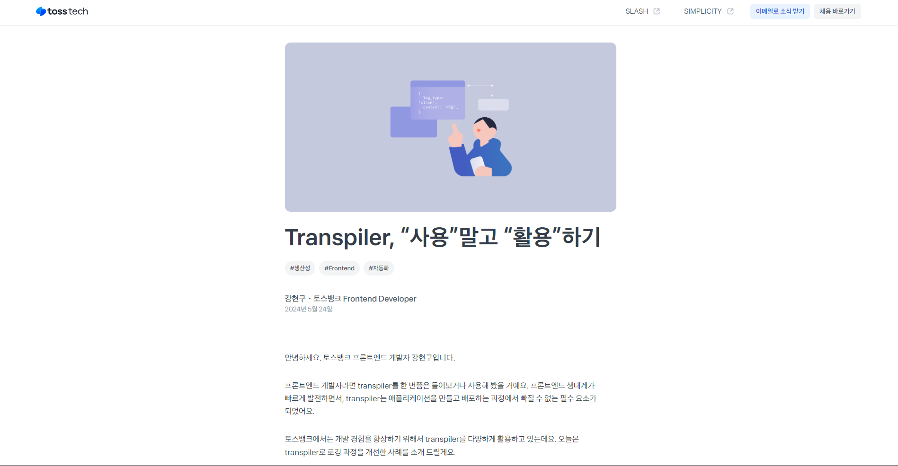
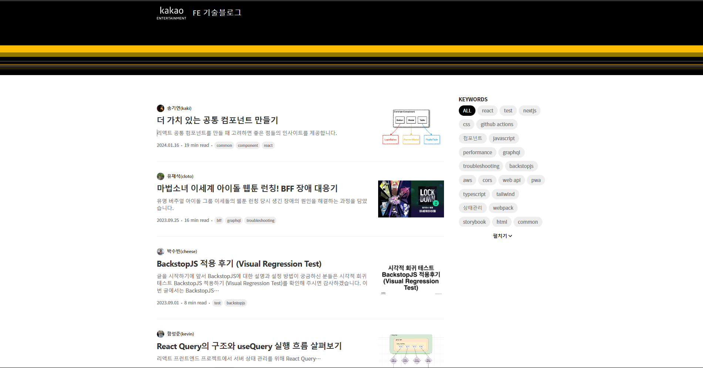

# 홈페이지 디자인

---

이전 `docs` 에서 `git flow branch` 전략을 이용한 `CI` , `Vercel` 을 이용한 `CD` 에 대해 공부했다.

물론 제대로 된 `CI` 를 위해선 `dev branch -> release branch -> main branch` 로 넘어갈 때 테스트 코드를 사용해서 테스트를 통과해야만 `main branch` 로 병합되도록 해야 하는데

우선은 추후 복잡한 기능들을 추가 할 때 넣기로 하고 지금은 디자인만 우선 해보려 한다.

# 어떤 UI 라이브러리를 쓸까 ?

---

직접 스타일드 컴포넌트를 이용해서 만들까도 생각했지만 지금은 프로토타입 단계라 생각하고 `tailwind` 를 쓰기로 했다.

`tailwind` 를 쓰면 동일한 디자인 패턴으로 작성된 클래스명을 쓸 수 있기 때문에 일관된 디자인을 유지 할 수 있다.

> _물론 공식문서를 보고 클래스명을 찾아 다녀야하는 런닝커브가 좀 있다 .. 나는 완전 끼고 산다 😂_

> `tailwind` 환경 설정 하기 위해 이것 저것 만져보고 그랬는데 잘못 설정해서 충돌이 났다.
> 알고보니 `create-next-app` 할 때 `tailwind` 쓸거냐는 물음에 `YES` 를 선택하기만 해도 필요한 환경 설정은 끝난다.

# 디자인 레퍼런스들 찾아보기

---

오케이 ~ 이제 준비는 끝났으니 어떻게 디자인 할지 찾아봐야겠다.

- **우아한 형제들 기술 블로그**
  

우아한 형제들 기술 블로그는 상단에 있는 태그 목록들을 클릭하면 태그 목록들을 만족하는 게시글들만 가져 올 수 있다.

되게 직관적이고 좋은 것 같다.

- **네이버 라인 기술 블로그**
  
  

- **컬리**
  
  

- **구글 코리아**
  

- **토스**

- **카카오**

블로그를 만들기 위해 필요한 페이지는 크게 두 가지인 것 같아 중요하다 생각하는 두 개의 페이지만을 가져왔다.

### 전체적인 특징

---

전체적인 특징으로는 모두 좌,우 여백이 매우 낭낭하다는 것이다.

어차피 사람의 시선은 중앙에서 머무르기 때문에 컨텐츠르 받아들일 때 시선을 좌 우로 많이 움직이는 것보다 좁은 영역으로 가둠으로서 집중력을 높힐 수 있기 때문이다.

또 , `GNB (Global Naviation Bar)` 이 존재한다는 점이 전체적인 특징이라 생각된다.

### 게시글을 모아두는 페이지

---

게시글을 모아두는 페이지는 두 종류가 있는 것 같다.

썸네일을 크게 하여 마치 쇼핑몰처럼 제목과 썸네일만 존재하는 페이지

썸네일을 작게하고 게시글들을 리스트 형태로 존재하는 페이지

나는 게시글들을 리스트 형태로 존재하는 형태로 구성하고 , 태그 별 혹은 시리즈 별로 게시글 리스트를 필터링 하는 방식을 사용하려 한다.

제목과 썸네일만 존재하는 페이지의 경우에는 게시글의 내용을 강조하기 위해서 썸네일을 매번 만들어야 하는데 썸네일을 매번 이쁘게 만들 자신이 없기 때문이다.

또 , 제목과 요약글로 이뤄진 게시글 리스트가 훨씬 보기에 어떤 게시글인지 파악하기가 쉬운듯 싶어서 말이다.

### 글 본문을 담는 페이지

---

글 본문은 대부분 비슷하다. 글 본문엔 인디게이터가 존재하는 곳이 있고 존재하지 않는 곳이 있었는데 나는 인디게이터를 추가해주려 한다. :)

대부분의 디자인 레퍼런스는 우아한 기술 블로그를 참고하여 만들도록 하자 화이팅
