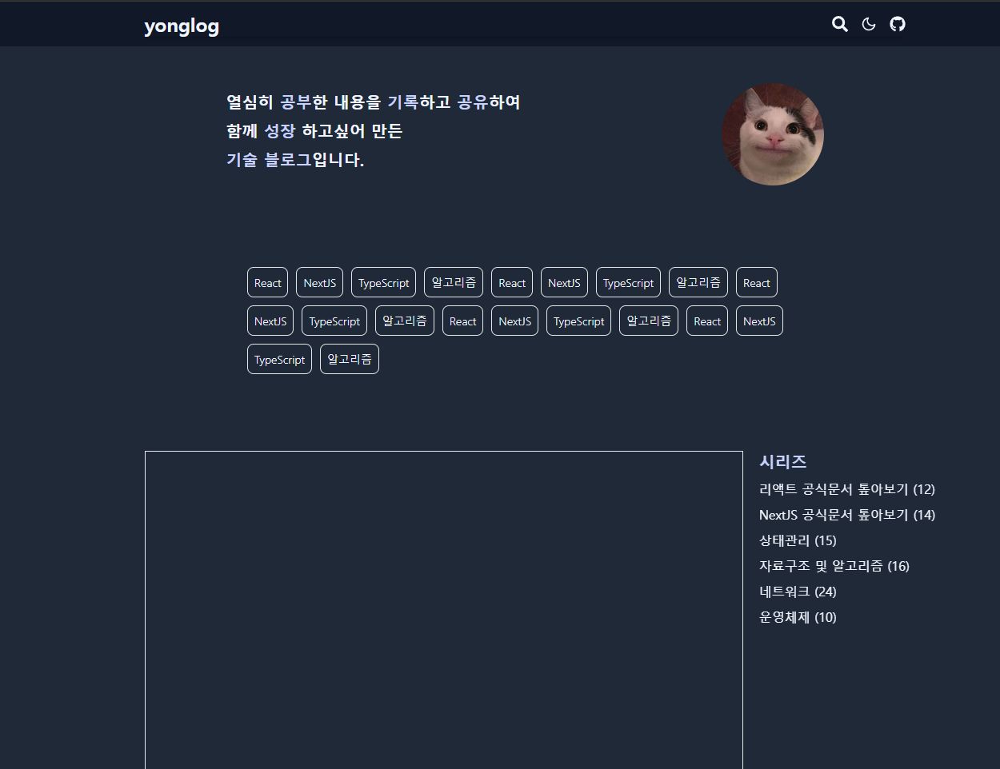

# MDX 를 사용하기 위한 라이브러리 설치하기

---

이전 `docs` 들에서 열심히 `ContentLayer` 를 이용하기 위해 공부하고 설치하려 했으나 `ContentLayer` 의 개발팀의 투자가 끊긴 후 업데이트가 되지 않아 `NextJS 14` 버전 이후부턴 `ContentLayer` 를 설치 할 수 없게 되었다.

> 개발 시장은 차갑다 ..

그래서 .. 눈물을 머금고 다른 라이브러리들을 사용하기로 했다.

대부분의 내용들은 `NextJS` 의 공식문서인 `Configuring:MDX` 를 참고했다.

<a href='https://nextjs.org/docs/app/building-your-application/configuring/mdx'>
  NextJS 공식문서 : Configuring : MDX
</a>

## 라이브러리 소개

### @next/mdx

---

<a href='https://www.npmjs.com/package/@next/mdx'>@next/mdx-npm</a>

해당 라이브러리는 `MDX` 파일을 `NextJS` 에서 컴포넌트처럼 이용 할 수 있게 도와주는 라이브러리이다.

> ### `MDX` ?
>
> `MDX` 는 `MarkDown + JSX` 의 파일 형식으로 `JSX` 를 내부에서 사용 가능한 마크다운 파일을 의미한다.
>
> 개발 블로그를 이용 할 때 주로 `MDX` 를 이용하곤 하는데 이는 `JSX` 를 `MDX` 내부에서 사용함으로서 페이지를 마크다운 내에서 렌더링 하거나
>
> `MDX` 파일을 컴포넌트처럼 불러와 브라우저에 렌더링 하도록 하기 위함이다.

`next.config.js` 에 해당 라이브러리를 감싸줌으로서 `MDX` 파일을 컴포넌트처럼 `import` 하여 사용하거나 컴포넌트 내부에 사용해줄 수 있다.

`MDX` 를 파일 시스템 기반 라우팅을 활용하여 `import` 해오는 것이 가능하며 이 때 리액트 컴포넌트처럼 불러오는 것을 가능하게 한다.

### @mdx-js/loader

---

<a href='https://www.npmjs.com/package/@mdx-js/loader'>@mdx-js/loader</a>

해당 라이브러리는 `MDX` 를 바벨 로더를 이용해 `MDX` 파일을 자바스크립트로 컴파일 시켜주는 라이브러리이다.

### next-mdx-remote

<a href='https://www.npmjs.com/package/next-mdx-remote'>next-mdx-remote</a>

해당 라이브러리는 파일 기반 라우팅 뿐 아니라 다양한 서버에 존재하는 `MDX` 파일을 가져올 수 있게 도와주는 라이브러리이다.

나는 웬만한 `MDX` 파일들을 모두 파일 기반 라우팅을 이용해 가져올 것이지만 , 혹시 모르니 해당 라이브러리를 이용해주도록 하자

## 라이브러리 설치하기

```bash
$ npm install @next/mdx @mdx-js/loader next-mdx-remote  @types/mdx
```

위에서 설명한 라이브러리들과 타입들을 설치한다.

## 환경 설정하기

---

```tsx
// next.config.js
const withMDX = require('@next/mdx')({
  extension: /\.mdx?$/,
});

/** @type {import('next').NextConfig} */
const nextConfig = {
  pageExtensions: ['js', 'jsx', 'ts', 'tsx', 'mdx'],
};

module.exports = withMDX(nextConfig);
```

`next.config.js` 파일에서 다음과 같이 `@next/mdx` 라이브러리를 불러와 `config` 파일을 감싸 사용한다.

이 때 `withMDX` 함수의 `extension` 옵션은 `MDX` 파일을 처리 할 때 사용할 파일 확장자를 정의한다. 정규 표현식을 이용해 `.mdx` 확장자의 파일들을 대상으로 `MDX loader` 를 적용하도록 한다.

즉, `next.config.js` 에서 `.mdx` 확장자를 가진 모든 파일명들을 대상으로 `MDX loader` 를 이용하도록 한다.

`nextConfig.pageExtension` 은 `Page` 컴포넌트로 인식 할 수 있는 확장자명들을 정의한다.

해당 배열에 존재하는 확장자명을 가진 파일들은 `Page` 컴포넌트로서 단독적으로 이용 될 수 있다.

> _하지만 나는 `layout` 내에서 호출해 사용 할 것이기 때문에 `mdx` 파일이 단독으로 `Page` 컴포넌트로 사용 될 일은 없을 것이다._

```json
// tsconfig.json
{
  "compilerOptions": {
    "lib": ["dom", "dom.iterable", "esnext"],
    "allowJs": true,
    "skipLibCheck": true,
    "strict": true,
    "noEmit": true,
    "esModuleInterop": true,
    "module": "esnext",
    "moduleResolution": "bundler",
    "resolveJsonModule": true,
    "isolatedModules": true,
    "jsx": "preserve",
    "incremental": true,
    "plugins": [
      {
        "name": "next"
      }
    ],
    "paths": {
      "@/*": ["./*"]
    }
  },
  "include": [
    "next-env.d.ts",
    "**/*.ts",
    "**/*.tsx",
    ".next/types/**/*.ts",
    /* 타입스크립트 컴파일러가 포함해야 할 파일 및 디렉토리에
    모든 폴더의  mdx의 타입 컴파일 하도록 설정
    */
    "**/*.md",
    "**/*.mdx"
  ],
  "exclude": ["node_modules"]
}
```

이후 `tsconfig.json` 에서 ` mdx` 파일들에서도 타입 스크립트가 컴파일 하도록 만든다.

그 이유는 `MDX` 파일에선 컴포넌트를 호출해 사용 할 수도 있기 대문에 타입 체크를 하도록 한다.

# MDX 파일들 생성하기

---



이제 해당 하얀 빈 부분들에 `mdx` 파일들의 리스트를 렌더링 하면 된다.

그렇기 위해서 가장 먼저 필요한 것은 `mdx` 파일들이다.

때 마침 현재 개발블로그를 개발하면서 `docs` 들을 준비해뒀기 때문에 해당 `docs` 들을 이용해 렌더링 해보도록 하자

```json
📦posts
┣ 📂don't upload
┗ 📂개발블로그 개발 여정
┃ ┣ 📂01. 기술블로그 제작을 시작하며
┃ ┃ ┗ 📜readme.mdx
┃ ┣ 📂02. CI,CD 파이프라인 구성하기
┃ ┃ ┣ 📜cicd.png
┃ ┃ ┣ 📜gitflow.jpg
┃ ┃ ┣ 📜image-1.png
┃ ┃ ┣ 📜image-2.png
┃ ┃ ┣ 📜image.png
┃ ┃ ┗ 📜readme.mdx
┃ ┣ 📂03. tailwind 환경 설정 및 디자인 레퍼런스 찾기
┃ ┣ ┗ /* 이하 생략 .. */
┃ ┣ 📂04. 메인 페이지 레이아웃 디자인 생성하기
┃ ┣ 📂05. Build 시 발생하는 typeError 해결하기
┃ ┗ 📂06. MDX 의존성 라이브러리 설치하기
```

프로젝트 루트 디렉토리에 `posts` 라는 폴더를 만들어두고 해당 폴더 내에 **개발 블로그 개발 여정** 이란 폴더를 생성해주었다.

앞으로는 `posts` 폴더 이하의 폴더들은 시리즈 -> 게시글들의 순서로 갈 듯 싶다. 추후 변경 될 수도 있지만 ..

각 `post` 들의 생김새는 다음과 같다.

```mdx
---
title: 'MDX를 사용하기 위한 라이브러리들 설치 및 환경 설정'
description: '필요한 라이브러리들을 설치하고 환경 설정을 해보자'
date: '2024-05-31'
tag: ['react', 'nextjs']
---

# MDX 를 사용하기 위한 라이브러리 설치하기

---
```

상단에 `meta data` 를 `YAML front matter` 형식을 이용해 적어준다. `YAML front matter` 형식이란 `content` 의 상단에 `---` 로 구분되는 블록에 메타 데이터를 적는 방식을 의미한다.

다음과 같이 `mdx` 파일들을 정의해준 후 마무리하도록 하자
