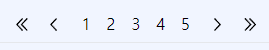

저번 `docs` 에서 `/` 경로에서 로컬 파일에 저장된 `@/posts` 경로에 있는 `md` 파일들을 불러오는 것 까지 했다.

이제 해야 할 일은 다양한 라우팅 경로에 따라 렌더링 될 페이지를 만드는 것들인데

라우팅을 일으키기 위한 `UI` 를 마저 생성해주도록 하자

# 페이지 네비게이션 만들기

---


페이지 네비게이션 (`pagination`) 은 말 그대로 페이지들를 네비게이팅 하게 할 수 있는 바이다.

이 때 만약 각 페이지 뿐 아니라 `>` 와 같은 `next page` , `>>` 와 같은 `last page` 도 존재한다면 좋을 것이다.

다만 `next page , last page` 같은 경우엔 현재 머무르고 있는 `page` 에 따라 다르게 렌더링 되어야 하겠지만 말이다.

### `globalCSS` , `tailwind.config.ts`설정하기

---

```css
@layer components {
  .bg-left-double-arrow {
    background-image: url('/arr_left_d.svg');
    background-size: auto 0.8em;
    width: 1.5em;
    height: 1.5em;
    color: inherit;
    background-repeat: no-repeat;
    background-position: center;
    text-align: center;
    display: inline-block;
  }

  .bg-right-double-arrow {
    background-image: url('/arr_right_d.svg');
    background-size: auto 0.8em;
    width: 1.5em;
    height: 1.5em;
    color: inherit;
    background-repeat: no-repeat;
    background-position: center;
    text-align: center;
    display: inline-block;
  }

  .bg-left-arrow {
    background-image: url('/arr_left-arrow.svg');
    background-size: auto 0.8em;
    width: 1.5em;
    height: 1.5em;
    color: inherit;
    background-repeat: no-repeat;
    background-position: center;
    text-align: center;
    display: inline-block;
  }

  .bg-right-arrow {
    background-image: url('/arr_right.svg');
    background-size: auto 0.8em;
    width: 1.5em;
    height: 1.5em;
    color: inherit;
    background-repeat: no-repeat;
    background-position: center;
    text-align: center;
    display: inline-block;
  }
}
```


다음과 같이 사용할 `svg` `< , << , > , >>` 와 같은 아이콘에 사용 할 `svg` 파일을 `public` 폴더에 저장해준 후 해당 폴더의 이미지를 백그라운드로 갖는 클래스명을 정의해주자

```typescript
// tailwind.config.ts
import type { Config } from 'tailwindcss';

const config: Config = {
  content: [
    './pages/**/*.{js,ts,jsx,tsx,mdx}',
    './components/**/*.{js,ts,jsx,tsx,mdx}',
    './app/**/*.{js,ts,jsx,tsx,mdx}',
  ],
  theme: {
    extend: {
      backgroundImage: {
        'left-double-arrow': 'url(/asset/arr_left_d.svg)',
        'left-arrow': 'url(/asset/arr_left.svg)',
        'right-double-arrow': 'url(/asset/arr_right_d.svg)',
        'right-arrow': 'url(/asset/arr_right.svg)',
      },
    },
  },
  plugins: [],
};
export default config;
```

이후 `globalCSS` 에서 정의한 `custom class` 이름을 `tailwind` 에서도 인식 할 수 있도록 `tailwind.config.ts` 에서도 정의해주자

이를 통해 `custom class` 이름을 이용해 `bg-[custom class name]` 처럼 사용 할 수 있게 되었다.

```tsx
<a className='bg-left-double-arrow mr-2'></a>
```

### `getPageList`

---


해당 로직을 구현하기 위해서는 적절한 페이지 번호들을 가져와야 한다.

페이지 번호를 가져오기 위해 설정해야 하는 변수들이 존재한다.

- `POSTS_PER_PAGES` : 페이지 별 보여줄 포스트들의 개수

`POSTS_PER_PAGES` 는 다른 함수나 컴포넌트에서도 사용 할 것이기 때문에 `.env.local` 파일을 만들어 해당 파일에 정의해주었다.

```env
POSTS_PER_PAGES = 1
```

```tsx
// app/lib/pagination.tsx
import { PostInfo } from '@/types/post';

type PaginationInfo = {
  avaliablePage: Array<number>;
  totalPages: number;
};

export const getPageList = (
  currentPage: number,
  totalPosts: Array<PostInfo>,
): PaginationInfo => {
  const POSTS_PER_PAGES = Number(process.env.POSTS_PER_PAGES); // 5
  const totalPages = Math.ceil(totalPosts.length / POSTS_PER_PAGES);
  const MAX_NAV_PAGES = 5;

  const prevPages: Array<number> = [];
  const nextPages: Array<number> = [];
  const pages: Array<number> = [currentPage];
  for (
    let prevPage = currentPage - 1;
    prevPage > 0 && prevPage > currentPage - MAX_NAV_PAGES;
    prevPage--
  ) {
    prevPages.push(prevPage);
  }

  for (
    let nextPage = currentPage + 1;
    nextPage <= totalPages && nextPage < currentPage + MAX_NAV_PAGES;
    nextPage++
  ) {
    nextPages.push(nextPage);
  }

  while (
    pages.length < MAX_NAV_PAGES &&
    (prevPages.length || nextPages.length)
  ) {
    if (prevPages.length) {
      pages.unshift(prevPages.shift() as number);
    }
    if (nextPages.length) {
      pages.push(nextPages.shift() as number);
    }
  }

  return { avaliablePage: pages, totalPages: totalPages };
};
```

다음과 같이 `currentPage` 번호에 따라서 `pagination` 에 사용될 페이지 리스트들을 가져오는 메소드를 정의해주었다.

`currentPage` 를 기준으로 좌,우로 `prev , next page` 의 번호들이 들어가며 대칭적으로 완성되도록 하는 메소드이다.

이 때 만약 대칭적으로 리스트를 만들 수 없을 때 (`currentPage` 가 `3` 보다 작거나 `totalPosts - 2` 보다 클 경우)를 대비하여 넉넉하게 `prevPages , nextPages` 들을 가져 온 후 `MAX_NAV_PAGES` 만큼 찰 때 까지 `pages` 를 채워주도록 하였다.

### `Pagination` 컴포넌트 생성하기

```tsx
// componets/Pagination.tsx

import { getPageList } from '@/app/lib/pagination';
import { getAllPosts } from '@/app/lib/post';

const Pagination = () => {
  const currentPage = 3; // 추후에 props 로 받도록 수정 예정

  const totalPosts = getAllPosts();
  const { avaliablePage, totalPages } = getPageList(currentPage, totalPosts);

  return (
    <nav className='flex justify-center' aria-label='page navigation'>
      <ul className='list-style-none flex'>
        {currentPage > 1 && (
          <>
            <li>
              <a className='bg-left-double-arrow mr-2'></a>
            </li>
            <li>
              <a className='bg-left-arrow mr-4'></a>
            </li>
          </>
        )}
        {avaliablePage.map((page, id) => (
          <li key={id}>
            <a href='/' className='mr-4'>
              {page}
            </a>
          </li>
        ))}
        {currentPage < totalPages && (
          <>
            <li>
              <a className='bg-right-arrow mr-2'></a>
            </li>
            <li>
              <a className='bg-right-double-arrow mr-4'></a>
            </li>
          </>
        )}
      </ul>
    </nav>
  );
};

export default Pagination;
```

이후 `pageList` 를 위에서 생성한 `getPageList` 메소드로 적절한 `pageList` 를 불러와 렌더링 하는 컴포넌트를 만들었다.





만약 `currnetPage` 에 따른 `Pagination` 의 모습은 의도한대로 잘 작동한다.

> 지금은 실험을 위해 인위적으로 `POSTS_PER_PAGES` 를 1로 줄여 총 8 페이지까지 가능하게 만들었다.

좀 더 세부적인 디자인들은 나중에 프로토타입이 나온 후 조작해주도록 하고 `Pagination` 은 여기까지만 하도록 하자 :)
