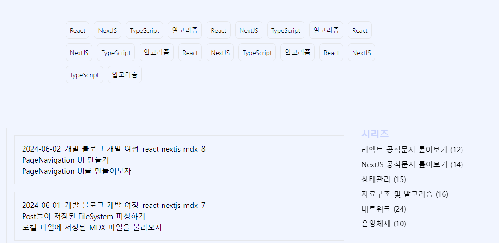

# `tag , seriese` 인디게이터 만들기

---



예전 프로토타입의 모습을 보기 위해 `tag  , series` 에 들어갈 내용들을 단순히 목업 데이터로 만들었었다.

예전 단계에서 `posts` 폴더에 존재하는 `md` 파일들을 읽기 위해 `getAllPosts` 메소드를 생성해줬었다.

이제 `getAllPosts` 메소드를 이용해 `tag , series` 에 사용 할 데이터를 생성해주도록 하자

### `getAllTags , getAllSeries`

---

```tsx
// types/global.d.ts
type Key = string;
type Count = number;

export type CountObject = Record<Key, Count>;
export type CountArray = Array<[Key, Count]>;
```

우선 해당 메소드에 사용 할 타입을 선언해주자

`CountObject` 는 배열과 같은 자료구조의 `Key` 값의 빈도수를 `value` 로 갖는 객체의 타입이며 `CountArray` 는 배열 안에 `Key , Count` 가 담긴 배열이 존재하는 이중 중첩 배열 객체의 타입이다.

```tsx
import { getAllPosts } from './post';
import type { CountObject, CountArray } from '@/types/global';

const incrementCount = (collection: CountObject, key: string) => {
  if (!collection[key]) {
    collection[key] = 0;
  } else {
    collection[key] += 1;
  }
};

export const getAllTags = (): CountArray => {
  const Posts = getAllPosts();
  const TagInfo: CountObject = {};
  Posts.forEach(({ meta: { tag } }) => {
    tag?.forEach((tagName) => incrementCount(TagInfo, tagName));
  });

  return Object.entries(TagInfo).toSorted((prev, cur) => cur[1] - prev[1]);
};

export const getAllSeries = (): CountArray => {
  const Posts = getAllPosts();
  const SeriesInfo: CountObject = {};
  Posts.forEach(({ meta: { series } }) => {
    incrementCount(SeriesInfo, series);
  });

  return Object.entries(SeriesInfo).toSorted((prev, cur) => cur[1] - prev[1]);
};
```

이후 `getallTags , getAllSeries` 메소드를 정의해주었다. 두 메소드들은 `Posts` 들의 `meta` 에 존재하는 `tag,series` 들의 빈도를 센 후

빈도에 따라 값을 내림차순으로 정렬하여 값과 빈도를 담은 `CountArray` 를 반환한다.

# `Cateogory` 컴포넌트에 적용하기

---

```tsx
import { getAllTags } from '@/app/lib/identifer';

// TODO Route 하는 Link 컴포넌트로 구성하기
// TODO Active 한 상태에 따라 뭐 어쩌구 저쩌구 하기
const Category = ({ name, to }: { name: string; to?: string }) => {
  return (
    <button className='border border-gray-300 rounded-l-3xl rounded-r-3xl text-center px-4 py-2 focus:outline-none font-light text-sm'>
      {name}
    </button>
  );
};
const tagList = getAllTags();

// TODO 태그 별 라우팅 하는 로직 추가하기
const CategoryList = () => {
  return (
    <section className='px-4 sm:px-8 md:px-16 lg:px-32 mt-24 sm:mt-24 md:mt-24 lg:mt-24 mb-12 sm:mb-12 md:mb-6 lg:mb-24'>
      <ul className='flex flex-wrap gap-2.5'>
        {tagList.map(([tagName, _], id) => (
          <li key={id}>
            <Category name={tagName} />
          </li>
        ))}
      </ul>
    </section>
  );
};

export default CategoryList;
```

```tsx
// components/Sidebar

// TODO MDX 의 시리즈 이름 가져와서 하기
import { getAllSeries } from '@/app/lib/identifer';

// TODO 라우팅 기능 넣기
// TODO 경로에 따라 활성 비활성화 상태 넣기
const Seriese = ({ title }: { title: string }) => (
  <li className='mb-2'>{title}</li>
);

const SideBar = () => {
  const serieseList = getAllSeries();
  return (
    <section className='sticky flex-2 top-[5rem] right-0'>
      <h2 className='text-indigo-200 font-bold text-xl mb-2'>시리즈</h2>
      <ul>
        {serieseList.map(([seriesName, count], id) => (
          <Seriese title={`${seriesName} (${count})`} key={id} />
        ))}
      </ul>
    </section>
  );
};

export default SideBar;
```

아직 미완성인 컴포넌트이지만 `tagList , seriesList` 를 `getAllTags , getAllSeries` 를 이용해 생성해주었다.


아 굿 ~~

`getAllPosts` 메소드만 만들어두니 할 수 있는게 무진장 많아졌다.
