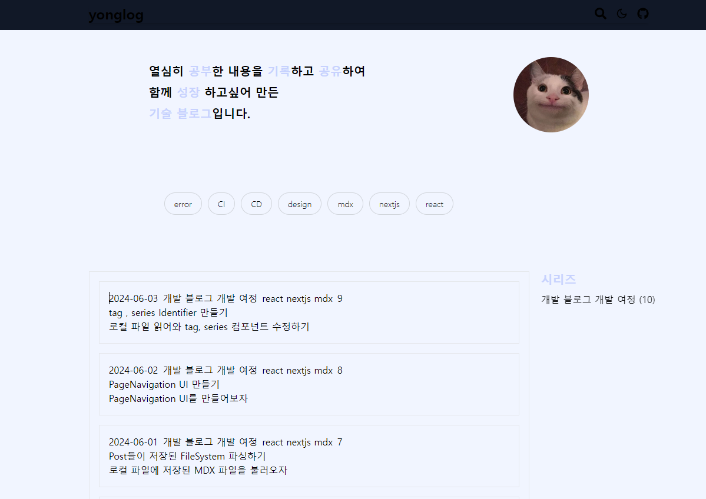
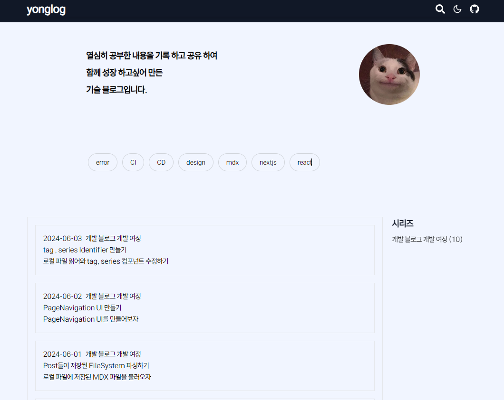
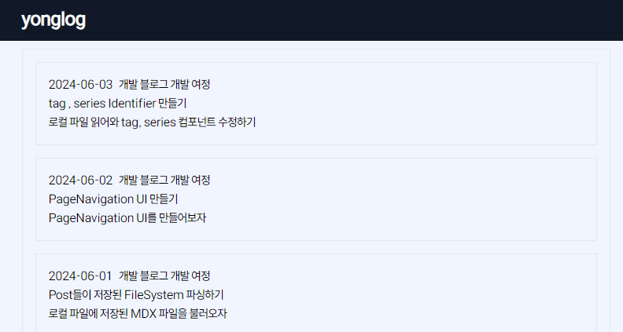
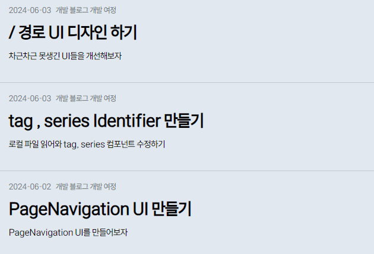
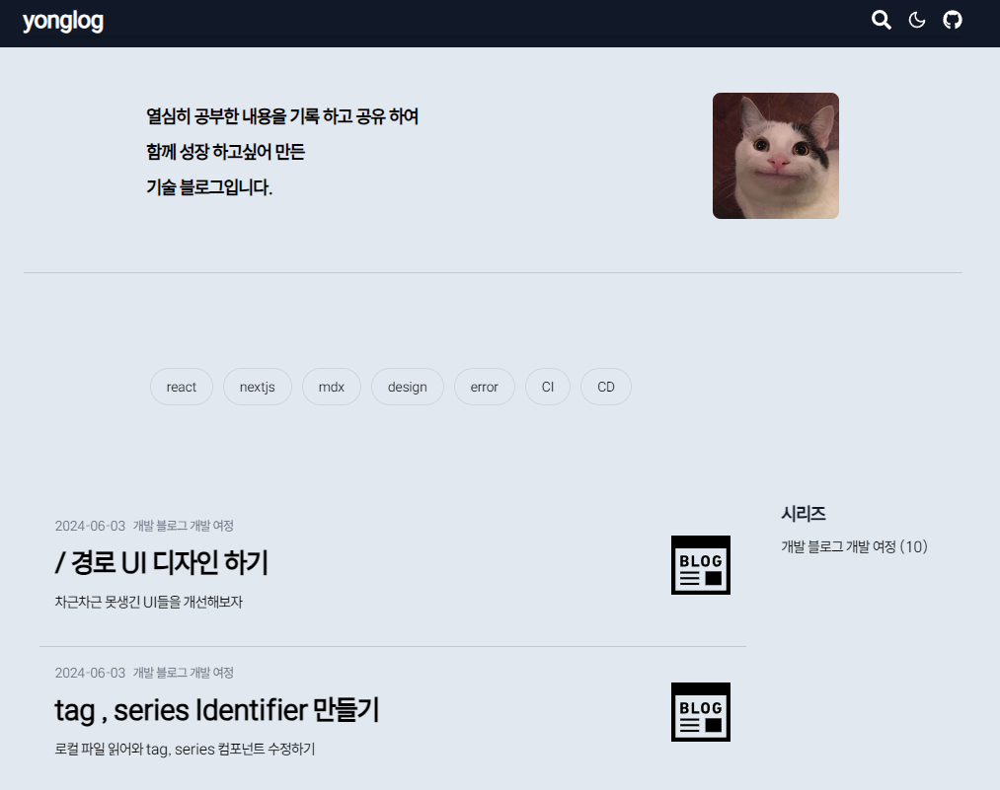

# `UI` 마무리 하기

---



이전 `docs` 에서 적지 않았지만 배경화면과 글자 색을 변경해줬었다.

이제 앞으로 해야 할 일들은 `Pagination` , `tag` , `series` 별 **다이나믹 라우팅,렌더링** 과 포스팅 리스트 중 , 해당 글자를 누르면 해당 포스팅으로 라우팅 되는 **다이나믹 라우팅,렌더링** 을 해줘야 한다.

우선 해당 작업들을 하기 전 `UI` 를 마무리 짓고 넘어가도록 하자

# 이쁜 폰트 찾아 다운로드 하기

---

현재 `UI` 의 폰트는 아주 기본적인 `sans-serif` 폰트이다. 이쁜 폰트를 찾아 인터넷을 뒤적이다 가장 취향에 드는 폰트를 발견했다.

그래서 해당 폰트의 `ttf` 파일을 다운 받은 후 `public/fonts` 폴더에 넣어주었다.

```dotnetcli
📦public
 ┣ 📂asset
 ┣ 📂fonts
 ┃ ┗ 📜Freesentation-4Regular.ttf
```

🪢 [Freesentation 세상에 없던 파워포인트를 위한 폰트](https://freesentation.blog/)

### `global.css` 에서 `custom-font` 적용하기

```css
@font-face {
  font-family: freesentation;
  src: url('/fonts/Freesentation-4Regular.ttf') format('truetype');
  font-weight: 500;
  font-style: normal;
}

body {
  background-color: #f1f5ff;
  color: black;
  font-family: 'freesentation', 'sans-serif';
}
...
```

`global.css` 에서 커스텀 폰트 패밀리를 만들어 준 후 `body` 의 `css` 속성에 넣어준다.

`global.css` 에서 접근하는 경로의 엔트리 경로는 `public` 이기 때문에 `public` 을 기준으로 한 상대 경로로 적어준다.

> 사실 `@next/font` 라이브러리를 이용해 `html` 에 인라인으로 넣어줘 `build time` 에 폰트를 적용하는 방법도 존재하며 그 방법이 `NextJS` 의 폰트 최적화 방법으로 알고 있다.
> 하지만 나는 `MDX` 를 이용하여 렌더링 하려고 하기에 `@next/font` 라이브러리와 `MDX` 를 함께 사용하는 것은 불가능하다.
> `@next/font` 는 `SWC loader (Seepd Web Compiler)` 를 이용하고 `MDX` 를 이용하기 위해선 `bable-loader` 를 이용해야 하기 때문이다.
> `MDX` 를 이용하기 위해 프로젝트 폴더에 `.bablerc` 파일을 만들어뒀더니 `@next/font` 라이브러리와 충돌했다.
> 그래서 `@next/font` 를 사용하지 않기로 했다.



폰트만 바꿨는데도 느낌이 확 사는 느낌이다. :)

# `PostItem` 디자인 하기

---

```tsx
import type { PostInfo } from '@/types/post';

export const PostItem = ({ meta }: { meta: PostInfo['meta'] }) => (
  <div className='my-4 border px-4 py-4'>
    <p>
      <span className='mr-2'>{meta.date}</span>
      <span className='mr-2'>{meta?.series}</span>
    </p>
    <h1>{meta.title}</h1>
    <p>{meta.description}</p>
  </div>
);

export const PostList = ({ postList }: { postList: Array<PostInfo> }) => {
  return postList.map(({ meta }, id) => <PostItem meta={meta} key={id} />);
};
```



이전 `docs` 에선 적지 않았지만 위와 같이 포스트들의 `meta` 데이터를 이용해 해당 포스트의 아이템을 적어주는 컴포넌트를 생성해뒀었다.

예전에는 `/` 경로의 `Page` 컴포넌트 내에 존재했지만 `PostItem , PostList` 라는 컴포넌트로 캡슐화 시켜주었다.

이제 해당 컴포넌트들의 `UI` 를 변경해줘보자

```tsx
import type { PostInfo } from '@/types/post';

export const PostItem = ({ meta }: { meta: PostInfo['meta'] }) => (
  <div className='my-4 px-4 pb-8 border-b-[1px] border-[#c1c8cf]'>
    <p className='text-gray-500 mb-2 text-sm'>
      <span className='mr-2'>{meta.date}</span>
      <span className='mr-2'>{meta?.series}</span>
    </p>
    <h1 className='text-3xl font-bold leading-10 mb-2 break-words whitespace-normal'>
      {meta.title}
    </h1>
    <p>{meta.description}</p>
  </div>
);

export const PostList = ({ postList }: { postList: Array<PostInfo> }) => {
  return postList.map(({ meta }, id) => <PostItem meta={meta} key={id} />);
};
```



`PostItem` 의 각 부분드릉의 글자 크기나 굵기를 다르게 줘 구분감 있게 만들어줬다.

지금 보며 아쉬운점은 우측이 휑해보인다는 점인데 우측에 시리즈별 썸네일을 추가해주면 어떨가 생각이 들었다.

### `meta` 데이터에 썸네일 경로 추가하기

각 `PostItem` 에서 썸네일을 렌더링 하기 위해선 `props` 로 들어오는 `meta` 에 썸네일의 주소가 필요하다.

`meta` 데이터를 파싱 해올 때 썸네일 이미지를 가져오도록 추가해주자

```dotnetcli
📦posts
 ┗ 📂개발 블로그 개발 여정
 ... /* 생략 */
 ┃ ┗ 📜thumbnail.jpg
```

각 시리즈별 사용 할 썸네일을 시리즈 폴더에 `thumbnail` 이란 이름으로 저장해줬다.

```ts
// types/post.d.ts
/* 기존 타입들 생략 */
export type ImgSource = Source & { __image: true };
export type PostInfo = {
  content: string;
  meta: {
    title: string;
    description: string;
    date: string;
    series: string;
    postId: number;
    tag?: Array<string>;
    seriesThumbnail?: ImgSource; // 추가
  };
};
```

`post.d.ts` 에 `ImgSource` 의 `nominal type` 을 추가해줬다. 이후 `ImgSource` 만을 반환하는 `getValidThumbnail` 메소드를 정의해주자

```tsx
import type {
  /* 생략 */
  ImgSource,
} from '@/types/post';
...

const getValidThumbnail = (source: MDXSource): ImgSource | null => {
  const thumbnailPath = path.join(source, '../../thumbnail');
  const paths = ['jpg', 'png', 'gif', 'svg'].map(
    (extname) => `${thumbnailPath}.${extname}` as ImgSource,
  );
  const validThumbnail = paths.find((path) => fs.existsSync(path));

  if (validThumbnail) {
    const relativePath = path.relative(
      path.join(process.cwd(), 'public'),
      validThumbnail,
    );
    const publicPath = `/${relativePath.replace(/\\/g, '/')}`;
    return publicPath as ImgSource;
  }

  return null;
};
...

const parsePosts = (source: Source): Array<PostInfo> => {
  const Posts: Array<PostInfo> = [];

  const parseRecursively = (source: Source): void => {
    getAllPath(source).forEach((fileSource: Source) => {
      if (isDirectory(fileSource)) {
        parseRecursively(fileSource);
      } else {
        if (isMDX(fileSource)) {
          const fileContent = fs.readFileSync(fileSource, 'utf8');
          const { data, content } = matter(fileContent);

          Posts.push({
            meta: {
              ...data,
              series: getSeriesName(fileSource),
              postId: getPostId(fileSource),
              seriesThumbnail: getValidThumbnail(fileSource),
            },
            content: content,
          });
        }
      }
    });
  };

  parseRecursively(source);

  return Posts;
};
```

이후 `posts` 폴더 내에 존재하는 모든 `md` 파일들에서 시리즈 별 `thumbnail` 을 가져오는 `getValidThumbnail` 메소드를 정의해주고 `meta` 데이터에 추가해주도록 하자

이를 통해 각 포스트들의 `meta` 데이터는 다음과 같이 생기게 되었다.

```tsx
{
  title: '/ 경로 UI 디자인 하기',
  description: '차근차근 못생긴 UI들을 개선해보자',
  date: '2024-06-03',
  tag: [ 'react', 'nextjs', 'mdx' ],
  series: '개발 블로그 개발 여정',
  postId: 10,
  seriesThumbnail: '/posts/개발 블로그 개발 여정/thumbnail.svg'
}
```

> `posts` 들을 프로젝트 루트 디렉토리 하위에 존재하도록 하지 않고 `public` 폴더에 존재하도록 하였다.
> 그 이유는 `NextJS` 에서 정적인 파일들에 접근하기 위한 경로들의 상대경로가 기본적으로 `public` 폴더를 기준으로 하기 때문이다.
> 모든 `static file` 들의 모든 접근 방식을 `public` 에 대한 상대 경로로 접근하는 것으로 통일시켜주었다.

### `meta.seriesThumbnail` 이용하여 썸네일 렌더링 하기

---

```tsx
import type { PostInfo } from '@/types/post';

import Image from 'next/image';

export const PostItem = ({ meta }: { meta: PostInfo['meta'] }) => (
  <div className='my-4 px-4 pb-8 border-b-[1px] border-[#c1c8cf] flex justify-between '>
    <div className='w-5/6'>
      <p className='text-gray-500 mb-2 text-sm'>
        <span className='mr-2'>{meta.date}</span>
        <span className='mr-2'>{meta?.series}</span>
      </p>
      <h1 className='text-3xl font-bold leading-10 mb-2 break-words whitespace-normal'>
        {meta.title}
      </h1>
      <p>{meta.description}</p>
    </div>
    <div className='flex justify-center items-center'>
      {meta.seriesThumbnail && (
        <Image
          src={meta.seriesThumbnail}
          alt='series-thumbnail'
          width={60}
          height={60}
        />
      )}
    </div>
  </div>
);

export const PostList = ({ postList }: { postList: Array<PostInfo> }) => {
  return postList.map(({ meta }, id) => <PostItem meta={meta} key={id} />);
};
```

이후 `next/image` 의 `Image` 컴포넌트를 이용해 이미지를 불러와 `thumbnail` 을 `PostItem` 에 추가해주었다.

> ### `Image` 컴포넌트의 이미지 최적화 방식
>
> - 동적 사이즈 조절 : `Image` 컴포넌트는 `src` 에 대한 이미지를 불러올 떄 `props` 로 전달한 `width , height` 에 맞춰 이미지 크기를 동적으로 조정하여 요청한다. 이를 통해 사용할만큼의 사이즈의 이미지로 조정 후 불러오기 떄문에 요쳥 시간이 빠르다.
> - `lazy loading` : 이미지가 뷰포트에 들어왔을 때에만 로딩 되도록 하여 불필요한 요청을 줄여 `FCP` 를 빠르게 한다.
> - `caching` : `NextJS` 는 `CDN` 들과 자동으로 통합되기 때문에 현재 위치로부터 가까운 `CDN` 으로부터 캐싱 된 이미지를 받을 수 있다.



짜자잔 ~~ 만족스럽다 :)
