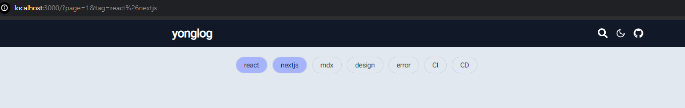
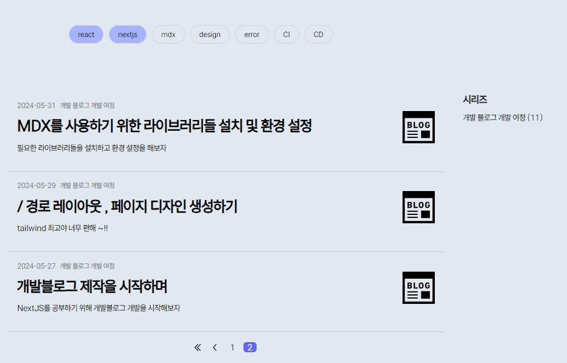

> ### 구현된 프로젝트 결과
>
> 

# 구현해야 하는 라우팅 기능 명세서 생각해보기

---


현재의 페이지는 `/` 경로에 대한 `UI` 만 존재하고 있다.

이제 블로그의 기능을 위해 라우팅 기능을 추가해주기로 하자

## Dynamic Routing ?

---

`NextJS` 에서 사용하는 서버 컴포넌트는 라우팅 되는 경로에 따라 서버에서 렌더링 되는 컴포넌트이다.

만약 라우팅 되는 경로가 정적으로 미리 정해져있다면 해당 컴포넌트는 서버에서 `build time` 에 렌더링 된 후 매 요청마다 미리 렌더링 된 값을 클라이언트에게 전송한다.

예를 들어 `app/introduce/page.tsx` 라는 파일이 존재한다면 `/introduce` 경로에선 매번 `build time` 에서 렌더링 된 `page.tsx` 컴포넌트가 반환될 것이다.

하지만 라우팅 되는 경로가 정적으로 정해져있는 것이 아니라 `runtime` 에 결정되는 경우엔 어떨까 ?

나의 `/` 경로 `UI` 에서 특정 태그 클릭하여 라우팅 된다거나 , 시리즈를 클릭하여 라우팅 된거나 , `pagination` 을 클릭해 라우팅 되는 경로와 같이 말이다.

이렇게 `runtime` 에 라우팅 될 경로가 결정되는 경우 , **동적으로 결정 될 라우팅 경로를 이용하는 행위를 `dynamic routing` 이라고 한다.**

## 어떻게 Dynamic Routing 을 할까 ?

---

`Dynamic Routing` 을 하기 위해선 두 가지 준비가 필요하다.

1. `Dynamic Routing` 될 경로에 맞는 파일 라우팅 시스템 준비하기

2. `Dynamic Routing` 될 경로에 맞는 `page.tsx` 준비하기

천천히 하나씩 `docs` 를 읽어가며 준비해보자

### Dynamic Routing 될 경로에 맞는 파일 라우팅 시스템 준비하기

---

`NextJS` 의 `App router` 방식에선 폴더 기반 라우팅으로 `app` 폴더를 기준으로 `/` 경로로 인식 한 후 하위 경로에 맞춰 세그먼트들을 정의한다.

마치 `app/introduce/page.tsx` 는 `/introduce` 경로의 `page` 로 인식하는 것 처럼 말이다.

위 예시에선 `introduce` 라는 폴더 명이 라우팅 경로의 `segment` 가 된다.

반대로 `runtime` 에 결정되는 세그먼트를 `Dynamic segment` 라고 한다. 이렇게 `Dynamic segment` 에 대한 폴더명은 폴더 이름에 `[]` 를 감싸 정의한다.

### Dynamic Segment 될 경로에 맞는 page.tsx 준비하기

---

```tsx
export default function Page({
  params,
  searchParams,
}: {
  params: { slug: string };
  searchParams: { [key: string]: string | string[] | undefined };
}) {
  return <h1>My Page</h1>;
}
```

기본적으로 `page.tsx` 의 정의되는 컴포넌트는 `params , serachParams` 를 `props` 로 받는다.

이렇게 명쾌하고 사랑스러울 수가 없다.

서버 컴포넌트에선 단순히 `props` 로 들어오는 `Dynamic segment` 들을 이용해 렌더링 로직을 작성해주면 된다.

## Dynamic Routing이 무엇이 있을지 생각해보기

---

### params

---

#### PostItem 컴포넌트


해당 컴포넌트를 클릭하면 해당 컴포넌트의 `PostID` 로 이동 할 수 있도록 라우팅 해줘야겠다.

이후 라우팅 된 경로에서 해당 `Post` 의 `mdx` 파일을 렌더링 하여 보여주면 된다.

### searchParams

---

#### Category 컴포넌트


#### Sidebar 컴포넌트


#### Pagination 컴포넌트


우선 `/` 경로에서 `PostList` 들을 보여줄 때 조건에 따라 보여주게 하기 위한 `Dynamic Segment` 들이 존재한다.

세 부분은 조건부적으로 같이 존재 할 수 있기 때문에 분절되어 있는 `segment` 가 아니라 같이 사용 가능한 `searchParams` 로 정의해주도록 하자

예를 들어 `/?tag=react&series=개발 블로그 개발 여정&page=1` 이런식으로 말이다.

`searchParams` 로 정의해줌으로 인해 세 `searchParams` 가 같이 존재 할 수도 , 부분적으로 존재 할 수도 , 아예 존재하지 않게도 할 수 있다.

# searchParams 라우팅 로직 구현하기

---

`postId` 별 렌더링 될 로직을 구현하기 위해선 `getAllPost` 메소드 내부의 `meta` 데이터를 만져줘야 하기 때문에 해당 부분은 나중에 구현하기로 하고

`searchParams` 값에 따라 `PostList` 들을 다르게 렌더링 하는 로직을 먼져 구현해주자

### types/global.tsx

---

```tsx
/* 기존 타입 생략 */

export type SearchParams = {
  tag?: string;
  page?: string;
  series?: string;
};
```

`global.d.ts` 에 사용할 타입을 선언해준다. `SearchParams` 태그는 `searchParams` 를 조작 할 때 사용할 객체들을 선언한 타입이다.

### app/lib/route.tsx

```tsx
import type { SearchParams } from '@/types/global';

const areTagsActive = (exsitTags: string, newTag: string): boolean => {
  return exsitTags.split('&').some((tag) => tag === newTag);
};

/**
 * 현재 라우팅 된 searchParams 와 라우팅 시킬 newParams 가 동일한지를 확인하는 메소드
 */
export const checkIsActive = (
  searchParams: URLSearchParams,
  newParams: SearchParams,
): boolean => {
  return Object.entries(newParams).every(([key, value]) => {
    const currentParams = searchParams.get(key);

    if (key === 'tag') {
      return currentParams ? areTagsActive(currentParams, value) : false;
    } else {
      return currentParams === value;
    }
  });
};

const addTagParams = (searchParams: URLSearchParams, newTag: string) => {
  const currentTag = searchParams.get('tag');

  if (!currentTag) {
    return newTag;
  }
  return `${currentTag}&${newTag}`;
};

const removeTagParams = (
  searchParams: URLSearchParams,
  targetTag: string,
): string => {
  const currentTag = searchParams.get('tag') as string;

  return currentTag
    .split('&')
    .filter((tag) => tag !== targetTag)
    .join('&');
};

export const getNewSearchParms = (
  searchParams: URLSearchParams,
  newParams: SearchParams,
  isActive?: boolean,
): string => {
  Object.entries(newParams).forEach(([key, value]) => {
    if (key === 'tag') {
      searchParams.set(
        key,
        isActive
          ? removeTagParams(searchParams, value)
          : addTagParams(searchParams, value),
      );

      /* 만약 searchParams 에 tag 가 '' 인 경우를 대비하여 제거 */
      if (!searchParams.get('tag')) {
        searchParams.delete('tag');
      }
    } else if (key === 'series') {
      isActive ? searchParams.delete(key) : searchParams.set(key, value);
    } else {
      /* key === page 일 때엔 Active 여부가 영향을 주지 않는다. */
      searchParams.set(key, value);
    }
  });
  return `?${searchParams.toString()}`;
};
```

`route.tsx` 에서 라우팅 시 사용할 로직들을 생성해준다.

모든 코드를 설명하지는 않겠지만 위에서 설명했듯이 `tag` 에 대한 `searchParams` 들은 `&` 를 기준으로 나열 할 것이기 때문에 배열로 변경해준 후 `some` 이나 `filter` 와 같은 배열 메소드로 `tag` 에 대한 `searchParams` 를 조작해준다.

제일 중요한 메소드인 `getNewSearchParams` 의 경우를 보면 기존의 `URLSearchParams` 를 받은 후 추가 할 `newParams` 를 받아 라우팅 할 `searchParams` 를 문자열 형태로 반환하는 모습을 볼 수 있다.

이 때 만약 라우팅 할 사이트가 현재의 주소를 나타내는 기준인 `isActive` 에 따라 라우팅 경로를 다르게 해주었다.

예를 들어 `?tag=react&nextjs` 인 경우 `react` 에 대한 라우팅을 한 번 더 누른다면 `?tag=nextjs` 로 변경되게 말이다.

이를 통해 `routing` 에 `on,off` 기능과 같이 구현해주었다.

### components/client/ActiveLink.tsx

```tsx
'use client';

import Link from 'next/link';

import { useSearchParams } from 'next/navigation';
import { checkIsActive, getNewSearchParms } from '@/app/lib/route';

import type { SearchParams } from '@/types/global';

type ActiveLinkProps = {
  newParams: SearchParams;
  classNames: {
    default: string;
    active: string;
  };
  scroll?: boolean;
  toFirstPage?: boolean;
  replace?: boolean;
  children?: React.ReactNode;
};

const ActiveLink = ({
  newParams,
  classNames,
  children,
  scroll = true,
  toFirstPage = false, // 라우팅 시 page=1 를 기본으로 추가 할 것인지
  replace = true, // window.history stack 에서 replace 할 것인지
}: ActiveLinkProps) => {
  const searchParams = useSearchParams(); // readOnly type 의 searchParameter
  const _searchParams = new URLSearchParams(searchParams.toString()); // 복사본 생성

  if (toFirstPage) {
    _searchParams.set('page', '1');
  }

  // 현재 주소와 라우팅 시킬 주소가 동일 한지를 확인
  const isActive = checkIsActive(_searchParams, newParams);
  // 만약 동일하다면 off 하기 위한 href 주소 , 아닐 경우엔 on 하기 위한 href 주소 생성
  const href = getNewSearchParms(_searchParams, newParams, isActive);
  const className = isActive ? classNames.active : classNames.default;

  return (
    <Link href={href} className={className} scroll={scroll} replace={replace}>
      {children}
    </Link>
  );
};

export default ActiveLink;
```

이후 클라이언트 컴포넌트로 `ActiveLink` 컴포넌트를 생성해주었다.

해당 컴포넌트는 `useSearchParams` 를 이용해 클라이언트 단의 `searchParams` 를 조회하여 라우팅 시킬 `href` 주소들과 `isActive` 값을 동적으로 생성하는 컴포넌트이다.

`Link` 컴포넌트의 기본 `props` 인 `scroll , replace` 등을 활용해 라우팅 시 페이지의 상단으로 이동 시킬지, 혹은 `window.history` 스택에 주소들을 추가 할 것인지 아닌지를 조절한다.

### app/page.tsx

---

이제 이렇게 라우팅을 시킬 로직을 완성했으니 페이지 컴포넌트에 `ActiveLink` 들을 이용해 라우팅 로직을 구현해주자

```tsx
import CategoryList from '@/components/Category';
import SideBar from '@/components/Sidebar';
import Introduce from '@/components/Introduce';
import Pagination from '@/components/Pagination';
import { PostList } from '@/components/PostList';

import type { SearchParams } from '@/types/global.d.ts';

const Page = ({ searchParams }: { searchParams: SearchParams }) => {
  /* 서버 컴포넌트의 props.searchParams 는 Object 객체이다.
  컴포넌트나 메소드 내에서 URLSearchParams 를 이용하기 때문에 복사본 생성
  */
  const _searchParams = new URLSearchParams(searchParams);

  return (
    <section className='mx-0 sm:mx-auto w-full lg:w-1/2'>
      <div className='hidden md:block'>
        <Introduce />
      </div>
      <CategoryList />
      <section className='w-full lg:w-[120%] flex gap-5'>
        <section className=' bg-black-200 w-full lg:w-8/12 px-4'>
          <PostList searchParams={_searchParams} />
          <Pagination searchParams={_searchParams} />
        </section>
        <div className='hidden lg:block lg:flex-2 sticky top-0 w-4/12'>
          <SideBar />
        </div>
      </section>
    </section>
  );
};

export default Page;
```

`/` 경로에 대한 `searchParams` 를 `props` 로 받은 후 하위 컴포넌트들에게 `props` 로 `drilling` 시켜준다.

라우팅을 시키기 위한 컴포넌트 내부에선 사실 `ActiveLink` 를 이용하기 때문에 라우팅 시킬 주소를 생성하기 위해서 `drilling` 시켜줄 필요는 없다.

`props drilling` 이 일어난 컴포넌트들은 컴포넌트 내부에서 `searchParams` 에 접근하기 위한 컴포넌트들이다.

컴포넌트 내부를 살펴보면서 어떤 말인지를 생각해보자

### components/CategoryList.tsx

---

```tsx
import ActiveLink from './client/ActiveLink';

import { getAllTags } from '@/app/lib/identifer';

const CategoryClassNames = {
  default:
    'border border-gray-300 rounded-l-3xl rounded-r-3xl text-center px-4 py-2 focus:outline-none font-light text-sm',
  active:
    'bg-indigo-300  border border-gray-300 rounded-l-3xl rounded-r-3xl text-center px-4 py-2 focus:outline-none  text-sm',
};

const CategoryList = () => {
  const tagList = getAllTags();
  return (
    <section className=' px-4 sm:px-8 md:px-16 lg:px-32 mt-24 sm:mt-24 md:mt-24 lg:mt-24 mb-12 sm:mb-12 md:mb-6 lg:mb-24'>
      <ul className='flex flex-wrap gap-2.5'>
        {tagList.map(([tagName, _], id) => {
          const newParams = {
            tag: tagName,
          };
          return (
            <li key={id}>
              <ActiveLink
                newParams={newParams}
                classNames={CategoryClassNames}
                toFirstPage
              >
                {tagName}
              </ActiveLink>
            </li>
          );
        })}
      </ul>
    </section>
  );
};

export default CategoryList;
```



해당 컴포넌트는 라우팅 시키기 위해 각 태그 별 `ActiveLink` 컴포넌트에게 본인의 태그를 `newParams` 에 담아 `drilling` 시킨다.

또한 `isActive` 상태에 따른 클래스 명을 담은 객체도 같이 `drilling` 시켜준다. 이를 통해 태그 별 `searchParmas` 에 대한 라우팅을 시켜줄 수 있었다.

> 컴포넌트를 제작 할 땐 별 생각 없었지만 지금 생각해보니 , 클라이언트 컴포넌트를 `ActiveLink` 하나로 국한시켜 최대한 `client boundary` 를 최소화 시켜주었기 때문에 `CategoryList` 컴포넌트를 서버 컴포넌트로 유지하여, 서버 컴포넌트에서 사용 가능한 메소드인 `getAllTag` 를 호출 할 수 있었다.
>
> 공식 문서에 나와있듯이 최대한 `client boundary` 를 적게 하여 `server component` 들의 수를 늘리는 것이 개발 시 얼마나 용이한지 알 수 있었다.

### components/postList.tsx

---

```tsx
import { selectPosts } from '@/app/lib/post';
import type { PostInfo } from '@/types/post';

import Image from 'next/image';

export const PostItem = ({ meta }: { meta: PostInfo['meta'] }) => (
  <div className='my-4 px-4 pb-8 border-b-[1px] border-[#c1c8cf] flex justify-between '>
    <div className='w-5/6'>
      <p className='text-gray-500 mb-2 text-sm'>
        <span className='mr-2'>{meta.date}</span>
        <span className='mr-2'>{meta?.series}</span>
      </p>
      <h1 className='text-3xl font-bold leading-10 mb-2 break-words whitespace-normal'>
        {meta.title}
      </h1>
      <p>{meta.description}</p>
    </div>
    <div className='flex justify-center items-center'>
      {meta.seriesThumbnail && (
        <Image
          src={meta.seriesThumbnail}
          alt='series-thumbnail'
          width={60}
          height={60}
        />
      )}
    </div>
  </div>
);

export const PostList = ({
  searchParams,
}: {
  searchParams: URLSearchParams;
}) => {
  const page = searchParams.get('page') || '1';
  const postList = selectPosts(searchParams);
  const POSTS_PER_PAGES = Number(process.env.POSTS_PER_PAGES);
  const offSet = Math.max(0, (Number(page) - 1) * POSTS_PER_PAGES);

  const slicedPostList = postList.slice(offSet, offSet + POSTS_PER_PAGES);
  return slicedPostList.map(({ meta }, id) => (
    <PostItem meta={meta} key={id} />
  ));
};
```



해당 컴포넌트는 `searchParams` 에 따라 적절한 `postList` 들을 받아와 렌더링 하는 컴포넌트이다.

해당 컴포넌트를 보면 `searchParams` 에 따라 `post` 들을 데이터베이스 (`public/posts`) 에서 가져 온 후 페이지 별 `POSTS_PER_PAES` 만큼 가져오는 모습을 볼 수 있다.

나는 `POSTS_PER_PAES` 를 5개로 설정했기 때문에 한 페이지 당 최대 5개씩의 `PostItem` 들이 렌더링 된다.

#### app/lib/posts.tsx

```tsx
const isPostHasTag = (
  postTag: PostInfo['meta']['tag'],
  searchParmsTag: string,
) => {
  // searchParamsTagArray
  const SPTArray = searchParmsTag.split('&');
  return SPTArray.every((spt) => postTag.includes(spt));
};

/**
 * SearchParms 에 맞게 적절한 PostList 를 반환하는 메소드
 */
export const selectPosts = (searchParams: URLSearchParams): Array<PostInfo> => {
  const allPosts = getAllPosts();
  const tag = searchParams.get('tag');
  const series = searchParams.get('series');

  if (!tag && !series) {
    return allPosts;
  }
  return allPosts.filter((post) => {
    const { meta } = post;
    return (
      (!tag || isPostHasTag(meta.tag, tag)) &&
      (!series || meta.series === series)
    );
  });
};
```

`PostList` 컴포넌트에서 사용 된 `selecPosts` 메소드를 살펴보면 이전에 작성해둔 `getAllPosts` 메소드를 이용해 모든 포스트들을 가져온 후 `searchParams` 의 `tag , series` 를 이용해 `postList` 들을 필터링 하여 반환한다.

**결국 라우팅이란 어떤 주소로 라우팅 시킬 것인지, 경로에 따라 어떤 데이터를 사용 할 것인지가 제일 중요하다.**

#### components/Pagination.tsx , SideBar.tsx

---

두 컴포넌트는 이전의 `a` 태그를 단순히 `ActiveLink` 로 변경시켜준 것 외에 크게 달라진 점이 없기 때문에 설명하지 않고 넘어가도록 하겠다.

```tsx
import ActiveLink from './client/ActiveLink';

import { getPageList } from '@/app/lib/pagination';
import { selectPosts } from '@/app/lib/post';

const paginationClasses = {
  indigator: {
    default: 'px-2 mr-2 font-normal  hover:bg-gray-200 rounded-md',
    active: 'px-2 mr-2 bg-indigo-500 text-white  rounded-md',
  },

  leftDouble: {
    default: 'bg-left-double-arrow mr-2',
    active: 'bg-left-double-arrow mr-2',
  },

  left: {
    default: 'bg-left-arrow mr-2',
    active: 'bg-left-arrow mr-2',
  },

  right: {
    default: 'bg-right-arrow mr-2',
    active: 'bg-right-arrow mr-2',
  },

  rightDouble: {
    default: 'bg-right-double-arrow mr-2',
    active: 'bg-right-double-arrow mr-2',
  },
};

const Pagination = ({ searchParams }: { searchParams: URLSearchParams }) => {
  const currentPage = Number(searchParams.get('page') || '1');

  const totalPosts = selectPosts(searchParams);
  const { avaliablePage, totalPages } = getPageList(currentPage, totalPosts);

  return (
    <nav className='flex justify-center' aria-label='page navigation'>
      <ul className='list-style-none flex'>
        {currentPage > 1 && (
          <>
            <li>
              <ActiveLink
                newParams={{ page: '1' }}
                classNames={paginationClasses.leftDouble}
              ></ActiveLink>
            </li>
            <li>
              <ActiveLink
                newParams={{ page: String(currentPage - 1) }}
                classNames={paginationClasses.left}
              ></ActiveLink>
            </li>
          </>
        )}
        {avaliablePage.map((page, id) => (
          <li key={id}>
            <ActiveLink
              newParams={{ page: String(page) }}
              classNames={paginationClasses.indigator}
            >
              {page}
            </ActiveLink>
          </li>
        ))}
        {currentPage < totalPages && (
          <>
            <li>
              <ActiveLink
                newParams={{ page: String(currentPage + 1) }}
                classNames={paginationClasses.right}
              ></ActiveLink>
            </li>
            <li>
              <ActiveLink
                newParams={{ page: String(totalPages) }}
                classNames={paginationClasses.rightDouble}
              ></ActiveLink>
            </li>
          </>
        )}
      </ul>
    </nav>
  );
};

export default Pagination;
```

```tsx
import ActiveLink from './client/ActiveLink';

import { getAllSeries } from '@/app/lib/identifer';

const sideBarClasses = {
  default: 'font-normal',
  active: 'text-indigo-500 font-semibold',
};

const SideBar = () => {
  const serieseList = getAllSeries();
  return (
    <section className='sticky flex-2 top-[5rem] right-0'>
      <h2 className='text-gray-900 font-bold text-xl mb-2'>시리즈</h2>
      <ul>
        {serieseList.map(([seriesName, count], id) => (
          <ActiveLink
            newParams={{ series: seriesName }}
            classNames={sideBarClasses}
            key={id}
            toFirstPage
          >
            {`${seriesName} (${count})`}
          </ActiveLink>
        ))}
      </ul>
    </section>
  );
};

export default SideBar;
```

---

어우 생각보다 라우팅하는데에만 하루를 꼬박 썼다.

가장 꼬였던 부분은 `ActiveLink` 컴포넌트를 서버 컴포넌트로 만들려고 했던 부분에서 꼬여서 두시간을 헤맸다.

나는 `Page` 컴포넌트의 `props.searchParams` 를 `ActiveLink` 의 `props` 로 받으면 가능한 모든 `searchParams` 에 대해 서버 측에서 렌더링 해주는 줄 알았는데 아녔다.

으갸갹 서버 사이드 렌더링에 대한 개념이 부족했던 것 같다. :)
