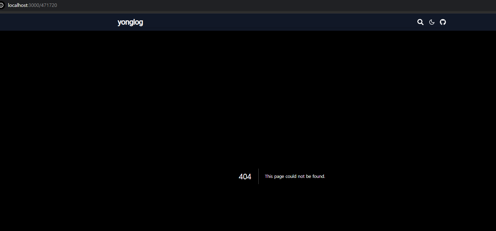
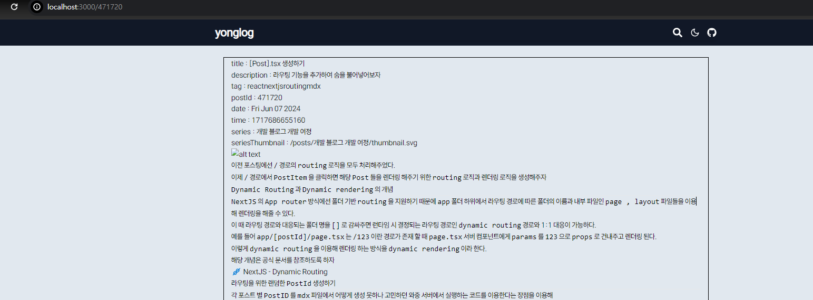
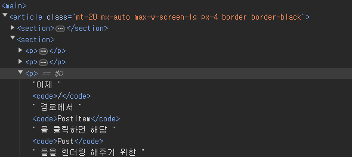
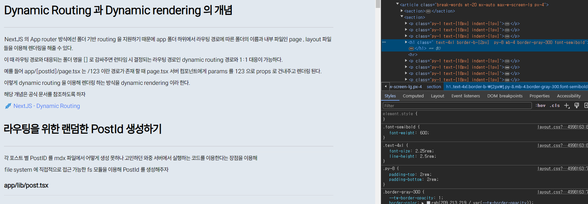
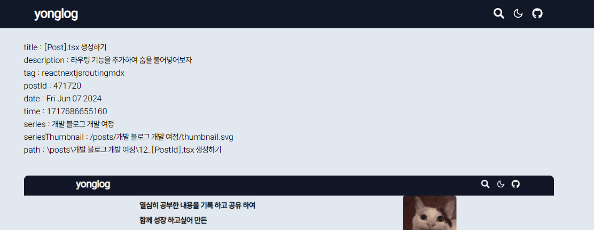
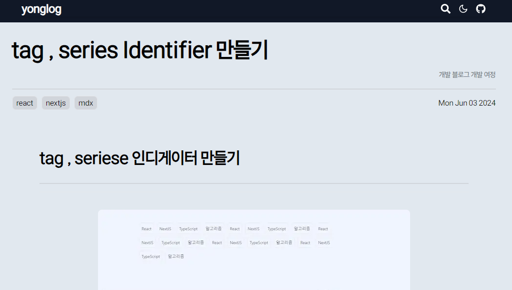

이전 포스팅에선 `/` 경로의 `routing` 로직을 모두 처리해주었다.

이제 `/` 경로에서 `PostItem` 을 클릭하면 해당 `Post` 들을 렌더링 해주기 위한 `routing` 로직과 렌더링 로직을 생성해주자

# `Dynamic Routing` 과 `Dynamic rendering` 의 개념

---

`NextJS` 의 `App router` 방식에선 폴더 기반 `routing` 을 지원하기 때문에 `app` 폴더 하위에서 라우팅 경로에 따른 폴더의 이름과 내부 파일인 `page , layout` 파일들을 이용해 렌더링을 해줄 수 있다.

이 때 라우팅 경로와 대응되는 폴더 명을 `[]` 로 감싸주면 런타임 시 결정되는 라우팅 경로인 `dynamic routing` 경로와 1:1 대응이 가능하다.

예를 들어 `app/[postId]/page.tsx` 는 `/123` 이란 경로가 존재 할 때 `page.tsx` 서버 컴포넌트에게 `params` 를 `123` 으로 `props` 로 건내주고 렌더링 된다.

이렇게 `dynamic routing` 을 이용해 렌더링 하는 방식을 `dynamic rendering` 이라 한다.

해당 개념은 공식 문서를 참조하도록 하자

[NextJS - Dynamic Routing]('https://nextjs.org/docs/app/building-your-application/routing/dynamic-routes')

# 라우팅을 위한 랜덤한 `PostId` 생성하기

---

각 포스트 별 `PostID` 를 `mdx` 파일에서 어떻게 생성 못하나 고민하던 와중 서버에서 실행하는 코드를 이용한다는 장점을 이용해

`file system` 에 직접적으로 접근 가능한 `fs` 모듈을 이용해 `PostId` 를 생성해주자

### `app/lib/post.tsx`

---

```tsx
const parsePosts = (source: Source): Array<PostInfo> => {
  const Posts: Array<PostInfo> = [];

  const parseRecursively = (source: Source): void => {
    getAllPath(source).forEach((fileSource: Source) => {
      if (isDirectory(fileSource)) {
        parseRecursively(fileSource);
      } else {
        if (isMDX(fileSource)) {
          const fileContent = fs.readFileSync(fileSource, 'utf8');
          const { data, content } = matter(fileContent);

          /* data.postId 가 존재하지 않으면 PostID 를 생성한 후 Post 저장*/
          if (!data.postId) {
            data.postId = Math.ceil(Math.random() * 9 * 100000);
            const updatedContent = matter.stringify(content, data);
            fs.writeFileSync(fileSource, updatedContent, 'utf-8');
          }
          /* data.date , time 이 존재하지 않으면 build 타임 기준으로 하여 생성 */
          if (!data.date) {
            data.date = new Date().toDateString();
            data.time = new Date().getTime();
          }

          Posts.push({
            meta: {
              ...data,
              series: getSeriesName(fileSource),
              seriesThumbnail: getValidThumbnail(fileSource),
            },
            content: content,
          });
        }
      }
    });
  };

  parseRecursively(source);

  return Posts;
};

/**
 * Posts 에서 Date 를 기준으로 정렬 후 전송
 */
export const getAllPosts = (): Array<PostInfo> => {
  const POST_PATH = '../app/public/posts';
  const posts = parsePosts(POST_PATH);

  return posts.toSorted((prev, cur) => {
    const prevTime = prev.meta.time;
    const curTime = cur.meta.time;

    return curTime - prevTime;
  });
};
```

```dotnetcli
/* public 내부의 readme.mdx 의 예시 */
---
title: '[Post].tsx 생성하기'
description: 라우팅 기능을 추가하여 숨을 불어넣어보자
tag:
  - react
  - nextjs
  - routing
  - mdx
postId: 471720
date: Fri Jun 07 2024
time: 1717686655160
---
```

동기적으로 파일을 다시 저장 할 수 있는 메소드를 이용해 `pstId` 가 존재하지 않는 `md,mdx` 파일들에 `PostId` 를 추가해주었다.

> 추가로 하는 김에 `date , time` 도 매번 입력하기 귀찮아서 관련 로직을 추가해주었다.
> `build time` 시 생성되는 `new Date().getTime()` 으로 인해 포스트 들을 최신 순으로 정렬하기도 편해졌다. :)

# `PostItem` 에 라우팅 기능 추가하기

---

### `components/postList.tsx`

---

```tsx
import Link from 'next/link';
/* 동일 코드 생략 */

export const PostItem = ({ meta }: { meta: PostInfo['meta'] }) => (
  <Link // 라우팅 기능 추가
    href={{ pathname: String(meta.postId) }}
    className='my-4 px-4 pb-8 border-b-[1px] border-[#c1c8cf] flex justify-between '
  >
    <div className='w-5/6'>
      <p className='text-gray-500 mb-2 text-sm'>
        <span className='mr-2'>{meta.date}</span>
        <span className='mr-2'>{meta?.series}</span>
      </p>
      <h1 className='text-3xl font-bold leading-10 mb-2 break-words whitespace-normal'>
        {meta.title}
      </h1>
      <p>{meta.description}</p>
    </div>
    <div className='flex justify-center items-center'>
      {meta.seriesThumbnail && (
        <Image
          src={meta.seriesThumbnail}
          alt='series-thumbnail'
          width={60}
          height={60}
        />
      )}
    </div>
  </Link>
);

/* 동일 코드 생략 */
```

이후 렌더링 되는 `PostItem` 에 `Link` 컴포넌트를 이용해 라우팅 기능을 추가해주었다.



이를 통해 특정 포스트를 클릭하면 해당 `PostId` 에 대한 경로로 라우팅 되도록 만들었다.

# `Dynamic rendering` 을 위한 컴포넌트 생성

---

이제 위에서 말했듯 `Dynamic Rendering` 을 위해 `app/[postId]/page.tsx` 를 생성해주자

```dotnetcli
📦app
 ┣ 📂lib
 /* 중복 생략 */
 ┣ 📂[postId]
 ┃ ┗ 📜layout.tsx
 ┃ ┗ 📜page.tsx
 /* 중복 생략 */
 ┣ 📜globals.css
 ┣ 📜layout.tsx
 ┗ 📜page.tsx
```

### `app/lib/post.tsx`

---

```tsx
/* 중복 생략 */
export const getPostContent = (postId: string): PostInfo => {
  const allPosts = getAllPosts();
  const searchedPost = allPosts.find(
    (post) => post.meta.postId === Number(postId),
  );

  return searchedPost as PostInfo;
};
```

### `app/[postId]/layout.tsx`

---

```tsx
const PostLayout = ({
  params,
  children,
}: {
  params: { postId: string };
  children: React.ReactNode;
}) => {
  return (
    <article className='mt-20 mx-auto max-w-screen-lg px-4 border border-black'>
      {children}
    </article>
  );
};

export default PostLayout;
```

### `app/[postId]/page.tsx`

```tsx
import { getPostContent } from '../lib/post';
import { MDXRemote } from 'next-mdx-remote/rsc';

const PostPage = ({ params }: { params: { postId: string } }) => {
  const { meta, content } = getPostContent(params.postId);
  return (
    <>
      <section>
        {Object.entries(meta).map(([key, value], id) => {
          return (
            <h1 key={id}>
              {key} : {value}
            </h1>
          );
        })}
      </section>
      <section>
        <MDXRemote source={content} />
      </section>
    </>
  );
};

export default PostPage;
```

다음과 같이 `[postId]` 경로에서 렌더링 될 `PostPage` 컴포넌트에서 `getPostContent` 를 이용해 `postId` 에 맞는 `Post` 를 가져오고 `MDXRemote` 를 이용해 페이지를 렌더링 해주도록 하자



ㅋㅋ 아 굿 ~~ `MDXRemote` 를 이용해 단순 `text` 형태인 글들을 적절한 `html` 파일로 `Bable loader` 가 변환 한 후 컴포넌트로 변환해 렌더링 되고 있는 모습을 볼 수 있다.

이제 하나씩 문제점을 손대면서 완성해보자 :)

# `mdx, mdx` 파일을 이쁘게 꾸미기 위해 커스텀 컴포넌트 만들기

---

```tsx
import { MDXRemote } from 'next-mdx-remote/rsc';

<MDXRemote source={content} />;
```


현재 해당 부분에서 `content` 를 `jsx` 로 변환 될 때엔 특별한 스타일링이 존재하지 않는 `jsx` 로 변한된다.

그렇기 때문에 렌더링 되는 `contnet` 가 매우 심심해보인다.

스타일링 할 커스텀 컴포넌트로 정의하고 `props` 로 넘겨주자 :)

### `app/lib/mdxComponents.tsx`

---

`MDXRemote` 컴포넌트는 `props` 로 `MDXRemoteProps` 를 받는다.

```tsx
export declare function MDXRemote(
  props: MDXRemoteProps,
): Promise<React.ReactElement<any, string | React.JSXElementConstructor<any>>>;

export type MDXRemoteProps = {
  source: VFileCompatible;
  options?: SerializeOptions;
  /**
   * An object mapping names to React components.
   * The key used will be the name accessible to MDX.
   *
   * For example: `{ ComponentName: Component }` will be accessible in the MDX as `<ComponentName/>`.
   */
  components?: React.ComponentProps<typeof MDXProvider>['components'];
};
```

이 떄 `MDXRemoteProps` 의 `components` 를 보면 `MDXProvider['components']` 즉 , `MDXComponents` 를 `props`로 받는다.

```tsx
export type MDXComponents = NestedMDXComponents & {
  [Key in StringComponent]?: Component<JSX.IntrinsicElements[Key]>;
} & {
  /**
   * If a wrapper component is defined, the MDX content will be wrapped inside of it.
   */
  wrapper?: Component<any>;
};
```

`MDXComponents` 는 `StringComponent` 를 키로 갖고 특정 `JSX` 객체를 반환하는 컴포넌트를 `value` 로 갖는데 다음과 같이 생겼다.

```tsx
    // StringComponent : Component<JSX.IntrinsicElements[key]> 의 예씨
    h1: ({ children }) => (
      <>
        <h1 className=' text-4xl border-b-[2px]  py-8 mb-4 border-gray-300 font-semibold'>
          {children}
        </h1>
      </>
```

다음과 같은 값들을 객체로 반환하는 `useMDXComponets` 훅을 생성해주자

```tsx
import path from 'path';

import Image from 'next/image';
import { MDXComponents } from 'mdx/types';

/**
 * @param {MDXComponents}   [components = []] - 서드파티 라이브러리 등에서 제공하는 컴포넌트를 인수로 받을 수 있음
 * @param {string} [postPath] - post 들이 존재하는 Directory 의 경로이다. 파싱되는 img 태그의 주소를 생성 할 떄 사용된다.
 */
export const useMDXComponents = (
  components: MDXComponents = {},
  postPath: string,
): MDXComponents => {
  return {
    h1: ({ children }) => (
      <>
        <h1 className=' text-4xl border-b-[2px]  py-8 mb-4 border-gray-300 font-semibold'>
          {children}
        </h1>
      </>
    ),
    h2: ({ children }) => (
      <h2 className='  text-3xl border-b-[1px]  py-8 mb-4 border-gray-300 font-semibold leading-7'>
        {children}
      </h2>
    ),
    h3: ({ children }) => (
      <h3 className='  text-xl border-b-[1px] py-4 mb-2 border-gray-300 font-semibold leading-7'>
        {children}
      </h3>
    ),
    h4: ({ children }) => (
      <h4 className='text-xl border-b-[1px]  py-2 mb-2 border-gray-300 font-semibold leading-7'>
        {children}
      </h4>
    ),
    blockquote: ({ children }) => (
      <blockquote className='text-wrap border-l-4 border-gray-300 pl-4 pr-2 mt-2 mb-2 py-2 bg-indigo-200 italic text-gray-600 leading-7 '>
        {children}
      </blockquote>
    ),
    p: ({ children }) => (
      <p className='py-1 text-[18px] indent-[1px]'>{children}</p>
    ),

    strong: ({ children }) => <strong>{children}</strong>,
    // TODO 코드 포맷터 라이브러리로 추가하기
    code: ({ children, className, ...props }) => {
      return (
        <code className={'font-ibm-plex-mono px-[1px] '} {...props}>
          {children}
        </code>
      );
    },
    pre: ({ children }) => (
      <pre className='bg-indigo-200 font-jetbrains px-12 py-8 my-8 text-wrap text-[80%]'>
        {children}
      </pre>
    ),
    img: ({
      src,
      alt,
      width = 600,
      height = 400,
      ...props
    }: {
      src: string;
      alt?: string;
      width?: number;
      height?: number;
    }) => {
      const imageSrc = path.join(postPath, src).replace(/\\/g, '/');

      return (
        <span className='flex justify-center w-full mt-8 mb-8'>
          <Image
            src={imageSrc}
            alt={alt || 'image'}
            width={width}
            height={height}
            style={{
              maxWidth: '100%',
              width: 'auto',
              height: 'auto',
              borderRadius: '8px',
              display: 'block',
            }}
          />
        </span>
      );
    },
    a: ({ href, children }) => (
      <a href={href} className='text-blue-500'>
        🪢 {children}
      </a>
    ),
    ...components,
  };
};
```

`useMDXComponents` 훅이 반환하는 `MDXComponents` 는 `MDXRemote` 컴포넌트의 `props` 로 전달되어

`MDXRemote` 가 `Babel loader` 를 이용해 `md` 파일을 `jsx` 객체들로 반환 했을 때 사용 할 `jsx` 객체들의 스타일을 담고 있다.

즉 , 만약 `MDXRemote` 가 어떤 문장을 단순한 `p` 태그로 컴파일 했을 때 , `MDXComponents` 의

```tsx
    p: ({ children }) => (
      <p className='py-1 text-[18px] indent-[1px]'>{children}</p>
    ),
```

를 호출하여 사용한다.

### `app/[postId]/page.tsx`

---

```tsx
import { useMDXComponents } from '../lib/mdxComponents'; // useMDXComponnets 로 커스텀 컴포넌트 호출

import { getPostContent } from '../lib/post';
import { MDXRemote } from 'next-mdx-remote/rsc';

const PostPage = ({ params }: { params: { postId: string } }) => {
  const { meta, content } = getPostContent(params.postId);
  const components = useMDXComponents({}, meta.path);

  return (
    <>
      <section>
        {Object.entries(meta).map(([key, value], id) => {
          return (
            <h1 key={id}>
              {key} : {value}
            </h1>
          );
        })}
      </section>
      <section>
        {/* MDXRemote 에게 커스텀 컴포넌트를 건내준다 */}
        <MDXRemote source={content} components={components} />
      </section>
    </>
  );
};

export default PostPage;
```

다음과 같이 `/[postId]` 경로에서 렌더링 될 페이지에서 `MDXRemote` 에게 컴파일 시킬 `md` 파일을 `source` 에 담아 보내주고 스타일링 할 때 사용 할 `components` 에 `useMDXComponents` 가 반환하는 `MDXComponent` 를 건내주자



잘 작동한다 :)

# 제목 영역 꾸미기

---



현재는 단순히 `content` 부분을 `MDXRemote` 에서 컴파일 시켜 렌더링 하고 있다.

상단에 존재할 제목 영역을 `meta` 데이터를 이용해 꾸며주자 :)

### `/components/PostTitle.tsx`

---

```tsx
import type { PostInfo } from '@/types/post';

const PostTitle = ({ meta }: { meta: PostInfo['meta'] }) => {
  const { title, tag, date, series } = meta;
  return (
    <>
      <section className='mb-4 py-4 border-b-[2px]  border-gray-300 '>
        <h1 className=' text-5xl py-4 font-semibold'>{title}</h1>
        <p className='text-gray-500 flex justify-end'>{series}</p>
      </section>
      <section className='flex justify-between'>
        <p>
          {tag.map((pTag, id) => {
            return (
              <span
                key={id}
                className='mr-2 border px-2 py-1 bg-gray-300 rounded-lg '
              >
                {pTag}
              </span>
            );
          })}
        </p>
        <p>{date}</p>
      </section>
    </>
  );
};

export default PostTitle;
```

다음과 같이 `meta` 데이터를 `props` 로 받아서 렌더링 하는 `PostTitle` 컴포넌트를 생성해주었다.



짜자잔
