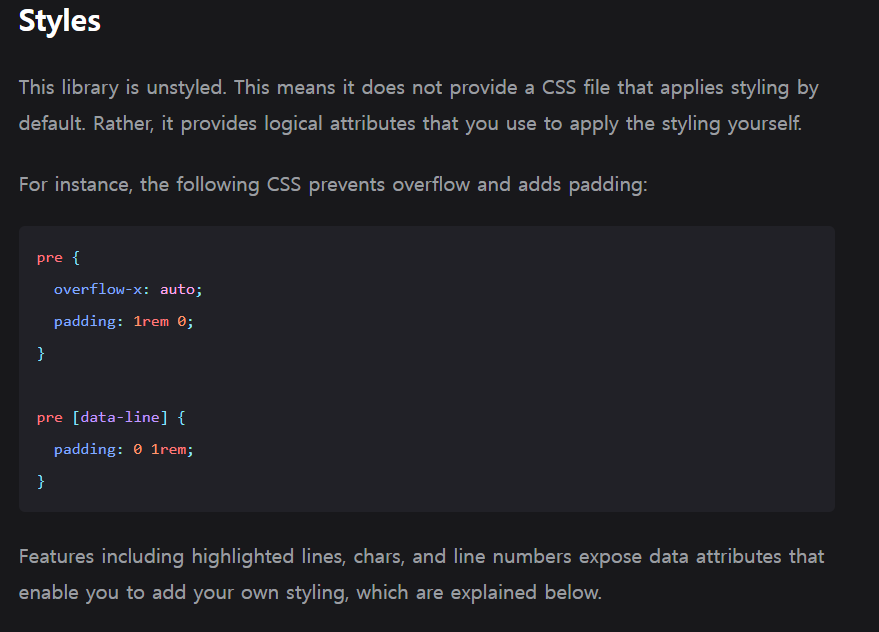

# 현재의 코드 블록의 모양새


```tsx
// app/[postId]/page.tsx 의 일부

const components = useMDXComponents({}, meta.path);

<MDXRemote source={content} components={components} />;
```

````tsx
export const useMDXComponents = (
  components: MDXComponents = {},
  postPath: string,
): MDXComponents => {
  return {
    /* 중복 코드 생략 */
    // TODO 코드 포맷터 라이브러리로 추가하기
    code: ({ children, className, ...props }) => {
      return (
        <code className={'font-ibm-plex-mono px-[1px] '} {...props}>
          {children}
        </code>
      );
    },
    pre: ({ children }) => (
      <pre className='bg-indigo-200 font-jetbrains px-12 py-8 my-8 text-wrap text-[80%]'>
        {children}
      </pre>
    ),
    ```
````

현재 `md` 파일을 `MDXRemote` 를 이용해 `jsx` 객체로 변경한 후 스타일링에 사용 할 `MDXComponents` 를 건내줘 어찌 저찌 `pre , code` 부분들이 코드 블록의 모양새를 가지고 있다.

나를 거의 국룰 코딩 폰트인 `jetbranis` 를 이용해 코드 블록 느낌은 나지만 여전히 아쉬운 점이 있다.

언어 별 포맷에 맞게 코드 블록 글이 포맷팅이 안된다는 점과 커스텀 블로그인 만큼 내가 원하는 코드 블럭에 줄을 치거나, 타이틀을 넣는 등의 커스텀화가 안된다.

너무 못생겼다 이말이야 ~~~~

그래서 코드 포맷터 라이브러리를 이용해주도록 하자 :)

# 사용 할 라이브러리 : `rehype-pretty-code`

[Next.js 블로그에서 코드 블록 꾸미기, rehype-pretty-code 플러그인 활용법](https://kilee.dev/blog/next-js-blog-codeblock-styling)

해당 게시글을 많이 참고했다.

물론 해당 글은 지금은 사장된 `contentLayer` 를 이용 할 떄의 이야기이지만 거의 사용 방법은 같으니 가보자고

```tsx
// next.config.mjs
import nextMDX from '@next/mdx';

const withMDX = nextMDX({
  extension: /\.(md|mdx)?$/,
});

/** @type {import('next').NextConfig} */
const nextConfig = { reactStrictMode: true };

export default withMDX(nextConfig);
```

> 혹시 이전 포스트들을 보며 따라온 사람들이 있을 수도 있어 이야기 하자면 이전엔 next.config.js 를 이용하여 `require` 문법을 사용했다.
>
> 하지만 이번 단계에서 `mjs` 형태로 바꾸고 `EMCAmodule` 방법을 선택하여 익숙한 `import , export` 문법으로 대체했다. :)

현재는 `@next/mdx` 라이브러리를 이용해 `mdx,md` 와 같은 `plain text` 를 컴파일 하여 컴포넌트로 사용 하고 있다.

`@next/mdx` 에선 `bable-loader` 를 이용하여 `mdx , md` 의 텍스트를 해석하여 `jsx` 객체로 변환하는 `remark` 패키지와 `html` 을 추상 구문 트리 형태의 데이터로 만들어 사용자가 원하는 변경을 `jsx` 에 적용 할 수 있도록 도와주는 `rehype` 패키지를 사용한다.

이 때 **다양한 플러그인을 추가해줘 `md,mdx` 파일이 `jsx` 객체로 변환 될 때 커스텀화 된 `jsx` 객체로 변환해줄 수 있으며 , 그러기 위해 사용 할 플러그인은 `rehype-pretty-plugin` 이다.**

`rehype-pretty-plugin` 에서 사용하는 컨벤션으로 코드 블록을 작성해준다면 `jsx` 객체로 변환 할 떄 선언해둔 스타일링 된 `jsx` 객체로 변환 하는 것이 가능하다. 호호호 렛츠고

[rehype-pretty-plugin 공식 문서](https://rehype-pretty.pages.dev/)

## 필요한 라이브러리 설치

---

```bash
$ npm install rehype-pretty-code

added 14 packages, and audited 711 packages in 8s

241 packages are looking for funding
  run `npm fund` for details

found 0 vulnerabilities
```

다음과 같이 `rehype-prety-code` 라이브러리를 설치해주자

## `next.config.mjs` 에 `plugin` 추가하기

---

```js
import nextMDX from '@next/mdx';
import rehypePrettyCode from 'rehype-pretty-code';

/** @type {import('rehype-pretty-code').Options} */
const options = {
  // See Options section below.
};

const withMDX = nextMDX({
  extension: /\.(md|mdx)?$/,
  options: {
    remarkPlugins: [],
    rehypePlugins: [[rehypePrettyCode, options]],
  },
});

/** @type {import('next').NextConfig} */
const nextConfig = { reactStrictMode: true };

export default withMDX(nextConfig);
```

이제 다음과 같이 `nextMDX.options` 에 플러그인으로 `rehypePrettyCode , options` 를 추가해주자

추후 설명하겠지만 `options` 는 플러그인에서 사용 할 기본 설정 값들이나 메소드 등을 담은 객체이다.

#### `options` 가 선언된 타입의 모습

```tsx
interface Options {
  grid?: boolean;
  theme?: Theme | Record<string, Theme>;
  keepBackground?: boolean;
  defaultLang?: string | { block?: string; inline?: string };
  tokensMap?: Record<string, string>;
  transformers?: ShikiTransformer[];
  filterMetaString?(str: string): string;
  getHighlighter?(options: BundledHighlighterOptions): Promise<Highlighter>;
  onVisitLine?(element: LineElement): void;
  onVisitHighlightedLine?(element: LineElement): void;
  onVisitHighlightedChars?(element: CharsElement, id: string | undefined): void;
  onVisitTitle?(element: Element): void;
  onVisitCaption?(element: Element): void;
}
```

옵션들은 나중에 `plugin` 을 실행 시킨 후 하나 씩 조정해가면서 알아가도록 하자

# 사용 할 라이브러리 : `shiki`

```bash
npm install shiki

up to date, audited 711 packages in 1s

241 packages are looking for funding
  run `npm fund` for details

found 0 vulnerabilities
```

또 사용 할 라이브러리로 `shiki` 를 설치해주도록 하자

해당 라이브러리는 코드 블록에서 사용 할 테마를 지정하거나 , 하이라이팅 할 떄 사용 할 라이브러리이다.

`TextMeta` 문법을 사용하여 하이라이팅 할 코드를 표시하거나 , 다양 한 프로그래밍 언어에 대한 포맷팅을 지원한다.

> `TextMeta` 문법은 이전 `md , mdx` 파일을 적을 때 `---` 를 기준으로 나눈 후
>
> `gray-matter` 로 파싱하여 가져왔을 때 처럼 `---` 를 기준으로 나눠 메타 데이터와 본문 데이터를 나누는 문법을 의미한다.

중요한 점은 **서버 측에서 하이라이팅을 수행 할 수 있으므로 서버 사이드 렌더링을 지원하는 `NextJS` 에서 아주 탁월한 선택이라는 것이다.**

또 다른 하이라이팅 라이브러리에 비해 속도가 매우 빠르다고 하며 `VScode` 에 정의 된 모든 테마를 사용 할 수 있다고 한다.

세상에 이렇게 고마운 라이브러리가 있을 수가 🤩

# `rehype-pretty-code` 자체는 스타일링을 도와주지 않는다.

이게 무슨 소리인가 싶을 수 있지만 공식 문서에 나온 설명 그대로이다.



