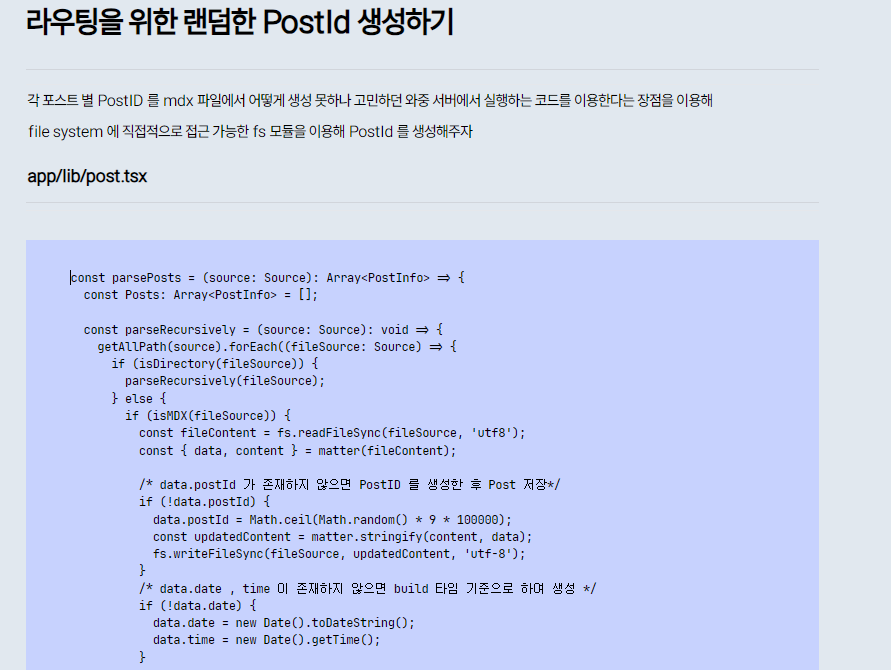
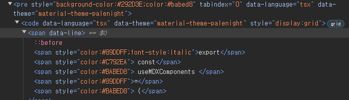

# 현재의 코드 블록의 모양새



현재 `md` 파일을 `MDXRemote` 를 이용해 `jsx` 객체로 변경한 후 스타일링에 사용 할 `MDXComponents` 를 건내줘 어찌 저찌 `pre , code` 부분들이 코드 블록의 모양새를 가지고 있다.

나를 거의 국룰 코딩 폰트인 `jetbranis` 를 이용해 코드 블록 느낌은 나지만 여전히 아쉬운 점이 있다.

언어 별 포맷에 맞게 코드 블록 글이 포맷팅이 안된다는 점과 커스텀 블로그인 만큼 내가 원하는 코드 블럭에 줄을 치거나, 타이틀을 넣는 등의 커스텀화가 안된다.

너무 못생겼다 이말이야 ~~~~

그래서 코드 포맷터 라이브러리를 이용해주도록 하자 :)

# 사용 할 라이브러리 : rehype-pretty-code

> [Next.js 블로그에서 코드 블록 꾸미기, rehype-pretty-code 플러그인 활용법](https://kilee.dev/blog/next-js-blog-codeblock-styling)
>
> 해당 게시글을 많이 참고했다.

## 필요한 라이브러리 설치

`@next/mdx` 에선 `bable-loader` 를 이용하여 `mdx , md` 의 텍스트를 해석하여 `jsx` 객체로 변환하는 `remark` 패키지와 `html` 을 추상 구문 트리 형태의 데이터로 만들어 사용자가 원하는 변경을 `jsx` 에 적용 할 수 있도록 도와주는 `rehype` 패키지를 사용한다.

이 때 **다양한 플러그인을 추가해줘 `md,mdx` 파일이 `jsx` 객체로 변환 될 때 커스텀화 된 `jsx` 객체로 변환해줄 수 있으며 , 그러기 위해 사용 할 플러그인은 `rehype-pretty-plugin` 이다.**

`rehype-pretty-plugin` 에서 사용하는 컨벤션으로 코드 블록을 작성해준다면 `jsx` 객체로 변환 할 때 선언해둔 스타일링 된 `jsx` 객체로 변환 하는 것이 가능하다. 호호호 렛츠고

[rehype-pretty-plugin 공식 문서](https://rehype-pretty.pages.dev/)

---

```bash
$ npm install rehype-pretty-code

added 14 packages, and audited 711 packages in 8s

241 packages are looking for funding
  run `npm fund` for details

found 0 vulnerabilities
```

다음과 같이 `rehype-prety-code` 라이브러리를 설치해주자

# 사용 할 라이브러리 : shiki

```bash
npm install shiki

up to date, audited 711 packages in 1s

241 packages are looking for funding
  run `npm fund` for details

found 0 vulnerabilities
```

또 사용 할 라이브러리로 `shiki` 를 설치해주도록 하자

해당 라이브러리는 코드 블록에서 사용 할 테마를 지정하거나 , 하이라이팅 할 때 사용 할 라이브러리이다.

`TextMeta` 문법을 사용하여 하이라이팅 할 코드를 표시하거나 , 다양 한 프로그래밍 언어에 대한 포맷팅을 지원한다.

`TextMeta` 에 대한 내용은 `rehype-pretty-code` 를 이용하는 모습을 보며 문법을 살펴보자

중요한 점은 **서버 측에서 하이라이팅을 수행 할 수 있으므로 서버 사이드 렌더링을 지원하는 `NextJS` 에서 아주 탁월한 선택이라는 것이다.**

또 다른 하이라이팅 라이브러리에 비해 속도가 매우 빠르다고 하며 `VScode` 에 정의 된 모든 테마를 사용 할 수 있다고 한다.

세상에 이렇게 고마운 라이브러리가 있을 수가 🤩

# MDXRemote 에도 플러그인을 추가해주자

> [Next.js 블로그 만들기 (14.1 최신 버전 + tailwind)](https://www.d5br5.dev/blog/nextjs_blog/setup)
>
> 정말 엄청나게 많은 도움을 받은 블로그이다.
>
> 사실 위의 `next.config.js` 에 플러그인들을 추가해주면 되는줄 알았다.
>
> 그런데 아무리 공식 문서에서 추가하란데로 추가하여도 전혀 코드 블록이 적용이 안됐는데 알고보니 `MDXRemote` 컴포넌트에서도 추가를 해줘야했다.
>
> 어떻게 `md , mdx` 파일을 파싱하냐에 따라 사용 방법이 다르겠지만 **`next-mdx-remote` 의 `MDXRemote` 를 이용하는 경우엔 `MDXRemote` 옵션에 추가해줘야 한다.**

```tsx {1-2, 23-35}#add title="app/[postId]/page.tsx"
import rehypePrettyCode from 'rehype-pretty-code';
import remarkGfm from 'remark-gfm';

import PostTitle from '@/components/PostTitle';
import { MDXRemote } from 'next-mdx-remote/rsc';

import { useMDXComponents } from '../lib/mdxComponents';
import { getPostContent } from '../lib/post';

const PostPage = ({ params }: { params: { postId: string } }) => {
  const { meta, content } = getPostContent(params.postId);
  const components = useMDXComponents({}, meta.path);

  return (
    <>
      <header className='pt-14 mb-12'>
        <PostTitle meta={meta} />
      </header>
      <main className='px-14'>
        <MDXRemote
          source={content}
          components={components}
          options={{
            mdxOptions: {
              remarkPlugins: [remarkGfm],
              rehypePlugins: [
                [
                  rehypePrettyCode,
                  {
                    theme: 'material-theme-palenight',
                  },
                ],
              ],
            },
          }}
        />
      </main>
    </>
  );
};

export default PostPage;
```

다음과 같이 `MDXRemote` 의 `options` 객체에 사용 할 라이브러리와 `options` 들을 추가해주면 코드 블록을 사용 할 준비는 모두 끝난다.

`options` 에는 다음과 같은 값들을 추가해 줄 수 있는데 이는 필요에 따라 공식문서를 참고하여 추가해주도록 하자. 나는 우선은 단순히 테마만 적용시켰다.

```tsx title="options의 타입 선언"
interface Options {
  grid?: boolean;
  theme?: Theme | Record<string, Theme>;
  keepBackground?: boolean;
  defaultLang?: string | { block?: string; inline?: string };
  tokensMap?: Record<string, string>;
  transformers?: ShikiTransformer[];
  filterMetaString?(str: string): string;
  getHighlighter?(options: BundledHighlighterOptions): Promise<Highlighter>;
  onVisitLine?(element: LineElement): void;
  onVisitHighlightedLine?(element: LineElement): void;
  onVisitHighlightedChars?(element: CharsElement, id: string | undefined): void;
  onVisitTitle?(element: Element): void;
  onVisitCaption?(element: Element): void;
}
```

# 코드 블록 스타일링 하기

코드 블록 스타일링의 경우 [rehype-pertty-code 공식 문서](https://rehype-pretty.pages.dev/) 에 가면 매우 친절하게 잘 설명되어 있다.

## 기본 코드 블록 css 설정

`rehype-pretty-code` 라이브러리는 코드 블록에 존재하는 `plain text` 들을 적절한 태그로 포맷팅 해주고, `rehype-pretty-code` 에서 제공하는 문법을 이용면 태그 별로 적절한 `attribute` 를 추가해준다.

우리는 이런 `attribute` 가 적용된 태그들을 스타일링을 해주면 된다. :)

```css showLineNumbers{29} title="global.css"
pre {
  overflow-x: auto;
  white-space: pre-wrap;
  word-wrap: break-word;
  font-family: var(--font-jetBrainsMono);
  padding-top: 1rem;
  padding-bottom: 2rem;
  margin-bottom: 2rem;
  border-radius: 0px 0px 10px 10px;
  scrollbar-width: none;
}

pre::-webkit-scrollbar {
  display: none;
}

pre {
  scrollbar-width: none;
}

code {
  font-family: var(--font-jetBrainsMono);
  font-size: 80%;
}
```

기본적으로 코드 블럭들에 사용할 스타일들을 `global.css` 에 추가해준다. 해당 코드들은 `rehype-pretty-code` 와는 상관 없는 스타일 속성들이다.

취향에 맞게 사용해주면 된다.

```css showLineNumbers{53} {1-4 , 5-7}
pre > code {
  display: grid;
  font-size: 80%;
}

pre span[data-line] {
  @apply inline-block px-4 py-0.5;
}
```

기본적으로 `rehype-pretty-code` 에서 `pre > code` 내부에 있는 `plain text` 들을 포맷팅 할 때

`const a = 1` 이란 코드가 존재한다면 다음과 같이 포맷팅 된다.

```html
<span data-line>
  <span>const</span>
  <span>a</span>
  <span>=</span>
  <span>1</span>
</span>
```

하나의 줄을 `data-line` 으로 감싸고 단어 별로 `span` 태그로 감싸준다는 것이다.

그렇기에 `pre > code` 부분을 `grid`로 해주고 `span[data-line]` 을 `inline-block` 으로 해준다면 코드 줄을 하나의 행으로 둬 명확하게 코드 블록을 줄 별로 구분해줄 수 있다.

> 어떻게 포맷팅 되는지 궁금한 사람은 포스트 내 코드 블록들을 개발자 도구를 통해 살펴보도록 하자 :)

## 테마 설정

이 때 `options` 에 넣은 `theme` 에 따라 `data-language` 에 따라 텍스트들에 적절한 색상이 존재하는 모습을 볼 수 있다.

[shiki 에서 기본적으로 제공하는 테마들](https://shiki.style/themes#themes)

기본적으로 `rehype-pretty-code` 의 경우 `shiki` 라이브러리에 의존하고 있기 때문에 `shiki` 라이브러리에서 제공하는 테마를 `theme` 프로퍼티에 담아 사용 할 수 있다.

만약 `shiki` 에서 제공하는 테마가 아니라 다른 테마를 적용하고 싶은 경우 적용하고 싶은 테마를 다운 받은 후 다음과 같이 적용하면 된다.

```tsx title="로컬 테마 파일 적용방법" {1-3}#add
const options = {
  theme: JSON.parse(fs.readFileSync('./themes/moonlight-ii.json', 'utf-8')),
};
```



## rehype pretty code 에서 제공하는 데이터 어트리뷰트들 살펴보기

### 코드 블록 하이라이팅 하기

````{1} title="하이라이팅 적용 예시"
```js {1-2,4}
import rehypePrettyCode from 'rehype-pretty-code';
import remarkGfm from 'remark-gfm';

import PostTitle from '@/components/PostTitle';
import { MDXRemote } from 'next-mdx-remote/rsc';
```
````

```js {1-2,4} title="하이라이팅 결과"
import rehypePrettyCode from 'rehype-pretty-code';
import remarkGfm from 'remark-gfm';

import PostTitle from '@/components/PostTitle';
import { MDXRemote } from 'next-mdx-remote/rsc';
```

코드 블록에서 `{}` 내부에 코드 라인 줄 수를 범위로 적어주거나, 코드 라인을 적음으로서 `span` 태그에 `data-highlighted-line` 어트리뷰트를 추가해줄 수 있다.


이렇게 추가 된 어트리뷰트에 따라 스타일링을 `css` 에 적어주면 된다.

```css showLineNumbers{85} title="global.css" {1-3}#add
span[data-highlighted-line] {
  background-color: #e0e0e031;
}
```

만약 `data-highlighted-line` 에서 추가와 제거 같이 커스텀화 된 `highlighted-line` 을 갖고 싶다면 작성 할 때 `#{id}` 를 추가해주면 된다.

````{1} title=" 그룹 하이라이팅 사용 예시"
```js {1-2}#add {3-4}#remove
import rehypePrettyCode from 'rehype-pretty-code';
import remarkGfm from 'remark-gfm';

import PostTitle from '@/components/PostTitle';
import { MDXRemote } from 'next-mdx-remote/rsc';
```
````

```js {1-2}#add {3-4}#remove title="그룹 하이라이팅 사용 결과"
import rehypePrettyCode from 'rehype-pretty-code';
import remarkGfm from 'remark-gfm';

import PostTitle from '@/components/PostTitle';
import { MDXRemote } from 'next-mdx-remote/rsc';
```

```css showLineNumbers{85} {5-11}#add title="global.css"
span[data-highlighted-line] {
  background-color: #e0e0e031;
}

span[data-highlighted-line-id='add'] {
  background-color: rgba(195, 255, 0, 0.127);
}

span[data-highlighted-line-id='remove'] {
  background-color: rgba(255, 99, 71, 0.315);
}
```

### 코드 블록 타이틀 넣기

코드 블록에 타이틀은 `title="사용 할 제목"` 을 추가해 사용해줄 수 있다.

추가된 제목은 코드 블록 상단에 `<figcaption data-rehype-pretty-code-title>` 태그로 생성된다.

해당 `figcaption` 에 사용 할 스타일링을 `css` 파일에 적어주자

```css showLineNumbers{97} title="global.css"
figcaption[data-rehype-pretty-code-title] {
  text-align: end;
  background-color: #292d3e;
  border-radius: 10px 10px 0px 0px;
  padding-top: 0.5rem;
  padding-right: 2rem;
  color: #aaa;
}
```

### 코드 블록에 라인 넘버 넣기

코드 블록에 라인 넘버를 넣는 방식은 기본적으로 `css` 를 이용해 작성해준다.

```css showLineNumbers{63}
code {
  counter-reset: line; /* code가 시작 될 때 마다 line 이란 이름의 카운터 생성 */
}

code > [data-line]::before {
  /* [data-line] 이 등장 할 때 마다 counter 1씩 증가 */
  counter-increment: line;

  /* [data-line] 이 등장 할 때 마다 counter 를 줄의 ::before에 
  추가해주기
  */
  content: counter(line);
  display: inline-block;
  width: 1rem;
  margin-right: 2rem;
  text-align: right;
  color: gray;
}

code[data-line-numbers-max-digits='2'] > [data-line]::before {
  width: 2rem;
}

code[data-line-numbers-max-digits='3'] > [data-line]::before {
  width: 3rem;
}
```
