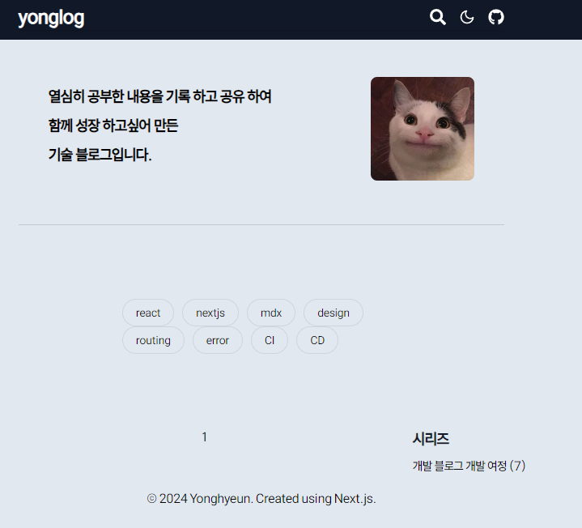

# 문제 정의

```tsx
import CategoryList from '@/components/Category';
import SideBar from '@/components/Sidebar';
import Introduce from '@/components/Introduce';
import Pagination from '@/components/Pagination';
import { PostList } from '@/components/PostList';

import type { SearchParams } from '@/types/global.d.ts';

const Page = ({ searchParams }: { searchParams: SearchParams }) => {
  /* 서버 컴포넌트의 props.searchParams 는 Object 객체이다.
  컴포넌트나 메소드 내에서 URLSearchParams 를 이용하기 때문에 복사본 생성
  */
  const _searchParams = new URLSearchParams(searchParams);

  return (
    <section className='mx-0 sm:mx-auto w-full lg:w-1/2'>
      <div className='hidden md:block'>
        <Introduce />
      </div>
      <CategoryList />
      <section className='w-full lg:w-[120%] flex gap-5'>
        <section className=' bg-black-200 w-full lg:w-8/12 px-4'>
          <PostList searchParams={_searchParams} />
          <Pagination searchParams={_searchParams} />
        </section>
        <div className='hidden lg:block lg:flex-2 sticky top-0 w-4/12'>
          <SideBar />
        </div>
      </section>
    </section>
  );
};

export default Page;
```



현재 배포 시 `/` 경로에 존재하는 `page.tsx` 에서 `PostList` 컴포넌트 부분이 서버에서 렌더링 되지 않는다.

`dev` 모드에선 문제 없이 `PostList` 부분이 렌더링이 잘 됨에도 불구하고 왜그럴까 ?

### `components/PostList.tsx`

---

```tsx
import Link from 'next/link';
import Image from 'next/image';
import { selectPosts } from '@/app/lib/post';
import type { PostInfo } from '@/types/post';

export const PostList = ({
  searchParams,
}: {
  searchParams: URLSearchParams;
}) => {
  const page = searchParams.get('page') || '1';
  const postList = selectPosts(searchParams);
  // 디버깅을 위해 사용 할 length
  console.log(searchParams.toString());
  console.log(postList.length);

  const POSTS_PER_PAGES = Number(process.env.POSTS_PER_PAGES);
  const offSet = Math.max(0, (Number(page) - 1) * POSTS_PER_PAGES);

  const slicedPostList = postList.slice(offSet, offSet + POSTS_PER_PAGES);
  return slicedPostList.map(({ meta }, id) => (
    <PostItem meta={meta} key={id} />
  ));
};
```
