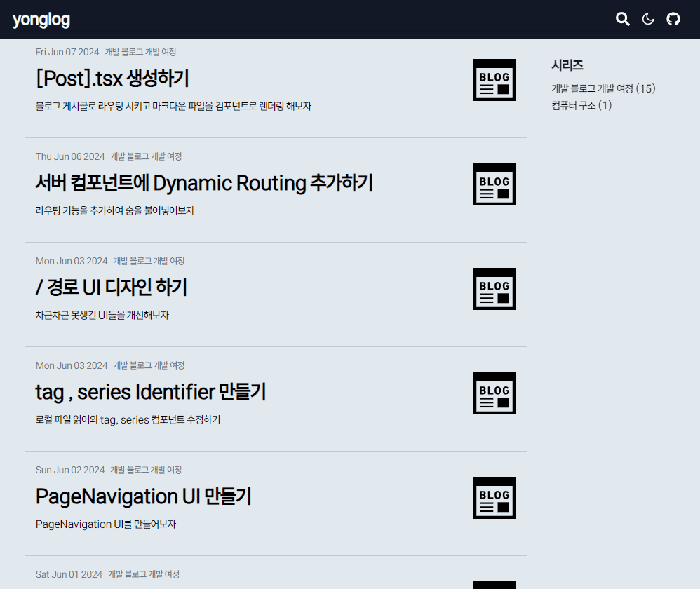
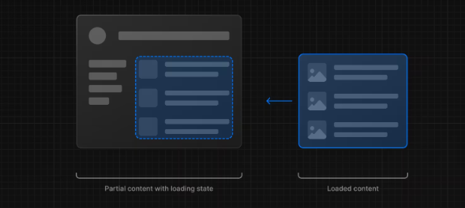

# Loading Suspense 가 필요한 이유

```tsx title="app/[postId]/page.tsx" {11,17,20-36}
import rehypePrettyCode from "rehype-pretty-code";
import remarkGfm from "remark-gfm";

import PostTitle from "@/components/PostTitle";
import { MDXRemote } from "next-mdx-remote/rsc";

import { getMdxComponents } from "../lib/mdxComponents";
import { getPostContent } from "../lib/post";

const PostPage = ({ params }: { params: { postId: string } }) => {
  const { meta, content } = getPostContent(params.postId);
  const components = getMdxComponents({}, meta.path);

  return (
    <>
      <header className="pt-14 mb-12">
        <PostTitle meta={meta} />
      </header>
      <main className="px-14">
        <MDXRemote
          source={content}
          components={components}
          options={{
            mdxOptions: {
              remarkPlugins: [remarkGfm],
              rehypePlugins: [
                [
                  rehypePrettyCode,
                  {
                    theme: "material-theme-palenight",
                  },
                ],
              ],
            },
          }}
        />
      </main>
    </>
  );
};

export default PostPage;
```

현재 포스트 리스트들을 보여주는 `[page]/page.tsx` 서버 컴포넌트는 무거운 작업들을 하고 있다.

우선 `getPostContent` 메소드에서 파일 시스템에 접근해 해당 `postId` 에 해당하는 `mdx` 파일을 읽어오고

`MDXRemote` 컴포넌트에선 `mdx` 파일들을 적절한 `jsx` 태그로 변환하는 작업들을 수행한다.

이로 인해 어떤 `postId` 경로로 이동 할 때 **서버 렌더링이 완료되기 전까지 라우팅이 지연** 되는 모습을 볼 수 있다.

> 밑의 예시에선 시간이 얼마 걸리지 않는 것 처럼 보이지만 사실 이는 `dev` 모드이기 때문이다.
>
> 실제 배포된 상태에선 3~4초간의 지연 시간이 존재했다.



물론 현재는 포스트의 내용이 적기 때문에 지연 시간이 오래 걸리지 않지만 만약 포스트 내용이 많거나, 내부에서 불러와야 하는 이미지들이 많은 경우에는 지연 시간이 더욱 오래 걸릴 것이다.

## NextJS 에선 Streaming UI 를 사용 할 것을 공식적으로 추천한다.

[NextJS 공식 문서 - Loading UI and Streaming](https://nextjs.org/docs/app/building-your-application/routing/loading-ui-and-streaming)

공식문서를 살펴보면 `NextJS` 의 내부엔 `React.Suspense` 컴포넌트를 이용한 `Streaming UI` 를 지원한다고 한다.

```tsx title="React.Suspense 사용 예시" {2-3}
/* 로딩 시엔 fallback의 컴포넌트를 렌더링 */
<Suspense fallback={<Loading />}>
  <SomeComponent /> /* 렌더링 할 준비가 완료 되면 해당 컴포넌트를 렌더링 */
</Suspense>
```



`Streaming UI` 란 어떤 컴포넌트의 작업이 오래 걸릴 경우 로딩중에 보여줄 컴포넌트를 우선적으로 렌더링 하고, 작업이 완료되면 작업물을 렌더링 하는 방식이다.

그렇다면 어떤 것을 스트리밍 할 지 생각을 해보자

## 무엇이 지연을 일으킬까 ?

포스트에 들어가기까지 걸리는 지연은 두 가지 이유로 인해 발생한다.

### 전체 지연 시간 : /[postId] 의 page.tsx의 렌더링 결과를 받아오는 네트워크의 지연 시간

말 그대로 `[postId]` 경로에 대한 서버 컴포넌트의 `React Server Component Payload` 파일을 받아오는데까지 걸리는 시간이다.

해당 시간은 클라이언트 측에서 서버로부터 `[postId]` 경로에 대한 `request` 를 보내는 시점으로부터

서버 측에서 `[postId]/page.tsx` 파일을 렌더링 하여 클라이언트에게 전송하는 시간을 의미한다.

### 부분 지연 시간 : 서버 측에서 렌더링 할 때 까지 걸리는 시간

```tsx title="app/[postId]/page.tsx" {11-27} showLineNumbers{12}
const PostPage = ({ params }: { params: { postId: string } }) => {
  const { meta, content } = getPostContent(params.postId);
  const components = getMdxComponents({}, meta.path);

  return (
    <>
      <header className="pt-14 mb-12">
        <PostTitle meta={meta} />
      </header>
      <main className="px-14">
        <MDXRemote
          source={content}
          components={components}
          options={{
            mdxOptions: {
              remarkPlugins: [remarkGfm],
              rehypePlugins: [
                [
                  rehypePrettyCode,
                  {
                    theme: "material-theme-palenight",
                  },
                ],
              ],
            },
          }}
        />
      </main>
    </>
  );
};

export default PostPage;
```

가장 많은 시간이 소비되는 공간으로 가져온 텍스트 파일을 `MDXRemote` 에서 `jsx` 객체로 변환하는 시간이다.

평소에는 해당 부분의 시간이 오래 걸리지 않았지만 `rehype-pretty-code` 를 추가 한 이후로 로딩 시간이 매우 오래 걸렸다.

사실 알고 보니 `rehype-pretty-code` 의 테마 설정 및 변환 과정은 **비동기적으로 작동되며 변환 단계까지 렌더링이 모두 `block` 된다** 는 사실을 알게 되었다.

외부 파일에 존재하는 테마와 언어 문법을 로드해와야 코드 블록을 적절하게 포맷팅 하는데 , 테마와 언어 문법을 로드해오는 과정이 비동기적이라는 것이다.

즉 , `page.tsx` 에 대한 서버단의 렌더링이 종료 후 `RSCP` 를 클라이언트 단에게 보냈을 때

서버의 `RSCP` 를 클라이언트 단에서 `hydrate` 시키는 과정에서 `MDXRemote` 컴포넌트가 모든 렌더링 단계를 `block` 하기 때문에 많은 시간의 지연이 발생한다.

**결국 `MDXRemote` 로 인해 `block` 되는 시간이 길어질 수록 전체 지연 시간이 길어진다는 것이다.**

> 이 부분은 나도 확실치 않다. `rehype-pretty-code` 의 공식문서를 읽어봐도 비동기적으로 처리된다는 말은 없지만
>
> 경험적으로 그렇다. 밑의 과정을 살펴보자 :)

# /[postId]/loading.tsx 파일을 생성해보자

우선적으로 `MDXRemote` 부분을 해결하기 전 `loading.tsx` 파일을 먼저 생성해보자

`loading.tsx` 는 `page.tsx` 파일이 클라이언트에게 도착되기 전까지 렌더링 되는 페이지이다.

```tsx title="기본 layout의 모습"
const PostLayout = ({ children }: { children: React.ReactNode }) => {
  return (
    <article className="break-words  mx-auto max-w-screen-lg xl:max-w-[960px] px-4">
      <Suspense fallback={/* loading.tsx 파일 */}>
        {children} {/* page.tsx 파일 */}
      </Suspense>
    </article>
  );
};

export default PostLayout;
```

즉 `[postId]` 경로에 대한 `layout` 이 다음과 같이 존재 할 때 사실 `NextJS` 은 다음과 같은 모습을 취하고 있다.

```tsx title="사실 page.tsx 는 Suspense로 감싸져있어요" {4,6}#add
const PostLayout = ({ children }: { children: React.ReactNode }) => {
  return (
    <article className="break-words  mx-auto max-w-screen-lg xl:max-w-[960px] px-4">
      <Suspense fallback={/* loading.tsx 파일 */}>
        {children} {/* page.tsx 파일 */}
      </Suspense>
    </article>
  );
};

export default PostLayout;
```

```tsx title="app/[postId]/loading.tsx"
import { LoadingTitle, LoadingContnet } from "@/components/Loading";

const PostLoading = () => (
  <>
    <header className="pt-14 mb-12">
      <LoadingTitle />
    </header>
    <main className="px-14">
      <LoadingContnet />
    </main>
  </>
);

export default PostLoading;
```

다음과 같이 `PostLoading` 컴포넌트를 생성해줬다. 해당 컴포넌트는 `page.tsx` 파일을 서버에서 받기 전까지 렌더링 되는 페이지이다.

내부에 쓰인 `LoadingTitle , LoadingContent` 는 `page.tsx` 에서 쓰인 `h1,p,span,div` 태그와 동일하게 스타일링 되었으면서 내부 컨텐츠가 `lorem` 으로 감싸진 컴포넌트들로 이뤄져있다.

```tsx title="components/Loading.tsx" {2-3}
export const LoadingTitle = () => (
  <div className='animate-pulse '>
    <section className=' mb-4 py-4 border-b-[2px]  border-gray-300 '>
      <h1 className='  text-5xl py-4 font-semibold '>
        <span className='bg-gray-300 text-gray-300'>
          로딩중인 제목입니다. 배경색과 같아요.
        </span>
      </h1>
      <span className=' text-end  flex justify-end'>
        <span className='bg-gray-300 text-gray-300'>
          로딩중인 시리즈 시리즈 시리즈
        </span>
      </span>
    </section>
    <section className=' flex justify-between'>
      <p>
        <span className=' mr-2 border px-2 py-1 bg-gray-300 text-gray-300 rounded-lg '>
          로딩시리즈
        </span>
        <span className=' mr-2 border px-2 py-1 bg-gray-300 text-gray-300 rounded-lg '>
          로딩시리즈
        </span>
        <span className=' mr-2 border px-2 py-1 bg-gray-300 text-gray-300 rounded-lg '>
          로딩시리즈
        </span>
      </p>
      <p className=' bg-gray-300 text-gray-300'>Aaa Aaa 11 2023</p>
    </section>
  </div>
);

export const LoadingContnet = () => (
  <div className='animate-pulse'>
    <h1 className=' text-3xl border-b-[2px]  pt-4 pb-2 mb-8 border-gray-300 font-semibold '>
      <span className='bg-gray-300 text-gray-300'>
        포스트와 같은 크기의 헤드입니다.
      </span>
    </h1>
    <div className=' mx-auto my-[1rem] max-w-screen-lg xl:max-w-[720px] h-[300px] bg-gray-300 text-gray-300'>
      이미지 크기 역할을 할 로딩 Content 입니다.
    </div>
    <p className='my-3 '>
      <span className='inline py-1 text-[16px] mb-2rem indent-[1px] bg-gray-300 text-gray-300'>
        Lorem ipsum dolor sit amet consectetur adipisicing elit. Assumenda
      </span>
    {/* 이후 코드 생략 */}
  </div>
);
```

이 때 `tailwind` 의 애니메이션 효과인 `animate-pulse` 를 이용해 로딩 상태를 처리했으며

배경색과 글자 색을 동일하게 하여 회색 톤의 빈 블록의 모습을 나타냈다.

> `width , height` 를 이용해 아무런 값이 존재하지 않는 블록을 표현 할 수도 있었지만 계산하기 귀찮아서 그냥 글자 치고 안보이게 해버렸다.

이렇게 하면 모든 문제가 해결될 줄 알았다. `page.tsx` 파일이 도착했다면 모든 데이터가 렌더링 되어 있었을 것이라 생각했기 때문이다.

## loading.tsx 만으론 완벽하지 않다.


하지만 실행된 결과를 보면 처음엔 `loading.tsx` 페이지가 보이다가 **전체 페이지가 사라진 후**, `page.tsx` 파일이 생성되는 모습을 볼 수 있다.

> 위 예시는 사용 할 이미지의 용량을 줄이기 위해 코드블록의 수가 적은 포스트로 예시를 들었다.
>
> 만약 사용 한 코드 블록이 늘어나면 늘어날 수록 로딩 시간 (빈 화면이 보이는 시간) 이 매우 길었다. 길게는 5초까지도 있었다.

그렇다면 이런 문제는 왜 발생했을까 ?

### 해당 문제가 발생한 이유

이는 `MDXRemote` 컴포넌트 자체가 비동기적으로 처리 되며 `rehype-pretty-code` 의 플러그인들이 코드블록을 포맷팅 하는 동안 모든 렌더링 단계가 `block` 되기 때문이다.

```tsx title="app/[postId]/page.tsx" {1-10} {11}#remove showLineNumbers{12}
const PostPage = ({ params }: { params: { postId: string } }) => {
  const { meta, content } = getPostContent(params.postId);
  const components = getMdxComponents({}, meta.path);

  return (
    <>
      <header className='pt-14 mb-12'>
        <PostTitle meta={meta} />
      </header>
      <main className='px-14'>
        <MDXRemote {/* 이 부분부터 렌더링이 block */}
          source={content}
          components={components}
          options={{
            mdxOptions: {
              remarkPlugins: [remarkGfm],
              rehypePlugins: [
                [
                  rehypePrettyCode,
                  {
                    theme: 'material-theme-palenight',
                  },
                ],
              ],
            },
          }}
        />
      </main>
    </>
  );
};

export default PostPage;
```

서버에서 보낸 작은 자바스크립트 번들인 `RSCP` 가 클라이언트 단에서 실행 될 때

`MDXRemote` 부분에 대한 번들 코드를 실행 하게 되면 `rehype-pretty-code` 의 비동기 메소드들로 인해 모든 렌더링 과정이 `block` 되고 `page.tsx` 의 전체 렌더링 시간이 매~우 길어지게 되고 있다.

# MDXRemote 를 Suspense 로 감싸주자

그!래!서! `MDXRemote` 컴포넌트가 `RSCP` 형태로 클라이언트에게 보내질 때 해당 부분을 `loading.tsx` 에서 사용했던 컴포넌틀르 이용해 `Suspense` 로 감싸 보내주었다.

```tsx {6,22,40}#add title="app/[postId]/page.tsx"
import rehypePrettyCode from "rehype-pretty-code";
import remarkGfm from "remark-gfm";

import PostTitle from "@/components/PostTitle";
import { MDXRemote } from "next-mdx-remote/rsc";
import { Suspense } from "react";
import { LoadingContnet } from "@/components/Loading";

import { getMdxComponents } from "../lib/mdxComponents";
import { getPostContent } from "../lib/post";

const PostPage = ({ params }: { params: { postId: string } }) => {
  const { meta, content } = getPostContent(params.postId);
  const components = getMdxComponents({}, meta.path);

  return (
    <>
      <header className="pt-14 mb-12">
        <PostTitle meta={meta} />
      </header>
      <main className="px-14">
        <Suspense fallback={<LoadingContnet />}>
          <MDXRemote
            source={content}
            components={components}
            options={{
              mdxOptions: {
                remarkPlugins: [remarkGfm],
                rehypePlugins: [
                  [
                    rehypePrettyCode,
                    {
                      theme: "material-theme-palenight",
                    },
                  ],
                ],
              },
            }}
          />
        </Suspense>
      </main>
    </>
  );
};

export default PostPage;
```

이렇게 되면 `loading.tsx` 파일이 렌더링 된 이후 `page.tsx` 파일이 렌더링 되는 동안 `MDXRemote` 의 비동기처리로 전체 렌더링 패스가 `block` 되는 것이 아니라 `loading.tsx` 때 처럼 `LoadingContent` 컴포넌트가 렌더링 되게 된다.

이후 `MDXRemote` 의 비동기처리가 모두 끝나면 정상적으로 `MDXRemote` 컴포넌트의 내용이 렌더링 된다.


렌더링 과정을 보면 `loading.tsx` 가 렌더링 됨으로 인해 `title , content` 영역이 모두 `loading` 상태였다가

`page.tsx` 부분이 렌더링 될 땐 `content (MDXRemote)` 영역이 `loading -> MDXRemote` 로 렌더링 되는 모습을 볼 수 있다.

> 처리해야 할 것들을 먼저 처리하고 나서 나중엔 `Image` 로 인해 발생하는 `layout shifting` 을 어떻게 해결할지 생각해봐야겠다.
