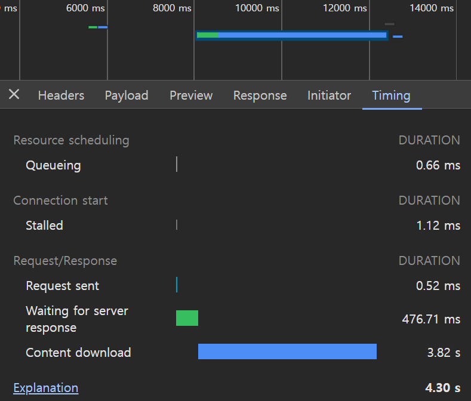
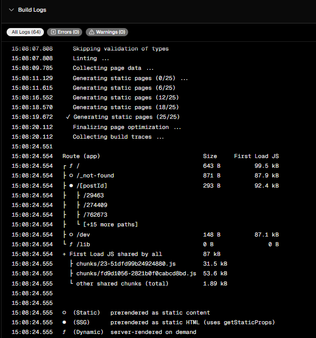
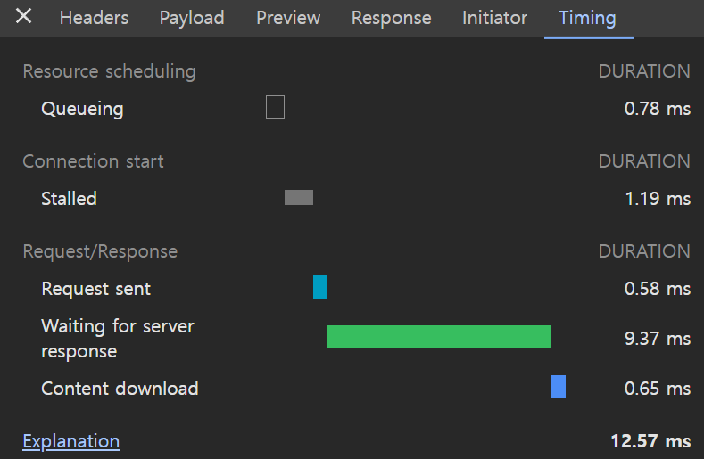

# 현재 상황을 먼저 짚고 가보자

```tsx title="app/[postId]/page.tsx" showLineNumbers{12} {2-3 ,11-28} {11,29}#add
const PostPage = ({ params }: { params: { postId: string } }) => {
  const { meta, content } = getPostContent(params.postId);
  const components = useMDXComponents({}, meta.path);

  return (
    <>
      <header className='pt-14 mb-12'>
        <PostTitle meta={meta} />
      </header>
      <main className='px-14'>
        <Suspense fallback={<LoadingContnet />}>
          <MDXRemote
            source={content}
            components={components}
            options={{
              mdxOptions: {
                remarkPlugins: [remarkGfm],
                rehypePlugins: [
                  [
                    rehypePrettyCode,
                    {
                      theme: 'material-theme-palenight',
                    },
                  ],
                ],
              },
            }}
          />
        </Suspense>
      </main>
    </>
  );
};

export default PostPage;
```

현재 블로그 포스트 글에 대한 `postId` 주소로 다이나믹 라우팅 시켜 `mdx` 파일들을 이용해 페이지를 렌더링 하는 컴포넌트이다.

해당 컴포넌트는 `dynamic rendering` 을 사용하고 있기 때문에 매번 라우팅 될 때 마다 라우팅 경로에 따라 컴포넌트가 호출된다.

이로 인해 어떤 문제가 발생했었는지 생각해보자

## Suspense 컴포넌트 도입 전 발생하던 문제


```tsx title="app/[postId]/loading.tsx"
import { LoadingTitle, LoadingContnet } from '@/components/Loading';

const PostLoading = () => (
  <>
    <header className='pt-14 mb-12'>
      <LoadingTitle />
    </header>
    <main className='px-14'>
      <LoadingContnet />
    </main>
  </>
);

export default PostLoading;
```

`[postId]` 경로에 접근했을 때 해당 포스트에 대한 서버에서의 렌더링 결과를 받기 전까지 `loading.tsx` 가 렌더링 되도록 해줬을 때

`page.tsx` 의 서버 렌더링 결과가 끝나고 클라이언트한테 요청이 도착하기 전까지 `loading.tsx`가 먼저 렌더링 되고

`page.tsx` 가 클라이언트에게 도착했을 때, **화면이 잠시 멈춰있다가 `page.tsx` 의 렌더링 결과가 나타나는 모습** 을 볼 수 있다.

화면이 왜 잠시 멈춰있는가 생각을 해본다면 문제는 `page.tsx` 가 서버에서 렌더링 된 후 클라이언트에게 렌더링 결과인 `RSCP` 를 넘기고 `RSCP` 를 클라이언트 창에서 호출하여 클라이언트의 인터페이스를 변경 할 때 발생한다.

```tsx title="app/[postId]/page.tsx" {1-10} {11}#remove showLineNumbers{12}
const PostPage = ({ params }: { params: { postId: string } }) => {
  const { meta, content } = getPostContent(params.postId);
  const components = useMDXComponents({}, meta.path);

  return (
    <>
      <header className='pt-14 mb-12'>
        <PostTitle meta={meta} />
      </header>
      <main className='px-14'>
        <MDXRemote {/* 이 부분부터 렌더링이 block */}
          source={content}
          components={components}
          options={{
            mdxOptions: {
              remarkPlugins: [remarkGfm],
              rehypePlugins: [
                [
                  rehypePrettyCode,
                  {
                    theme: 'material-theme-palenight',
                  },
                ],
              ],
            },
          }}
        />
      </main>
    </>
  );
};

export default PostPage;
```

`MDXRemote` 컴포넌트에서 `rehype-pretty-code` 에서 코드 블록을 포맷팅 하는 단계에서 전체 렌더링을 `block` 하여 코드 블록이 포맷팅 되는 동안 이런 문제들이 발생하고 있었다.

> 저번 게시글에서 이야기하였지만 `rehype-pretty-code` 에선 비동기적으로 테마를 가져오거나 , 코드 문법에 따라 포맷팅을 다르게 하기 위해 코드에 대한 정보를 가져오는 비동기 과정이 존재한다.
>
> `MDXRemote` 컴포넌트 자체는 동기적인 컴포넌트이지만 내부 함수에서 `async/await` 혹은 `Promise chaining` 으로 이뤄진 부분이 모두 `resolve` 되어야 컴포넌트 호출이 완료되기 때문에 이런 `block` 과정이 존재했던 것으로 생각한다.

## Suspense 컴포넌트를 도입하여 로딩 상태를 렌더링 하도록 했다.

클라이언트의 화면에서 아무런 화면이 뜨지 않고 빈 화면만 렌더링 하는 것은 매우 치명적인 단점이다.

그래서 나는 `MDXRemote` 컴포넌트의 렌더링이 모두 완료되기 전에 로딩 상태를 보여줄 컴포넌트를 이용해 `Suspense` 컴포넌트로 감싸주었다.

```tsx {6,22,40}#add title="app/[postId]/page.tsx"
import rehypePrettyCode from 'rehype-pretty-code';
import remarkGfm from 'remark-gfm';

import PostTitle from '@/components/PostTitle';
import { MDXRemote } from 'next-mdx-remote/rsc';
import { Suspense } from 'react';
import { LoadingContnet } from '@/components/Loading';

import { useMDXComponents } from '../lib/mdxComponents';
import { getPostContent } from '../lib/post';

const PostPage = ({ params }: { params: { postId: string } }) => {
  const { meta, content } = getPostContent(params.postId);
  const components = useMDXComponents({}, meta.path);

  return (
    <>
      <header className='pt-14 mb-12'>
        <PostTitle meta={meta} />
      </header>
      <main className='px-14'>
        <Suspense fallback={<LoadingContnet />}>
          <MDXRemote
            source={content}
            components={components}
            options={{
              mdxOptions: {
                remarkPlugins: [remarkGfm],
                rehypePlugins: [
                  [
                    rehypePrettyCode,
                    {
                      theme: 'material-theme-palenight',
                    },
                  ],
                ],
              },
            }}
          />
        </Suspense>
      </main>
    </>
  );
};

export default PostPage;
```


그렇다면 모든 문제가 해결된 것일까 ?

사실은 그렇지 않다. `Suspense` 컴포넌트를 도입하여 렌더링 전에 보여줄 컴포넌트를 우선적으로 보여줌으로서 `UX` 는 높혔을 지 모르지만

**여전히 게시글의 내용이 보여지기 까지 매우 긴 로딩 시간이 존재한다는 사실은 동일** 하다.

# 왜 이런 문제가 발생했을지 생각해보자 : 다이나믹 렌더링의 한계점

이는 `[postId]/page.tsx` 의 렌더링 방식인 다이나믹 렌더링의 한계로 인해 발생한다.

라우팅 경로인 `postId` 에 따라 `file system` 에서 `mdx` 데이터를 가져오는 `getPostContent` 도 무거운 작업이고

가져온 `mdx` 파일을 `MDXRemote` 컴포넌트로 렌더링 하는 작업은 더욱 무거운 작업이다.

이렇게 무거운 작업을 **클라이언트가 요청 할 때 마다 수행하는 행위는 매우 비효율적인 작업 방식이다.**

다이나믹 렌더링이 필요한 상황에는 적절한 방식이겠지만 `build time` 시 렌더링 시 사용할 `mdx` 파일들이 미리 정해져있는 블로그에서 해당 방식은 비효율적인 방법이다.

차라리 `build time` 시 모든 처리들을 미리 해두고 , 클라이언트의 요청이 일어날 때 마다 미리 준비해둔 정보들을 이용해 렌더링을 처리하는 방식이 훨씬 맞을 것이다.

# 어떻게 해결할까 ? : generateStaticParams

## generateStaticParams

기본적으로 `page.tsx` 파일은 `props` 로 해당 경로의 `params , searchParameter` 를 동적으로 받는다.

`app/[postId]/page.tsx` 에서 `/1` 에 대한 `request` 가 서버 측에 도달했다면 서버에서 렌더링 되는 `page.tsx` 는 `{params : 1}` 을 `props` 로 받았을 것이다.

이렇게 동적으로 시행되는 라우팅에 대해 렌더링 하는 방식이 `dynamic routing , rendering` 방식이다.

그렇다면 나의 블로그의 경우엔 해당 방식이 올바른 방식인지 생각해볼 필요가 있다.

내 블로그 게시글들은 결국 게시글에 사용 될 `postId` 경로에 대한 라우팅만 지원을 할 것이다.

그러니 모든 경로에 대해 적용되는 다이나믹 라우팅 이 아닌 `postId` 에 대해서만 라우팅을 지원하면 된다.

이는 `generateStaticParams` 메소드를 이용해 해결 할 수 있다.

[NextJS-generateStaticParams API](https://nextjs.org/docs/app/api-reference/functions/generate-static-params)

`generateStaticParams` 메소드에 대한 공식문서의 설명을 살펴보자

> During `next dev`, generateStaticParams will be called when you navigate to a route.
>
> During `next build`, generateStaticParams runs before the corresponding Layouts or Pages are generated.

개발 모드에선 잘 작동하지 않지만, 배포시에 `layout.tsx , page.tsx` 에게 제공 할 `params` 들을 모두 생성해둔다고 한다.

즉 , `generateStaticParams` 는 **`build time` 때 라우팅 경로를 미리 생성해둔다.**

_??? : ㅋㅋㅋ 엥 ? 아니 정적으로 경로들 미리 생성해두는게 무슨 의미가 있나요?_

`generateStaticParams` 로 생성해둔 라우팅 경로의 장점은 `build time` 때 미리 생성해둔 라우팅 경로들에 대해서 `pre-render` 를 해두고 `static params` 에 대한 접근 시 `pre-render` 해둔 페이지를 반환한다는 것이다.

**이렇게 `build time` 때 미리 페이지들을 생성해두는 방식을 `Static Server Generation` 이라고 한다.**

> 이전 `page routing` 방식에선 `getStaticPath , getStaticProps` 메소드 등을 이용해 `SSG` 를 구현해뒀다면
>
> `app routing` 방식에선 `generateStaticParams` 로 정적 라우팅 경로들을 생성해두기만 하면 `build time` 시 `pre-render` 해두는 방식으로 변경되었다.

# SSG 기능 추가 전 지표들을 살펴보기

기능 추가 전,후로 성능을 얼마나 향상 시켰는지를 확인하기 위해 지표들을 설정해두자




`generateStaticParams` 는 배포 모드일 때에만 작동되기 때문에 현재 `vercel` 에 배포된 게시글을 대상으로 지표를 삼아봤다.

서버에서 `page.tsx` 를 렌더링 하여 `RSCP` 를 생성하고 클라이언트에게 보내는기까지 걸리는 시간 `476.71ms` , 클라이언트 단에서 `RSCP` 를 이용해 페이지를 띄우는데까지 걸리는 시간 `3820ms` , 총 4.3 초정도의 시간이 걸렸다.

> 해당 포스트를 작성 하기 전 블로그의 배경색을 변경해주었기에 위 이미지들과 배경색이 다를 수 있다. :)

# generateStaticParams 추가하기

```tsx showLineNumbers{12} {1-5}#add title="app/[postId]/page.tsx"
export function generateStaticParams(): { postId: string }[] {
  const allPost = getAllPosts();

  return allPost.map(({ meta }) => ({ postId: String(meta.postId) }));
}

const PostPage = ({ params }: { params: { postId: string } }) => {
  {
    /* 동일 코드 이하 생략 */
  }
};

export default PostPage;
```

다음과 같이 `generateStaticParams` 란 함수를 `page.tsx` 에서 정의해주고 `export` 로 해당 모듈을 보내준다.

`generateStaticParams` 에서 반환하는 반환값은 해당 페이지에서 이용할 `params` 에 정적으로 할당 할 값들을 `{key : string}` 형태로 정의한 배열값들이여야 한다.

나는 이전에 정의한 `getAllPost` 로 모든 포스트들을 가져오고 모든 포스트들의 `postId` 들을 정적으로 정의해주었다.

이렇게 정적으로 정의된 라우팅 경로들에 대해선 `build time` 시 생성 되며, 다이나믹 라우팅 시 정적으로 정의 된 경로에 대한 요청이라면 `pre-render` 해둔 페이지를 반환 할 것이다.

`vercel` 에 재배포 한 후 잘 작동하는지 확인해보자

> `generateStaticParams` 는 라우트 경로가 여러개인 `multiple dynamic` 에서도 사용 가능하다. (예를 들어 `[series]/[postId]` 와 같이)
>
> 이렇게 라우팅 경로가 여러개이면서 각 경로마다 `generateStaticParams` 를 이용한다면 `child segment` 는 `parent segment` 의 `generateStaticParams` 가 호출 될 때 마다 매 번 호출된다고 한다.

## vercel 의 build log 를 살펴보자



`vercel` 에선 배포 하기 위한 과정을 `Build Logs` 창에서 확인 할 수 있는데 해당 창을 보면 게시글 18개들에 대해서 `SSG` 가 일어난 모습을 볼 수 있다.

나는 앱 라우팅 방식이라 `generateStaticParams` 를 이용했으나 `page routing` 방식에서 사용하는 `getStaticPath , getStaticProps` 등을 이용해 `pre render` 되었다고 한다.

아마 `app routing` 방식이 보일러 플레이트 코드가 많은 `page routing` 방식의 `sugar syntax` 버전이기에 `generateStaticParmas` 도 `getStaticPath , getStaticProps` 로 변환되어 배포되는 듯 하다.




진짜 말도 안되게 빨라졌다.

기능 추가 전 `wating for server response` , 즉 클라이언트가 다이나믹 라우팅 방식으로 요청한 `postId` 에 대해서 서버에서 렌더링 하는 시간은 `476ms` 였다.

하지만 SSG 기능 추가 후에는 `9.37ms` 로 50배나 빨라졌다.

아무래도 다이나믹 렌더링 시에는 매 렌더링 마다 `getAllPost` 를 호출하는 `getPostContent` 메소드를 호출한 후 렌더링 하기 때문에 긴 시간이 걸렸으나

`SSG` 로 구성되어 있는 페이지의 경우엔 단순히 미리 생성해둔 페이지를 건내주면 되기 때문에 시간이 매우 단축되었다.

`Content download` 시간 , 즉 서버에서 생성한 `RSCP` 가 클라이언트의 인터페이스에 렌더링 되기 까지의 시간은 `SSG` 도입 전엔 `3820ms` 였으나 현재는 `0.65ms` 이다. 약 `3800` 배나 빨라졌다.

`MDXRemote` 에서 `mdx` 파일을 `rehype-pretty-code` 를 이용해 반환하는데 걸리는 시간이 `build time` 때 모두 수행되었기 때문에 시간이 매우 단축 된 것으로 보인다.

결국 `SSG` 를 이용하면 서버에서의 렌더링 시간이 없기 때문에 단순히 네트워크가 오고 가는 시간 + ${\alpha}$(SSG 파일을 처리하는 시간) 만큼의 시간만 소요되고

즉시 클라이언트의 인터페이스에서 렌더링 되기 떄문에 시간이 크게 단축된다.

**전체 소요시간은 다이나믹 렌더링 시 `4300ms` 에서 `SSG` 에서 `12.57ms` 로 342배나 빨라졌다.**
