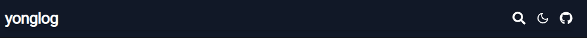
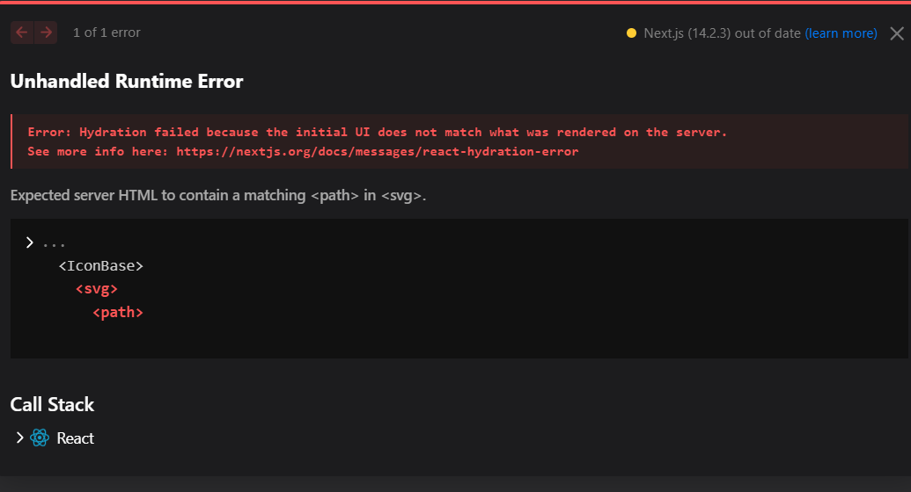
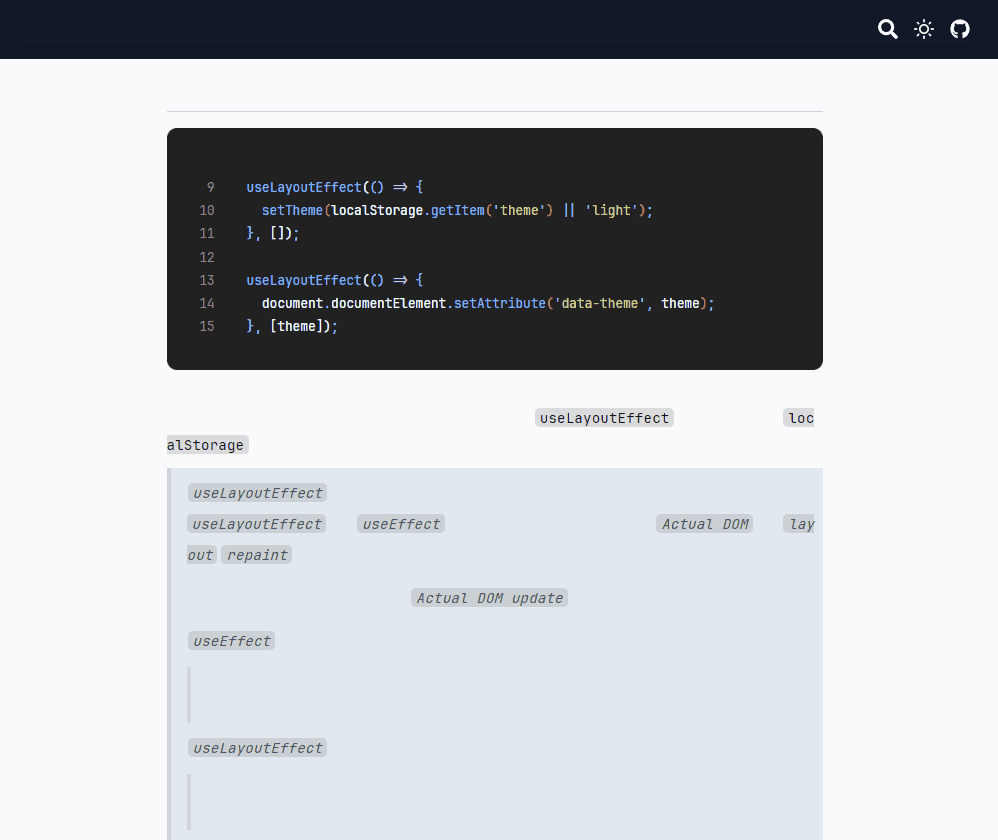

기술 블로그들에 항상 존재하는 다크모드 테마 기능을 추가해보려고 한다.

사실 요즘 같은 시대에 다크모드가 존재하지 않는 페이지를 보기 힘들 정도로 `UX` 관점에서 다크모드는 중요한 역할을 한다.

그래서 ! 나도 다크모드를 생성해보려고 한다.

# 기본 아이디어

## Context는 이용하고 싶지 않았다.

```tsx title="대충 만들어본 가상의 ThemeProvider" {1-22}#add
'use client';

import { createContext, useState } from 'react';

const ThemeContext = createContext<{ theme: string; handleTheme: () => void }>({
  theme: 'light',
  handleTheme: () => {},
});

export const ThemeProvider = ({ children }: { children: React.ReactNode }) => {
  const [theme, setTheme] = useState<string>('light');

  const handleTheme = () => {
    setTheme(theme === 'light' ? 'dark' : 'light');
  };

  return (
    <ThemeContext.Provider value={{ theme, handleTheme }}>
      {children}
    </ThemeContext.Provider>
  );
};
```

```tsx title="/layout.tsx" {8,19}#add
export default function RootLayout({
  children,
}: Readonly<{
  children: React.ReactNode;
}>) {
  return (
    <html lang='kr'>
      <ThemeProvider>
      {/* ThemeProvider 하위는 모두 Client Component 로 취급*/}
        <body>
          <header>
            <GlobalNav />
          </header>
          <main>{children}</main>
          <footer className='flex justify-center py-4'>
            <p>&copy; 2024 Yonghyeun. Created using Next.js.</p>
          </footer>
        </body>
      </ThemeProvider>
    </html>
  );
```

사실 다크모드를 구현하는 가장 쉬운 방법은 모든 컴포넌트를 클라이언트 컴포넌트로 생성해두고 가장 최상단에 `theme` 과 관련 `state` 를 생성해주는 것이다.

이후 해당 `theme state` 값에 따라서 `body` 에 클래스 이름을 다르게 하거나, 사용 할 컴포넌트들에 `theme state` 값을 이용한 스타일링 값들을 넣어주는 것일 것이다.

하지만 `ThemeProvider` 를 사용하면 하위에 존재하는 모든 컴포넌트가 `Client Component` 로 변경되어 `Client Boundary` 가 너무 커져버리게 된다.

나는 내부 페이지들을 초기 접근 속도를 빠르게 하기 위해 서버 컴포넌트의 `SSG` 형태를 이용하는데 `Client Boundary` 내부에 들어가게 되면 `SSG` 를 이용하지 못하게 된다.

그래서 다른 방법을 찾아야 했다.

## 어떻게 할까 ? : CSS 를 활용하자

다크모드와 라이트 모드일 때 변경이 되어야 하는 스타일 속성들을 `global.css` 에서 처리해주기로 하였다.

테마에 영향을 받는 스타일 속성들을 `css variable` 형태로 생성해두고 테마가 변경되면 `css variable` 값들을 변경해주기로 했다.

어차피 `css variable` 값이 변경되면 해당 `css variable` 을 참조하는 값들이 `Actual DOM` 의 업데이트 과정에서 `repaint` 될 것이기 때문에 `Virtual DOM` 의 `client boundary` 를 넓히지 않고도 화면을 변경하는 것이 가능 할 것이다.

# 1. CSS variable 생성

```css title="/global.css" showLineNumbers{21} {1-18}#add
:root {
  --background-color: rgb(248 250 252); /* bg-slate-50 */
  --color: #111;
  --side-bar-title: rgb(49 46 129); /* bg-indigo-900 */
  --blockquote-background: rgb(226 232 240); /* bg-stale-200 */
  --blockquote-border-color: rgb(209 213 219); /* bg-gray-300 */
  --blockquote-color: rgb(75 85 99); /* bg-gray-600 */
}

[data-theme='dark'] {
  --background-color: #111;
  --color: rgb(248 250 252); /* bg-slate-50 */
  --side-bar-title: rgb(129 140 248);
  --blockquote-background: rgb(39 39 42); /* bg-zinc-600 */
  --blockquote-border-color: rgb(228 228 231); /* bg-zinc-200 */
  --blockquote-color: rgb(228 228 231); /* bg-gray-400 */
}
```

다음과 같이 `:root , [data-theme='dark']` 에 대한 `css variable` 들을 생성해줬다.

해당 `css variable` 은 최상단 태그인 `html` 의 어트리뷰트 값에 따라 변경된다.

- `dark theme` : `[data-theme='dark'] css variable`
- `light theme` : `:root css variable`

이후 테마에 영향받을 태그들을 생성한 `css variable` 등을 이용해 스타일링 해준다.

```css {1-14}#add title="/global.css"
body {
  background-color: var(--background-color);
  color: var(--color);
}

h2[data-sidebar-title='true'] {
  color: var(--side-bar-title);
}

blockquote[theme-block='true'] {
  background-color: var(--blockquote-background);
  border-color: var(--blockquote-border-color);
  color: var(--blockquote-color);
}
```

영향 받을 컴포넌트들에 알아보기 쉽게 어트리뷰트들을 넣어줬다. 클래스명으로 넣어줘도 상관 없지만 난 클래스명엔 `tailwind` 를 이용하고 있기 때문에 어트리뷰트로 넣어줬다.

# 2. 클라이언트 컴포넌트 생성



최상단 우측을 보면 테마 버튼으로 사용하기 위해 만들어뒀던 컴포넌트가 있다.

해당 컴포넌트는 현재 단순한 `li,svg` 태그로 생성해뒀지만 클라이언트 컴포넌트로 생성하여 여러 로직들을 추가해주도록 하자

```tsx title="/components/client/ThemeButton.tsx" {1-8 , 12-36}#add {9-11}
'use client';

import { FiMoon, FiSun } from 'react-icons/fi';
import { useLayoutEffect, useState } from 'react';

const ThemeButton = () => {
  const [theme, setTheme] = useState('light');

  useLayoutEffect(() => {
    setTheme(localStorage.getItem('theme') || 'light');
  }, []);

  useLayoutEffect(() => {
    document.documentElement.setAttribute('data-theme', theme);
  }, [theme]);

  const handleTheme = () => {
    const nextTheme = theme === 'light' ? 'dark' : 'light';
    setTheme(nextTheme);
    document.documentElement.setAttribute('data-theme', nextTheme);
  };

  return theme === 'light' ? (
    <button className='py-2' onClick={handleTheme}>
      <FiSun size={20} />
    </button>
  ) : (
    <button className='py-2' onClick={handleTheme}>
      <FiMoon size={20} />
    </button>
  );
};

export default ThemeButton;
```

## 상태값에 따른 ThemeButton 의 반환 값

해당 컴포넌트는 `theme state` 값에 따라 해와 달 모양을 반환한다.

## 클라이언트 데이터와 동기화

```tsx showLineNumbers{9} title="초기 hydration 시 동기화"
useLayoutEffect(() => {
  setTheme(localStorage.getItem('theme') || 'light');
}, []);

useLayoutEffect(() => {
  document.documentElement.setAttribute('data-theme', theme);
}, [theme]);
```

초기 클라이언트 단에서 하이드레이션시에는 `useLayoutEffect` 를 이용하여 `localStorage` 에 존재하는 값에 맞춰 동기화 한다.

> `useLayoutEffect` 를 사용한 이유
> `useLayoutEffect` 는 `useEffect` 와 비슷한 역할을 하지만 `Actual DOM` 의 `layout`,`repaint` 과정 전에 발생한다.
>
> 이를 통해 최대한 불필요한 `Actual DOM update` 를 방지해줄 수 있다.
>
> `useEffect` 를 사용했을 경우
>
> > _리렌더링 -> Actual DOM update -> useEffect -> Actual DOM update_
>
> `useLayoutEffect` 를 사용했을 경우
>
> > _리렌더링 -> useLayoutEffect -> Actual DOM update_

하지만 이 과정에서 이런 의문이 들 수 있다.

_그럼 애초에 `useState` 부분에서 `lazy initalize`를 이용해 `localStorage` 에 접근하면 되는거 아닌가?_

나도 처음엔 그렇게 생각했다.

그래서 해당 부분을 처음엔 다음처럼 설계했었다.

```tsx showLineNumbers{7} title="lazy initalize를 이용해볼까?"
const [theme, setTheme] = useState(() =>
  typeof window === 'undefined'
    ? 'light'
    : localStorage.getItem('theme') || 'light',
);
```

`client component` 는 서버 단에서도 한 번 렌더링 되기 때문에 서버 단에서 렌더링 되는 경우엔 `light`로 클라이언트 단에서 렌더링 될 땐 `localStorage.getItem('theme') or light` 로 설계했었다.

하지만 이렇게 하게 되면 문제가 발생한다.

```tsx title="만약 localStorage에 저장된 값이 black이라면?" showLineNumbers{7} {3-5}#remove
const [theme, setTheme] = useState(() =>
  typeof window === 'undefined'
    ? 'light' {/* 서버에서 렌더링 될 땐 light로 렌더링 */}
    {/* 클라이언트 단에선 dark로 렌더링 */}
    : localStorage.getItem('theme') || 'light',
);
```



서버 단에서 렌더링 된 `ThemeButton` 과 클라이언트 단에서 `hydration` 된 `ThemeButton` 이 일치하지 않으면 문제가 발생 할 수 있기 때문에 `NextJS` 에선 오류를 발생시킨다.

이로 인해 두 다른 환경에서 렌더링 된 컴포넌트를 일치 시켜주기 위해 `light` 로 초기에 렌더링 한 후 `useLayoutEffect` 를 이용해 동기화 시켜주는 방법을 선택했다.

## 테마 버튼을 클릭하면 변경되는 일들

```tsx showLineNumbers{13} title="테마 버튼 클릭시 발생하는 일들"
useLayoutEffect(() => {
  document.documentElement.setAttribute('data-theme', theme);
}, [theme]);

const handleTheme = () => {
  const nextTheme = theme === 'light' ? 'dark' : 'light';
  setTheme(nextTheme);
  document.documentElement.setAttribute('data-theme', nextTheme);
};
```

해당 테마 버튼을 누르면 다음과 같은 일들이 발생한다.

1. `setTheme(nextTheme)`
   해당 부분은 `ThemeButton` 이 반환하는 값에만 영향을 미치며 해당 함수의 결과 값은 다른 컴포넌트들에 영향을 미치지 않는다.
2. `localStorage.setItem('theme' , nextTheme)`
   해당 부분은 재방문시의 동기화를 위해 `localStorage` 의 값을 변경한다.
3. `setTheme(nextTheme)` 으로 `ThemeButton`의 상태가 변경되면 위에서 설정했던 `useLayoutEffect` 가 호출되어 `Actual DOM` 의 어트리뷰트를 변경한다.

사실 `Actual DOM` 을 직접적으로 조작하는 행위는 리액트에서 모범적인 정답은 아니다.

모범적인 정답은 리액트 내부에 존재하는 `state` 값들을 이용해 `Virtual DOM` 을 조작하고 변경된` Virtual DOM` 과 `Actual DOM` 을 동기화 하는 것일 것이다.

하지만 위 방법을 사용하면 위에서 말했듯 `Client Boundary` 가 넓어져 `SSG` 의 장점을 사용하지 못하기 때문에 `Actual DOM` 을 직접적으로 조작하는 방법을 택했다.


테마 버튼을 클릭하면 `html`의 어트리뷰트가 변경되어 이전에 설정해둔 `css variable` 값들이 변경되고

```css
body {
  background-color: var(--background-color);
  color: var(--color);
}

h2[data-sidebar-title='true'] {
  color: var(--side-bar-title);
}

blockquote[theme-block='true'] {
  background-color: var(--blockquote-background);
  border-color: var(--blockquote-border-color);
  color: var(--blockquote-color);
}
```

해당 태그들이 `repaint` 되는 모습을 볼 수 있다.

# 3. 초기 테마가 깜박이는 현상 해결하기

`ThemeButton` 을 클릭하면 `html` 의 어트리뷰트가 변경되는 잘 해결되었다.

하지만 여전히 문제는 존재한다.



`localStorage` 의 값이 `dark` 인 상태로 재접속 했을 때

`ThemeButton` 이 `hydration => useLayoutEffect` 로 동기화 되기 전까지 `html` 의 어트리뷰트는 존재하지 않기 때문에 플리커링 현상이 발생했다.

이러한 이유는 `localStorage` 에 존재하는 값에 접근하는 행위가 `ThemeButton`의 `hydration` 이후에 발생했기 때문이다.

## dangerouslySetInnerHTML를 이용하자

그래서! 초기에 서버에서 렌더링 되어 보내지는 첫 페이지를 클라이언트 단에서 `hydration` 될 때부터

`localStorage` 에 접근 할 수 있도록 `/layout.tsx` 을 수정해주었다.

```tsx title="/layout.tsx" {11-15,25-27}#add
import './globals.css';
import GlobalNav from '@/components/GlobalNav';

import type { Metadata } from 'next';

export const metadata: Metadata = {
  title: 'yonglog',
  description: '프론트엔드 개발블로그예용',
};

/* Client 단에서 서버 렌더링 결과가 hydration 될 때 실행되는 IIFE */
const setThemeFromLocalStorage = `(function () {
  const theme = localStorage.getItem('theme') || 'light';
  document.documentElement.setAttribute('data-theme', theme);
})()`;

export default function RootLayout({
  children,
}: Readonly<{
  children: React.ReactNode;
}>) {
  return (
    <html lang='kr'>
      <head>
        <script
          dangerouslySetInnerHTML={{ __html: setThemeFromLocalStorage }}
        ></script>
      </head>
      <body>
        <header>
          <GlobalNav />
        </header>
        <main>{children}</main>
        <footer className='flex justify-center py-4'>
          <p>&copy; 2024 Yonghyeun. Created using Next.js.</p>
        </footer>
      </body>
    </html>
  );
}
```

다음과 같이 `layout.tsx` 에서 `html` 태그 하단에 `script` 태그를 넣어주게 되면

클라이언트 단에서 `index.html` 파일을 파싱하던 과정에서 `script` 태그를 만나 `parsing` 과정이 `block` 되고 `script` 태그를 실행하게 된다.

다음처럼 작성하게 되면 클라이언트가 받는 `html` 파일은 다음과 같이 생겼다.

```html title="클라이언트가 받는 html파일의 모습" {3-8}#add
<html lang="kr">
  <head>
    <script>
      (function () {
        const theme = localStorage.getItem('theme') || 'light';
        document.documentElement.setAttribute('data-theme', theme);
      })();
    </script>
  </head>
      <body>
        <header>
          ...
</html>
```

이를 통해 클라이언트가 처음으로 보게 되는 페이지에선 `localStorage` 에 접근하여 이전에 설정한 테마와 동기화 된 페이지를 보게 되기 때문에 플리커링 현상 없이 동기화가 가능하다.


### 그렇다면 useLayoutEffect로 동기화 하는 과정을 리팩토링 하자

```tsx title="ThemeButton 리팩토링" showLineNumbers{9} {6-8}#remove {13}#add
useLayoutEffect(() => {
  /* 해당 부분은 ThemeButton의 아이콘 동기화를 위해 필요하다. */
  setTheme(localStorage.getItem('theme') || 'light');
}, []);

// useLayoutEffect(() => {
//   document.documentElement.setAttribute('data-theme', theme);
// }, [theme]);

const handleTheme = () => {
  const nextTheme = theme === 'light' ? 'dark' : 'light';
  setTheme(nextTheme);
  document.documentElement.setAttribute('data-theme', nextTheme);
};
```

초기 동기화를 위해 `useLayoutEffect` 로 `theme` 가 변경될 때 마다 `html` 의 어트리뷰트를 바꿔주던 부분을 `handleTheme` 로 옮겨주었다.

`handleTheme` 이 호출될 때 마다 변경되는 `Effect` 는 `Effect` 를 잘못 쓰는 대표적인 안티패턴이기 때문이다.

굿~~~
