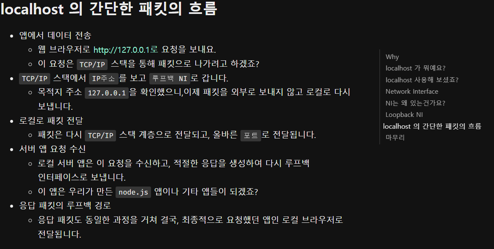
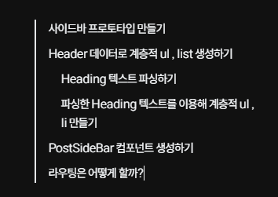
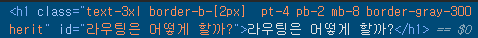
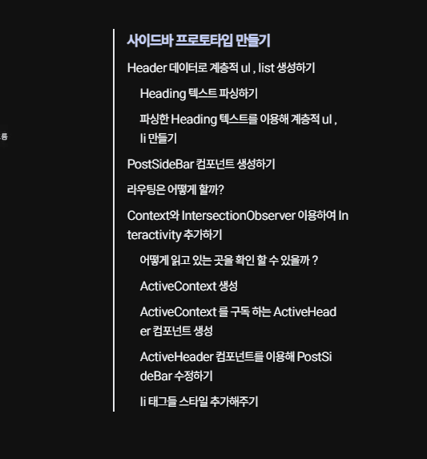

`Velog` 의 사이드바처럼 인터렉티브하게 사용자가 보고 있는 영역에 맞춰 활성화 되고

클릭하면 해당 타이틀로 이동하는 사이드바를 만들어보자

# 사이드바 프로토타입 만들기

```tsx title="app/[postId]/page.tsx" showLineNumbers{17} {10}#remove {11-12,32-46}#add
const PostPage = ({ params }: { params: { postId: string } }) => {
  const { meta, content } = getPostContent(params.postId);
  const components = useMDXComponents({}, meta.path);

  return (
    <>
      <header className='pt-14 mb-12'>
        <PostTitle meta={meta} />
      </header>
      <main className='px-14'>
      <main className='w-[100%] lg:w-[150%] flex'>
        <section className='px-7 w-[100%] lg:px-14 lg:w-[70%] lg:mr-[2rem]'>
          <Suspense fallback={<LoadingContnet />}>
            <MDXRemote
              source={content}
              components={components}
              options={{
                mdxOptions: {
                  remarkPlugins: [remarkGfm],
                  rehypePlugins: [
                    [
                      rehypePrettyCode,
                      {
                        theme: 'material-theme-darker',
                      },
                    ],
                  ],
                },
              }}
            />
          </Suspense>
        </section>
        <section className='hidden lg:block'>
          <nav className='sticky top-[15rem] w-[250px]  border-l-[2px] pl-3'>
            <ul>
              <li>
                Lorem ipsum dolor sit amet consectetur, adipisicing elit. Illum
                ullam odio quo nobis blanditiis dicta corrupti id ex quis nisi,
              </li>
              <li>
                Lorem ipsum dolor sit amet, consectetur adipisicing elit. Saepe
              </li>
            </ul>
          </nav>
        </section>
      </main>
    </>
  );
};

export default PostPage;
```


미디어 쿼리를 이용해 사이드바의 프로토타입을 구현해봤다.

- 뷰포트의 너비가 `1024px` 이상일 때 : 포스트를 담고 있는 너비를 `150%` 로 키운 후 사이드바를 `display : block` 으로 변경해 렌더링 되도록 한다. 이후 사이드바를 `sticky` 로 고정한다.

- 뷰포트의 너비가 `1024px` 이하일 때 : 포스트를 담고 있는 너비를 줄이고 사이드바를 `display : hidden` 으로 렌더링 하지 않는다.

잘 작동한다. :)

해당 프로토타입을 토대로 기능을 하나씩 추가해보자

# Header 데이터로 계층적 ul , list 생성하기

## Heading 텍스트 파싱하기

```tsx title="@/app/lib/interactiveSidebar.tsx" {1-29}#add
import type { PostInfo } from '@/types/post';

type HeadingSize = 1 | 2 | 3;
type HeadingText = string;
type HeadingInfo = [HeadingSize, HeadingText];
export type Headers = HeadingInfo[];

export const parsingHeaders = (content: PostInfo['content']): Headers => {
  const headers: Headers = [];
  const splitedContent = content.split('\r\n');
  splitedContent.forEach((paragraph) => {
    const [headerSize, ...headerText] = paragraph.split(' ');
    switch (headerSize) {
      case '#':
        headers.push([1, headerText.join(' ')]);
        break;
      case '##':
        headers.push([2, headerText.join(' ')]);
        break;
      case '###':
        headers.push([3, headerText.join(' ')]);
        break;
      default:
        break;
    }
  });

  return headers;
};
```

다음과 같이 단순히 `mdx` 텍스트를 배열로 변환 후 `# , ## , ###` 를 기준으로

`HeadingSize,HeadingText[]` 를 담은 배열을 반환하는 `parsingHeaders` 메소드를 정의해준다.

해당 메소드의 반환값 예시는 다음과 같다.

```tsx title="parsingHeaders의 반환값 예시"
[
  [1, '사이드바 프로토타입 만들기'],
  [1, 'Header 데이터로 계층적 ul , list 생성하기'],
  [2, 'Heading 텍스트 파싱하기'],
  [2, '파싱한 Heading 텍스트를 이용해 계층적 ul , li 만들기'],
  [1, 'PostSideBar 컴포넌트 생성하기'],
  [1, '라우팅은 어떻게 할까?'],
];
```

## 파싱한 Heading 텍스트를 이용해 계층적 ul , li 만들기

```tsx title = "@/app/lib/interactiveSidebar.tsx" {1-31}#add
export const createList = (
  headers: Headers,
  index: number = 0,
  beforeHeadingSize: number = 0,
  list: React.ReactNode[] = [],
) => {
  while (index < headers.length) {
    const [currentHeadingSize, text] = headers[index];
    if (currentHeadingSize > beforeHeadingSize) {
      const subList = createList(headers, index, currentHeadingSize);
      list.push(
        <ul key={`ul-${index}`} className='px-4'>
          {subList.list}
        </ul>,
      );
      index = subList.nextIndex;
    } else if (currentHeadingSize < beforeHeadingSize) {
      return { list, nextIndex: index };
    } else {
      list.push(
        <li key={`li-${index++}`} className='mb-2'>
          {text}
        </li>,
      );
    }
  }

  return { list, nextIndex: index };
};
```

이후 재귀함수인 `createList` 메소드를 이용해 계층적인 `ul , li` 태그로 이뤄진 배열을 생성해주자

`createList` 는 호출시 생성된 `list` 를 반환하는데 해당 `list` 에는 `li` 태그로만 이뤄진 컴포넌트들만 존재하거나 `ul , li` 태그들로 이뤄진 컴포넌트를 반환한다.

`createList` 는 본인보다 `headingSize`가 큰 값을 만날 때 까지 재귀적으로 호출되며 본인과 같은 경우엔 `list` 에 `li` 태그를 담고

본인보다 작은 경우엔 `createList_2` 를 호출하여 재귀적으로 탐색한 `list_2` 값들을 이용해 `<ul>{list_2}</ul>` 를 `list` 에 담는다.

> 편의상 두 번째 호출된 `createList` 를 `createList_2`, `createList_2` 가 반환하는 `list` 를 `list_2` 라고 하였다.

```tsx title="createList의 반환값 예시 , children에 존재하는 값들은 모두 재귀적으로 담겨진 h1~h3의 list들이다"
[
  {
    $$typeof: Symbol(react.element),
    type: 'ul',
    key: 'ul-0',
    ref: null,
    props: { className: 'px-4', children: [Array] },
    _owner: null,
    _store: {},
  },
];
```

# PostSideBar 컴포넌트 생성하기

이후 클라이언트 컴포넌트로 `PostSideBar` 컴포넌트를 생성해주자

```tsx title="@/components/client/PostSideBar.tsx" {1-18}#add
import { parsingHeaders, createList } from '@/app/lib/interactiveSidebar';

import type { PostInfo } from '@/types/post';

const PostSideBar = ({ content }: { content: PostInfo['content'] }) => {
  const headers = parsingHeaders(content);
  const { list: PostHeaderList } = createList(headers);

  return (
    <nav className='sticky top-[15rem] w-max-[300px] border-l-[2px] '>
      {PostHeaderList}
    </nav>
  );
};

export default PostSideBar;
```

```tsx title="/[postId]/page.tsx" showLineNumbers{18} {33}#add
const PostPage = ({ params }: { params: { postId: string } }) => {
  const { meta, content } = getPostContent(params.postId);
  const components = useMDXComponents({}, meta.path);

  return (
    <>
      <header className='pt-14 mb-12'>
        <PostTitle meta={meta} />
      </header>
      <main className='w-[100%] lg:w-[150%] flex'>
        <section className='px-7 w-[100%] lg:px-14 lg:w-[70%] lg:mr-[2rem]'>
          <Suspense fallback={<LoadingContnet />}>
            <MDXRemote
              source={content}
              components={components}
              options={{
                mdxOptions: {
                  remarkPlugins: [remarkGfm],
                  rehypePlugins: [
                    [
                      rehypePrettyCode,
                      {
                        theme: 'material-theme-darker',
                      },
                    ],
                  ],
                },
              }}
            />
          </Suspense>
        </section>
        <section className='hidden lg:block'>
          <PostSideBar content={content} />
        </section>
      </main>
    </>
  );
};

export default PostPage;
```



# 라우팅은 어떻게 할까?

라우팅 자체는 그닥 어려운 문제가 아니다.

```tsx title="app/[postId]/page.tsx" showLineNumbers{17} {17}
const PostPage = ({ params }: { params: { postId: string } }) => {
  const { meta, content } = getPostContent(params.postId);
  const components = useMDXComponents({}, meta.path);

  return (
    <>
      <header className='pt-14 mb-12'>
        <PostTitle meta={meta} />
      </header>
      <main className='px-14'>
        <Suspense fallback={<LoadingContnet />}>
          <MDXRemote
            source={content}
            components={components}
            options={{
              mdxOptions: {
                remarkPlugins: [remarkGfm],
                rehypePlugins: [
                  [
                    rehypePrettyCode,
                    {
                      theme: 'material-theme-darker',
                    },
                  ],
                ],
              },
            }}
          />
        </Suspense>
      </main>
    </>
  );
};

export default PostPage;
```

MDX 파일을 변환 할 때 `remarkPlugins` 에 `remarkGfm` 을 이용해주고 있는데 해당 플러그인을 사용하면 자동으로 `h1~h6` 까지의 `children` 을 `id` 로 적용시켜놔준다.



> 원활한 `id` 설정을 위해선 `h1~h6` 태그 내부의 `children` 은 순수한 문자열로 적는 것이 좋다.
>
> 나는 헤딩 태그 내부에서 백틱을 이용한 '`<code>..</code>`어쩌구 저쩌구' 이런식의 단어를 자주 쓰곤했는데 그렇게 되면 `id` 값이 `[Object object] 어쩌구 저쩌구` 이런 식으로 된다.
>
> 그렇게 되면 각 `heading` 태그들의 `id` 값과 `Link` 값이 가리키는 주소가 다르기 때문에 라우팅이 되지 않는다.
>
> 그래서 포스트들을 파싱 해올 때 `#` 가 들어간 텍스트들의 백틱들을 정규표현식을 이용해 제거해주는 `filterContent` 메소드를 정의해 적용해주었다.

```tsx title="lib/post.tsx" showLinerNumbers{93} {2-10,23-24}#add
...
const filterContent = (content: PostInfo['content']) => {
  const splitedContent = content.split('\r\n');

  return splitedContent
    .map((text) => {
      return text.startsWith('#') ? text.replace(/`/g, '') : text;
    })
    .join('\r\n');
};

const parsePosts = (source: Source): Array<PostInfo> => {
  const Posts: Array<PostInfo> = [];

  const parseRecursively = (source: Source): void => {
    getAllPath(source).forEach((fileSource: Source) => {
      if (isDirectory(fileSource)) {
        parseRecursively(fileSource);
      } else {
        if (isMDX(fileSource)) {
          const fileContent = fs.readFileSync(fileSource, 'utf8');
          let { data, content } = matter(fileContent);
          /* 만약 h1~h3에서 백틱이 존재한다면 라우팅 기능이 되지 않으니 필터링 해주자 */
          content = filterContent(content);
          ...
```

`PostSideBar` 에 들어가는 `li` 태그의 내용과 모든 `h1~h3` 들의 `id` 가 동일하기 때문에

`Link` 컴포넌트의 `href` 에 해당 `id` 값을 넣어 라우팅을 시켜주자

```tsx showLineNumbers{32} title="@/lib/interactiveSidebar.tsx" {21,25}#add
export const createList = (
  headers: Headers,
  index: number = 0,
  beforeHeadingSize: number = 0,
  list: React.ReactNode[] = [],
) => {
  while (index < headers.length) {
    const [currentHeadingSize, text] = headers[index];
    if (currentHeadingSize > beforeHeadingSize) {
      const subList = createList(headers, index, currentHeadingSize);
      list.push(
        <ul key={`ul-${index}`} className='px-4'>
          {subList.list}
        </ul>,
      );
      index = subList.nextIndex;
    } else if (currentHeadingSize < beforeHeadingSize) {
      return { list, nextIndex: index };
    } else {
      list.push(
        <Link href={`#${text}`}>
          <li key={`li-${index++}`} className='mb-2'>
            {text}
          </li>
        </Link>,
      );
    }
  }

  return { list, nextIndex: index };
};
```


# Context와 IntersectionObserver 이용하여 Interactivity 추가하기

현재의 사이드바는 라우팅 기능이 있는 정적인 서버 컴포넌트이다.

이번에 추가하고자 하는 기능은 내가 어느 파트를 읽고 있는지를 확인 할 수 있는 인터렉티브한 기능을 만들고자 한다.

읽고 있는 파트에 대해서 스타일링을 다르게 해주도록 하자

다만 이 때 단순히 현재 읽고 있는 파트 뿐 아니라 상위 파트까지 같이 스타일링을 다르게 해줄 예정이다.

```tsx {1-4}#add title="내가 원하는 사이드바의 모습"
h1
  h2
    h3
    h3 을 읽고 있다면 해당 부분까지 모두 액티브
h1
  h2
  h2
```

## 어떻게 읽고 있는 곳을 확인 할 수 있을까 ?

`window API` 인 `IntersectionObserver` 를 활용하려고 한다.

`IntersectionObserver` 는 실제 `Actual DOM` 의 태그를 선택하여 해당 태그가 뷰포트 혹은 상위 노드를 기준으로 하여

말 그대로 `Intersection` 한지를 확인하는 `API` 이다.

> 자세한 설명은 `MDN` 을 참고하도록 하자
> [MDN - Intersection Obsserver](https://developer.mozilla.org/en-US/docs/Web/API/Intersection_Observer_API)

사이드바에 적용되는 `li` 태그의 경우에 `li` 태그가 렌더링 하는 글자인 `text` 는 실제 `Actual DOM` 에 존재하는 `h1~h3` 태그들의 `id` 와 같다.

그렇기 때문에 해당 `id` 에 해당하는 `heading` 태그가 뷰포트에서 눈에 보이는지를 확인하여

현재 어느 파트를 읽고 있는지에 대해 확인 할 수 있을 것이다.

## heading , li 태그의 순서를 기억 할 수 있도록 parsingHeaders 수정하기

```tsx title="@/lib/interactiveSidebar.tsx" {3,16,20,24}#add {15,19,23}#remove
type HeadingSize = 1 | 2 | 3;
export type HeadingText = string;
export type HeadingNumber = number;
export type HeadingInfo = [HeadingSize, HeadingText, HeadingNumber];
export type Headers = HeadingInfo[];

export const parsingHeaders = (content: PostInfo['content']): Headers => {
  const headers: Headers = [];
  const splitedContent = content.split('\n');

  splitedContent.forEach((paragraph, index) => {
    const [headerSize, ...headerText] = paragraph.split(' ');
    switch (headerSize) {
      case '#':
        // headers.push([1, headerText.join(' ')]);
        headers.push([1, headerText.join(' '), index]);
        break;
      case '##':
        // headers.push([1, headerText.join(' ')]);
        headers.push([2, headerText.join(' '), index]);
        break;
      case '###':
        // headers.push([1, headerText.join(' ')]);
        headers.push([3, headerText.join(' '), index]);
        break;
      default:
        break;
    }
  });
  return headers;
};
```

본문에서 `heading1 ~heading3` 까지의 글들을 파싱하여 `Headers` 배열을 생성하던 `parsingHeaders` 메소드에서 `index` 도 배열에 같이 담아주도록 수정해주었다.

순서 역할을 하는 `index` 를 이용해 현재 읽고 있는 `N` 번째 `heading` 태그를 만난다면 동일하게 `N` 번쨰 `li` 태그를 활성화시켜주기 위함이다.

## ActiveContext 생성

```tsx title="@/components/client/ActiveContext.tsx" {1-27}#add
'use client';

import { createContext, useContext, useState } from 'react';

type ActiveContextType = {
  activeIndex: number;
  setActiveIndex: React.Dispatch<React.SetStateAction<number>>;
};

export const ActiveContext = createContext<ActiveContextType>({
  activeIndex: 0,
  setActiveIndex: () => {},
});

export const ActiveProvider = ({ children }: { children: React.ReactNode }) => {
  const [activeIndex, setActiveIndex] = useState<number>(0);
  return (
    <ActiveContext.Provider value={{ activeIndex, setActiveIndex }}>
      {children}
    </ActiveContext.Provider>
  );
};

export const useActiveContext = () => {
  return useContext(ActiveContext);
};
```

다음과 같이 컨텍스트를 생성해주었다. 해당 컨텍스트는 현재 활성화 되어 있는 `index` 를 상태 값으로 생성하고 관리한다.

여기서 활성화 되어 있는 `index` 란 사이드바에 존재하는 `li` 태그 혹은 `heading` 태그의 순서를 의미한다.

> 이전에 말했듯 포스트 사이드바에 존재하는 `li` 태그들의 순서는 `heading 1~3` 태그들의 순서와 정확히 일치한다.

## ActiveContext 를 구독 하는 ActiveHeader 컴포넌트 생성

```tsx title="@/components/client/ActiveHeader.tsx" {1-14, 17-23 , 31-35 , 38-41,44-55}#add {15-16,24-30 , 36-37 , 42-43}
'use client';
import { useActiveContext } from '@/app/context/ActiveContext';
import { useEffect } from 'react';

import type { HeadingText, HeadingNumber } from '@/app/lib/interactiveSidebar';

const ActiveHeader = ({
  headingText,
  headingNumber,
}: {
  headingText: HeadingText; // Actual DOM heading tag의 Id와 같음
  headingNumber: HeadingNumber;
}) => {
  useEffect(() => {
    const $targetHeading = document.getElementById(headingText.trim());
    if (!$targetHeading) return;

    const options = {
      root: null,
      rootMargin: '0px',
      threshold: 1.0,
    };

    const observer = new IntersectionObserver((entries) => {
      entries.forEach(({ isIntersecting }) => {
        isIntersecting && setActiveIndex(headingNumber);
      });
    }, options);

    observer.observe($targetHeading);
    return () => observer.disconnect();
  }, []);

  const { activeIndex, setActiveIndex } = useActiveContext();

  const isUnderActive = headingNumber < activeIndex;
  const isActive = headingNumber === activeIndex;

  return (
    <li
      className='mb-2'
      data-active={isActive}
      data-underActive={isUnderActive}
    >
      {headingText}
    </li>
  );
};

export default ActiveHeader;
```

이후 `ActiveContext` 의 상태를 구독하는 `ActiveHeader` 컴포넌트를 생성해준다.

해당 컴포넌트에선 `li` 태그의 `children` 이자 `heading` 태그들의 `id` 인 `headingTitle` 를 `props` 로 받는다.

해당 값을 이용해 `Actual DOM` 에 존재하는 태그를 찾아 옵저버에게 등록한다.

이를 통해 해당 `heading` 태그가 뷰포트에 보이면 `ActiveContext` 의 `activeIndex` 를 현재의 `HeadingNumber` 로 변경한다.

여기서 `HeadingNumber` 는 `li` 태그의 순서이자 `heading1~heading3` 태그들의 순서를 의미한다.

즉, 만약 4번째 `heading` 태그가 뷰포트에 나타난다면 `activeIndex` 는 3이 된다.

이후 `li` 태그에 `isActive , isUnderActive` 값을 이용해 어트리뷰트를 추가해준다.

- `isActive` : 현재의 `li` 태그가 가장 최근에 뷰포트에 나타난 `heading` 태그를 가리키는가?
- `isUnderAcgtive` : 현재의 `li` 태그가 가리키는 `heading` 태그는 뷰포트에서 지나갔는가 ?

## ActiveHeader 컴포넌트를 이용해 PostSideBar 수정하기

```tsx title="@/lib/interactiveSideBar.tsx" {22-24}#remove {25}#add
export const createList = (
  headers: Headers,
  index: number = 0,
  beforeHeadingSize: number = 0,
  list: React.ReactNode[] = [],
) => {
  while (index < headers.length) {
    const [currentHeadingSize, text] = headers[index];
    if (currentHeadingSize > beforeHeadingSize) {
      const subList = createList(headers, index, currentHeadingSize);
      list.push(
        <ul key={`ul-${index}`} className='px-4'>
          {subList.list}
        </ul>,
      );
      index = subList.nextIndex;
    } else if (currentHeadingSize < beforeHeadingSize) {
      return { list, nextIndex: index };
    } else {
      list.push(
        <Link href={`#${text}`} key={`Link-${index}`} replace>
          {/* <li key={`li-${index++}`} className='mb-2'>
            {text}
          </li> */}
          <ActiveHeader headingNumber={index} headingText={text} />
        </Link>,
      );
      index++;
    }
  }

  return { list, nextIndex: index };
};
```

이후 기존 `interactive` 하지 않던 `li` 태그에서 옵저버가 장착된 `ActiveHeader` 컴포넌트로 변경해준다.

## li 태그들 스타일 추가해주기

```css title="global.css" {8-9, 19-20 }#add showLineNumbers{21}
:root {
  --background-color: rgb(248 250 252); /* bg-slate-50 */
  --color: #111;
  --side-bar-title: rgb(49 46 129); /* bg-indigo-900 */
  --blockquote-background: rgb(226 232 240); /* bg-stale-200 */
  --blockquote-border-color: rgb(209 213 219); /* bg-gray-300 */
  --blockquote-color: rgb(75 85 99); /* bg-gray-600 */
  --active-sidebar-color: rgb(55 48 163); /* bg-indigo-800 */
  --underactive-sidebar-color: rgb(30 27 75); /* bg-indigo-950 */
}

[data-theme='dark'] {
  --background-color: #111;
  --color: rgb(248 250 252); /* bg-slate-50 */
  --side-bar-title: rgb(129 140 248);
  --blockquote-background: rgb(39 39 42); /* bg-zinc-600 */
  --blockquote-border-color: rgb(228 228 231); /* bg-zinc-200 */
  --blockquote-color: rgb(228 228 231); /* bg-gray-400 */
  --active-sidebar-color: rgb(199 210 254); /* text-indigo-200*/
  --underactive-sidebar-color: rgb(129 140 248); /* text-indigo-400 */
}
```

```css title="global.css" {1-12}#add showLineNumbers{63}
li[data-active='true'] {
  color: var(--active-sidebar-color);
  font-weight: 700;
  font-size: 120%;
  transition: 0.3s ease-in-out;
}

li[data-underActive='true'] {
  color: var(--underactive-sidebar-color);
  font-weight: 700;
  transition: 0.3s ease-in-out;
}
```

각 `active , underActive` 상태에 따른 `li` 태그들의 스타일을 `global.css` 에 정의해준다.

`global.css` 에서 정의해준 이유는 테마 별 색상을 다르게 하기 위해서 `css variable` 을 활용하기 위함이다.


