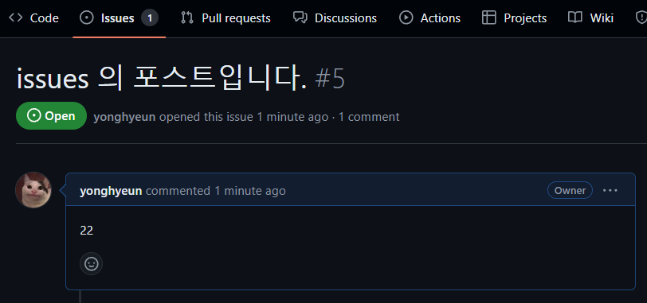
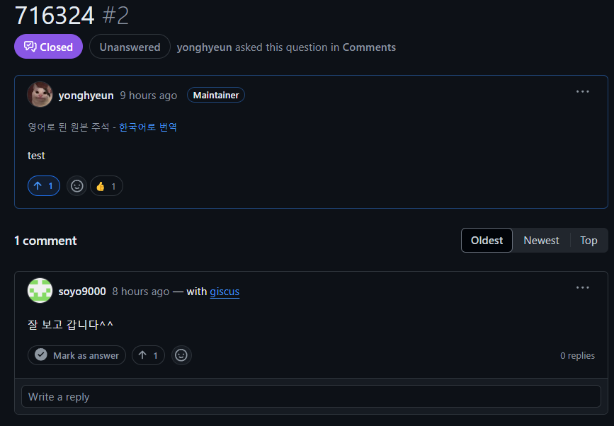
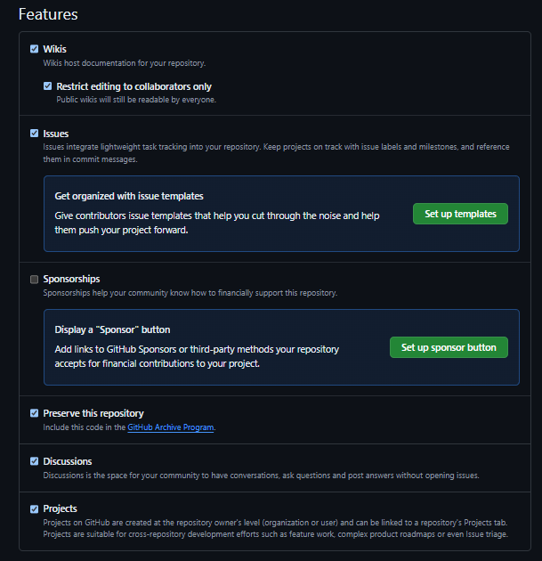
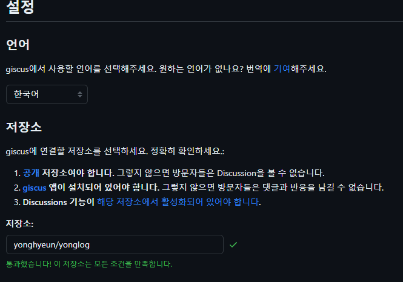
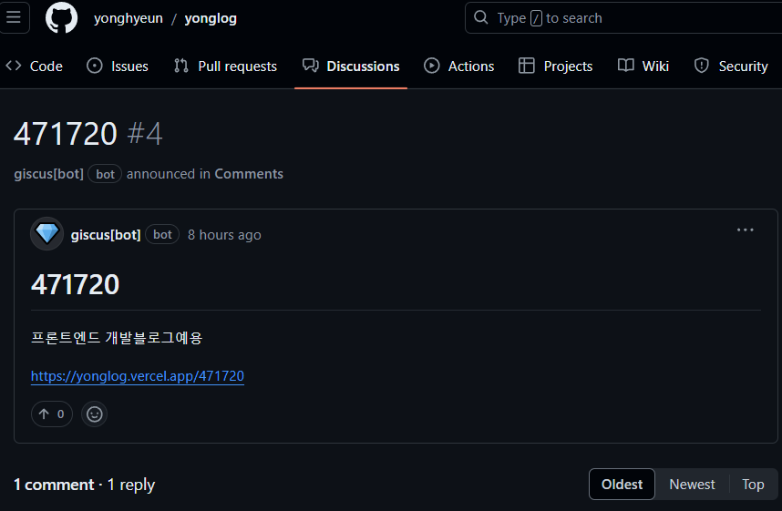
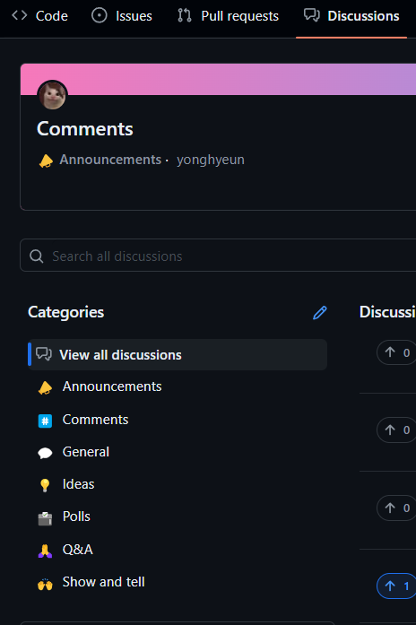
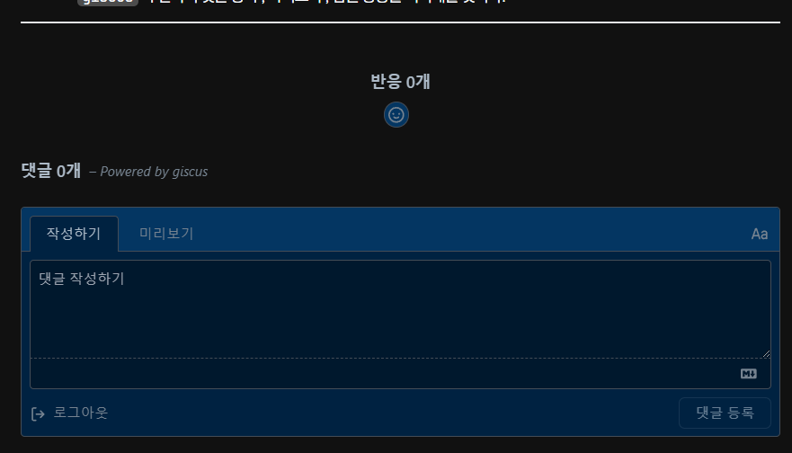

# 현재 상황

```tsx title="/[postId]/page.tsx"
// 코드들 생략
const PostPage = ({ params }: { params: { postId: string } }) => {
  const { meta, content } = getPostContent(params.postId);
  const components = useMDXComponents({}, meta.path);

  return (
    <>
      <header className='pt-14 mb-12'>
        <PostTitle meta={meta} />
      </header>
      <main className='w-[100%] lg:w-[150%] flex'>
        <section className='px-7 w-[100%] lg:px-14 lg:w-[70%] lg:mr-[2rem]'>
          {/* mdx 를 파싱하여 생성한 본문 컴포넌트 */}
        </section>
        <section className='hidden lg:block'>{/* 사이드바 컴포넌트 */}</section>
      </main>
    </>
  );
};

export default PostPage;
```

현재 본문 페이지의 모습을 살펴보면 본문과 사이드바만 존재하는 아주 심심한 모습의 컴포넌트이다.

블로그의 가장 주된 목적인 소통을 위해 댓글 기능을 추가해보자

# giscus 라이브러리

[giscus 홈페이지](https://giscus.app/ko)

`giscus` 이전에도 기술 블로그에서도 깃허브를 이용해 댓글 기능을 구현 하는 라이브러리들이 존재했다.

깃허브를 이용해 댓글 기능을 구현 가능하게 하는 가장 큰 이유는 아무래도 깃허브의 API들 덕분일 것이다.

포스트 내에 댓글을 달 경우 , 설정한 레파지토리 내부의 `issue , discussion` 등에 포스트를 동적으로 만들고 만들어진 게시글에 댓글이 달리게 된다.

포스트에선 해당 레파지토리 내 게시글에 담긴 댓글들을 API로 요청해와 렌더링 하게 되는 구조이다.

## giscus가 영감을 받은 utterances 라이브러리

`giscus` 공식 문서에서도 큰 영감을 받았다고 설명하는 `utterances` 라이브러리의 경우에는 레파지토리의 `issue` 를 이용해 댓글을 생성해주었다.

<a href='https://github.com/utterance/utterances'>utterances</a> 공식문서에서`Github
issue searchAPI` 와 `Github OAuthflow` 를 활용한다고 설명한다.

댓글이 달리기 위한 `issue` 포스트는 레파지토리에서 설치한 `utterances` 앱의 봇이 자동으로 생성해준다고 한다.

## giscus 는 어떤 것이 다를까 ?

`giscus` 는 `issue` 가 아닌 `discussions` 를 활용한다고 한다.

`discussion` 을 활용 할 때의 장점은 바로 **답글이 가능** 하다는 점이다.

밑 두 사진을 통해 `issue` 와 `discussions` 의 모습을 살펴보자





`issue , discussions` 을 활용하는 방법은 모두 댓글을 위한 데이터베이스를 따로 만들지 않고 레파지토리 내부에서 댓글들을 저장 하고 가져올 수 있다는 공통점이 존재하지만

`discussions` 를 활용하는 `giscus` 를 이용해서 답글이 존재하는 `giscus` 를 선택하기로 했다.

# giscus를 사용하기 위한 기본 설정들

## 1. 레파지토리를 public 레파지토리로 만들자

기본적으로 giscus 는 github API를 사용하기 때문에 API 요청을 보낼 레파지토리가 필요하다.

이 때 레파지토리가 public이 아니라면 댓글을 달 수도 , 외부에서 레파지토리의 정보를 가져오는 것이 불가능하다.

## 2. 레파지토리의 디스커션 기능을 활성화해주자



`giscus` 는 레파지토리 내 discussions 를 활용해 댓글을 생성 , 읽어온다.

그러니 기능을 활성화해주자

## 3. 레파지토리에 giscus 앱 설치하기

[giscus GITHUB APP 설치 링크](https://github.com/apps/giscus)

해당 링크에 접속해 댓글을 관리 할 레파지토리에 앱을 설치해준다.

해당 앱은 디스커션 내에서 댓글을 달 포스트가 존재하지 않는다면 자동으로 포스트를 생성해준다.

![열심히 일하는 giscus[bot]](image-3.png)

추후 설명하겠지만 기술 블로그내에서 댓글들은 `giscus[bot]` 이 생성한 포스트에 달리게 된다.

## 4. giscus가 하란데로 마우스만 딸깍 딸깍 하자

[giscus app 페이지](https://giscus.app/ko)

이후엔 해당 페이지에서 친절하게 설명해준데로 마우스를 몇 번 딸깍 거리면 설정은 끝난다.



![giscus[bot] 설정 및 discussions 연결](image-5.png)

`giscus`는 페이지와 디스커션을 연결하는 방식에 맞춰 적절한 댓글들을 요청해와 가져온다.

나는 제목이 페이지의 경로를 포함하도록 설정해주었다.

이를 통해 현재 경로가 `1` 인 영역에서 댓글이 달리게 되면 하단에서 정의한 디스커션 카테고리에 `1` 이란 제목의 포스트가 생성되고 해당 포스트에 댓글이 달리게 된다.





해당 버튼을 눌러 `new category` 를 클릭하여 카테고리를 생성해주자. 이 때 `Announcements` 포맷으로 생성해줄 것을 권장한다.

`Announcments` 포맷으로 생성로 디스커션 카테고리에선 소유자와 `giscus[bot]` 만이 디스커션을 열고 삭제 할 수 있기 때문에 댓글 기능을 위한 포스트 생성을 제 3자가 개입하는 것을 방지해줄 수 있다.

## 5. script 태그 생성하기

마우스 몇 번만 딸깍하면 알아서 자동으로 하단에 `script` 태그를 생성해준다.

> 위에서 설명하지 않았지만 테마도 설정 할 수 있다. 몇 번 더 마우스를 딸깍 딸깍 해보자

```html
<script
  src="https://giscus.app/client.js"
  data-repo="yonghyeun/yonglog"
  data-repo-id="R_kgDOMBOWoA"
  data-category="Comments"
  data-category-id="DIC_kwDOMBOWoM4CgKYD"
  data-mapping="pathname"
  data-strict="0"
  data-reactions-enabled="1"
  data-emit-metadata="0"
  data-input-position="bottom"
  data-theme="cobalt"
  data-lang="ko"
  crossorigin="anonymous"
  async
></script>
```

다음과 같은 `script` 태그를 페이지에 추가해주기만 하면 된다.

> `repo-id , category-id` 등은 레파지토리와 카테고리를 추가해주기만 하면 자동으로 설정된다.

# script 태그를 리액트에서 어떻게 넣지 ?

만약 `html` 파일이라면 그냥 스근하게 해당 `script` 태그를 넣어주면 되지만 `react,  nextjs` 환경에선 딱히 `html` 파일이 존재하지 않는다.

그렇기에 컴포넌트에서 `ref , useEffect` 를 이용해 해당 태그를 `actual dom` 에 직접 추가해주자

```tsx title="@/components/client/GiscusComments.tsx"
'use client';

import { useEffect, useRef } from 'react';

const Comments = () => {
  const commentRef = useRef<HTMLDivElement>(null);

  useEffect(() => {
    if (!commentRef.current || commentRef.current.hasChildNodes()) {
      // 이미 section 밑에 Giscus 로 생성한 댓글창이 존재한다면 return
      return;
    }

    const script = document.createElement('script');
    script.src = 'https://giscus.app/client.js';
    script.async = true;
    script.crossOrigin = 'anonymous';
    script.setAttribute('data-repo', 'yonghyeun/yonglog');
    script.setAttribute('data-category', 'Comments');
    script.setAttribute('data-repo-id', 'R_kgDOMBOWoA');
    script.setAttribute('data-category-id', 'DIC_kwDOMBOWoM4CgKYD');
    script.setAttribute('data-mapping', 'pathname');
    script.setAttribute('data-strict', '0');
    script.setAttribute('data-reactions-enabled', '1');
    script.setAttribute('data-emit-metadata', '0');
    script.setAttribute('data-input-position', 'bottom');
    script.setAttribute('data-theme', 'cobalt');
    script.setAttribute('data-lang', 'ko');
    commentRef.current.appendChild(script);
  }, []);

  useEffect(() => {
    const iframe = document.querySelector<HTMLIFrameElement>(
      'iframe.giscus-frame',
    );
    iframe?.contentWindow?.postMessage('https://giscus.app');
  }, []);

  return (
    <section
      className='border-t-[2px] pt-[3rem] giscus'
      ref={commentRef}
    ></section>
  );
};

export default Comments;
```

별거 없다. 그냥 `script` 태그를 실제로 생성해두고 `giscus` 란 클래스 이름을 가진 태그 밑에 삽입해주면 된다.

`giscus` 로 인해 생성되는 댓글창은 별도의 `iframe` 형태의 위젯이다. 두 번째 `useEffect` 는 생성된 `iframe` 위젯의 관리를 `https://giscus.app` 에게 맡긴다.

`giscus` 가 알아서 댓글 등록 , 가져오기 , 답글 등등을 처리해줄 것이다.

# 결과물

```tsx title="/[postId]/page.tsx" {2,44}#add showLineNumbers{6}
/* 이하 코드 생략 */
import Comments from '@/components/client/GiscusComments';

export function generateStaticParams(): { postId: string }[] {
  const allPost = getAllPosts();
  return allPost.map(({ meta }) => ({ postId: String(meta.postId) }));
}

const PostPage = ({ params }: { params: { postId: string } }) => {
  const { meta, content } = getPostContent(params.postId);
  const components = useMDXComponents({}, meta.path);

  return (
    <>
      <header className='pt-14 mb-12'>
        <PostTitle meta={meta} />
      </header>
      <main className='w-[100%] lg:w-[150%] flex'>
        <section className='px-7 w-[100%] lg:px-14 lg:w-[70%] lg:mr-[2rem]'>
          <Suspense fallback={<LoadingContnet />}>
            <MDXRemote
              source={content}
              components={components}
              options={{
                mdxOptions: {
                  remarkPlugins: [remarkGfm],
                  rehypePlugins: [
                    [
                      rehypePrettyCode,
                      {
                        theme: 'material-theme-darker',
                      },
                    ],
                  ],
                },
              }}
            />
          </Suspense>
        </section>
        <section className='hidden lg:block'>
          <PostSideBar content={content} />
        </section>
      </main>
      <Comments />
    </>
  );
};

export default PostPage;
```



이후 만들어진 해당 컴포넌트를 `[postId]/page.tsx` 에 추가해주자

그럼 잘 작동한다. :)

> 결국 `giscus` 란 것도 깃허브 공식 API 를 이용한 것이기 때문에 나중에 시간이 나면 직접 깃허브 API 를 이용해서 구현해봐야겠다.
