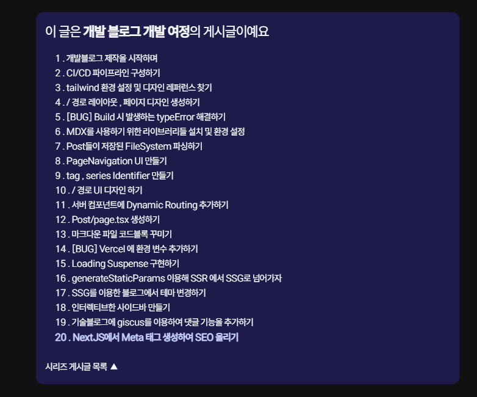
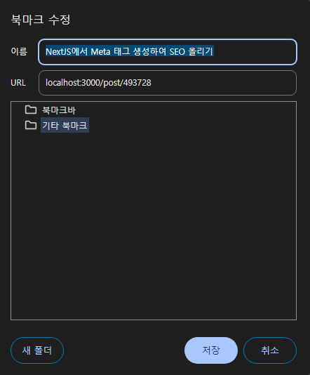

# 내 사이트를 검색 엔진이 어떻게 찾을까 ?

> 가장 대중적으로 사용되는 검색 엔진이 구글일테니 구글을 기준으로 하여 포스트를 작성하도록 하겠다.

구글 검색 엔진에 검색어를 입력하면 구글 검색 엔진은 가장 소비자에게 적절한 정보를 제공하는 페이지를 제공한다.

이 과정은 모두 자동화되어 작동하는데 , 구글 검색 엔진은 **크롤러라는 프로그램을 사용하여 끊임없이 웹을 탐색하고 색인에 추가한다.**

검색엔진이 검색 엔진에서 검색 가능한 사이트들의 글을 크롤링 하고, 구글 데이터베이스 내에 해당 게시글을 적절하게 파싱하고 분석하여 저장한다.

이후, 사용자가 검색어를 입력하면 검색 엔진은 **데이터베이스에서 저장된 포스트들 중 가장 적절한 게시글을 순서대로 검색 엔진에 띄운다.**

즉, 검색 엔진에서 내 사이트가 우선적으로 나타나기 위해서는 검색 엔진이 적절한 게시글이라 평가 할 수 있도록 최대한 최적화 해야 하는데, 이런 과정을 `SEO (Search Engine Orginization)` 이라고 한다.

## 충격사실, 내 사이트는 현재 검색 엔진에서 검색 되지 않는다.


정말 슬프게도 현재 나의 사이트는 구글 색인에 저장되어 있지 않다. 물론 사이트가 검색 엔진에 등록 되기 위해선 시간이 걸린다고 하지만 생각해보면 벌써 생성한지 거의 한 달이 된 거 같은데 안타깝다.

물론 당연히 그럴만도 한게 현재 나는 검색 엔진에 등록 되기 위한 노력을 그닥 하고 있지 않으니 그럴 수 있다고 생각한다.

그래도 슬퍼요

# 천천히 SEO를 다시 이해해보자

[위키백과 - 검색 엔진 최적화](https://ko.wikipedia.org/wiki/%EA%B2%80%EC%83%89_%EC%97%94%EC%A7%84_%EC%B5%9C%EC%A0%81%ED%99%94)

SEO는 정말 말 그대로 검색 엔진이 웹 사이트의 품질을 잘 평가 할 수 있도록 최적화 하는 과정이다.

## SEO의 분류

최적화는 다음과 같이 분류된다.

- 온 페이지 SEO

온 페이지 SEO는 웹 사이트 내에서 검색 엔진 최적화를 위해 하는 일련의 작업을 말한다.

적절한 시맨틱 태그를 사용한다거나 , 메타 태그 , 이미지 최적화 , 콘텐츠 최적화 , 글자의 수 등등과 같이 말이다.

- 오프 페이지 SEO

오프 페이지 SEO는 웹 사이트 외부에서 검색 엔진 최적화를 위해 하는 일련의 작업을 말하며

관련성 , 신뢰성 및 권한이 포함되고 해당 사이트가 인용된 백링크 등이 주된 작업이다.

## 나는 SEO는 어떻게 높힐 수 있을까 ?

나는 다음과 같은 방법들을 이용해 SEO 를 최적화 해보려 한다 .

1. 페이지의 구조적 문제를 조사하고 수정하자

2. 적절한 Meta 태그를 이용해 검색 엔진에게 올바르게 평가 될 수 있도록 한다.

하나씩 찾아보면서 문제를 확인해보자

대부분의 내용은 구글 검색 센터의 문서를 많이 참고하였다.

[Google 검색 센터 검색엔진 최적화 기초](https://developers.google.com/search/docs/fundamentals/seo-starter-guide?hl=ko)

# SEO 기본 가이드를 하나씩 따라가며 내 페이지를 생각해보자

> 우선 해당 챕터에선 `meta` 태그를 이용하지 않는 한에서 `SEO` 를 최대한 높히기 위해 노력해볼 것이다.
>
> `meta` 태그 부분은 `meta` 태그만 다루는 게시글로 새로 다루도록 하겠다.

## 1. Google이 내 페이지를 찾을 수 있는가 ?

[구글 URL 검사도구](https://support.google.com/webmasters/answer/9012289?hl=ko)

구글이 내 페이지를 찾기 위해선 `Google Search Console` 에 도메인 이름과 함께 색인 추가를 신청하라고 한다.

현재 내 도메인의 이름은 `yonglog.vercel.app` 이라는 매우 끔찍한 이름인데 색인 추가에 사용할 도메인 이름을 가비아라는 사이트에서 구매해주었다.

`yonglog` 라는 이름을 동일하게 사용하려고 했는데 세상에나 `yonglog` 라는 이름을 가진 블로그들이 수두룩 빽뺵이였다.

그래서 우리 집 고양이 이름을 이용해 `abonglog.me` 라는 도메인 이름을 1년에 7700원으로 구매해주었다.

적절한 도메인 이름을 갖는 것은 브랜딩 입장에서도 좋을 뿐 더러 기억하기 좋고 깨끗한 URL 구조를 갖을 수 있게 도와준다.

> 사실 난 깔끔한 도메인 이름을 갖는 것 자체만으로도 SEO에 도움이 될 수 있을 줄 알았는데 그렇지는 않다고 한다.
>
> 그래도 어차피 사려고 했으니 그냥 구매해버렸다.

> 오마이갓 , 도메인을 구매하기만 해서 끝이 아니라 `SSL` 인증서도 구매해야하고 할 게 많다. 이것 저것 하고 있는데 서버 등록하는데에만 24~48 시간 정도 걸릴 수 있다고 하니까 이 부분은 스킵하고 넘어가도록 하겠다.

## 2. 내 URL은 게시글을 나타내는데 직관적인가 ?


다음과 같이 게시글이 존재한다 했을 때, 게시글의 경로가 게시글의 정체성을 나타 낼 수 있는가에 대한 이야기이다.

현재 내 게시글들에 대한 경로는 단순한 `/postId` 에 불과한데 이렇게 임의의 식별자만 포함된 URL 은 도움이 되지 않는다고 한다.

`/post/postId` 경로로 변경해줘야겠다.

```tsx title='/ 경로에서 라우팅 시키는 PostItem 컴포넌트' {4}#remove {5}#add
export const PostItem = ({ meta }: { meta: PostInfo['meta'] }) => (
  <Link
    href={{
      // pathname: String(meta.postId),
      pathname: `post/${String(meta.postId)}`,
}}
    className='my-4 px-4 pb-8 border-b-[1px] border-[#c1c8cf] flex justify-between '
  >
```

## 2. 관련 리소스 링크 하기

링크는 관련 있는 내용들을 다른 사이트에 있는 관련 페이지로 연결해준다.

해당 링크를 통해 관련 있는 사이트들을 집약적으로 보여줘 가치를 더 할 수 있다고 한다.

적절한 `a` 태그 내부 텍스트를 이용하란건데 적절히 이용하고 있는 것 같으니 넘어가도록 하자

추가로 관련된 글들을 모아둔 `SeriesAccordions` 라는 컴포넌트를 생성해주었다.

해당 태그도 다양한 `a` 태그들로 이뤄진 컴포넌트이다.



```tsx title="@/components/SeriesAccordions" {1-99}#add
import AccordionsWithState from './client/AccordionsWithState';

import { getSeriesArray } from '@/app/lib/post';

import type { PostInfo } from '@/types/post';

const SeriesAccordions = ({ meta }: { meta: PostInfo['meta'] }) => {
  const { series, postId: currentPostId } = meta;
  const allSeries = getSeriesArray(series);

  return (
    <AccordionsWithState
      seriesTitle={series}
      items={allSeries.toReversed()}
      currentPostId={currentPostId}
    />
  );
};

export default SeriesAccordions;
```

해당 게시글은 `state` 를 갖는 다른 컴포넌트를 이용해 만들어졌는데 우선 해당 부분은 현재 주제와 맞지 않으니 넘어가도록 하자 :)

## 3. Google 검색에 사이트가 표시되는 방식에 영향 미치기

구글은 검색 결과의 헤드라인에 사용 할 요소를 `title` 요소 내의 단어와 페이지의 다른 제목을 포함하여

해당 페이지로 이동하기 위한 링크를 생성하는데 몇 가지 소스를 사용한다고 한다.

`title` 태그 내부 텍스트는 브라우저와 북마크에 표시되는 제목에도 사용 할 수 있다고 한다.

```tsx title="post/[postId]/page.tsx" {7}#add showLineNumbers{21}
const PostPage = ({ params }: { params: { postId: string } }) => {
  const { meta, content } = getPostContent(params.postId);
  const components = useMDXComponents({}, meta.path);

  return (
    <>
      <title>{meta.title}</title> // 포스트의 게시글 제목
```

호다닥 포스트 페이지에 `title` 태그를 추가해주었다.

`title` 은 항상 `head` 태그 내부에서 존재하기 때문에 `head` 영역 외부에서 선언된 `title` 은 자동으로 `head` 영역으로 올라가서 저장된다.

이 때 이전에 설정된 `title` 태그보다 상단에서 저장되기 때문에 상위 컴포넌트에서 설정한 `title` 태그를 덮어 씌우는 행위가 가능하다.

실제 `title` 태그가 하는 역할을 살펴보기 위해 북마크를 추가해보았다.




### title 태그 딥다이브

`title` 태그는 단순히 북마크의 제목만 변경하는게 아니라 다양한 역할을 한다 .

우선 페이지 별 유니크한 `title` 태그 값으로 구분하는 것이 가능해진다.

특히 나의 예시에선 여러 `post` 별 `title` 태그를 갖게 되기 때문에 모두 게시글 목적에 맞게 적절한 `title` 태그를 갖게 된다.

`SEO` 관점에서 적절한 `title` 태그는 `title` 태그를 통해 해당 문서의 메인 주제를 확인하고 어떻게 색인 해야 할지, 순위를 매길지를 결정한다.

이 뿐 아니라 검색 엔진에서 나타나는 `search engine results pages (SERPs)` 을 생성할 때에도 사용되며 클릭률이 높을 수록 검색 엔진 랭크는 올라가게 된다.

또한 `SNS` 등에서 공유 될 때 `title` 태그 내부의 값을 이용해 공유 화면을 만들기 때문에 적절한 `title` 태그는 필요하다.

다른 방법들에 대한 이야기들이 있다.

## 4. 이미지 최적화

`SEO` 관점에서의 이미지 최적화는 과연 이미지가 의미론적으로 적절한 위치에 존재하며 해당 이미지를 잘 설명하는가에 대한 이야기이다.

이미지가 적절한 위치에 존재하게 하기 위해선 우선 내가 적절하게 글을 잘 써야겠지 ..

```tsx showLineNumbers{63} title="mdx를 컴포넌트로 변경하는 mdxComponents 파일의 일부"
img: ({
      src,
      alt,
      width = 600,
      height = 400,
      ...props
    }: {
      src: string;
      alt?: string;
      width?: number;
      height?: number;
    }) => {
      const imageSrc = path.join(postPath, src).replace(/\\/g, '/');

      return (
        <span className='grid justify-center  mx-auto w-full my-8'>
          <Image
            src={imageSrc}
            alt={alt || 'image'}
            width={width}
            height={height}
            style={{
              width: 'auto',
              height: 'auto',
              borderRadius: '8px',
              display: 'block',
            }}
            {...props}
          />
          {alt && alt !== 'alt text' && (
            <span
              className={`italic block text-center text-[90%] width-${width}px`}
            >
              {alt}
            </span>
          )}
        </span>
      );
    },
```

`alt` 태그를 이용해 이미지를 설명하는 방법도 있는데 , 나는 꾸준히 이미지들에 `alt` 부분을 넣어주고 있으니 넘어가도록 하자 :)

심지어 나는 이미지 밑에도 `alt` 의 글을 적어주고 있다.

제발 내 노력을 알아줘 크롤러야
