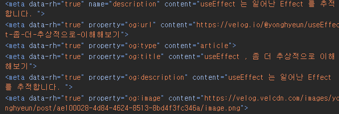
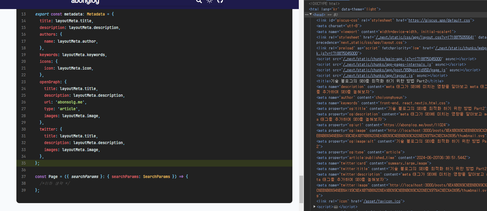

[기술 블로그의 SEO를 최적화 하기 위한 방법 Part1](https://yonglog.vercel.app/post/493728) 이전 포스트에서 SEO의 개념에 대해 알아보고 URL 구조 경로를 수정하거나 `title` 태그를 추가해줬다.

이번 파트에서는 `SEO` 와 큰 관련이 있는 `meta` 태그들을 활용하여 `SEO` 를 최적화 해보도록 하자

# meta 태그가 무엇일까 ?

`meta` 태그는 웹 페이지에 대한 정보를 제공하는 태그이다.

직접적으로 페이지에 렌더링 되는 정보는 아니지만 브라우저나 검색엔진 , 웹 서비스 등에게 페이지의 정보를 제공 할 수 있다.

기본적으로 `html` 파일을 만들면 `head` 태그 내에 기본 설정된 `meta` 태그 등이 존재하는 모습을 심심찮게 볼 수 있었을 것이다.

```html title="기본 html 생성 시 생성되는 meta 태그들의 모습" {4-5}
<!DOCTYPE html>
<html lang="en">
  <head>
    <meta charset="UTF-8" />
    <meta name="viewport" content="width=device-width, initial-scale=1.0" />
    <title>Document</title>
  </head>
  ...
</html>
```

이전 챕터에서 말했듯 페이지가 검색 엔진에서 나타나기 위해선 검색 엔진이 페이지를 올바르게 평가하고 높은 순위를 매겨야 검색 엔진에서 상단에 노출된다.

검색 엔진에게 페이지에 대한 적절한 정보를 `meta` 태그에 담아 생성해야 검색 엔진에게 높은 평가를 받을 수 있다.

# meta 태그의 종류

크게 나눠봤을 때 `meta` 태그는 두 가지 종류로 나눌 수 있다.


직접적으로 페이지의 정보를 담는 `Description meta tag` 와 검색 엔진의 크롤러 로봇이 확인 할 수 있는 `Robots meta tag` 이다.

> `title element` 는 `meta` 태그가 아니지만 종종 `meta` 태그의 일부분으로 분류되곤 한다고 한다.

# meta 태그를 사용하기 위해 알아야 하는 선수 지식들

## meta 태그는 head 태그 내부에 존재해야 한다.

`html` 문서의 의미론적 구조에로 보았을 때 페이지의 본문과 관련된 내용은 `body` 태그 내부에 담아 사용 하는 것이 일반적이다.

`meta` 태그는 페이지의 본문과 관련된 내용이 아니기에 `head` 태그에 담아 선언해주도록 하자

## meta 태그는 lifting up 되기도 하고 상속 되기도 한다.

검색 엔진의 크롤러는 페이지의 `html` 문서를 전부 확인 할 때 상단부터 하단까지 전체적으로 훑으며 `meta` 태그들을 수집해나간다.

예를 들어 다음과 같은 문서 구조가 있다고 해보자

```html title="meta 태그가 사용된 문서의 예시 , title은 liftngup , autor 는 상속" {6-7,14}
<!DOCTYPE html>
<html lang="en">
  <head>
    <meta charset="UTF-8" />
    <meta name="viewport" content="width=device-width, initial-scale=1.0" />
    <meta description="저의 문서입니다" />
    <meta author="김땡땡" />
    <title>Document</title>
  </head>
  <body>
    {/* body 태그 내부 정보는 라우팅 경로에 따라 다르다고 가정해보자 */}
    <section>
      <head>
        <meta description="저의 자기소개와 관련된 문서입니다." />
      </head>
    </section>
  </body>
</html>
```

검색 엔진 크롤러는 문서 전체 구조를 살펴보며 `meta` 태그들을 수집한다.

이 때 `body` 태그 내부의 `meta` 태그들은 라우팅 경로에 따라 다르다고 가정해본다면

크롤러는 자기 소개와 관련된 경로인 `/introudce` 라는 페이지의 `meta` 태그를 정의 할 때 다음과 같이 정의한다.

- 상위 레이아웃인 `head` 에 존재하는 `charset , name , description , author` 를 통해 `meta` 태그를 정의한다.
- 문서를 훑으며 하위 레이아웃인 `body` 에 존재하는 `description` 을 통해 `meta` 태그를 정의한다.

이처럼 `author` 의 경우엔 하위 레이아웃에서 정의해주지 않았지만 상위 레이아웃에서 정의 한 `meta` 태그가 상속 되었다.

반대로 `title` 은 하위 레이아웃에서 재정의 되었기 때문에 상위 레이아웃에서 정의한 `title` 태그를 덮어 씌웠다.

이를 통해 경로에 따른 다른 레이아웃에서 `meta` 태그를 효과적으로 생성하는 것이 가능하다.

# meta 태그의 종류들을 알아보자

## meta.description

`meta` 태그의 `description` 은 문서의 전체적인 주제를 의미하는 태그이다.

검색 엔진은 문서의 전체적인 내용을 `title` 태그와 `meta.description` 에 정의 된 내용을 통해 문서의 전체적인 내용을 파악하고 검색 엔진에서 드러나게 한다.


예를 들어 파란 부분은 `title` 태그의 문서 , 회색 부분은 `description` 에 해당한다.

`description` 의 경우엔 주로 `50~160`자 사이의 길이를 사용하며 한글 기준으론 `80` 자 이내여야 한다고 한다.

너무 긴 경우엔 검색 결과에서 생략 되고 , 짧으면 충분한 정보를 제공 할 수 없다고 한다.

예전에는 별 생각 없이 `metadata` 부분을 썼었는데 검색 엔진에 띄워질 내용이라 생각하니 좀 더 성의있게 수정해주었다.

## meta.author

`meta.author` 태그는 문서의 저작권자에 대한 정보를 담고 있다.

## meta.keywords

`keywords` 는 페이지에서 다루는 키워드들을 `,` 로 구분한 문자열이다.

다만 구글 검색 엔진은 더 이상 `keywords` 를 검색 엔진 랭크를 선언 할 때 사용하지 않는다고 한다.

아무래도 무작위한 `keywords` 남발로 인해 적절하지 않은 문서들이 검색 브라우저에 뜨는 것을 방지하기 위함이 아닌가 싶다.

## openGraph

메타 태그의 `property` 인 `openGraph` 는 웹 문서가 소셜 미디어를 통해 공유될 때 사용되는 메타 태그이다.




예를 들어 디스코드에서 벨로그의 게시글을 공유하면 다음과 같이 `og: ..` 에 설정한 것과 같은 양상으로 나타나는 모습을 볼 수 있다.

## 파비콘


파비콘이란 인터넷 탭 옆에 존재하는 이미지 아이콘을 의미한다.

적절한 이미지를 가져와 `.ico` 확장자로 변경후 `public/asset/favicon.ico` 확장자로 생성해주었다.

## robots

`robots` 관련 메타 태그는 검색 엔진의 크롤러가 검색 엔진의 색인에 문서를 추가하기 위해

문서의 소유자인 웹 마스터가 설정하는 태그이다.

이를 통해 크롤러가 내 웹 페이지는 검색 엔진에서 나타나지 않도록 설정 할 수도, 혹은 색인에 추가하면서 내부에 존재하는 `a` 태그를 통해 여러 문서를 통합적으로 크롤링 할 수 있게 할 수도 있다.

나는 최대한 검색 엔진이 내 문서들을 가져가길 바라니 색인에 추가 하기 위해 `index` , 주변 리소스도 탐색 가능하게 `follow` 설정을 넣어주도록 할 것이다.

# 루트 레이아웃 메타 태그 컴포넌트 생성하기

```tsx title="/layout.tsx" {2-36}#add
/* 생략 */
const layoutMeta = {
  title: "abonglog",
  description:
    "프론트엔드 기술 블로그입니다. 열심히 공부한 내용을 기록하고 공유하여 함께 성장하고 싶습니다.",
  author: "choiyonghyeun",
  keywords: "front-end, react,nextjs,html,css",
  image: "/assets/profile.jpg",
  icon: "/asset/favicon.ico",
};

export const metadata: Metadata = {
  title: layoutMeta.title,
  description: layoutMeta.description,
  metadataBase: new URL(baseUrl), // metadataBase 설정
  authors: {
    name: layoutMeta.author,
  },
  keywords: layoutMeta.keywords,
  icons: {
    icon: layoutMeta.icon,
  },
  robots: "index follow",
  openGraph: {
    title: layoutMeta.title,
    description: layoutMeta.description,
    url: "abonsolg.me",
    type: "article",
    images: layoutMeta.image,
  },
  twitter: {
    title: layoutMeta.title,
    description: layoutMeta.description,
    images: layoutMeta.image,
  },
};

const Page = ({ searchParams }: { searchParams: SearchParams }) => {
  /*이하 생략 */
};
```

> **`metadataBase` 를 추가해준 모습을 살펴보자**
>
> `meta` 태그 내에서 사용하는 경로들은은 모두 `http , https: // ..` 로 시작하는 절대 경로여야 한다.
>
> 상대 경로를 `meta` 태그 내에서 사용하기 위해서 `NextJS` 에서는 `metadataBase` 값에 시작 경로를 넣어줘야 한다.

이후 `NextJS` 에서 제공하는 메타 데이터 생성 방법인 `Metadata` 객체를 `export` 하는 방법으로 메타 태그를 생성해주었다.

이는 직접 `<meta name='description' content = '...'>` 형태로 입력해주는 것과 같은 행위다.

`Metadata` 라는 형태를 `NextJS` 에서 제공해주니 제공해주는 기능을 사용해보자

# 동적 메타 데이터 생성하기

이제는 블로그 포스팅 별 존재 할 동적인 메타 데이터들을 생성해보자

이전 `genarateStaticParams` 로 포스팅들을 생성해뒀던 것들 처럼 `generateMetadata` 를 통해 동적인 메타 데이터들을 생성해줄 수 있다.

`generateMetadata` 는 동적으로 결정되는 라우팅 경로들에 대한 `meta` 태그들을 `Metadata` 객체 형태로 생성해둔다.

해당 메타 데이터들은 라우팅 경로와 호환되는 `postId` 들에 대해서 게시글의 `meta` 영역의 내용을 가지고 `meta` 태그 들을 생성하도록 한다.

> 개발 블로그 개발 여정의 이전 글들을 모르는 사람들에게 말하자면
>
> 페이지의 내용이 되는 `mdx` 파일들 상단에 다음과 같은 `meta` 영역을 선언해두었다.

```mdx title="mdx 파일의 상단, 해당 부분이 postId 별 meta 객체에 해당한다."
---
title: 기술 블로그의 SEO를 최적화 하기 위한 방법 Part2
description: meta 태그가 SEO에 미치는 영향을 알아보고 meta 태그를 추가하여 SEO를 높혀보자
thumb: public/posts/개발 블로그 개발 여정/21. 기술블로그 SEO 최적화 part2/image-1.png
tag:
  - react
postId: 11024
date: Thu Jun 20 2024
time: 1718865531544
---
```

```tsx title="/post/[postId]/page.tsx" {2,9-41}#add
/* 생략 */
import { Metadata } from "next";

export function generateStaticParams(): { postId: string }[] {
  const allPost = getAllPosts();
  return allPost.map(({ meta }) => ({ postId: String(meta.postId) }));
}

export function generateMetadata({
  params,
}: {
  params: { postId: string };
}): Metadata {
  const { meta } = getPostContent(params.postId);

  const baseUrl = "https://abonglog.me";

  return {
    title: meta.title,
    description: meta.description,
    metadataBase: new URL(baseUrl), // metadataBase 설정
    openGraph: {
      title: meta.title,
      description: meta.description,
      url: `${baseUrl}/post/${meta.postId}`,
      images: [
        {
          url: meta.validThumbnail,
          alt: meta.title,
        },
      ],
      type: "article",
      publishedTime: new Date(meta.time).toISOString(),
    },
    twitter: {
      title: meta.title,
      description: meta.description,
      images: meta.validThumbnail,
    },
  };
}

const PostPage = ({ params }: { params: { postId: string } }) => {
  const { meta, content } = getPostContent(params.postId);
  const components = getMdxComponents({}, meta.path);

  return {
    /* 생략 */
  };
};

export default PostPage;
```

다음과 같이 `post/[postId]/page.tsx` 에서 동적으로 메타 태그들을 생성하는 `generateMetadata` 메소드를 정의해주자

결국 `postId` 라는 경로에 맞춰 메타 데이터를 생성하여 `meta` 태그를 생성한다.

상위 레이아웃에선 `layoutMeta` 객체에 담긴 정보를 이용해 `meta` 태그를 생성해주었지만 현재 하위 레이아웃 (`post/[postId]` 경로) 에선 포스트의 `meta` 정보를 이용해 `meta` 태그를 생성해주었다.



이를 통해 동적으로 페이지 별 메타 태그를 생성해주었다.

# 기타 메타 데이터들 설정하기

## meta.data-theme


`data-theme` 메타 태그는 해당 문서를 보고 있는 클라이언트의 주변 디자인을 커스터마이징 해주는 태그이다.

해당 `meta` 태그는 현재 피시에서는 사파리 , 핸드폰에선 크롬과 사파리 , 삼성 인터넷에서만 사용 가능한 메타 태그이지만 추가해주도록 하자

```html title="theme-color의 사용 예시"
<meta name="theme-color" media="(prefers-color-scheme: light)" content="cyan" />
<meta name="theme-color" media="(prefers-color-scheme: dark)" content="black" />
```

다음과 같이 `media` 어트리뷰트로 사용자의 선호 테마에 따라서 다른 값을 줄 수도 있다.

나는 `prefers-color-scheme` 기능이 아니라 클라이언트 컴포넌트인 `ThemeButton` 에서 테마를 지정하니 `ThemeButton` 컴포넌트에서 해당 `meta` 태그를 직접적으로 조작해주도록 하자

```tsx title="/layout.tsx" {4,7 , 24-25}#add
/* Client 단에서 서버 렌더링 결과가 hydration 될 때 실행되는 IIFF */
const setThemeFromLocalStorage = `(function () {
  const theme = localStorage.getItem('theme') || 'light';
  const contentColor = theme === 'light' ? 'rgb(248, 240, 252)' : '#111';

  document.documentElement.setAttribute('data-theme', theme);
  const metaTheme = document.querySelector('meta[name="theme-color"]');
  }
})()`;

export default function RootLayout({
  children,
}: Readonly<{
  children: React.ReactNode;
}>) {
  return (
    <html lang='kr'>
      <head>
        {/* 구글 검색 엔진 등록 위한 메타 태그 */}
        <meta
          name='google-site-verification'
          content='7O0-gfyTg8JG154_G2ceeUM5SyOAQ1R9tH4W9BHoP7U'
        />
        {/* 모바일 유저의 인터페이스를 변경하기 위한 메타 태그 */}
        <meta name='theme-color' content='rgb(248,240,252)' />
        <script
          dangerouslySetInnerHTML={{ __html: setThemeFromLocalStorage }}
        ></script>
```

레이아웃에서 기본 값으로 사용 할 `data-theme` 의 값을 지정해 준 후 실제 클라이언트 화면에서 하이드레이션 될 때엔 로컬 스토리지에 저장된 `theme` 값에 따라 다르게 설정해주도록 했다.

```tsx title="@/components/client/ThemeButton.tsx" {15,18-21}#add
"use client";

import { FiMoon, FiSun } from "react-icons/fi";
import { useLayoutEffect, useState } from "react";

const ThemeButton = () => {
  const [theme, setTheme] = useState("light");

  useLayoutEffect(() => {
    setTheme(localStorage.getItem("theme") || "light");
  }, []);

  const handleTheme = () => {
    const nextTheme = theme === "light" ? "dark" : "light";
    const contentColor = theme === "light" ? "rgb(248, 240, 252)" : "#111";

    setTheme(nextTheme);
    document.documentElement.setAttribute("data-theme", nextTheme);
    document
      .querySelector('meta[name="theme-color"]')
      ?.setAttribute("content", contentColor);
    localStorage.setItem("theme", nextTheme);
  };

  return theme === "light" ? (
    <button className="py-2" onClick={handleTheme}>
      <FiSun size={20} />
    </button>
  ) : (
    <button className="py-2" onClick={handleTheme}>
      <FiMoon size={20} />
    </button>
  );
};

export default ThemeButton;
```

이후 테마 버튼에서도 테마가 변경되면 동적으로 `data-theme` 이 존재하는 메타데이터의 값을 변경해주도록 수정해주면 끝 !
