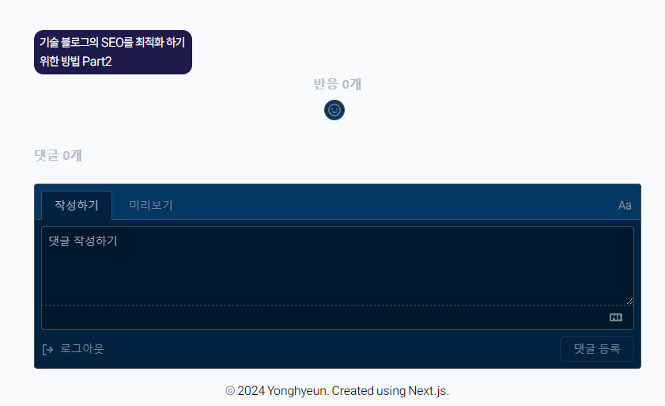
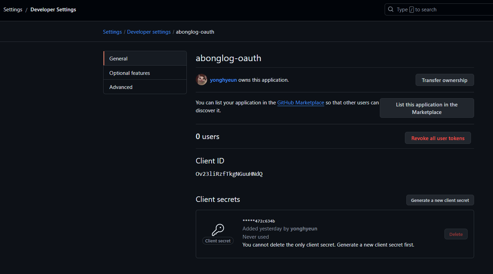
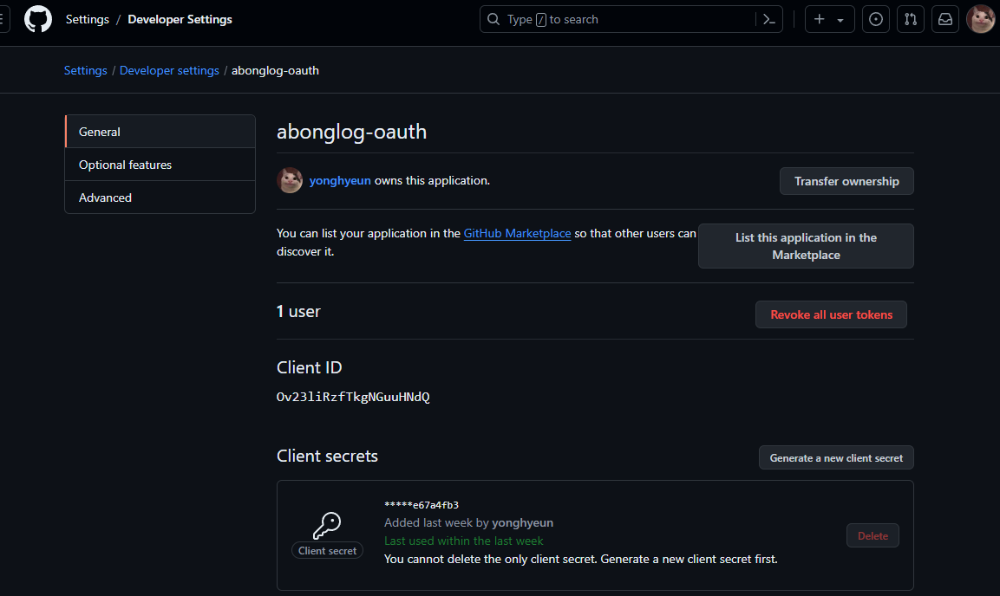
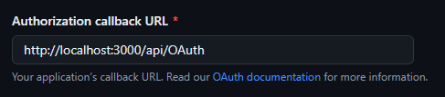
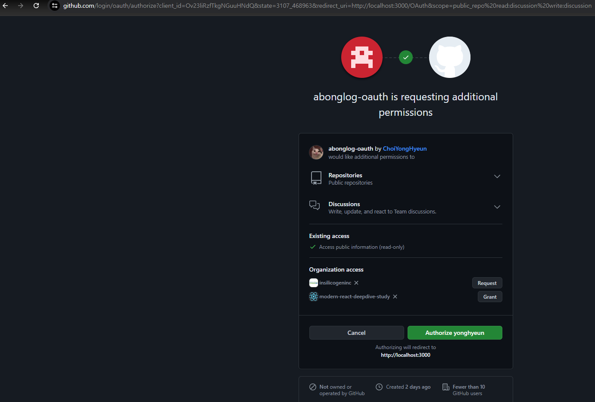
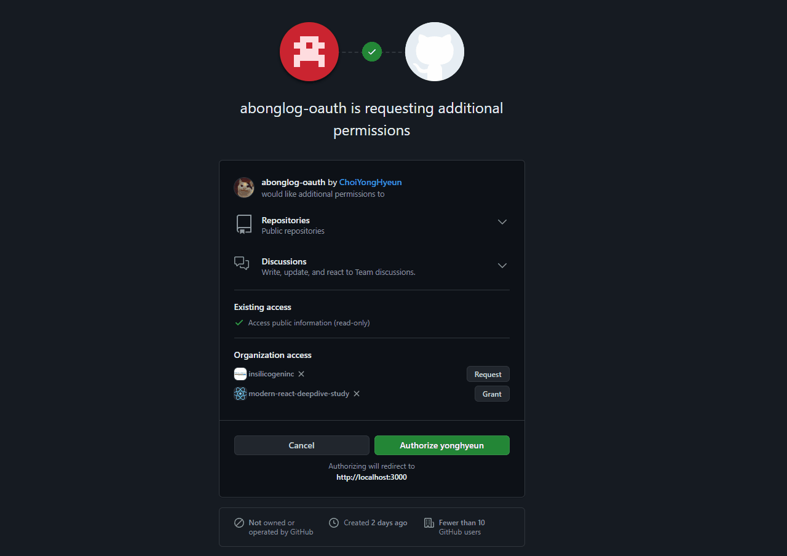

# 현재는 giscus 라이브러리를 이용하여 댓글을 사용하고 있다.



현재는 `giscus` 를 이용하여 깃허브 `OAuth` 및 댓글을 사용하고 있다.

`giscus` 는 깃허브 API 를 활용하여 디스커션에 댓글을 달고, 해당 디스커션에 존재하는 댓글 리스트를 `OAuth` 과정에서 얻은 액세스 토큰을 이용해 가져오는 라이브러리이다.

라이브러리를 이용하면 한 시간도 안돼서 빠르게 댓글 기능을 구현 할 수 있었으나 공부를 위해 기술 블로그를 만들면서 라이브러리를 사용하는 것은 아닌 것 같아서 바닐라 자바스크립트로 직접 구현하려고 한다.

`OAuth` 에 대한 내용은 [이전 글](https://www.abonglog.me/post/437527)을 참고하도록 하자 :)

# 깃허브에서 OAuth App 다운로드 받기

## client id, client secret 발급 받기

`OAuth` 를 이용하기 위해선 우선 해당 인증 서버에서 요구하는 `client id , secret` 을 발급 받아야 한다.



깃허브 API 를 이용 할 것이기 때문에 깃허브에서 `client id, secret` 을 받아오도록 하자

이후 받아온 값들을 환경 변수에 저장해주자

```env title="env.local" {2-3}#add
POSTS_PER_PAGES = 10
CLIENT_ID = Ov23liRzfTkgNGuuHNdQ
CLIENT_SECRET = /* 발급 받은 클라이언트 비밀번호 */
```

배포 시에도 사용 할 수 있도록 `vercel` 환경 변수에도 추가해주도록 하자



## callback URI 설정하기



깃허브 `OAuth App` 에서 `client id, client secret` 받은 페이지에서 스크롤을 좀 하단으로 내리다보면 `Authorization callback URL` 을 설정하는 칸이 존재한다.

해당 칸에 `callback URL` 을 설정해주자

여기서 `callback URL` 이 어떤 행위를 하는지에 대해선 추후 설명 하도록 한다.

배포 시엔 배포 할 때 사용하는 경로를 이용해서 써야 하며 현재는 개발 중 쓸 것이니 `localhost` 주소로 설정해주었다.

# 깃허브 로그인창으로 리다이렉션 시키기

[Github docs - OAuth](https://docs.github.com/en/apps/oauth-apps/building-oauth-apps/authorizing-oauth-apps)

이후엔 문서의 흐름을 따라 따라가도록 하자

```dotnetcli title='깃허브 OAuth에 접근하기 위한 엔드포인트'
GET https://github.com/login/oauth/authorize?client_id=어쩌구&redirect_uri=저쩌구&state=블라블라
```

```tsx title="@/components/Comments"  {4,7}
import { Login } from '@/components/client/OAuth';

const Comments = ({ postId }: { postId: string }) => {
  const CLIENT_ID = process.env.CLIENT_ID as string;
  return (
    <section>
      <Login clientId={CLIENT_ID} postId={postId} />
    </section>
  );
};

export default Comments;
```

우선 서버 컴포넌트로 `Comments` 컴포넌트를 생성해주었다. 해당 컴포넌트는 서버 컴포넌트로 `process.env` 에 접근 할 수 있는 컴포넌트이다.

서버 컴포넌트에서 환경 변수에 접근한 후 인증 및 인가 과정이 일어날 클라이언트 컴포넌트에게 환경 변수 값을 `props` 로 담아 전송해주도록 하자

```tsx title="@/components/client/OAuth.tsx" {1-99}#add
'use client';

import Link from 'next/link';

const GITHUB_LOGIN_ENDPOINT = 'https://github.com/login/oauth/authorize';
const REDIRECT_URI =
  process.env.NODE_ENV === 'development'
    ? 'http://localhost:3000/OAuth'
    : 'https://abonglog.me/OAuth';
const scopes = 'public_repo read:discussion write:discussion';

export const Login = ({
  clientId,
  postId,
}: {
  clientId: string;
  postId: string;
}) => {
  const randomState = Math.floor(Math.random() * 10000);
  const authorizationUrl = `${GITHUB_LOGIN_ENDPOINT}?client_id=${clientId}&state=${randomState}_${postId}&redirect_uri=${REDIRECT_URI}&scope=${scopes}`;
  return <Link href={authorizationUrl}>Login With Github</Link>;
};
```

깃허브의 `OAuth` 를 이용하기 위해선 우선적으로 깃허브의 로그인 페이지로 사용자를 리다이렉션 시켜야 한다.

위에서 말한 엔드포인트로 클라이언트를 리다이렉션 시키도록 하자

이 때 필수적으로 사용해야 할 쿼리 파라미터론 `client_id`가 존재한다.

`redirect_uri` 은 인증이 처리된 이후 리다이렉트 될 경로를 의미한다.

해당 값은 이미 셋팅 할 때 `Authroization callback URL` 을 설정해뒀기 때문에 적어두지 않아도 무관하다.

추가적으로 추천하는 것은 `state` 쿼리 파라미터인데 해당 파라미터는 `CSRF` 공격을 막기 위한 쿼리 파라미터로 랜덤한 문자열로 작성해주라고 한다.

`state` 값에 저장해둔 값은 인증 이후 `redirect_uri` 에 설정된 경로로 이동 되었을 때 쿼리 파라미터에 담겨 전송된다.

그래서 나는 `state` 부분에 로그인을 요구했던 페이지의 주소를 담아 작성해주었다.

쿼리 파라미터 중 `scope` 는 인증 후 인가 때 받아올 액세스 토큰이 할 수 있는 권한의 영역을 의미한다.

나는 `discussion` 을 읽거나 , `discussion` 에 댓글을 달 수 있게 하기 위해 `scope` 를 `repo read:discussion write:discussion` 으로 설정해주었다.



이에 해당 `Login` 컴포넌트를 클릭하면 깃허브 인증 서버에서 제공하는 로그인 페이지로 리다이렉션된다.

해당 페이지에서 로그인 후 `Authorization 본인 아이디` 를 클릭하면 이전에 설정해둔 `redirect uri` 로 리다이렉션 된다.



## 인증 이후 리다이렉션 될 페이지 생성하기

```tsx title="/Oauth/page.tsx"
/**
 * 해당 컴포넌트는 Github에서 OAuth로 인증을 받은 후 /OAuth?code= , state= 경로로
 * 들어왔을 때 나타나는 페이지를 나타내는 컴포넌트
 *
 * 로딩 상태를 렌더링 하고, 리소스 오너의 임시 토큰인 code 값을 받아 액세스 토큰을 받아오고
 * state 값에 정의된 경로로 다시 리다이렉션 시키는 컴포넌트
 */
const OAuthPage = () => {
  return <section className='mt-24 '>...</section>;
};

export default OAuthPage;
```

인증 이후 리다이렉션 될 페이지를 생성해주었다.
