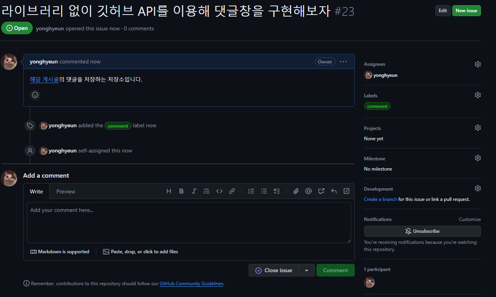

# 깃허브 API를 이용하여 댓글을 가져와보자

현재 나는 `giscus` 라이브러리를 이용해 댓글을 쉽게 구현했지만 공부를 위해 만드는 기술 블로그에서 라이브러리를 사용 하는 것은 좀 아닌 것 같아 바닐라 자바스크립트로 직접 만들어보려 한다. :)

어떤 포스트가 먼저 올라갈지는 모르겠지만 나는 깃허브 API를 이용해 `OAuth` 와 댓글 관리를 모두 만들려고 한다.

## 댓글을 깃허브 issue에 담아 저장하면 좋은 점

우선 깃허브 API를 이용하고자 하는 이유는 크게 두 가지이다.

우선, **프론트엔드 기술 블로그인만큼 접속자의 대부분이 깃허브를 사용하는 유저**일 것이기 때문에 댓글을 달기 위한 인증, 인가 과정 시 깃허브 OAuth 를 이용하면 좋을 것 같았다.

그리고, 따로 **댓글을 저장 할 데이터베이스를 만들지 않고 깃허브 레파지토리 내부에서 댓글을 저장, 가져옴으로서 API요청 로직에만 집중**하면 되기에 좋다.

## discussion 은 냅두고 왜 issue 를 사용하는가 ?


이전 포스트들에서 말했지만 `giscus` 라이브러리는 디스커션을 이용하여 답글 기능이 존재했다.


아쉽게도 `issue` 에서는 답글 기능이 존재하지 않는다는 단점이 존재하여 최대한 디스커션을 이용하여 구현하려했다.

하지만 아쉽게도, 디스커션에 대한 API는 GraphQL 을 이용한 API요청만이 가능하더라 ..

GraphQL 을 배워볼까 했지만 할 일이 산더미기 때문에 우선은 익숙한 **RestAPI 로 조작 가능한 issue** 를 사용하도록 결정했다.

# 깃허브 API를 사용하기 위한 스텝들을 밟아보자

## 1. 액세스 토큰 발급 받기

```tsx title="이슈에 달린 댓글 리스트를 가져오는 GET요청의 예시" {2}
const octokit = new Octokit({
  auth: 'YOUR-TOKEN',
});

await octokit.request(
  'GET /repos/{owner}/{repo}/issues/{issue_number}/comments',
  {
    owner: 'OWNER',
    repo: 'REPO',
    issue_number: 'ISSUE_NUMBER',
    headers: {
      'X-GitHub-Api-Version': '2022-11-28',
    },
  },
);
```

> 깃허브 공식 문서에서는 API 요청시 `octokit` 라이브러리를 사용하여 설명한다.
>
> 어떤 라이브러리를 사용하던 REST API 형식을 만족하면 어떤 것을 사용하든 상관이 없다.

우선 개인적으로 사용 할 액세스 토큰을 발급 받아야 한다.

깃허브 API에서 인증,인가 과정 없이도 사용 가능한 API들이 존재하지만 대부분의 요청들은 인가 과정에 필요한 `auth-token` 을 요구한다.

블로그의 게시글을 빌드 할 때 필요한 API 요청들을 사용하기 위해 개인용 액세스 토큰을 발급 받자

해당 토큰들은 **게시글의 댓글들이 달릴 `issue` 들을 생성하는데 사용** 될 예정이다.

액세스 토큰은 `Settings - Developer Settings - Personal access tokens` 에서 생성 해줄 수 있다.

생성한 토큰을 환경 변수에 저장해주도록 하자

```title=".env.local" {2}#add showLineNumbers{14}
/* 기타 환경 변수 생략 */
PERSONAL_ACCESS_TOKEN = /* 발급 받은 access token */
```

## 2. API 요청을 보낼 때 사용 할 GitHub 모델 생성하기

```tsx title="/lib/GithubModel.tsx" {1-10,12-99}#add {11}
import type {
  QueryParameter,
  Header,
  RequestOptions,
  HTTPResponse,
} from '@/types/api';

export default class GithubAPI {
  private static BASE_URL = 'https://api.github.com';
  private static baseHeader: Header = {
    Authorization: `token ${process.env.PERSONAL_ACCESS_TOKEN}`,
    'Content-Type': 'application/json',
  };

  private static setHeaders(headers: Header) {
    return { ...this.baseHeader, ...headers };
  }

  private static setURL(endPoint: string, queryParameter: QueryParameter) {
    if (Object.keys(queryParameter).length === 0) {
      return `${this.BASE_URL}${endPoint}`;
    }
    const searchParams = new URLSearchParams(queryParameter).toString();
    return `${this.BASE_URL}${endPoint}?${searchParams}`;
  }

  static async GET<T>(
    endPoint: string,
    requestOptions: RequestOptions,
  ): Promise<HTTPResponse<T>> {
    const { additionalHeader, queryParameter } = requestOptions;
    const url = this.setURL(endPoint, queryParameter || {});
    const headers = this.setHeaders(additionalHeader || {});

    try {
      const response = await fetch(url, {
        method: 'GET',
        headers,
      });
      if (!response.ok) {
        throw new Error(`Error: ${response.status} - ${response.statusText}`);
      }

      const data = await response.json();
      return data;
    } catch (error) {
      console.error(error);
      throw error;
    }
  }

  static async POST<T>(
    endPoint: string,
    requestOptions: RequestOptions,
  ): Promise<HTTPResponse<T>> {
    const { additionalHeader, queryParameter, body } = requestOptions;
    const url = this.setURL(endPoint, queryParameter || {});
    const headers = this.setHeaders(additionalHeader || {});

    try {
      const response = await fetch(url, {
        method: 'POST',
        headers,
        body: JSON.stringify(body),
      });
      if (!response.ok) {
        throw new Error(`Error: ${response.status} - ${response.statusText}`);
      }

      const data = await response.json();
      return data;
    } catch (error) {
      console.error(error);
      throw error;
    }
  }
}
```

깃허브에게 API 요청을 보내는 행위를 반복 할 것이기 때문에 API 요청 로직을 담당 할 `GithubAPI` 를 생성해보자

해당 모델은 깃허브의 기본 주소와 토큰을 담고 있는 기본 헤더 정보들을 담고 있는 모델이다.

환경 변수에 저장된 토큰 값들을 사용하기 때문에 해당 모델은 필수적으로 서버 단에서만 실행 되어야 한다.

> ps. Authorization 헤더 부분에 토큰 값을 넣을 때 token 이란 문자열 후에 넣어주도록 하자
>
> 공식문서에선 `octokit` 라이브러리를 사용해서 딱히 넣어줄 필요가 없었지만 해당 라이브러리를 사용하지 않으면 `token` 이란 문자열을 넣어줘야 한다.

> 타입과 관련된 값들은 포스팅 맨 추후에 붙여넣도록 하겠다.
>
> 계속 개발하면서 추가 될 예정이기 때문이다.

## 3. 깃허브 API를 이용하여 issue 목록 가져오기

[Github DOCS - List repository-issues](https://docs.github.com/en/rest/issues/issues?apiVersion=2022-11-28#list-repository-issues)

```tsx title="/lib/api.tsx" {1-99}#add
import GithubAPI from './GithubModel';

import type { IssueList } from '@/types/api';

/**
 * yonglog 레파지토리에 존재하는 이슈에 대한 정보를 GET 요청하여 가져오는 메소드
 * @param {number} page - 전체 이슈 리스트를 30개씩 가져 올 때 가져와야 할 페이지
 * 전체 포스트의 개수에 따라 달라질 수 있다.
 */
export const GET_issueList = async (page: number = 1) => {
  const endPoint = '/repos/yonghyeun/yonglog/issues';
  const queryParameter = {
    per_page: '30',
    labels: 'comment',
    page: String(page),
  };

  const issueList = await GithubAPI.GET<IssueList>(endPoint, {
    queryParameter,
  });
  return issueList;
};
```

쿼리파라미터를 이용해 `comment` 라는 라벨을 가지고 있는 이슈 리스트들만 가져오는 메소드를 생성해주었다.


```tsx title="GET_issueList 응답값의 일부 형태"
[
  {
    url: 'https://api.github.com/repos/yonghyeun/yonglog/issues/9',
    number: 9,
    title: '테스트용 이슈입니다',
    body: '바디바디바디 당근당근 ',
    user: {},
    labels: [[Object]],
    state: 'open',
    comments: 0,
    reactions: {
      url: 'https://api.github.com/repos/yonghyeun/yonglog/issues/9/reactions',
      total_count: 0,
      '+1': 0,
      '-1': 0,
      laugh: 0,
      hooray: 0,
      confused: 0,
      heart: 0,
      rocket: 0,
      eyes: 0,
    },
  },
];
```

응답 값 들중 사용 할 정보들만 간추려 가져와봤다.

해당 요청의 응답값은 이슈의 번호 (`number`) 와 제목과 본문, 댓글 수, 반응 수등을 가져온다.

생성한 `GithubModel` 을 이용하여 하나씩 API 요청을 하는 메소드들을 정의해보자

`GET_issueList` 는 `per_page` 개씩 `page` 에 해당하는 이슈 포스트들을 가져오는 메소드이다.

## 4. 깃허브 API를 이용하여 issue 생성하기

[Github DOCS - Create-an-issue](https://docs.github.com/en/rest/issues/issues?apiVersion=2022-11-28#create-an-issue)

`issue` 를 생성하는 과정이 필요한 이유는 **게시글에 달리는 댓글을 저장하기 위한 게시글 별 이슈가 필요 하기 때문**이다.

```tsx title="/lib/api.tsx" {1-99}#add showLineNumbers{27}
/**
 * 특정 게시글의 meta 데이터를 이용해 이슈 게시글을 생성하는 메소드
 * @param {PostInfo['meta']} 특정 게시글의 메타데이터
 */
export const POST_issuePost = async (meta: PostInfo['meta']) => {
  const { title, postId } = meta;
  const endPoint = '/repos/yonghyeun/yonglog/issues';
  const additionalHeader = {
    Accept: 'application/json',
  };
  const body = {
    title,
    body: `<a href = 'https://abonglog.me/post/${postId}'>해당 게시글</a>의 댓글을 저장하는 저장소입니다.`,
    labels: ['comment'],
    assignees: ['yonghyeun'],
  };
  const response = await GithubAPI.POST<Issue>(endPoint, {
    body,
    additionalHeader,
  });
  return response;
};
```

해당 `POST` 요청에 대한 응답 값은 생성된 이슈 포스트를 반환한다. 즉 , `Issue` 타입과 동일하다.

해당 메소드를 `/post/[postId]/page.tsx` 에서 실행하면 다음과 같이 이슈가 자동으로 만들어진다.

```tsx title="/post/[postId]/page.tsx" {6-99}#add showLineNumbers{59}
const PostPage = ({ params }: { params: { postId: string } }) => {
  const { meta, content } = getPostContent(params.postId);
  const components = useMDXComponents({}, meta.path);

  // 단순히 실험을 위한 즉시 실행 함수
  (async function () {
    await POST_issuePost(meta);
  })();
```



### 모든 포스트의 댓글 저장소를 만들어주자

이전 챕터들을 읽은 사람들이라면 알고 있을 수 있지만 나는 현재 `/lib/posts.tsx` 파일에서 로컬 파일에 존재하는 `mdx` 파일들을 `parsePosts` 메소드를 호출하여 가져오며

해당 메소드에선 동적으로 `mdx` 파일들에 존재하는 `meta` 데이터 영역을 조회하여 조건부적으로 값을 추가해주고 있다.

```tsx title="/lib/post.tsx" showLineNumbers{103} {14-25}
const parsePosts = (source: Source): Array<PostInfo> => {
  const Posts: Array<PostInfo> = [];

  const parseRecursively = (source: Source): void => {
    getAllPath(source).forEach((fileSource: Source) => {
      if (isDirectory(fileSource)) {
        parseRecursively(fileSource);
      } else {
        if (isMDX(fileSource)) {
          const fileContent = fs.readFileSync(fileSource, 'utf8');
          const { data, content } = matter(filterContent(fileContent));

          /* data.postId 가 존재하지 않으면 PostID 를 생성한 후 Post 저장*/
          if (!data.postId) {
            data.postId = Math.ceil(Math.random() * 9 * 100000);
            const updatedContent = matter.stringify(content, data);
            fs.writeFileSync(fileSource, updatedContent, 'utf-8');
          }
          /* data.date , time 이 존재하지 않으면 build 타임 기준으로 하여 생성 */
          if (!data.date) {
            data.date = new Date().toDateString();
            data.time = new Date().getTime();
            const updatedContent = matter.stringify(content, data);
            fs.writeFileSync(fileSource, updatedContent, 'utf-8');
          }

          /* 추후 이미지 파일에 접근하기 위해 해당 포스트가 존재하는 폴더 명을 meta 데이터에 저장 */
          const directoryPath = path.join(fileSource, '..');
          const relatevePath = directoryPath.split('public')[1];

          Posts.push({
            meta: {
              ...data,
              series: getSeriesName(fileSource),
              validThumbnail: getValidThumbnail(fileSource, data),
              path: relatevePath,
            },
            content: content,
          });
        }
      }
    });
  };

  parseRecursively(source);

  return Posts;
};
```

해당 부분처럼 `parsePosts` 메소드에서 조건부적으로 `/lib/api.tsx` 에 정의 된 메소드들을 호출하여 댓글 저장소를 생성하고 `meta` 데이터 영역에 저장해주도록 하자

```tsx title="기능이 추가된 parsePost" {1,29-49,69}#add showLineNumbers{106}
const parsePosts = async (source: Source): Promise<Array<PostInfo>> => {
  const Posts: Array<PostInfo> = [];

  const parseRecursively = async (source: Source) => {
    const allPath = getAllPath(source);

    for (const fileSource of allPath) {
      if (isDirectory(fileSource)) {
        parseRecursively(fileSource);
      } else {
        if (isMDX(fileSource)) {
          const fileContent = fs.readFileSync(fileSource, 'utf8');
          const { data, content } = matter(filterContent(fileContent));

          /* data.postId 가 존재하지 않으면 PostID 를 생성한 후 Post 저장*/
          if (!data.postId) {
            data.postId = Math.ceil(Math.random() * 9 * 100000);
            const updatedContent = matter.stringify(content, data);
            fs.writeFileSync(fileSource, updatedContent, 'utf-8');
          }
          /* data.date , time 이 존재하지 않으면 build 타임 기준으로 하여 생성 */
          if (!data.date) {
            data.date = new Date().toDateString();
            data.time = new Date().getTime();
            const updatedContent = matter.stringify(content, data);
            fs.writeFileSync(fileSource, updatedContent, 'utf-8');
          }

          /* data.issueNumber가 존재하지 않으면 yonghyeun/yonglog/issue에 issue 생성*/
          if (!data.issueNumber) {
            /* 이슈가 중복적으로 생성되는 것을 막기 위해 이슈 리스트를 가져와 한 번 더 검증하는 과정을 거치자 */
            const issueList = await Promise.all([
              GET_issueList(1, '100'),
              GET_issueList(2, '100'),
            ]).then((res) => res.flat());
            const existedIssue = issueList.find(
              ({ title }) => data.title === title,
            );
            if (existedIssue) {
              data.issueNumber = existedIssue.number;
            } else {
              const newIssue = await POST_issuePost(data);
              const { number } = newIssue;
              data.issueNumber = number;
            }

            const updatedContent = matter.stringify(content, data);
            fs.writeFileSync(fileSource, updatedContent, 'utf-8');
          }

          /* 추후 이미지 파일에 접근하기 위해 해당 포스트가 존재하는 폴더 명을 meta 데이터에 저장 */
          const directoryPath = path.join(fileSource, '..');
          const relatevePath = directoryPath.split('public')[1];

          Posts.push({
            meta: {
              ...data,
              series: getSeriesName(fileSource),
              validThumbnail: getValidThumbnail(fileSource, data),
              path: relatevePath,
            },
            content: content,
          });
        }
      }
    }
  };

  await parseRecursively(source);

  return Posts;
};
```

비동기 처리인 `POST_issuePost` 를 이용하여 만약 메타 데이터에 `issueNumber` 가 존재하지 않는 경우에는 이슈를 생성하도록 만들어주었다.

해당 게시글에선 적지 않겠지만 `async/await` 를 이용해주었기 때문에 `parsePosts` 를 호출하는 모든 메소드와 서버 컴포넌트들을 `async,await` 로 감싸 변경해주었다.

> `issueNumber` 의 경우 `yonglog/issue` 에 생성된 이슈들의 번호이다.
>
> 추후 이슈에 달린 댓글들을 가져 올 때 사용된다.

> 사실 초기 개발 과정에서 `GET_IssueList` 를 이용하여 검증하는 과정을 거치지 않았더니 이슈들이 중복적으로 생성되어 한 포스트 당 2~3개의 중복적인 이슈들이 생성되었다.
>
> 물론 결국 사용햐는 `issueNumber` 는 `mdx` 파일에 적힌 `issueNumber` 이기 때문에 큰 상관이 없지만 `issue` 들의 개수가 포스트의 개수와 맞지 않게 되었다. (포스트는 30개정도인데 이슈는 현재 99개)
>
> 개수를 맞춰주기 위해 하나씩 지워주다가 그냥 지쳐서 이미 만들어진 이슈는 놔두기로 하고 `GET_IssueList` 를 이용해 더 이상 중복적인 이슈들이 생성되는 현상을 방지해주었다.
>
> > 아마도 중복적으로 생성되는 이유는 `mdx` 파일이 업데이트 되기 전 `Stric mode` 로 인해 한 번 더 호출되면서 이런 문제가 발생했나 ? 하고 의심하고 있다.

## 5. 깃허브 API를 이용하여 issue에 달린 댓글 리스트 가져오기
