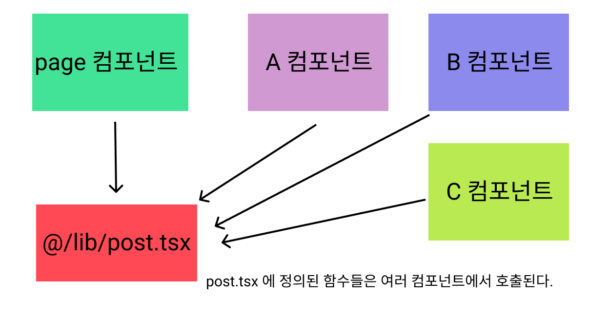
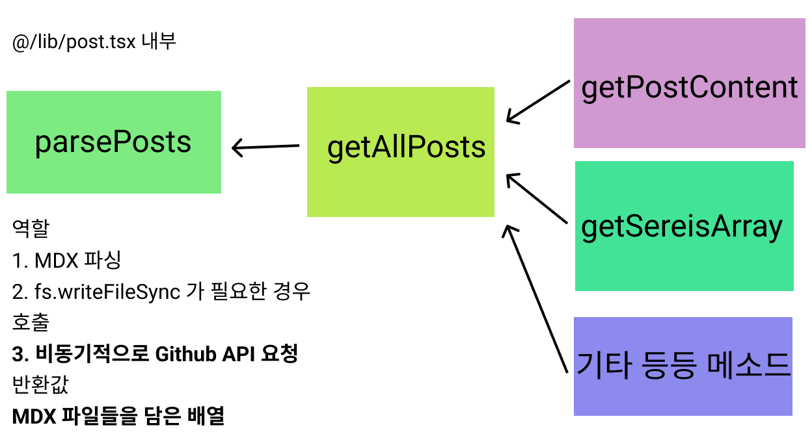
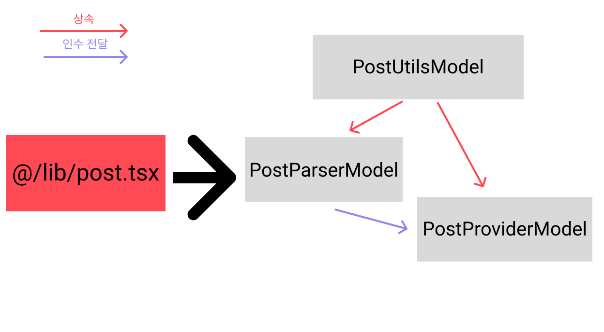

# 현재 상황은 어떨까 ?



`mdx` 파일들을 처리하는 다양한 메소드가 담긴 `@/lib/post.tsx` 에 존재하는 파일은 위 이미지와 같이

다양한 컴포넌트들에서 호출되어 사용된다.

이 때 다양한 장소에서 호출 되는 메소드들이 서로 의존성이 존재 하지 않는다면 괜찮겠지만 현재의 `@/lib/post.tsx` 내부를 살펴보면



```tsx title="parsePosts에 의존성을 가지고 있는 getAllPosts'
const parsePosts = async (source: Source): Promise<Array<PostInfo>> => {
  const Posts: Array<PostInfo> = [];

  const parseRecursively = async (source: Source) => {
    /* 내용 생략 */
  };

  await parseRecursively(source);

  return Posts;
};

export const getAllPosts = async (): Promise<Array<PostInfo>> => {
  const POST_PATH = path.join(process.cwd(), 'public/posts');
  const posts = await parsePosts(POST_PATH);

  return posts.toSorted((prev, cur) => {
    const prevTime = prev.meta.time;
    const curTime = cur.meta.time;

    return curTime - prevTime;
  });
};
```

위의 이미지처럼 `MDX` 파일들을 담은 배열을 반환하는 `parsePosts` 메소드에 **직접적이건, 간접적이건 의존성**을 가지고 있는 모습을 볼 수 있다.

그 말은 해당 메소드들이 여러 컴포넌트에서 무작위적으로 호출된다면 `parsePosts` 들도 그 수에 맞춰 매번 호출된다는 것이다.

이로 인해 `parsePosts` 내부에서 존재하는 비동기적으로 `Github API` 요청을 하는 부분에서 `race condition` 문제도 발생했고 이를 막기 위해 `flag` 를 동기적으로 설정하여 문제를 해결했었다.

> 해당 트러블 슈팅 경험은 [API요청과 async/await를 잘못 생각하면 겪을 수 있는 트러블 슈팅 경험](https://abonglog.me/post/710088) 에서 볼 수 있다.
>
> 게시글에서도 모범 사례가 아님을 이야기했다.

근본적으로 생각해보면 여러 컴포넌트에서 호출하는 다양한 메소드들이 의존성을 가져야 하는 것은 `parsePosts` 메소드의 행위가 아닌 `parsePosts` 가 반환하는 **MDX파일들을 담은 반환값**이다.

그렇다면 `parsePosts` 가 반환하는 값을 전역 객체로 생성하고 다른 메소드들에서 해당 메소드를 인수로 받거나 참조하면 되는거 아닌가 ? 라고 단순히 생각 할 수 있다.

하지만 `parsePosts` 가 반환하는 값은 `Promise` 이기 때문에 반환 값이 `resolve` 되기 이전까지 다른 메소드들을 호출하지 못하도록 신경 써야 한다.

그래서 그런점들을 신경 써서 `parsePosts` 가 반환하는 값을 다른 메소드들이 자유롭게 참조 할 수 있도록 리팩토링 해보도록 하자

# 사용하고자 하는 디자인 패턴 : 프로미스 패턴

프로미스 패턴은 비동기적으로 resolve 되는 객체 A가 존재 할 때

**해당 객체 A를 참조하는 메소드 등이 A 객체가 resolve 된 이후 실행 되는 것을 보장**하는 형태이다.

이 때 특징적으론 Promise 객체를 생성 할 때 **resolve 시키는 callback 함수를 Promise 생성 이후의 순간으로 빼줘버리는 것이다.**

이는 프로미스 객체의 특성을 이용한 것으로 예시를 들어보자면 다음과 같다.

```tsx title="프로미스 패턴을 이용한 객체 접근의 예시" {1,3-4 , 14-15 , 20-21 , 26-27 }
let resolveA;
const objectAPromise = new Promise((resolve, reject) => {
  resolveA =
    resolve; /* resolveA를 어떤 값을 resolve 할 수 있는 콜백 함수로 지정 */
});

function initializeObjectA() {
  setTimeout(() => {
    const objectA = { value: 'A is resolved' };
    resolveA(objectA); /* resolveA 객체는 objectA를 resolve 한다. */
  }, 2000);
}

function methodB() {
  objectAPromise.then((objectA) => {
    console.log('Method B executed with', objectA);
  });
}

function methodC() {
  objectAPromise.then((objectA) => {
    console.log('Method C executed with', objectA);
  });
}

function methodD() {
  objectAPromise.then((objectA) => {
    console.log('Method D executed with', objectA);
  });
}

initializeObjectA();
methodB();
methodC();
methodD();
```

```dotnetcli title="methodB,C,D 의 출력 결과, 모든 메소드 들은 resolveA 가 resolve 된 이후 실행된다."
Method B executed with { value: 'A is resolved' }
Method C executed with { value: 'A is resolved' }
Method D executed with { value: 'A is resolved' }
```

해당 패턴은 정말 내가 원하는 그대로를 모두 지원한다. 하나씩 리팩토링 해보자

# @/lib/post 파일을 어떻게 쪼갤까 ?



`@/lib/post` 파일에는 여러 역할을 하는 메소드 들이 서로 섞여 존재한다.

실제 컴포넌트에서 호출 되는 메소드들도 존재하고 , 다른 메소드 내부에서 사용되는 유틸적인 기능을 가진 유틸 메소드들도 존재한다.

이 때 이런 역할을 갖는 메소드들을 하나의 페이지에서 관리 할 것이 아니라 역할에 맞춰

- 다른 메소드를 구성하는데 도움이 되는 유틸 로직 : PostUtilsModel
- 실제로 mdx 파일들을 가져오는 것과 관련된 로직 : PostParserModel
- 컴포넌트에서 호출되어 mdx 파일을 전달하는 로직 : PostProviderModel

이렇게 세 가지 모델들로 나눠서 설계하였다.

이 때 `PostUtilsModel` 클래스는 생성자를 생성하지 않고 단순히 `PostParserModel , PostProviderModel` 에서 사용 되는 유틸 함수들을 정의해둔 클래스이며 상속을 통해 필수 로직이 아닌 것들을 캡슐화 하여 전달해주는 역할을 한다.

또 , `PostParserModel` 과 `PostProviderModel` 은 `build` 시 딱 한번만 생성되며 `PostProviderModel` 은 생성된 `PostParserModel` 을 인수로 받아 `mdx` 파일들을 컴포넌트들에게 전달한다.

자세한 것들은 코드를 통해 설명하도록 하겠다.

# 필요한 유틸 함수들을 캡슐화 해둔 PostUtilsModel

```tsx title="@/lib/postUtilsModel, 코드 내용은 생략"
import type { Source, Directory, MDXSource, PostInfo } from '@/types/post';
import type { CountObject } from '@/types/global';

const fs = require('fs');
const path = require('path');

class PostUtilsModel {
  isDirectory(source: Source): source is Directory {}

  isMDX(source: Source): source is MDXSource {}

  translatePath(source: Source): Source {}

  isPostHasTag(postTag: PostInfo['meta']['tag'], searchParmsTag: string) {}

  incrementCount(collection: CountObject, key: string) {}

  deepStringtify(obj: Object) {
    return stringtifyRecursively(obj);
  }
}

export default PostUtilsModel;
```

다음과 같이 여러 모델에서 공통적으로 사용되는 유틸 함수들을 담은 `PostUtilsModel` 클래스가 존재한다.

메인 로직이 아닌 유틸 로직들을 해당 메소드에 정의 해줌으로서 다른 모델들에선 필수 로직만 존재 할 수 있도록 하였다.

# Promise 객체를 생성해두는 PostParserModel

```tsx title="@/lib/postParserModel"{10-11, 16-20,61 , 66, 68}
import PostUtilsModel from './postUtilsModel';
import { POST_createIssue } from './api';

const fs = require('fs');
const path = require('path');
const matter = require('gray-matter');

export class PostParser extends PostUtilsModel {
  source: Source;
  Posts: Promise<PostInfo[]>;
  resolvePosts: (value: PostInfo[] | PromiseLike<PostInfo[]>) => void;

  constructor(source: Source) {
    super();
    this.source = source;
    this.resolvePosts = () => {};
    this.Posts = new Promise<PostInfo[]>((resolve) => {
      this.resolvePosts = resolve;
    });
    this.parsePosts();
  }

  /* 다른 코드들 생략 */
  async parsePosts() {
    const Posts: PostInfo[] = [];

    const parseRecursively = async (source: Source) => {
      const allPath = this.getAllPath(source);
      for (const fileSource of allPath) {
        if (this.isDirectory(fileSource)) {
          await parseRecursively(fileSource);
        } else {
          if (this.isMDX(fileSource)) {
            const { data, content } = await this.getMDXData(fileSource);

            const directoryPath = path.join(fileSource, '..');
            const relatevePath = directoryPath.split('public')[1];

            Posts.push({
              meta: {
                ...data,
                series: this.getSeriesName(fileSource),
                validThumbnail: this.getValidThumbnail(fileSource, data),
                path: relatevePath,
              },
              content: content,
            });
          }
        }
      }
    };

    await parseRecursively(this.source);

    const sortedPosts = Posts.toSorted((prev, cur) => {
      const prevTime = prev.meta.time;
      const curTime = cur.meta.time;
      return curTime - prevTime;
    });

    this.resolvePosts(sortedPosts);
  }
}

const PostPath = path.join(process.cwd(), 'public/posts');
const postParser = new PostParser(PostPath);

export default postParser;
```

이 부분이 이번 리팩토링에서 가장 핵심이 되는 부분인데 `PostParserModel` 에서

비동기적으로 준비가 되는 `mdx` 파일들을 담는 `this.Posts` 부분을 단순한 `Promise` 객체로만 생성해두고 `resolve` 시킬 콜백 함수를 `this.resolvePosts` 가 참조하도록 하여 외부로 빼주었다.

이후 해당 `resolvePosts` 함수를 비동기적으로 모든 `mdx` 파일들을 가져온 이후 `resolve` 시켜주는 모습을 볼 수 있다. (61번째 줄)

이후 `postParser` 모델을 생성자로 생성 한 후 `export` 시켜주었따.

`postParser` 는 생성 되는 시점에서 `contructor` 내부에서 호출된 `prasePosts` 로 인해 `this.Posts` 를 `pending` 상태로 만들어 둘 것이다.

# 실제 컴포넌트들에게 값을 전달하는 PostProvider

```tsx title="@/lib/postProvider" {31, 33 , 12 , 15-18 , 2}
import { PostInfo } from '@/types/post';
import postParser, { PostParser } from './postParserModel';
import PostUtilsModel from './postUtilsModel';

import type { CountObject, CountArray } from '@/types/global';

class PostProvder extends PostUtilsModel {
  posts: Promise<PostInfo[]>;

  constructor(postParser: PostParser) {
    super();
    this.posts = postParser.Posts;
  }

  async getAllPosts(): Promise<PostInfo[]> {
    const allPosts = await this.posts;
    return allPosts;
  }

  async selectPost(searchParams: URLSearchParams): Promise<PostInfo[]> {}

  async getPostcontent(postId: string): Promise<PostInfo> {}

  async getSeriesArray(series: string) {}

  async getAllTags(): Promise<CountArray> {}

  async getAllSeresList(): Promise<CountArray> {}
}

const postProvider = new PostProvder(postParser);

export default postProvider;
```

이후 현재 `mdx` 파일들을 불러오고 있는 인스턴스인 `postParser` 를 인수로 받는 `postPovider` 를 생성해주었다.

해당 클래스는 `postParser` 의 `Promise` 객체인 `Posts` 를 실제 컴포넌트들에게 전달하는 역할을 한다.

이 때 각 메소드들에서 `await this.posts(postParser.Post 와 같다.)` 를 항상 해줌으로서 `fulfiled` 된 상태인 `Promise` 객체를 사용하는 것을 항상 보장해줄 수 있다.

# 실제 사용 예시

```tsx title="컴포넌트에선 postProvider를 이용해 Promise<Post> 를 전달받는다." {9}
import postProvider from '@/app/lib/postProvider';

export const PostList = async ({
  searchParams,
}: {
  searchParams: URLSearchParams;
}) => {
  const page = searchParams.get('page') || '1';
  const postList = await postProvider.selectPost(searchParams);

  const POSTS_PER_PAGES = Number(process.env.POSTS_PER_PAGES);
  const offSet = Math.max(0, (Number(page) - 1) * POSTS_PER_PAGES);

  const slicedPostList = postList.slice(offSet, offSet + POSTS_PER_PAGES);

  return slicedPostList.map(({ meta }, id) => (
    <PostItem meta={meta} key={id} />
  ));
};
```

# 무엇을 얻었을까 ?

우선 매우 무겁던 하나의 파일을 여러 파일들로 나눠줌으로 인해서 가독성이 올라간 것에 대해서 큰 수확인 것 같다.

사실 처음에는 `parsePosts` 메소드가 반복적으로 호출되지 않고 빌드타임시 딱 한번만 호출되기 때문에 배포 시간도 짧아질려나 ? 했는데

`parsePosts` 메소드 자체가 많이 무거운 함수가 아니기 때문에 (비동기 요청만 없다면) 크게 시간이 줄지는 않았다. 네트워크 상황도 많이 영향을 미치는 것 같기도 하고 말이다.

그래도 `postParser` 인스턴스 내부에 `Post` 값들을 캐싱해둘 수 있기 때문에 해당 캐싱된 값을 이용해 다양한 기능들을 추가 해줄 수 있을 것 같다.

예를 들어 검색 기능이나, GPT 를 이용한 요약 및 번역 기능 같은 것들을 말이다.

만약 이처럼 리팩토링을 해두지 않았다면 포스트에 접근하고자 하는 API 요청이 올 때 마다 매번 `parsePosts` 메소드가 완료 될 때 까지 기다려야 했을텐데 이제는 그러지 않아도 된다는 점에서 큰 수확인 것 같다. :)

다만 나는 디자인 패턴을 어깨 너머로만 보았을 뿐 열심히 공부해보지 않았기 때문에 해당 패턴이 올바른 패턴인지 확실치 않다. 나중에 시간내서 디자인 패턴을 따로 공부해보고 염두해서 개발해봐야겠다. :)
