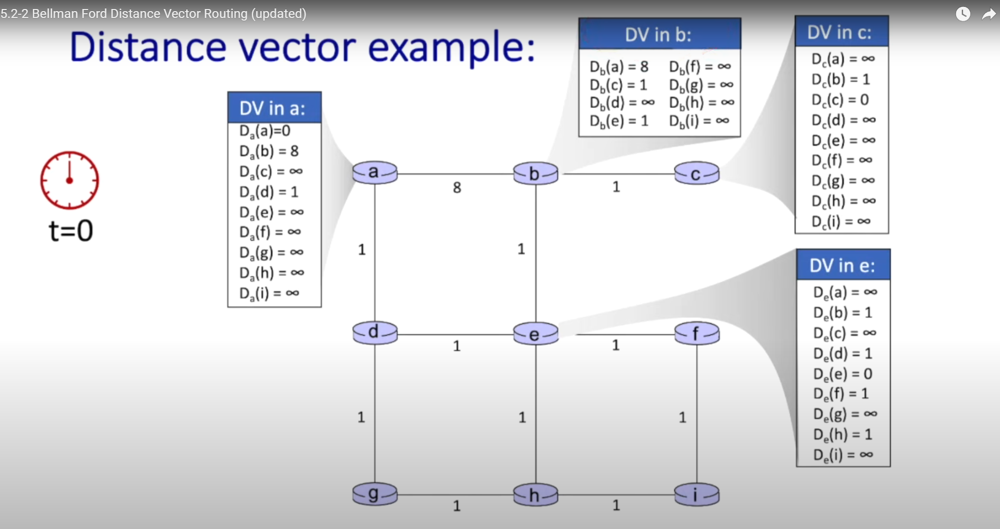
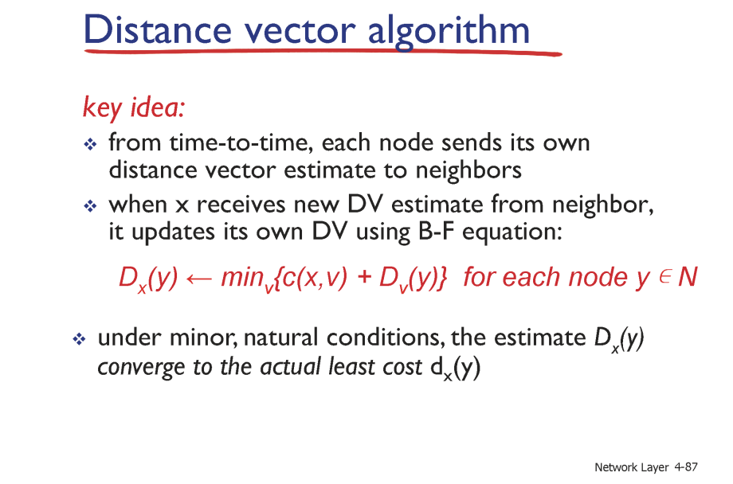
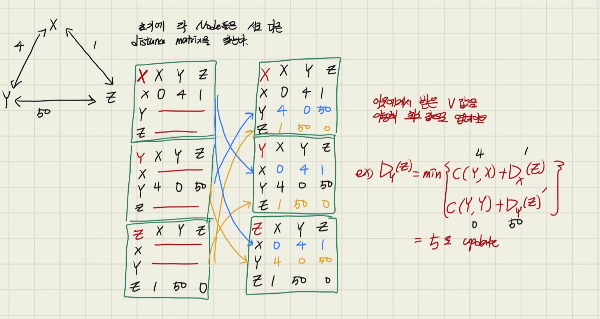
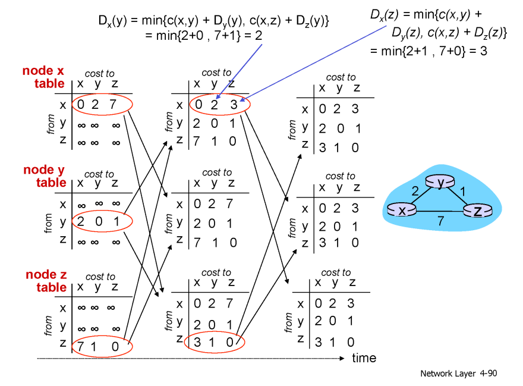
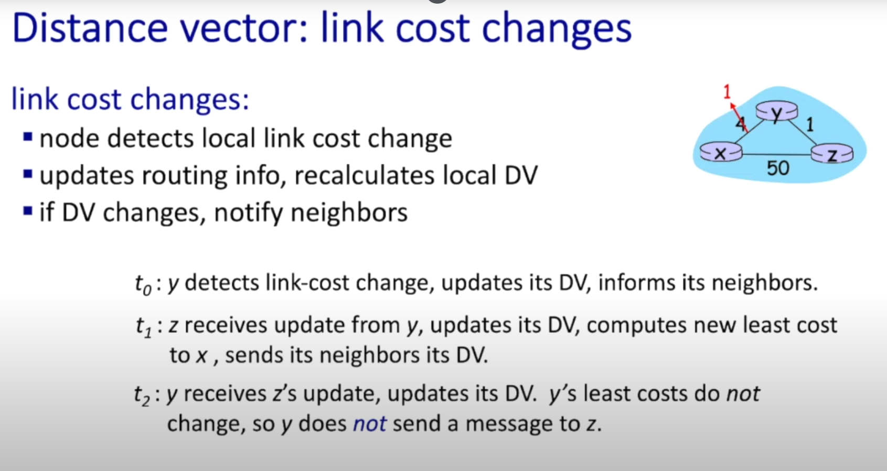
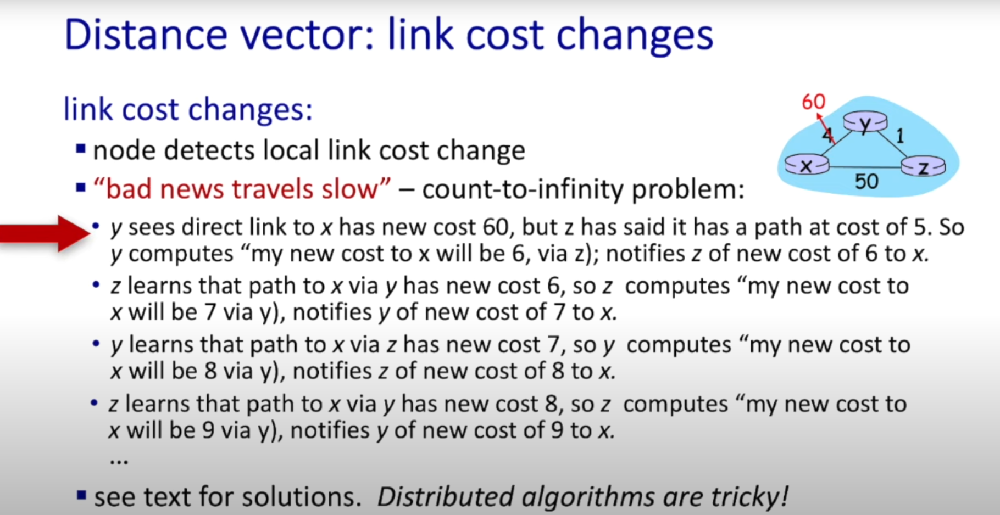

이번 게시글은 이석복 교수님의 강의와 [5.2-2 Bellman Ford Distance Vector Routing (updated)](https://www.youtube.com/watch?v=jJU2AVX6gpU) 의 내용을 많이 참고하였다.

해당 유튜브에서 사용하는 PPT 자료는 강의에 사용된 발표 자료와 동일하다.

# Recap : Dynamic Routing 이 왜 필요할까 ?

> 너무 오랜만에 하는 네트워크 공부이기 때문에 리캡을 한 번 하고 정리하고자 한다.

네트워크는 결국 서로 다른 지역에 존재하는 컴퓨터 간의 정보를 물리적으로 이어져있는 `Link` 들을 통해 전달하는 역할을 한다.

이 때 도착지까지 전달되는 과정을 `Routing` 이라고 하며 도착지까지 가기 위한 경로를 설정하는 방식은 정적으로 미리 경로를 정해두는 `Static Routing` 방식과 동적으로 경로를 정하는 `Dynamic Routing` 방식이 존재한다.

`Dynamic Routing` 방식은 `Static Routing` 에 비해 네트워크의 상황에 맞춰 유연하게 경로를 변경함으로서 항상 최적의 경로를 추천 가능하다는 점에서 복잡한 네트워크 환경에 적합하다.

`Dynamic Routing` 방식은 이전 포스트에서 설명한 `Link State` 방식과 현재 포스트에서 이야기 하고자 하는 `Distance Vector` 방식이 존재한다.

`Link State` 방식은 경로에 존재하는 노드가 이웃간의 `Distance` 를 알고 있다는 가정하에 연결 된 노드 간의 `Distance` 를 반복적으로 탐색해나가며 가장 최소가 되는 `Distance` 를 계산해 나간다.

> `Distance` 에선 물리적 거리 뿐 아니라 정보가 이동하는데까지 필요한 모든 자원을 의미한다.
>
> 가장 최소가 되는 `Distance` 를 계산해나갈 때는 다익스트라 알고리즘을 이용한다.

# Distance Vector Routing란

`Distance Vector` 방식에선 최적의 `Distance` 를 계산 할 때 인접한 노드와의 거리만으로 계산하는 것이 아닌 각 노드가 가지고 있는 `Distance Array` 를 이용한다.

아래 예시를 통해 먼저 살펴보자

해당 이미지에서 각 노드들은 모든 노드까지 걸리는 `Distance` 를 배열의 형태로 저장하고 있다.

즉, 벡터 형태로 `Distance` 를 계산하고 있다는 것이다.

이후 인접한 노드 간 `Distance Vector` 를 공유하여 최적의 `Distance` 를 계산해 나간다.

이제 그 과정을 스텝별로 천천히 알아가보자

# Distance Vector Routing의 공식

공식을 이해 하기 위해선 언어를 먼저 정리 할 필요가 있다.

- v : `Distance` 들을 담은 `Distance Vector` 로 출발 노드부터 N 개의 노드까지 최적의 `Distance` 값들이 담긴 벡터이다. 이 때 계산되지 않는 `Distance` 는 `infinity` 값을 갖는다.
- V : N개의 노드들의 `Distnace Vector` 인 `v` 들을 담고 있는 벡터들 `V` 이다. 만약 노드 개수가 `N` 개라면 `V` 벡터의 차원은 `N` 차원이다.
- Dx(Y) : 출발 노드 X 부터 도착 노드 Y 까지 걸리는 최적의 `Distance`
- C(X,V) : 출발 노드 X부터 벡터들 `V` 까지의 `Distance`
- DV(Y) : 벡터들 `V` 부터 도착 노드 Y 까지 걸리는 최적의 `Distance`

`Distance Vector Routing` 은 각 노드들이 갖는 `Vector` 들을 이용해 **비동기적이고 재귀적으로 `Distance Vector` 를 업데이트** 해간다.

이후 업데이트가 일어나지 않을 때 까지, 즉 각 노드 간 최적의 `Distance Vector` 를 계산하고 `Distance Vector` 들로 생성된 `Distance Matrix` 들을 모든 노드가 동일하게 공유한다.

이후 만약 특정 노드의 `Distance Vector` 가 변경 된다면 (연결 된 어떤 노드까지의 C 값이 변경) 해당 `Distance Vector` 값을 이용하는 노드들의 `Distance Vector` 를 변경하여 `Distance Matrix` 를 업데이트 한다.

그럼 위 공식들을 이용해 다시 공식을 살펴보자

`Dx(Y) = min [ C(X, V) + Dv(Y) ]` 가 의미하는 것은 출발 노드 `x` 부터 도착 노드 `Y` 까지의 `Distance` 는 출발 노드 `X` 로부터 `N * N` 으로 이뤄진 `V` 까지의 거리 + `V` 에서 도착 노드 `Y` 까지 걸리는 최소 값을 의미한다.

**수식적으로 하지 않고 직관적으로 이야기 하면 결국 `X` 부터 `Y` 까지의 거리는 `X` 와 연결된 `N` 개의 노드로부터 게산된 `Y` 까지의 최소 `Distance` 들 중 최소 값을 고른다는 것이다.**

이러한 부분은 `Link State` 방식과 동일한 개념을 가지며 계산 방식에서 `Link` 의 한 값들이 아닌 배열로 이뤄진 `Vector` 들을 이용한다는 차이점이 있다.

# Distnace Vector Routing 계산 과정

간단한 예시를 통해 계산을 해보자

다음처럼 초기에 노드 들은 본인과 인접한 노드들에게 본인이 가지고 있는 `Vector` 정보를 전파한다.

이후 이웃에게서 받은 `Vector` 정보들을 이용해 최적의 `Distance Vector` 로 업데이트 한다.

위 예시에선 `Dy(Z)` 를 업데이트 하는 모습을 봤는데 초기엔 `50` 이였지만 `X,Z` 로부터 받은 `Vector` 정보를 이용해 5로 업데이트 하였다.

이렇게 업데이트가 일어난 정보를 이용해 모두가 같은 `Distance Vector` 를 가질 때 까지 반복하다보면 완성된다.

밑에선 반복이 일어난 예시를 통해 살펴보자

# 값이 업데이트 되었을 때

그럼 이렇게 모두 동일한 `Distance Vector` 들을 가지고 있다가 특정 노드에서 업데이트가 일어나면 어떤 일이 벌어질까 ?

그것은 단순하다. 특정 링크의 `Distance` 가 변경되면 변경된 `Distance Vector` 를 이웃 노드들에게 전송하고 해당 변경 사항에 영향을 받는 노드들은 업데이트 , 그렇지 않다면 아무런 일도 일어나지 않는다.

위의 예시에선 `C(Y,X)` 를 이용하는 벡터인 `Dy(X) Dx(Y) , Dz(X) , Dx(Z)` 의 값이 업데이트 된다.

이는 매우 단순하게 업데이트 된 경우를 의미하고 이 경우를 생각해보자

이 경우는 `infinity problem` 이라 이야기 하는 상황이다.

C(Y,X) 가 변경 되었을 때 변경된 노드 Y 는 `Dy(X)` 를 계산 해야 한다.

`Dy(X)` 를 계산하기 위해선 `C(Y,X) + Dy(Y)` 와 `C(Y,Z) + Dz(X)` 를 계산해야 하는데 `Dz(X)` 는 `C(Z,Y) + Dy(X)` 로 이뤄져있다.

그렇기 때문에 업데이트엔 변경에 일어나기 전의 `Distance` 를 사용하게 되고 (현재 존재하지 않는) 이러한 문제는 Y 업데이트 , Z 업데이트 , Y 업데이트 .. 이런식의 일이 일어난다.

즉 **계산에 사용되는 `Dz(X)` 는 계산에 구하고자 하는 `Dy(X)` 를 이용하고 있어 위와 같은 단계가 일어난다.**

## Infinity Problem 을 방지하는 방법

이런 문제를 방지하기 위한 다양한 기능이 존재하는데 그 중 `Split Horizon , Split Horizon with Poison Reverse` 방법만 이야기 하려 한다.

`Split Horizon` 은 노드 X가 노드 Y 를 통해 노드 Z로 가는 최단 경로를 구했다면 노드 X는 노드 Y에게 그 정보를 전달하지 않는 방식이다.

즉 노드 Y에게 X는 `Dx(Z)` 를 전달하지 않는 방법이다. `Dx(Z)` 에는 `Dy(Z)` 의 값이 이미 존재하기 때문이다.

위 에서 발생한 `Infinity Problem` 상황에서는 `Z` 가 `Y` 에게 `Dz(X)` 를 전달하지 않는 방법이 이에 해당 할 것이다.

`Split Horizon with Poison Reverse` 방법은 동일한 개념인데 전달하지 않는 것이 아니라 `infinity` 값을 전달하는 방식이다.

그렇다면 최소 값을 구할 때 자연스럽게 해당 값은 사용이 되지 않기 때문이다.

# 이런 Dynamic Routing 방식은 어디에서 사용될까 ?

이전에 말한 `Link state` 부터 `Distance Vector` 방식은 크기가 큰 네트워크보다 크기가 비교적 작은 네트워크에서 주로 사용된다.

`Link State , Distance Vector` 방식 모두 모든 노드들과의 정보 교환이 일어나야 하기 때문에 시간 복잡도가 `O(N^2)` 에 해당하는데 거대한 네트워크에서 사용 할 수 없기 때문이다.

다만 작은 규모의 네트워크에선 빠르게 수렴하고 설정과 유지 관리고 용이하다는 장점이 존재한다.
