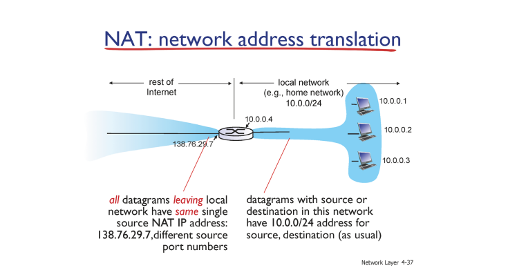
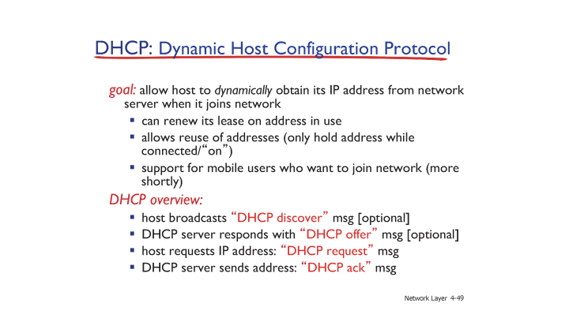
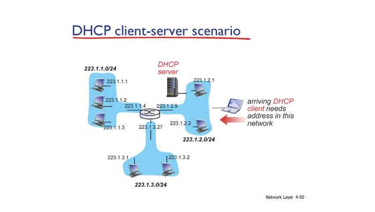
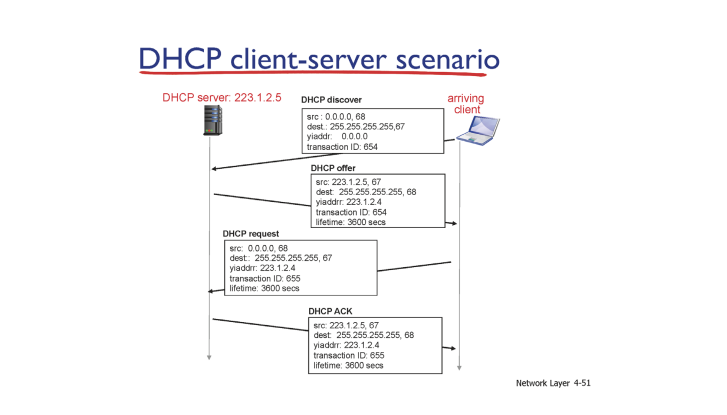
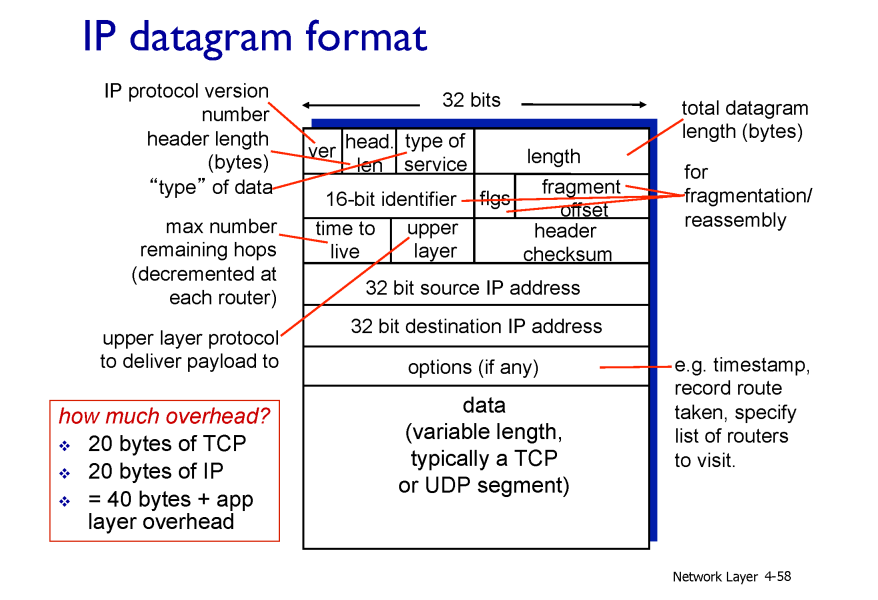
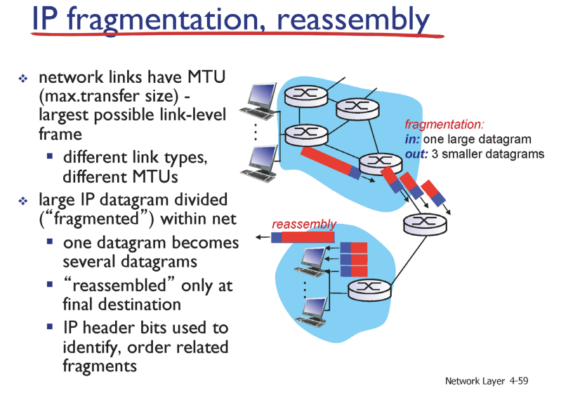

# 이전 강의 Recap

이전 강의에서 `NAT (Network Address Translation)` 에 대해 공부했었다.

`NAT` 는 유한한 개수의 `IP` 주소들을 마치 무한하듯 활용하기 위한 방법으로

동일한 지역 `IP` 주소를 갖는 , 즉 같은 서브넷을 갖는 클라이언트 간에서만 `IP` 주소를 유한하듯 사용 하기로 하고

서브넷 외부에서는 클라이언트의 `IP` 주소가 중복되어도 상관 없게 하는 방식이다.

> ### 서브넷 ?
>
> 서브넷이란 같은 지역 IP (`prefix`) 를 갖는 집합을 의미한다.
>
>  > `IP` 주소는 지역적 정보와 호스트 정보를 담은 이진수의 형태이다.
>
> 이 때 지역정 정보만큼을 담고 있는 공간을 서브넷 마스크라고 한다. 위 예시에서는 빨간 부분만큼이 지역정보이기 때문에 255.255.255.0 이 서브넷 마스크가 된다.
> (지역적 정보를 가진 `IP` 가 가질 수 있는 공간)

이 때 , 각기 다른 지역 아이피 주소를 가진 호스트간의 `IP` 주소는 같을 수 있다. 예를 들어 한국 도봉동 서브넷에 있는 호스트의 `IP` 주소가 `10.0.0.1` 이라면

도봉동에는 해당 주소가 하나로 독립적이지만 , 다른 서브넷인 미국이나 멕시코 등등에 해당 `IP` 주소를 가진 호스트는 많아도 괜찮다.

이를 통해 유한한 `IP` 주소를 마치 무한하게 재사용 하여 사용 할 수 있다.

고유하지 않은 `IP` 주소를 마치 고유하듯 사용 하기 위해 서브넷과 외부를 잇는 **게이트웨이 라우터가 `IP` 주소를 변환하여 외부와 통신** 한다.

게이트웨이 라우터의 주소는 고유하기 때문에 외부와의 통신은 고유한 두 엣지간의 통신으로 인식되고 게이트웨이 라우터는 외부의 응답값을 내부에 존재하는 테이블을 통해 서브넷 내부의 클라이언트에게 전송한다.

그러니 , 도봉동의 `10.0.0.1` 인 호스트가 구글에서 이미지를 검색하면 구글 측에는 `10.0.0.1` 이란 주소가 아닌 게이트웨이 라우터의 `IP` 주소로 요청을 보낸다.

구글은 게이트웨이 라우터와 통신하여 라우터에게 정보를 보내고, 게이트웨이 라우터는 요청을 보냈던 `10.0.0.1` 호스트에게 응답값을 보낸다.

게이트웨이 라우터는 포트 별로 각 개별적인 호스트들이 연결되어 있다.

> 기억하자 , `IP` 주소란 결국 각 클라이언트를 연결하고 있는 인터페이스의 주소이다.

이 때 클라이언트가 `destination ip` 주소에 요청을 보내면 게이트웨이 라우터가 해당 요청을 받아 **주소를 변환하고** 요청을 보낸다.

게이트웨이 라우터는 **클라이언트의 포트 번호 (게이트웨이 라우터가 클라이언트를 식별 하기 위한 주소), , `destination IP`** 주소를 테이블에 기록해뒀다가 응답이 오면 테이블을 보고 클라이언트에게 전송한다.

## NAT 는 여전히 문제가 있다.

물론 `NAT` 는 유한한 `IP` 주소를 무한하듯 사용 할 수 있게 도와준다는 방법이 있다.

`NAT` 는 게이트웨이 라우터가 클라이언트의 `IP` 주소를 변경시켜버린다는 단점이 존재한다.

즉 네트워크 구축의 기본 원리를 라우터가 지키지 못하는 것이다.

`NAT` 는 `IPv4`의 유한한 `IP` 주소를 활용하기 위한 임시 방편일 뿐이다.

그렇다고 해서 엄청나게 많은 주소를 갖는 `IPv6` 으로 넘어가기에도 `IPv6` 도 나온지 20년이나 된 주소 체계이고 미래에 어떤 요구가 있을지 몰라 넘어가지 못하고 있는 실정이라고 한다.

# Dynamic Host Configuration Protocol (DHCP)

강의에서 사용한 예시를 그대로 사용하도록 하겠다.

학교 와이파이를 쓰고 있는 어떤 학생의 `IP` 주소 관련 정보는 다음과 같다.

- `IP` : 192.168.1.47
- `Subnet mask` : 255.255.255.0

학생의 `IP` 주소는 `192.168.1` 이란 `prefix` 를 갖고 호스트 `ID` 는 `47` 임을 알 수 있다.

- `router` : 192.168.1.1
- `DNS` : 192.168.1.1

클라이언트가 외부에게 요청을 보내기 위해 알야아 하는 주소들이다.

외부 도메인에 접속 할 때에도 게이트웨이 라우터인 `192.168.1.1` 에게 해당 도메인에 대한 `IP` 주소를 물어보고 해당 게이트웨이 라우터를 통해 외부로 요청을 보낸다.

[DNS 조회 (DNS Lookup)](https://velog.io/@yonghyeun/DNS-%EC%A1%B0%ED%9A%8C-DNS-Lookup)

그런데 생각해보자, 학생의 디바이스의 인터페이스는 단 하나이다. 그런데 학생이 학교의 와이파이를 이용 할 때 , 집에서 이용 할 때 , 카페에서 이용 할 때 등 어디 네트워클르 이용하냐에 따라 `IP` 주소는 동적으로 변한다.

그럼 이 동적으로 변환하는 과정은 어떻게 일어날까 ? 또 필요한 정보들은 어떻게 `configure` 할까 ?

그게 바로 `DHCP` 이다.

서브넷의 네트워크의 최대 사용자가 만명일 때 , 각 클라이언트에게 제공 할 수 있는 `IP` 주소들을 고정적으로 정해둔다면 만개의 `IP` 주소들을 가지고 있어야 한다.

예를 들어 학교에서 학생 A 의 주소는 이것 , B의 주소는 이것 ... 등등

하지만 `DHCP` 는 `IP` 주소를 고정적으로 정해두지 않고 동적으로 지정하기 때문에 평균 사용자 만큼의 주소만큼만 준비하고 있다가 이용자들에게 동적으로 할당해주면 된다.

> 시나리오를 이해하기 전 `255.255.255.255.port number` 에 대해 알 필요가 있다.
>
> `255.255.255.255` (`1.1.1.1` 로 표현된다. ) 와 같은 주소는 `broad cast` 라고 하여 해당 서브넷에 있는 모두에게 보내는 메시지이다.

1. 클라이언트는 본인의 주소를 할당 받기 위해 해당 서브넷의 `68` 번 포트번호에 연결하고 `broad cast.67` 에게 본인이 `68` 번 포트에 연결 됐음을 알린다.

> 이 때 서버와 메시지를 주고 받기 위해 메시지들을 식별 할 수 있는 `transition ID` 를 헤더에 첨부한다.

2. 이 때 `DHCP` 만이 모든 포트를 열고 있기 때문에 `67` 포트 번호로 전송된 클라이언트의 요청을 받아 `broad cast.68` 에게 `DHCP offer`를 보낸다.

`broad cast.68` 로 보내는 이유는 아직 클라이언트에게 주소가 할당되지 않았기 때문에 포트 번호를 이용해 응답을 보내는 것이며 `68` 번 포트는 요청을 보냈던 클라이언트 컴포만 연결 되어 있다.

이 때 `DHCP server` 는 `yiaddr (your ip address)` 영역에 클라이언트가 할당 받을 `IP` 주소를 적어 보낸다.

3. 클라이언트는 받은 `offer` 에 대한 `request` 를 서버에게 보내고 클라이언트 `request` 에 대한 서버의 `ACK` 가 전송되면 그 후부터 클라이언트는 `yiaddr`로 받은 `IP` 주소를 받을 수 있게 된다.

## 실생활 속의 NAT 를 예시로 들어 이해해보자

우리는 `IPv4` 의 한게점을 해결하기 위해 `NAT` 를 적용한 네트워크 세상 속에서 살고있다.

실생활 속 예시를 들어 생각해보자

우리 집 내부에 있는 무선 공유기를 우리 가족 A,B,C,D 가 모두 사용하고 있다고 생각해보자

이 때 우리 가족은 무선 공유기에 의해 `DHCP` 로 서브넷 내부에서 고유한 `IP` 주소를 할당 받는다.

우리 가족은 공유하는 무선 공유기의 `prefix` 를 공유하기 때문에 하나의 서브넷이라 볼 수 있다.

이 때 우리 가족이 외부와 통신 할 땐 서브넷 내부의 고유 `IP` 가 아닌 게이트웨이 라우터의 `IP` 주소로 외부와 통신한다.

`NAT` 는 `edge` 에 가까운 게이트웨이 라우터에게만 국한 된 것이 아니다.

우리 집의 무선 공유기인 게이트웨이 라우터는 우리 동네의 게이트웨이 라우터 내부의 서브넷이 될 수도 있고 동네의 게이트웨이 라우터는 구의 게이트웨이 라우터의 서브넷의 일부일 수 있고 ... 등등 계층적 `NAT` 를 가질 수 있다.

그래서 생각해보면 전자 투표 시 동일한 `IP` 주소에서 같은 표가 나왔다라는 뉴스를 보면

아 ~ `NAT` 로 인해 게이트웨이 라우터의 `IP` 주소로 표가 집결되었구나 하고 생각 할 수 있다.

# IP datagram format

네트워크는 다양한 물리적 계층들로 이뤄져있으며 , 각 계층 별 전송 해야 할 `data` 영역과 해당 영역에서 전송 할 `data` 들의 정보를 담은 `header` 영역이 존재한다.

`IP` 계층에서 전송하는 `packet` 은 상위 계층에서 전송하고자 하는 데이터들을 담은 `data` 영역과 `IP` 계층에서 사용 할 `header` 영역들이 존재한다.

`IP header` 에는 사용하는 `IP version , packet length, time to live , upper layer protocol , checksum , source , destination` 등에 대한 정보들이 존재한다.

이 때 `IP header` 영역에서 두 번쨰 행에 해당되는 `16-bit identifier , flags , fagement offset` 에 대해 이야기 해보자

`IP` 에서 전송하는 `pacekt` 은 하위 계층인 물리적 계층 (`Link`) 를 통해 전송된다. 이 때 각 `Link` 는 전송 할 수 있는 데이터들의 한계 용량이 존재한다.

이런 한계 용량을 `Max Transfer Size , (MTU)` 라고 한다.

`MTU` 는 사용하는 `Link` 에 따라 용량이 다른데 이는 해당 계층을 공부 할 때 마저 알아보도록 하고 `MTU` 에 따라 `Link` 계층에선 데이터들을 분할하는 `fragmentation` 을 적용한다.

예를 들어 해당 `Link` 의 `MTU` 가 `1500byte` 라면 `4000 byte` 크기의 `packet` 을 `1500byte` 의 독립적 3가지 `packet` 으로 분할 한 후 전송한다.

이후 해당 `packet` 을 받는 쪽에선 분할되어 받은 `packet` 들을 하나의 `packet` 으로 조립하는 `reassembly` 과정을 거친다.

`16-bit identifier , flags , fragment offset` 은 `fragment , reassembly` 과정을 위해 필요하다.

예를 들어 `MTU` 가 `1500byte` 이고 `packet` 의 크기가 `4000byte` 인 경우를 생각해보자

`packet` 의 크기가 `4000byte` 라는 것은 `IP header` 영역이 `20byte` , `IP content` 영역이 `3980byte` 임을 의미한다.

> 각 `header` 의 통상적 크기는 `20byte` 이다.
>
> `IP content` 에는 상위 계층의 `header (20byte), content` 들도 존재한다.
>
> 하지만 `IP content` 에선 상위 계층의 `header , content` 들도 하나의 `header` 로 취급한다. 모든 계층이 그렇다.

`MTU` 에 맞춰 `packet` 을 전송하기 위해선 `4000byte` 크기의 `packet` 을 `1500byte , 1500byte , 1000byte` 크기의 `packet` 으로 `fragmentation` 을 해야한다.

이 과정에서 `packet` 의 크기인 `length (4000byte)` 를 `MTU` 로 나눠 3개의 `packet` 을 생성한다.

분할 된 `packet` 은 모두 같은 `ID` 를 갖는데 , 같은 `ID` 를 가져야 `reassembly` 단계에서 하나의 `packet` 으로 인식 할 수 있다.

각 분할 된 `packet` 들은 `fragflag , offset` 을 가지는데

`fragflag` 는 해당 `packet` 이후에 `fragmentation` 된 `packet` 이 존재하는지를 이야기 하는 `flag` 이다.

`offset` 은 `fragmentation` 이 된 `pacekt` 이 원본 `packet` 으로부터 얼만큼 뒤에 존재하는지를 표현하는 `offset` 이다.

그럼 생각해보자

`1500byte` 크기의 `packet` 은 `20byte` 의 `header` , `1480byte` 의 `content` 를 가진다.

분할 된 `packet` 들은 모두 `20byte` 의 공통된 크기의 `header` 를 가져야 한다. (그래야 라우팅 과정에서 `source` 를 보거나 상위 계층의 `protocol` 등을 알 수 있다.)

그럼 분할 되는 `packet` 의 `content` 들은 모두 `1480byte` 크기로 나뉜다.

각 분할된 `packet` 의 `content` 들의 `offset` 은 첫 번재 `fragmentation` 된 `packet` 으로부터 `1480byte,  1480 * 2 byte` 만큼으 `offset` 을 갖게 되는데 `header` 에 해당 `offset` 을 입력 할 땐 `8` 로 나눈 후의 값을 표기한다.

> 최대한 `header` 에 입력되는 비트의 크기를 줄이기 위함이다.

이로 인해 두 번쨰 `packet` 의 `offset` 은 `1480/8 = 185` , 세 번째 `packet` 의 `offset` 은 `1480 * 2 / 8 = 370` 의 `offset` 값을 갖는다.
