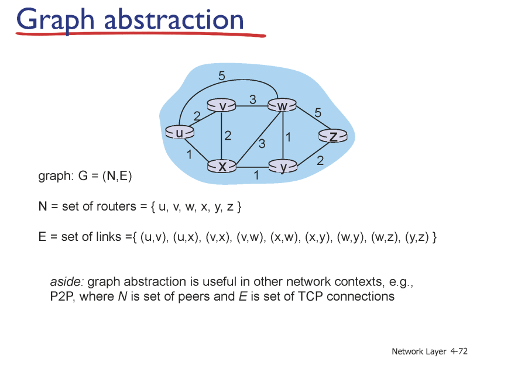
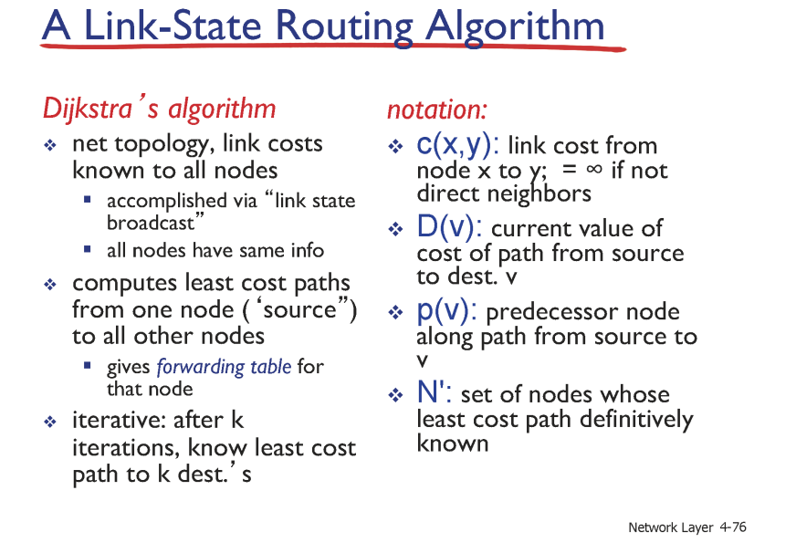

# 정적 라우팅 알고리즘

이전 라우팅 프로토콜에 대해서 인터넷 사이에 존재하는 네트워크에서 `source` 부터 `destination` 까지 이동하기 위해선 라우터들을 거쳐야 하며

이동 할 때에는 라우터에 적힌 `forwarding table` 을 보고 도착지까지 이동한다고 하였다.

`forwarding table` 에 적힌 `destination address` 와 `IP packet` 에 적힌 `destination` 의 내용 중 가장 많이 일치하는 곳으로 이동 시킨다.

이 방법은 이미 도착지에 대해 가야 할 경로가 정해져있는 정적 라우팅 알고리즘에 속한다.

## 정적 라우팅 알고리즘의 장점

- 구현하기가 간단하다.

가장 직관적인 장점으로 구현하기가 간단하다는 장점이 있다.

`IP` 주소들은 모두 지역적인 특성을 가지고 있기 때문에 지역적인 특성 별로 포워딩 테이블을 생성해두고 라우팅 시켜버리면 된다.

예를 들어 서울특별시 YY구 ZZ동 ... 이란 주소를 가진 택배를 보낼 때 1차적으론 서울특별시로 보내버리고 그 다음엔 YY구 그 다음엔 ZZ동으로 보내버리듯 보내버리면 된다.

- 리소스 효율적이다.

나중에 동적 라우팅 알고리즘 때 이야기 하겠지만 이미 정해져있는 주소에 대해서만 분류하면 되기 때문에 `forwarding table` 을 저장 할 리소스 외에는 사용하는 것이 없다.

그 뿐 아니라 별다른 업데이트 과정이 없기 때문에 대역폭을 소비하지도 않는다. (이후 설명 할 알고리즘들에선 업데이트 과정을 거친다.)

- 예측하기가 쉽다.

정적으로 도착지까지의 주소가 정해져있으니 예측하기가 쉽다.

이를 통해 예상치 못한 라우팅 루프를 방지 할 수 있으며 (도착지까지 도착하지 못하고 빙글빙글 도는 행위)

명시적으로 라우팅 경로를 지정 할 수 있기 때문에 제어 할 수 있다.

## 정적 라우팅 알고리즘의 단점

- 확장 및 관리 하기가 어렵다.

정적 라우팅은 이미 포워딩 테이블이 정해져있기 때문에 새로운 포워드 주소가 생성되거나, 어떤 수정 사항이 있을 경우 모든 라우터들의 포워딩 테이블을 수정해야 하는 문제점이 존재한다.

이는 확장성을 낮추며 업데이트 시간도 길기 때문에 가동 중지 시간이 늘어날 수 있다.

- **최상의 속도를 보장하지 않는다**.

가장 큰 단점으로 이미 경로가 정적으로 정해져있기 때문에 해당 경로의 지연 시간이 긴 경우엔 매우 긴 응답 시간을 가질 수 있다.

또한 정적인 경로들에서 특정 경로에 라우팅들이 몰리는 경우 속도가 계속하여 느려진다는 단점이 존재한다.

즉, **정적으로 경로를 정해둠으로서 발생하는 문제로 최상의 경로를 탐색하지 않는 것이 단점**이다.

# 동적 라우팅 알고리즘

그래서 ! 라우팅 경로를 미리 정적으로 정해두는 것이 아닌 동적으로 정해두는 동적 라우팅 알고리즘이 등장했다.

해당 방법은 일정 주기를 가지고 경로들을 업데이트 하거나 하는 방식으로 도착지까지 가기 위한 최상의 속도를 보장하는 경로를 제공한다.

이번 게시글에선 동적 라우팅 알고리즘의 하나인 다익스트라 알고리즘을 활용한 `link state` 알고리즘을 이야기 하고자 한다.

## link state를 공부하기 전 알아야 할 사전 지식들

### Graph : Graph의 정의

알고리즘을 이야기 하기 전, 네트워크는 그래프로 표현 가능하다.

그래프들은 노드와 엣지로 이뤄진 자료구조로 여러 라우터들이 노드가 되고. 노드들이 연결된 엣지를 라우터들이 물리적으로 연결 된 `link` 를 의미한다.

### Graph : cost의 정의

그래프에서 `cost` 란 노드에서 노드까지 이동하기 위해 걸리는 비용을 의미한다.

네트워크에서의 비용은 결국 지연 시간일 것이다.

네트워크의 지연 시간엔 여러 요소가 영향을 미치지만 결국 **최상의 속도를 제공하기 위해선 가장 적은 지연 시간을 갖는 엣지들을 통과하는 경로를 생성**해야 한다.

# link state의 정의

`link state` 알고리즘은 `global information` 을 이용하는 알고리즘이다.

즉, 위의 이미지처럼 모든 노드들이 **본인과 인접한 노드 간의 지연 시간을 알고 있고** 그 뿐 아니라 **본인과 인접한 노드 간의 지연 시간을 다른 노드 들도 알고 있을 때** 를 가정한다.

## 인접한 노드 간의 지연 시간은 어떻게 알까 ?

네트워크 개발자가 사용하는 방식에 따라 다르겠지만 [OSPF (Open Shortest Path First)](https://www.youtube.com/watch?v=_ThYOX1wX_4) 를 이용하는 경우엔 `TTL` 이 1인 `hello packet` 을 인접한 노드에게 보내 지연 시간을 응답 받는다.

> `TTL` 은 `time to live` 로 `TTL` 이 1인 `packet` 은 라우터 하나만 거치고 나면 사라진다.
>
> `hello packet` 을 보내는 과정에서 `hello packet` 을 받은 노드는 보낸 노드에게 여러 메타 정보가 담긴 응답값을 전송한다.

## 각 노드 들은 어떻게 다른 노드들의 이웃 지연 시간을 알 수 있을까?

이 또한 위에서 링크한 유튜브 영상을 참조하면 좋은데 , 결국 네트워크란 해당 네트워크를 관리하는 프로세스에서 각 노드들의 이웃 지연 시간 (바로 인접한 노드 간의 지연 시간) 들을 저장한 `table` 을 네트워크 데이터베이스에 저장한다.

각 노드들은 해당 데이터베이스에 저장된 `table` 을 확인 하는데 해당 테이블을 `topology table` 이라고 한다.

이렇게 `topology table` 을 이용해 네트워크 간의 경로들을 표현하면 위에서 제시했던 사진과 동일한 방식일 것이다.

그럼 이렇게 **모든 노드들이 다른 노드들의 이웃 간 지연시간을 알고 있을 때 특정 경로까지 가기 위한 최소 경로를 결정하는 알고리즘이 바로 `link state` 이다.**

# 다익스트라 알고리즘

그럼, `topology table` 을 가지고 어떻게 최소 경로를 찾을 수 있을까 ?

그건 바로 다익스트라 알고리즘을 사용하는 방법이다.

> 다익스트라 알고리즘에 대한 자세한 설명은 나중에 알고리즘 관련 포스트를 게시하면서 작성하도록 하겠다.

## 다익스트라 알고리즘을 이해하기 위한 notation

`link state` 를 이야기 하기 전 먼저 `notation` 을 살펴 본 후 다익스트라 알고리즘의 슈도코드를 살펴보도록 하자

- `c(x,y)` 는 노드 x부터 노드 y까지 가는데 필요한 비용들을 의미한다. 이 때 두 노드가 연결되어 있지 않은 경우엔 지연 시간을 `infinity` 로 정의한다.

이 때의 `cost` 들은 레이턴시나, 물리적 거리 , `bandwidth` 와 같은 다양한 정량적 비용을 의미한다.

- `D(v)` 는 해당 목적지 `v` 까지 가는데 필요한 최소 비용을 의미한다. 즉 가장 최소한이 되는 `c(시작지점,V)` 와 동일하다.

- `p(v)` 는 `D(v)` 를 만족하는 `v` 까지 가는 경로에서 `v` 를 가기 전 거치는 이전 장소 (`predecessor node`) 를 의미한다.

`p(v)` 가 필요한 이유는 경로를 생성하기 위해서이다.

- `N'` 은 전체 노드의 집합을 `N` 이라 하였을 때 `D(v)` 가 구해진 노드들, 즉 최소 경로가 결정 된 노드들의 집합을 의미한다.

## 다익스트라 알고리즘의 슈도 코드

목적지 `u` 부터 `v` 까지 가기 위한 최소 경로를 구하는 슈도 코드를 살펴보자

사실 해당 코드는 슈도 코드보다 각 `iteration` 별 테이블을 살펴보는 것이 훨씬 더 히해 하기가 쉽다.

각 `iteration` 마다 `N'` 이 아닌 모든 노드 집합 `N` 들에 대해서 `D(node)` 를 구하고 구해진 `D(node)` 중 최소값이 되는 노드를 `N'` 에 추가한다.

이후 다음 `iteration` 에서 `D(node)` 를 구할 때 `N'` 에 포함된 노드를 이용하여 `D(node)` 를 다시 구하고 최소값이 되는 노드를 `N'` 에 추가하는 과정을 반복한다.

> 각 `iteration` 에서 이전 `iteration` 에서 `N'` 에 추가된 새로운 노드부터 탐색을 시작하여 `D(node)` 들을 구한 후 이전 `iteration` 에서 구한 `D(node)` 들의 값과 비교하여 최소값을 찾는 방법도 존재한다.
>
> 해당 방식은 [다익스트라 알고리즘 - (1) 동작 원리 [알고리즘 특강]](https://www.youtube.com/watch?v=JfwzA467D04) 영상을 살펴보도록 하자.

이렇게 해당 노드까지 가기 위한 `D(node)` 를 모두 구해뒀으면 `p(node)` 들을 역으로 탐색하여 경로를 구성 해줄 수 있다.

위 사진의 예시에서 `u` 노드에서 `z` 까지 가기 위한 경로는 `P(z)` 를 따라 `u -> w -> v -> y -> z` 임을 알 수 있다.

# link state 는 업데이트 주기를 갖는다.

이렇게 최소 비용을 구했다 하더라도 해당 경로는 항상 최적의 경로임을 보장하지는 않는다.

결국 동적으로 경로를 구하더라도 해당 경로가 업데이트 되지 않는다면 정적 라우팅 알고리즘과 별반 다를 것이 없다.

이에 네트워크 개발자는 `link state` 알고리즘에 활용하는 `topology table` 을 일정 주기를 가지고 지속적으로 업데이트 한다.

# link state의 장단점

## 장점

- 네트워크의 현재 상황을 가장 잘 반영한다.

`link state` 알고리즘은 각 라우터들이 공유하는 데이터베이스 내부에 존재하는 완성된 `topology table` 을 이용해 최소 경로를 생성하기 때문에 네트워크의 현재 상황을 가장 잘 반영한다는 장점이 존재한다.

즉 , `topology table` 의 업데이트 주기가 잦으면 잦을 수록 가장 실제 네트워크의 지연 시간들에 대한 최적의 경로를 제공 할 수 있다 .

- 대역폭을 절감 할 수 있다.

아직 다루지 못한 `distance-vector protocol` 은 지속적으로 각 네트워크에게 `routing table` 들을 보내지만 , `link state` 는 데이터베이스에 존재하는 `topology table` 만 업데이트 하면 되기 때문에 대역폭을 이용하지 않고도 알고리즘을 수행 할 수 있다.

## 단점

- 라우터들이 `topology table` 을 저장하기 위한 메모리 용량이 필요하다.

각 라우터들은 `topology table` 을 통해 최적의 경로를 계산하기 때문에 라우터들이 `topology table` 을 저장하기 위한 메모리를 필요로 한다.

- 초기 셋업시 오버헤드가 발생한다.

`topology table` 을 구성하기 위해선 각 노드들이 다른 노드들의 존재를 알아야 한다.

그렇기에, 노드들은 `broad casting` 으로 모든 노드들에게 본인의 존재를 알리기 위한 `packet` 을 초기에 발송하는데 이 과정은 노드들이 많을 수록 대역폭 사용량이 늘어나게 된다.

- 잘못된 구성에 대한 취약성

`topology table` 을 구성 할 때 인접 노드 간 지연 시간이나 네트워크 상황이 실제와 다르게 잘못 수신된 경우 잘못된 `topology table` 을 생성하여 예기치 못한 오류를 발생 시킬 수 있다.

# 정리

정리해보자

결국 `link state` 는 동적 라우팅 알고리즘의 한 종류이다.

각 라우터들을 관리하는 서버가 존재하며, 해당 서버 내부 데이터베이스에는 모든 노드들에게서 인접한 노드 간의 지연 시간들이 저장 되어 있다.

이런 저장되어있는 자료를 `topology table` 이라고 하며 라우터들은 메모리에서 `topology table` 을 저장해둔다.

이후 라우터들은 `topology table` 을 통해 모든 노드로 가기 위한 최소 경로를 다익스트라 알고리즘을 이용해 계산하여 들어오는 `packet` 을 포워딩한다.
