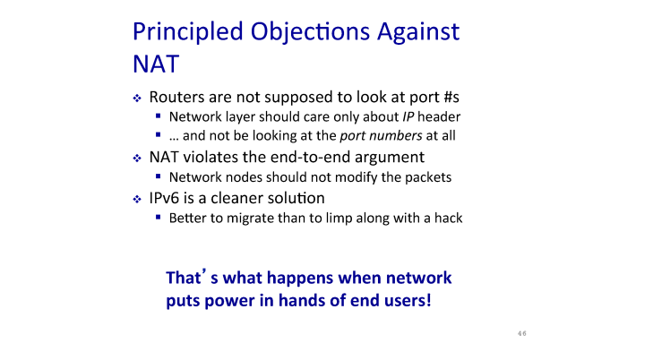

# 이전 강의 Recap

이전 강의에서 `NAT (Network Address Translation)` 에 대해 공부했었다.

`NAT` 는 유한한 개수의 `IP` 주소들을 마치 무한하듯 활용하기 위한 방법으로

동일한 지역 `IP` 주소를 갖는 , 즉 같은 서브넷을 갖는 클라이언트 간에서만 `IP` 주소를 유한하듯 사용 하기로 하고

서브넷 외부에서는 클라이언트의 `IP` 주소가 중복되어도 상관 없게 하는 방식이다.

> ### 서브넷 ?
>
> 서브넷이란 같은 지역 IP (`prefix`) 를 갖는 집합을 의미한다.
>
>  > `IP` 주소는 지역적 정보와 호스트 정보를 담은 이진수의 형태이다.
>
> 이 때 지역정 정보만큼을 담고 있는 공간을 서브넷 마스크라고 한다. 위 예시에서는 빨간 부분만큼이 지역정보이기 때문에 255.255.255.0 이 서브넷 마스크가 된다.
> (지역적 정보를 가진 `IP` 가 가질 수 있는 공간)

이 때 , 각기 다른 지역 아이피 주소를 가진 호스트간의 `IP` 주소는 같을 수 있다. 예를 들어 한국 도봉동 서브넷에 있는 호스트의 `IP` 주소가 `10.0.0.1` 이라면

도봉동에는 해당 주소가 하나로 독립적이지만 , 다른 서브넷인 미국이나 멕시코 등등에 해당 `IP` 주소를 가진 호스트는 많아도 괜찮다.

이를 통해 유한한 `IP` 주소를 마치 무한하게 재사용 하여 사용 할 수 있다.

고유하지 않은 `IP` 주소를 마치 고유하듯 사용 하기 위해 서브넷과 외부를 잇는 **게이트웨이 라우터가 `IP` 주소를 변환하여 외부와 통신** 한다.

게이트웨이 라우터의 주소는 고유하기 때문에 외부와의 통신은 고유한 두 엣지간의 통신으로 인식되고 게이트웨이 라우터는 외부의 응답값을 내부에 존재하는 테이블을 통해 서브넷 내부의 클라이언트에게 전송한다.

그러니 , 도봉동의 `10.0.0.1` 인 호스트가 구글에서 이미지를 검색하면 구글 측에는 `10.0.0.1` 이란 주소가 아닌 게이트웨이 라우터의 `IP` 주소로 요청을 보낸다.

구글은 게이트웨이 라우터와 통신하여 라우터에게 정보를 보내고, 게이트웨이 라우터는 요청을 보냈던 `10.0.0.1` 호스트에게 응답값을 보낸다.

게이트웨이 라우터는 포트 별로 각 개별적인 호스트들이 연결되어 있다.

> 기억하자 , `IP` 주소란 결국 각 클라이언트를 연결하고 있는 인터페이스의 주소이다.

이 때 클라이언트가 `destination ip` 주소에 요청을 보내면 게이트웨이 라우터가 해당 요청을 받아 **주소를 변환하고** 요청을 보낸다.

게이트웨이 라우터는 **클라이언트의 포트 번호 (게이트웨이 라우터가 클라이언트를 식별 하기 위한 주소), , `destination IP`** 주소를 테이블에 기록해뒀다가 응답이 오면 테이블을 보고 클라이언트에게 전송한다.

## NAT 는 여전히 문제가 있다.

물론 `NAT` 는 유한한 `IP` 주소를 무한하듯 사용 할 수 있게 도와준다는 방법이 있다.

`NAT` 는 게이트웨이 라우터가 클라이언트의 `IP` 주소를 변경시켜버린다는 단점이 존재한다.

즉 네트워크 구축의 기본 원리를 라우터가 지키지 못하는 것이다.

`NAT` 는 `IPv4`의 유한한 `IP` 주소를 활용하기 위한 임시 방편일 뿐이다.

그렇다고 해서 엄청나게 많은 주소를 갖는 `IPv6` 으로 넘어가기에도 `IPv6` 도 나온지 20년이나 된 주소 체계이고 미래에 어떤 요구가 있을지 몰라 넘어가지 못하고 있는 실정이라고 한다.

# Dynamic Host Configuration Protocol (DHCP)

강의에서 사용한 예시를 그대로 사용하도록 하겠다.

학교 와이파이를 쓰고 있는 어떤 학생의 `IP` 주소 관련 정보는 다음과 같다.

- `IP` : 192.168.1.47
- `Subnet mask` : 255.255.255.0

학생의 `IP` 주소는 `192.168.1` 이란 `prefix` 를 갖고 호스트 `ID` 는 `47` 임을 알 수 있다.

- `router` : 192.168.1.1
- `DNS` : 192.168.1.1

클라이언트가 외부에게 요청을 보내기 위해 알야아 하는 주소들이다.

외부 도메인에 접속 할 때에도 게이트웨이 라우터인 `192.168.1.1` 에게 해당 도메인에 대한 `IP` 주소를 물어보고 해당 게이트웨이 라우터를 통해 외부로 요청을 보낸다.

[DNS 조회 (DNS Lookup)](https://velog.io/@yonghyeun/DNS-%EC%A1%B0%ED%9A%8C-DNS-Lookup)

그런데 생각해보자, 학생의 디바이스의 인터페이스는 단 하나이다. 그런데 학생이 학교의 와이파이를 이용 할 떄 , 집에서 이용 할 때 , 카페에서 이용 할 때 등 어디 네트워클르 이용하냐에 따라 `IP` 주소는 동적으로 변한다.

그럼 이 동적으로 변환하는 과정은 어떻게 일어날까 ? 또 필요한 정보들은 어떻게 `configure` 할까 ?

그게 바로 `DHCP` 이다.

서브넷의 네트워크의 최대 사용자가 만명일 때 , 각 클라이언트에게 제공 할 수 있는 `IP` 주소들을 고정적으로 정해둔다면 만개의 `IP` 주소들을 가지고 있어야 한다.

예를 들어 학교에서 학생 A 의 주소는 이것 , B의 주소는 이것 ... 등등

하지만 `DHCP` 는 `IP` 주소를 고정적으로 정해두지 않고 동적으로 지정하기 때문에 평균 사용자 만큼의 주소만큼만 준비하고 있다가 이용자들에게 동적으로 할당해주면 된다.

> 시나리오를 이해하기 전 `255.255.255.255.port number` 에 대해 알 필요가 있다.
>
> `255.255.255.255` (`1.1.1.1` 로 표현된다. ) 와 같은 주소는 `broad cast` 라고 하여 해당 서브넷에 있는 모두에게 보내는 메시지이다.

1. 클라이언트는 본인의 주소를 할당 받기 위해 해당 서브넷의 `68` 번 포트번호에 연결하고 `broad cast.67` 에게 본인이 `68` 번 포트에 연결 됐음을 알린다.

> 이 때 서버와 메시지를 주고 받기 위해 메시지들을 식별 할 수 있는 `transition ID` 를 헤더에 첨부한다.

2. 이 때 `DHCP` 만이 모든 포트를 열고 있기 때문에 `67` 포트 번호로 전송된 클라이언트의 요청을 받아 `broad cast.68` 에게 `DHCP offer`를 보낸다.

`broad cast.68` 로 보내는 이유는 아직 클라이언트에게 주소가 할당되지 않았기 때문에 포트 번호를 이용해 응답을 보내는 것이며 `68` 번 포트는 요청을 보냈던 클라이언트 컴포만 연결 되어 있다.

이 떄 `DHCP server` 는 `yiaddr (your ip address)` 영역에 클라이언트가 할당 받을 `IP` 주소를 적어 보낸다.

3. 클라이언트는 받은 `offer` 에 대한 `request` 를 서버에게 보내고 클라이언트 `request` 에 대한 서버의 `ACK` 가 전송되면 그 후부터 클라이언트는 `yiaddr`로 받은 `IP` 주소를 받을 수 있게 된다.
