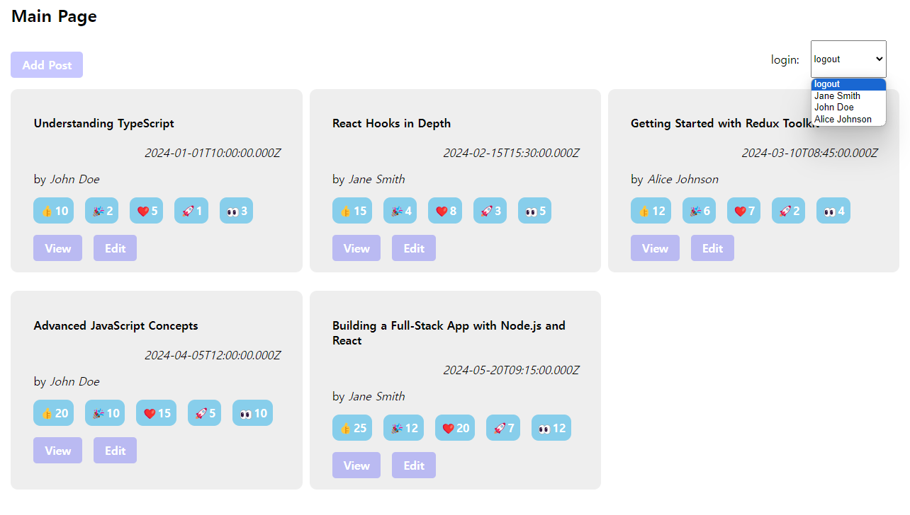

최근 포트폴리오를 위해 프로젝트를 찾아보던 중 문득 든 생각이 나의 기술 스택이 너무 부족하단 사실을 알았다.

여태 해본 프로젝트라고 해봤자 5월달 쯤에 진행해본 토이프로젝트 하나랑 이 기술 블로그가 하나뿐이며 이 블로그는 모두 `SSG,SSR` 로직으로 이뤄져있기 때문에 실제 리액트스러운 코드는 부족한 실정이 사실이다.

그래서 등한시 했던 전역 상태 관리 라이브러리를 공부 할 겸 다시 리덕스 툴킷 공식 문서를 읽어보고 직접 만들어보기로 하였다.

> 실습 시작 전 `ts.config , vite.config` 에서 `@` 경로가 `src/` 를 향하도록 설정해주었다.
>
> 사용할 라이브러리는 `react-router-dom , reduxjs/toolkit , react-redux` 이다.

# 프로젝트 시작 전 Redux Toolkit 에 대한 개괄적인 내용

예전 5월 달 리덕스를 처음 접한 후 리덕스에 대한 개괄적인 내용들은 이전에 사용하던 블로그에 잘 정리 되어 있다.

- [[Redux] Redux 이해하기 - Redux 를 선택한 이유와 개념](https://velog.io/@yonghyeun/Redux-Redux-%EC%9D%B4%ED%95%B4%ED%95%98%EA%B8%B0-Redux-%EB%A5%BC-%EC%84%A0%ED%83%9D%ED%95%9C-%EC%9D%B4%EC%9C%A0%EC%99%80-%EA%B0%9C%EB%85%90)
- [웹앱의 MVC 패턴의 한계와 리액트의 Flux 패턴](https://velog.io/@yonghyeun/Flux-%ED%8C%A8%ED%84%B4%EC%9D%B4-%EB%AD%98%EA%B9%8C)

리덕스의 자세한 컨셉은 공식문서 [Redux Docs - Redux Overview and Concepts](https://redux.js.org/tutorials/essentials/part-1-overview-concepts) 를 참고하도록 하자

리덕스는 `Flux` 패턴을 통해 전역 상태 관리의 흐름을 일방향적으로 만들어 추적 하기 쉽다라는 장점이 존재한다.

다만 리덕스는 보일러 플레이트 코드가 많다는 단점이 존재했는데 보일러 플레이트 코드가 적은 형태의 `Redux toolkit` 이 출시 되어 리덕스에선 `Redux Toolkit` 사용을 권장한다.

## 리덕스 툴킷이 리덕스에서 업그레이드 된 점

1. 리덕스를 원활하게 사용하기 위해 필요했던 미들웨어들이 기본적으로 장착 되어 있다.

2. `createSlice` 를 통해 보일러 플레이트 코드들을 한 곳에 집중하여 작성이 가능하다.

3. `immutable` 하게 작성해야 하던 상태 관리 로직을 마치 `mutable` 하듯이 작성 하는 것이 가능하다.

4. 비동기 처리를 처리하기 위한 미들웨어 로직을 기본 라이브러리로 제공하여 사용이 가능하다 .(`createAsyncThunk`)

자세한 내용들을 이 포스트에서 모두 적지는 않겠다. 기본적으로 이 포스팅은 리덕스를 사용해본 사람들이 읽어보기를 추천한다.

# 기본적인 파일 구조

```json title="기본적인 파일 구조" {5}
📦app
 ┣ 📂node_modules
 ┣ 📂public
 ┣ 📂src
 ┃ ┣ 📂feature
 ┃ ┣ 📂pages
 ┃ ┣ 📜global.css
 ┃ ┣ 📜main.tsx
 ┃ ┣ 📜router.ts
 ┃ ┗ 📜vite-env.d.ts
```

기본적인 파일구조는 다음과 같다. `pages` 는 `react-router-dom` 을 사용할 때 필요한 페이지 컴포넌트들이 들어간다.

`RTK` 와 관련 있는 폴더는 `feature` 폴더로 리덕스 공식 문서에서도 `feature` 폴더 구조를 사용한다.

`feature` 폴더에선 `store` 에서 관리 될 상태 업데이트를 트리거하는 컴포넌트와 `store` 에 저장 될 `slice` 들을 저장한다.

# 만들고자 하는 페이지의 뷰 부터 생성해보자

상태 업로드를 생성 하기 전 우선 목업 데이터를 이용해서 만들고자 하는 뷰를 생성해보자

```tsx title='MainPage 컴포넌트의 일부' showLineNumbers{37} {2-3 , 16-23 , 26-30}
const MainPage = () => {
  const [posts, setPosts] = useState<Post[]>(mockPosts);
  const [user, setUser] = useState<string>('logout');

  const handleLogin = (e: React.ChangeEvent<HTMLSelectElement>) => {
    setUser(e.target.value);
  };

  return (
    <section className='main-page'>
      <h1>Main Page</h1>
      <div className='header'>
        <Link to={`add/${user}`}>Add Post</Link>
        <div className='flex'>
          <p>login:</p>
          <select name='login' id='login' value={user} onChange={handleLogin}>
            <option value='logout'>logout</option>
            {users.map(({ userName }, idx) => (
              <option key={idx} value={userName}>
                {userName}
              </option>
            ))}
          </select>
        </div>
      </div>
      <section className='post-wrapper'>
        {posts.map((post, idx) => (
          <Post post={post} key={idx} />
        ))}
      </section>
    </section>
  );
};

export default MainPage;
```



다음과 같이 `/` 경로에 대한 메인 페이지의 뷰를 생성해주었다.

우선은 예시로 생성한 데이터를 이용해 `internal state` 의 예시인 `useState` 로 포스트들과 유저를 선언해주었다.

> `select` 태그는 간소화 된 로그인 기능을 의미하며 로그아웃과 3명의 유저가 있다고 가정해보자

이 때 정의된 `posts , user` 상태 값은 해당 페이지 뿐 아니라 `add, view , edit` 경로에서도 사용되어야 하기 때문에 `useState` 로 정의된 `internal state` 를 전역에 선언해줄 필요가 있다.

# Redux Toolkit 을 이용해 전역 상태 저장소 생성하기

```tsx title="/store.tsx"
import { configureStore } from '@reduxjs/toolkit';

const store = configureStore();

export default store;
```

다음과 같이 `configureStore` 를 이용해 전역 상태 저장소를 생성해주자

이 `store` 에는 현재 아무런 값도 존재하지 않는다.

아직 아무런 `reducer` 도 추가해주지 않았기 때문이다. `reducer` 를 생성해주도록 하자

## 리듀서 생성하고 하나씩 뜯어 보기

```tsx title="@/feature/postSlice.tsx"
import { createSlice } from '@reduxjs/toolkit';
import type { Post } from '@/global';
import { mockPosts } from '@/mocupdata';

export type PostsState = {
  posts: Post[];
};

const initialState = {
  posts: mockPosts,
} satisfies PostsState as PostsState;

export const postSlice = createSlice({
  name: 'posts',
  initialState,
  reducers: {
    addPost: (state, action) => {
      const { author, title, content, date } = action.payload;
      const newPost = {
        author,
        title,
        content,
        date,
        reactions: {
          thumbsUp: 0,
          hooray: 0,
          heart: 0,
          rocket: 0,
          eyes: 0,
        },
      };
      state.posts.push(newPost);
    },
  },
});

export const { addPost } = postSlice.actions;
export default postSlice.reducer;
```

다음과 같이 `createSlice` 를 이용해 `post` 와 관련된 리듀서를 생성해주자

`createSlice` 의 인수를 하나씩 다 뜯어보면 다음과 같다.

- `name`

`createSlice` 로 생성되는 슬리이스의 이름으로 `store` 에서 특정 상태 값을 찾을 때에도 사용된다. 또한 생성되는 액션 객체의 `type` 값에 들어가게 되는데 `postSlice.actions.addPost` 로 생성된 액션 타입들은 모두 `{type : posts/addPost  , ... }` 와 같은 형태를 갖는다.

- `initalState`

`slice` 에서 초기값으로 사용 할 상태 값을 의미한다. 이 때 타입 선언에서 `satisfies PostsState as PostsState` 로 타입을 선언 한 모습을 볼 수 있다.

```tsx title="두 방법은 차이를 갖는다."
const initialState = {
  posts: mockPosts,
} satisfies PostsState as PostsState;

const initialState: PostsState = {
  posts: mockPosts,
};
```

처음에 나는 후자의 방법을 사용해서 선언했는데 `RTK` 공식문서에선 위와 같이 `satisfies as` 문법을 사용하는 모습을 확인 했다.

알고보니 이는 `initalState` 에서 초기 상태 값이 아니라 다른 값이 추가 될 수 있을 때 사용하는 문법으로 초기 타입값만 만족한다면 해당 타입으로 인식 시키는 유연성을 제공하기 위해 사용된다.

```tsx title="만약 후자의 방법을 사용한다면 새로운 값이 추가 될 수 없다."
type PostsState = {
  posts: Post[];
};

const initialState: PostsState = {
  posts: mockPosts,
  extra: 'extra property', // TypeScript error: Object literal may only specify known properties
};
```

- `reducers`

```tsx title="createSlice 내부의 reducers"
reducers: {
    addPost: (state, action) => {
      const { author, title, content, date } = action.payload;
      const newPost = {
        author,
        title,
        content,
        date,
        reactions: {
          thumbsUp: 0,
          hooray: 0,
          heart: 0,
          rocket: 0,
          eyes: 0,
        },
      };
      state.posts.push(newPost);
    },
  },

...
export const { addPost } = postSlice.actions;
```

`createSlice` 내부에 존재하는 `reducer` 와 생성된 인스턴스인 `slice.reducer` 는 다르다.

`createSlice` 내부에서 선언된 `reducers` 에는 해당 `slice` 의 `state` 값을 변경 시킬 **액션 객체를 생성하는 메소드**들을 담는다.

따라서 `createSlice` 내부에 선언된 메소드를 디스트럭쳐링 할 때 `const { addPost } = postSlice.actions` 처럼 `actions` 에서 꺼내오는 모습을 볼 수 있다.

`reducers` 안에서 선언된 `addPost`는 추후 `dispatch(addPost({ ... }))` 와 같이 `dispatch` 되어 해당 슬라이스의 상태 값을 변경 한다.

> **🐣** `reducers` 내부에 선언된 메소드의 첫 번째 인수인 `state` 는 해당 `slice` 내부에 존재하는 `state` 를 가리킨다.

## 해당 리듀서를 스토어에 집어 넣기

```tsx title="/store.tsx" {2,5-7}#add
import { configureStore } from '@reduxjs/toolkit';
import postReducer from '@/feature/posts/postSlice';

const store = configureStore({
  reducer: {
    post: postReducer,
  },
});

export default store;
```

생성한 `postReducer` 를 `configureStore` 안에 집어 넣어줌으로서 이제 `store` 내부에는 `postReducer` 가 존재하게 되었다.

**`configureStore` 인수 안에 존재하는 `reducer` 는 `store` 의 상태 값을 변경 시킬 때 사용되는 리듀서를 의미한다.**

그게 무엇을 의미하냐면 , 만약 `postSlice` 에서 선언된 액션 크리에이터 함수로 `dispatch(addPost({...}))` 가 호출 될 경우

`postReducer` 에게 해당 액션 객체가 넘어가 `postSlice.reducer` 가 호출되어 상태 값을 변경 한다.

### user 와 관련된 slice 도 생성해 넣어주자

```tsx title="@/feature/user/userSlice"
import { createSlice } from '@reduxjs/toolkit';

type UserState = {
  userName: string;
};

const initialState = {
  userName: 'logout',
} satisfies UserState as UserState;

export const userSlice = createSlice({
  name: 'user',
  initialState,
  reducers: {
    changeUser: (state, action) => {
      state.userName = action.payload;
    },
  },
});

export const { changeUser } = userSlice.actions;
export default userSlice.reducer;
```

```tsx title="/store.tsx"
import { configureStore } from '@reduxjs/toolkit';
import postReducer from '@/feature/posts/postSlice';
import userReducer from '@/feature/user/userSlice';

const store = configureStore({
  reducer: {
    post: postReducer,
    user: userReducer,
  },
});

export default store;
```

## 해당 스토어를 컴포넌트에게 전역으로 제공해주자

```tsx {1-2, 6,8}#add
import { Provider } from 'react-redux';
import store from './store.tsx';

ReactDOM.createRoot(document.getElementById('root')!).render(
  <React.StrictMode>
    <Provider store={store}>
      <RouterProvider router={router} />
    </Provider>
  </React.StrictMode>,
);
```

다음과 같이 최상단에 전역 상태 프로바이더로 감싸줌으로서 이제 모든 컴포넌트에서 `store` 에 접근 할 준비는 모두 끝났다.

## useDispatch , useSelector 사용하기

### 타입 선언

`redux` 에선 `store` 상태값에 접근하기 위해선 `useSelector` 를 이용하고 , 상태 값을 변경하기 위해선 `useDispatch` 훅을 이용한다.

```tsx title="useSelector 사용법"
const firstState = useSelector((state) => state.firstState);
```

```tsx title="useDispatch 사용법"
const dispatch = useDispatch();
...
dispatch(changeUser('logout'))
```

타입스크립트에서 해당 훅 들을 사용하기 위해선 `state` 가 어떤 타입인지를 알려줘야 하고, `useDispatch` 로 반환되는 `dispatch` 가 어떤 `store` 에게 전달 될 `dispatch` 인지 알려주기 위해 제네릭 타입을 넘겨줘야 한다.

따라서 해당 값들에게 넘겨줄 타입들을 `export` 해주자

```tsx title="/store.tsx" {14,15}#add
import { configureStore } from '@reduxjs/toolkit';
import postReducer from '@/feature/posts/postSlice';
import userReducer from '@/feature/user/userSlice';

const store = configureStore({
  reducer: {
    post: postReducer,
    user: userReducer,
  },
});

export default store;

export type RootState = ReturnType<typeof store.getState>;
export type AppDispatch = typeof store.dispatch;
```

`store.getState` 는 `store` 에 저장된 모든 상태 값을 반환하고 , `store.dispatch` 메소드는 `store` 가 액션 객체를 디스패치 하도록 한다.

이렇게 `RootState,  AppDispatch` 에 대한 타입을 가져왔다면 이제 `useDispatch , useSelector` 를 사용 할 때 다음과 같이 사용해주면 된다.

```tsx title="타입과 함께 사용 하는 방법"
const firstState = useSelector((state : RootState) => state.firstState);
...
const dispatch = useDispatch<AppDispatch>()
```

### 타입 선언이 되어있는 커스텀훅 생성

다만 `store` 에 접근하고자 하는 모든 컴포넌트에서 매번 타입들을 `import` 한 후 제네릭 타입으로 넘겨주는 것은 비효율적이다.

따라서 해당 과정을 추상화 한 커스텀 훅을 생성해주자

```tsx title="/hooks.tsx"
import { useDispatch, useSelector } from 'react-redux';
import type { RootState, AppDispatch } from './store';

export const useAppSelector = useSelector.withTypes<RootState>();
export const useAppDispatch = useDispatch.withTypes<AppDispatch>();
```

다음과 같이 `withTypes` 메소드를 이용해 간단히 타입이 선언된 커스텀 훅을 생성해주도록 하자

뭐 직접 만들어도 됐겠지만 이렇게 간단히 제공해주니 사용해주도록 하자 :)
