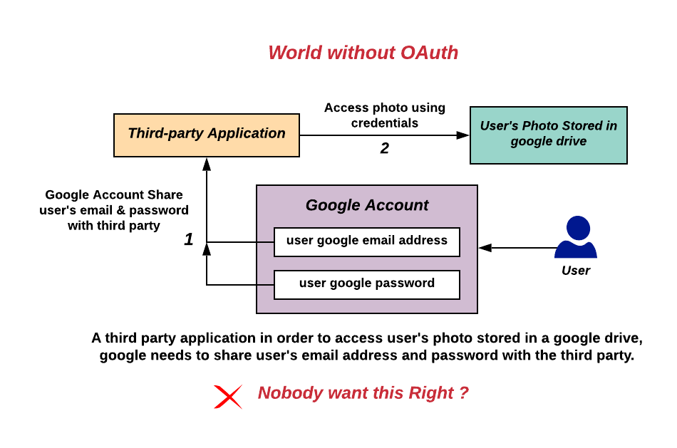
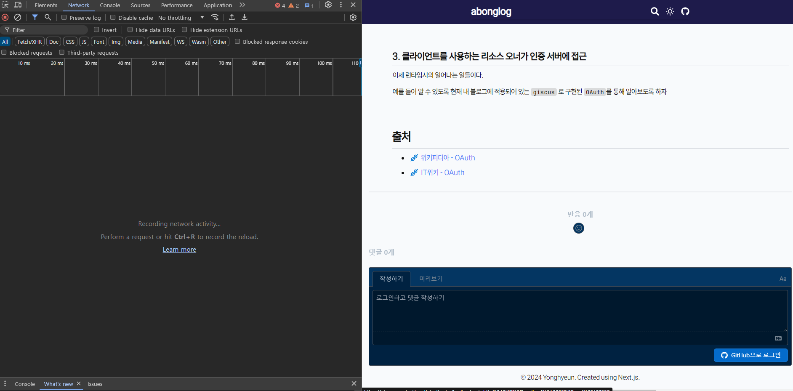
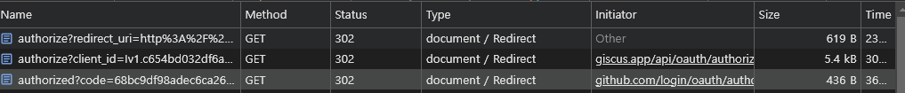
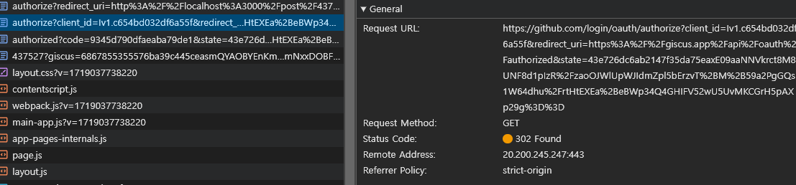
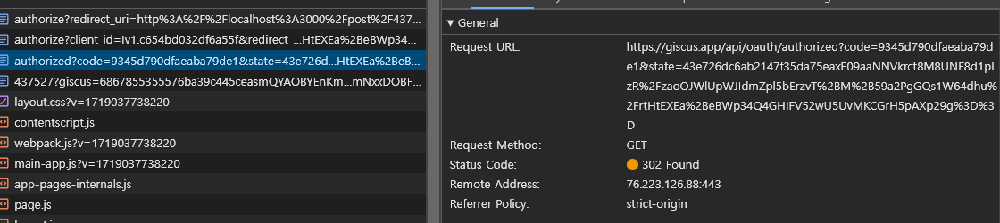
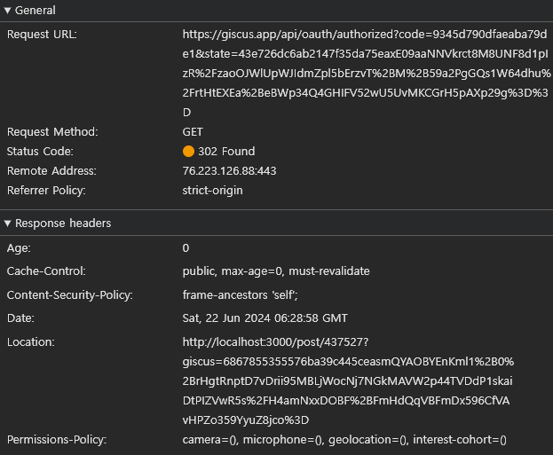
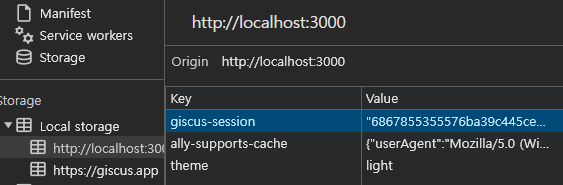

# 인증과 인가 (Authentication & Authorization)

인증과 인가는 특정 리소스에 접근하기 전 , **해당 리소스에 접근 할 권한이 있는지를 확인하고 , 부여하기 위해 필요한 프로세스이다.**

하나씩 알아가보자

## 인증 (Authentication)

인증은 사용자의 신원을 확인하는 프로세스이다.

인증 과정에선 다음과 같은 수집이 포함된다.

- 데이터베이스에 등록 된 아이디와 비밀번호를 통해 확인하는 방법

- **인증 서버에서 발급한 **토큰** 을 이용하여 인증하는 방법**

- 식별을 위해 디바이스에서 생체 인식 데이터를 확인 하는 방법

- MFA (Multi Factor Authentication) 과 같이 특정 인가 프로그램으로 전송되는 일회용 코드를 이용하는 방법

## 인가 (Authorization)

인가는 **인증이 된 사용자에게 특정 리소스에 접근하거나 특정 작업을 수행 할 수 있는 권한을 확인하는 프로세스이다.**

인가는 다음과 같은 종류들이 있다.

- 역할 기반 액세스 제어 : 사용자에게 역할을 할당하고 역할마다 가지고 있는 특정 권한을 부여함
- **속성 기반 액세스 제어 : 사용자 , 리소스 , 환경 요인 (시간 , 위치) 와 같은 속성을 기반으로 액세스를 부여함**
- 액세스 제어 목록 : 특정 리소스에 대한 액세스가 허용되는지 사용자 또는 그룹을 지정함

### 인증과 인가 정리

결국 인증과 인가는 리소스에 접근 하기 위해 사용자를 식별하고 , 식별된 사용자에게 리소스에 접근 할 수 있는 권한을 주는 행위이다.

이번에 알아볼 `OAuth` 는 토큰을 이용하여 인증하고 , 속성 기반으로 리소스에 대한 권한을 부여한다.

# OAuth 알아보기

## OAuth 를 이해하기 위한 용어 정리

우선 해당 개념을 공부 하기 전 용어를 명확히 하고 가자

- `Resoucre Owner` : 리소스 오너는 말 그대로 **어떤 리소스를 사용하고자 하는 주체**를 의미한다. 네트워크 엣지 부분에 존재하는 실 사용자이다.
- `Resource Server` : 리소스 서버는 리소스 오너가 사용하고자 하는 리소스들을 저장하고 있는 서버이다. 위 예시에선 구글 드라이브 서버에 해당한다. **리소스 서버에 저장된 리소스를 이용하기 위해선 권한이 필요하다.**
- `Authorzation Server` : 인증 서버는 리소스 서버의 리소스를 사용하기 인증과 인가 역할을 맡은 서버이다. 위 예시에선 구글 인증 서버에 해당한다.
- `Client` : 클라이언트는 **리소스 서버나 인증 서버에게로부터 리소스 오너에게 액세스 토큰을 발급 해 줄 권한을 인가를 미리 받은 주체**이며 리소스 오너가 사용 하고 있는 웹에 해당한다. 써드 파티 앱이라고도 한다.

## OAuth 는 왜 필요할까 ? : OAuth가 없을 때를 가정해보자

만약 특정 서드 파티 앱에서 리소스 오너가 프로필 사진을 구글 드라이브에 있는 사진으로 업로드 하려고 한다고 해보자

그렇다면 다음과 같은 일들이 벌어져야 한다.

1. 리소스 오너가 구글 아이디와 비밀번호를 서드파티 앱에게 제공함
2. 서드파티 앱은 제공 받은 구글 아이디와 비밀번호를 이용해 리소스 서버에 직접 접근
3. 리소스 서버는 서드파티 앱을부터 받은 아이디와 비밀 번호를 통해 사진 제공

위 과정은 문제가 있다.

한 가지 문제로는 나의 구글 아이디와 비밀번호를 서드파티 앱에게 보내야 한다는 점이다.

민감한 리소스에 접근 할 수 있는 정보들이 리소스 서버나 인증 서버에게만 가는 것이 아니라 다른 서드 파티 앱에게 공유 하는 상황은 아무도 원하지 않는다.

이런 문제를 해결하기 위해 OAuth라는 개념이 등장했다.

OAuth는 클라이언트(서드파티 앱)가 **리소스 오너가 인증과 인가를 직접적으로 인증 서버로부터 받아올 수 있도록 인증 서버의 인증 URL로 리다이렉트 시켜 임시적인 인증과 인가를 받아오도록** 하고

임시적인 인증과 인가를 받은 리소스 오너를 클라이언트의 URL 로 코드 정보와 함께 리다이렉션 시킨다.

**클라이언트는 리소스 오너가 가지고 온 임시 코드를 이용해 인증 서버로부터 유효기간이 존재하는 토큰을 받아와 리소스를 사용 할 수 있도록 한다.**

전체적인 도식을 살펴보면 다음과 같다.

> 해당 도식화 이미지에서 인증 서버가 클라이언트에게 직접적으로 권한 부여 코드를 응답 하고 있는 모습으로 보인다.
>
> 이는 다양한 방법 중 하나로, 직접적으로 인증 서버가 클라이언트에게 임시 코드를 직접적으로 보낼 수도, 혹은 클라이언트가 인증 서버로부터 임시 코드를 발급 받은 후, 클라이언트의 URL로 리다이렉트 될 때 쿼리 파라미터에 임시 코드를 담아 접근 하기도 한다.
>
> 어떤 방법을 쓰든 결국 클라이언트에게 임시 코드를 보내는 행위는 동일하다.
>
> 도식에서 중요한 점은 임시 코드와 액세스 토큰에 대한 흐름과 리다이렉트를 통한 역할 분리이다.

# OAuth 2.0

2013년에 발표된 프로토콜 `OAuth 2.0` 은 2009년쯤에 발표된 `OAuth 1.0` 의 단점들을 보완하여 나온 프로토콜이다.

`OAuth 1.0` 에서도 리다이렉트를 이용한 인증 방식을 사용했지만 임시 코드가 존재하지 않아 액세스 토큰의 유효 기간이 매우 길었다는 점과 리소스 서버,인증 서버의 구분이 일어나있지 않았다는 차이점이 존재한다.

> [[NHN FORWARD 22] 로그인에 사용하는 OAuth : 과거, 현재 그리고 미래](https://www.youtube.com/watch?v=DQFv0AxTEgM&t=1613s)
> 전체적인 흐름은 해당 영상을 참고하면 좋을 것 같다. 정말 좋은 발표 영상이다.

이후 내용들은 `OAuth 2.0` 을 이용하기 위한 스텝들을 하나씩 설명한다.

## 1. 인증 서버로부터 clientID , client-secret 발급

우선적으로 해야 할 것은 클라이언트가 인증 서버로부터 client id , client secret 을 발급 받아야 한다.

발급 받은 `id,secret` 들은 클라이언트가 인증 서버로부터 리소스 오너의 액세스 토큰을 발급 받기 위해 제공하는 `request header` 에 담겨 전송된다.

이를 통해 인증 서버는 해당 클라이언트가 리소스 오너의 액세스 토큰을 발급 받을 수 있는 권한이 있는지를 확인 한다.

## 2. callback url 설정

인증 서버로부터 client id, client secret 을 발급 받는 과정에서 클라이언트는 인증서버로부터 `callback url` 을 설정한다.

`callback url` 은 리소스 오너를 인증 서버로 리다이렉션 시켜 인증 이후 발급 받은 임시 코드와 함께 리다이렉션 될 url 을 의미한다.

예를 들어 `callback url` 을 `abonglog.me` 로 설정해뒀다면 , 클라이언트는 구글 로그인 페이지에서 로그인 후 `abonglog.me` 로 리다이렉션 된다.

> 리다이렉션 될 때 받은 임시 코드를 `query parameter` 에 담아 리다이렉트 되거나, `request header` 에 담아 리다이렉션 될 수 있다.

## 3. 클라이언트를 사용하는 리소스 오너가 인증 서버에 접근

이제 런타임시의 일어나는 일들이다.

예를 들어 알 수 있도록 현재 내 블로그에 적용되어 있는 `giscus` 로 구현된 `OAuth`를 통해 알아보도록 하자

해당 페이지에서 댓글을 이용하려면 깃허브 로그인을 한 후, 댓글을 달아야 한다.

로그인 버튼을 눌러보자

다음과 같은 상황들이 발생 한다.

### 3.1 버튼이 눌리면 `giscus` 앱이 깃허브 로그인 페이지로 302 상태 코드와 함께 `github/login` 으로 `redirect` 시킨다.

이 때 `github/login` 페이지에게 `client id , callback url` 의 주소를 명시하여 리다이렉트 시킨다.

### 3.2. `github/login` 에서 리소스 오너가 로그인을 한다. 이 때 로그인 관련 정보는 리소스 오너와 인증 서버간에서만 이뤄진다.

리다이렉션 된 페이지는 현재 브라우저의 네트워크에서 알 수 없으나, 로그인이 완료 된 리소스 오너는 본인이 받은 임시 `code` 와 함께 해당 주소로 302 상태 코드와 함께 리다이렉트 된다.

### 3.3 리다이렉트 될 때 받은 임시 코드 값을 이용해 액세스 토큰을 받아오기

> **🐣 일반적으로 해당 과정은 서버에서 일어난다.**
>
> `giscus` 라이브러리는 프론트 엔드 단에서 서버 없이 `OAuth` 를 구현 하기 위한 라이브러리로 `url` 경로에 액세스 토큰을 담아 전송한다.
>
> 하지만 일반적으론 해당 요청 과정은 백엔드 단에서 일어나는 행위이다.
>
> 그 이유는 액세스 토큰은 민감한 정보이기 때문에 브라우저를 통해 전송되는 경우 탈취 당할 위험이 존재하기 때문이다.

해당 주소에서 쿼리 파라미터로 `code` 값이 함께 존재하는 모습을 볼 수 있다.

해당 값은 깃허브 로그인 이후 받은 임시 코드 값으로 인증이 일어났다는 징표이다.

해당 `url` 로 요청을 보내게 되면 받은 코드값을 이용해 깃허브 인증 서버에 접근하여 액세스 토큰을 받아온다.

받아오는 `response` 를 살펴보자

액세스 토큰 값과 함께 댓글 창으로 `redirect` 시키는 모습을 볼 수 있다.

**해당 액세스 토큰은 리소스에 접근 하기 위한 인가에 사용된다.**

댓글을 보내게 된다면 깃허브 api 를 이용해 post 요청을 보내게 되는데 이 때 받은 `access token` 을 `request header` 에 담아 전송하여 인가를 받은 리소스 오너임을 나타낼 수 있다.

> `giscus` 는 `iframe` 형태로 문서 내에 존재한다. 즉 쿼리 파라미터로 존재하는 `?giscus=...` 값으로 이뤄진 `url` 주소는 로그인이 완료된 댓글창을 의미한다.

### ps. giscus 에선 액세스 토큰을 유지하기 위해 로컬 스토리지에 액세스 토큰 값을 저장해둔다.

> **🐣 일반적으로 해당 과정은 서버에서 일어난다.**
>
> `giscus` 는 서버 없이 `OAuth` 과정을 사용하기 위한 라이브러리이기 때문에 브라우저의 스토리지에 저장해두지만
>
> 일반적인 경우에선 서버의 데이터베이스에서 저장해준다.
>
> 마지막 3번 과정 요청이 서버 단에서 일어나기 때문에 받아온 액세스 토큰 값을 DB에 저장해두고 클라이언트를 원래 경로로 `redirect` 시킨다.
>
> 서버에선 리소스 오너의 액세스 토큰을 DB에 저장해두고 리소스 오너가 해당 DB의 액세스 토큰에 저장 할 수 있는 key 값 역할을 할 값을 쿠키에 담아 전송한다.

이후 페이지를 이동했을 때에도 로그인 정보를 유지 하기 위해 발급 받은 액세스 토큰을 로컬 스토리지에 저장해두는 모습을 볼 수 있다. :)

로컬 스토리지에 액세스 토큰을 저장해둠으로서 액세스 토큰의 만료 기간이 지나기 전까지는 자동 로그인이 가능하다.

# 출처

- [위키피디아 - OAuth](https://en.wikipedia.org/wiki/OAuth#/media/File:Without-oauth.png)
- [IT위키 - OAuth](https://itwiki.kr/w/OAuth#OAuth1.0%EA%B3%BC_OAuth2.0%EC%9D%98_%EC%B0%A8%EC%9D%B4)
- [후디 블로그 - OAuth](https://hudi.blog/oauth-2.0/)
