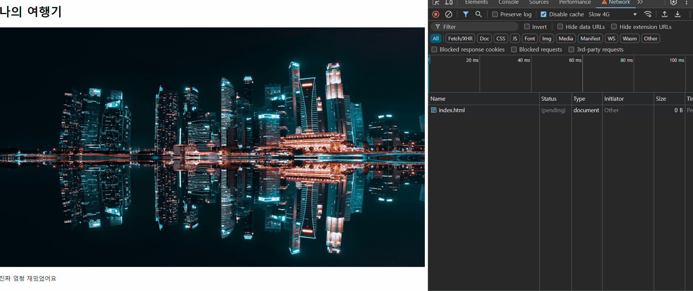
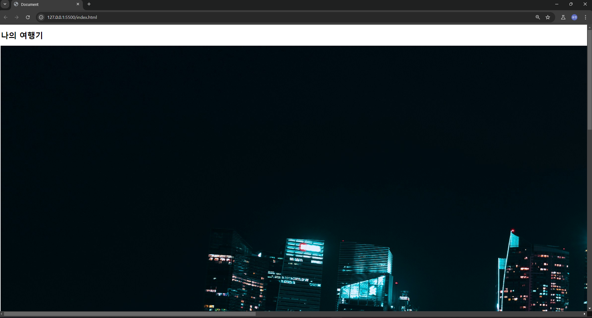
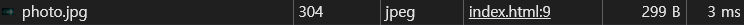
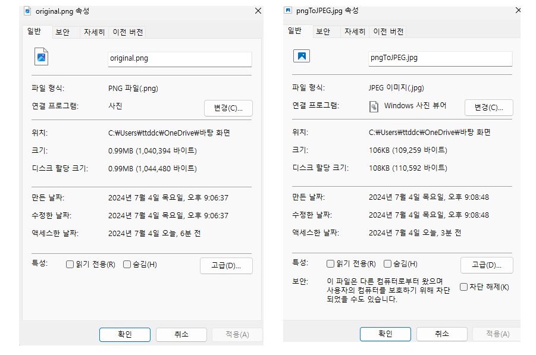
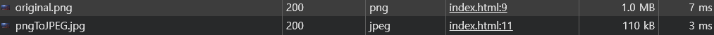
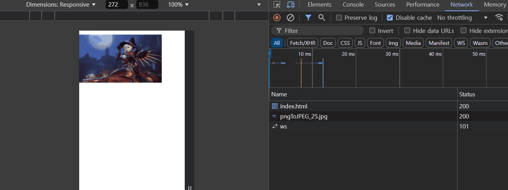

# 이미지 최적화가 필요한 이유

## UX를 높히기 위해선 LCP 시간을 줄여야 한다

`LCP` 란 `Largest Contentfull Paint` 의 줄임말로 시작부터 의미 있는 내용을 보기 까지 걸리는 시간을 의미한다.

이 때 의미 있는 내용이란 **이미지나 비디오 , 많은 글 들이 있는 텍스트 블록** 들을 의미한다.

사용자가 웹 페이지에 네비게이팅 되었을 때, 가장 빠른 시간 내에 의미 있는 내용을 보아야 사용자 경험이 올라가는 것은 당연한 일이다.

`2500ms` 이내에 의미 있는 내용을 보여주는 것을 좋은 `LCP` 를 가진 웹 사이트로 이야기 하며 50~60% 이상의 웹 사이트들은 좋은 LCP 시간을 가지고 있다.

](image.png)

반대로 말하면 40% 이상의 웹 사이트들은 좋지 못한 `LCP` 를 가지고 있다는 것인데 `LCP` 에 영향을 미치는 요소는 무엇이 있고 어떻게 해결 할 수 있을까 ?

## 이미지를 불러오는 시간이 길어질 수록 LCP 를 증가 시킨다.

브라우저가 `html` 문서를 렌더링 하기 위해 파싱하던 중 이미지 태그를 만나게 되면 다음과 같은 일이 벌어진다.

```html title="이미지 태그를 만났을 때" {2}#remove
<h1>여행 다녀 왔어요</h1>
 {/* 비동기적으로 요청 */}
<p>댕꿀잼</p>
```

브라우저는 이미지 태그와 같이 요청을 받아와야 하는 경우엔 전체 렌더링 프로세스를 블록 하는 것이 아니라 **비동기적으로 요청해오고** 다른 태그들을 우선적으로 동기적으로 파싱한다.

이후 동기적인 파싱이 모두 완료가 되면 우선 브라우저에 텍스트 등을 렌더링 하고 이미지에 대한 비동기 요청이 완료가 되면 다시 `reflow,repaint` 과정을 거쳐 렌더링 된다.

예시를 살펴보자

```html title="이미지 태그가 존재 할 때의 렌더링을 살펴보자"
<body>
  <h1>나의 여행기</h1>
  
  <p>진짜 엄청 재밌었어요</p>
</body>
```



> 극단적인 예시를 위해 캐싱 기능을 끄고 네트워크 환경을 `slow 4g` 로 하였다.

파싱 과정에서 이미지 태그등을 보면 비동기적으로 요청하여 전체 렌더링 프로세스를 블록하지 않는 다는 점은 칭찬할만 하지만

여전히 의미 있는 이미지를 보기까지의 시간, 즉 `LCP` 는 이미지에 대한 요청이 받아지고 `reflow,repaint` 가 일어난 후에 일어난다는 사실은 변함이 없다.

# 이미지를 불러오는 시간이 오래 걸리는 이유

불러오고자 하는 이미지의 화질이 높거나 이미지의 크기가 클 수록 이미지가 갖는 픽셀 수는 클 수 밖에 없다.

예를 들어 4K 이미지의 경우엔 3840 x 2160 픽셀의 이미지고 각 픽셀 마다 `3byte` 이니 (RGB) 파일의 크기는 `3840 x 2160 x 3byte = 24.88MB` 의 용량을 갖는다.

네트워크에서 `24.88MB` 만큼의 리소스를 요청 받으려면 매우 오랜 시간이 걸릴 것이다.

그럼 생각해보자

우리가 브라우저에서 사진을 렌더링 할 때 이미지 태그를 원본 사이즈만하게 렌더링 할 일이 있을까?

```html title="나는 기필코 원본 사진을 렌더링 하겠노라"
<body>
  <h1>나의 여행기</h1>
  
  <p>진짜 엄청 재밌었어요</p>
</body>
```



예를 들어 사진을 이용해 `300px` 만큼의 블록만을 렌더링 하고 싶은데 `3840 x 2160` 크기의 이미지를 네트워크로 불러오는 것은 너무 비효율적인 일이다.

또 모바일 환경은 어떠한가 , 모바일 환경에선 렌더링 할 뷰포트가 더 작아지는데 여전히 큰 사이즈의 이미지를 불러오는 것도 비효율적이다.

# 이미지를 빠르게 불러오기 위한 방법 : 이미지 용량을 줄여 저장하면 된다.

## 1. 이미지 압축하여 용량 줄이기

위 예시에서 사용한 이미지는 `5452 x 3067` 사이즈의 사진이지만 네트워크에선 `299Byte` 만큼의 용량으로 줄여 요청을 해왔다.

이는 위에서 말한 원본 이미지보다 더 적은 크기의 사진을 이용했다는 것이다.

그런 것이 가능한 이유는 원본 이미지를 적은 용량의 이미지로 변환하는 이미지 압축 기술이 존재하기 때문이다.



이미지의 타입을 보면 알 수 잇듯이 이미지는 `JPEG` 와 같은 압축 기술을 이용하여 이미지를 작은 사이즈의 사진으로 압축해줘 이미지의 용량을 많이 줄여준다. (현재 사진의 용량은 `299 byte`밖에 되지 않는다.)

다양한 압축 기술이 있지만 그 중 하나인 [JPEG - 위키백과](https://ko.wikipedia.org/wiki/JPEG) 을 먼저 살펴보자

`JPEG` 는 `RGB` 형태로 존재하는 이미지들을 인간이 인식 할 수 있는 색상 영역인 `YCbCr` 색상으로 변경하고 전체 블록들을 각 블록들로 (`8 x 8 pixel`) 나눠 픽셀을 압축한다.

이를 통해 원본 이미지의 화질보다 낮아지더라도 이미지의 용량을 줄이는 것이 가능하다.


그 뿐 아니라 원본 이미지의 화질 저하를 일으키지 않으면서 용량을 줄이는 압축이 가능한 `Webp` 나 `AVIF` 와 같은 다양한 압축 기술등이 존재한다.

> 압축 기술의 원리는 설명하기에 너무 복잡해서 지금 하지는 않겠다.
>
> 원본 이미지의 용량을 압축하는 기술 등이 존재한다는 것만 우선 포인트 두고 포스팅 하도록 하겠다.

이미지 압축은 다양한 웹 사이트들에서 제공하고 있으니 웹 사이트를 뒤져 `png -> JPEG ` 이미지로 압축해보자



기존 `png` 파일을 `JPEG` 파일로 변환하고 나서 크기를 살펴보면 기존 용량의 `0.001` 배로 변경된 것을 볼 수 있다.

이렇게 용량이 다른 이미지들은 네트워크 요청 시간이 걸리는 시간 또한 차이가 날 수 밖에 없다.



## 2. 이미지의 크기를 줄이기

이미지의 원본 크기를 유지 하면서 픽셀을 압축하는 압축 기술 뿐 아니라 이미지의 크기를 줄이는 것도 이미지의 용량을 줄이는 효과적인 방법이다.

존재하는 픽셀의 수를 절대적으로 줄여버리면 용량 또한 같이 줄어들기 때문이다.

이미지의 크기를 줄이는 방법엔 다양한 알고리즘이 존재하는데 가장 간단한 예시를 들면

`Neaest Neighbor` 방법으로 N 개의 픽셀들의 평균으로 하나의 픽셀로 변환하여 새로운 이미지를 생성하는 방법이 있다.

그거 말고도 기타 등등 다양한 방법이 있지만 현재 포스트에선 다루지 않기로 하고 이미지의 크기를 줄이는 웹 사이트의 도움을 받아 용량을 줄여보자

[이미지 압축 및 리사이징이 가능한 사이트](https://www.iloveimg.com/ko)

이후 여태까지의 결과를 테이블로 살펴보도록 하자

|      | 원본 이미지 | 원본 이미지 크기 50% | 이미지 압축 | 압축 이미지 크기 50% |
| ---- | ----------- | -------------------- | ----------- | -------------------- |
| 용량 | 1040KB      | 254KB                | 110KB       | 27.4KB               |

물론 이미지의 용량을 줄이는 방법은 장점만 존재하는 것이 아닌데 이는 원본 이미지의 픽셀을 훼손하기 때문에 원본 이미지와 조금은 다른 사진을 사용하게 된다는 점이다.

근데 그것또한 괜찮은게 100% 크기의 이미지를 불러와 절반 사이즈로 렌더링 하는 거나 , 50% 이미지를 불러와 전체 사이즈로 렌더링 하는 것은 같은 결과를 가져오기 때문이다.

어차피 작은 사이즈를 렌더링 할 거면 이미지를 작게 만들어버리면 된다.

# 적절한 상항에 맞춰 다른 용량의 이미지를 가져오는 방법

위에서 이미지의 용량을 줄이기 위한 저장 방법을 기술했다.

그렇다면 이번에는 적절한 상황에 맞춰 다른 용량의 이미지를 가져오는 방법을 알아보자

이는 `img` 태그의 어트리뷰트를 이용하는 방법으로 `srcset , sizes` 어트리뷰트를 이용 하는 방법이 존재한다.

```html title="srcset과 sizes 어트리뷰트를 이용하기"

```

사진 이름에 `_` 를 기준으로 줄인 이후의 크기를 표기하였다.

## srcset

`srcset` 은 다음과 같은 기준으로 표기한다.

`file source` (불러올 이미지의 크기) + `descriptor` (뷰포트 너비를 가리키는 `w` descriptor or 해상도를 가리키는 `x` descriptor)

즉, `descriptor` 크기에 맞춰 적절하게 가져 올 파일의 경로를 지정해줄 수 있다.

위 예시에선 뷰포트의 너비가 `300px` 이상일 경우엔 `pngToJPEG_25` , `600px` 이상일 경우엔 `pngToJPEG_50` , `900px` 이상일 경우엔 `pngToJPEG` 를 가져오라는 것을 의미한다.

## sizes

`sizes` 는 미디어쿼리를 이용하여 표현 할 수 있는데, `scrset` 에서 뷰포트 너비에 맞춰 불러 올 이미지의 소스들을 정의했으니

`sizes` 에선 불러와 렌더링 될 이미지들의 크기를 지정해줄 수 있다.

위 예시에선 뷰포트 너비에 따라 이미지를 `160px , 320px , 640px` 크기로 렌더링 하라는 것과 같다.



뷰포트의 너비가 커지면 커질 수록 `srcset` 에서 적절한 이미지들을 불러오고 렌더링 하는 모습을 볼 수 있다.

# 정리

결국 **이미지를 빠르게 불러오고 싶으면 이미지를 압축하여 용량을 줄이고, 뷰포트 크기에 맞는 사이즈의 이미지들을 저장한 후 적절히 불러오라는 것**이다.
