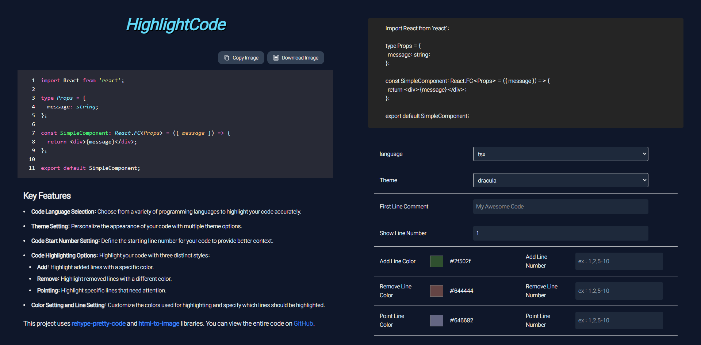

# 현재 상황



이번 3일간 리덕스 툴킷 복습할 겸 토이프로젝트로 [Highlightcode](https://www.highlightcode.site/) 를 개발했다.

> [프로젝트 Github 주소](https://github.com/yonghyeun/CodeHighlighter)

해당 사이트는 `NextJS , ReduxToolkit` 을 이용하여 만들었는데 앱 라우터 기능이 필요 없었지만 서버 사이드 렌더링의 장점을 깨닳은 이후로는 웬만한 개발을 다 `NextJS` 를 이용해서 하게 되더라

다만 나는 여태 리덕스를 `CRA` 환경에서만 써봤어서 `CRA` 환경에서 쓸 때 처럼 `store` 를 생성해줬는데 이건 올바른 사용 방식이 아니라는 공식 문서를 보고 나서 리팩토링을 해보려고 한다.

```tsx title="@/store.tsx"
'use client';

import { configureStore } from '@reduxjs/toolkit';

import snippetReducer from '@/feature/snippet/snippetSlice';
import settingReducer from '@/feature/setting/settingSlice';

const store = configureStore({
  reducer: {
    snippet: snippetReducer,
    setting: settingReducer,
  },
});

export default store;

export type RootState = ReturnType<typeof store.getState>;
export type AppDispatcher = typeof store.dispatch;
```

```tsx title="@/app/page.tsx" {3-4,9}
'use client';

import { Provider } from 'react-redux';
import store from '@/store';

export default function Home() {
  return (
    <main className='flex md:flex-col min-h-screen'>
      <Provider store={store}>{/* 생략 */}</Provider>
    </main>
  );
}
```

`CRA` 환경에서 사용 할 때 처럼 전역 변수로 `store` 를 생성해두고 `Provider` 를 이용해 컴포넌트들에게 `store` 를 넘겨주는 방식으로 리덕스 툴킷을 이용했다.

이 방법이 `NextJS` 에서 올바르지 않은 이유를 알기 위해선 우선 `NextJS` 의 서버 사이드 렌더링의 개념을 한 번 더 짚고 가야 한다.

# NextJS 의 서버 사이드 렌더링 방식

`NextJS` 는 서버 단에서 모든 컴포넌트들을 먼저 렌더링 하여 `RSCPayload` 형태로 만들어 클라이언트에게 전송하여 빠르게 `FCP` 를 완료하고

이후 **클라이언트 컴포넌트들만 한 번 더 클라이언트 단에서 렌더링** 하는 `hydration` 과정을 거친다.

그 말은 즉 `store` 를 전역으로 전달하는 `Provider` 컴포넌트와 `Provider` 하위에 존재하는 모든 컴포넌트는 서버,클라이언트에서 모두 렌더링 된다는 뜻이다.

# store를 전역 변수로 생성해두면 생기는 문제들

`store` 같은 경우는 서버 단에서 한 번 렌더링 될 때 생성되고 클라이언트 컴포넌트인 `Provider` 컴포넌트는 **서버 렌더링 시 생성된 `store` 를 이용해 `hydration` 된다.**

서버에서 생성 된 `store` 객체를 이용해 `hydration` 된다는 사실로 다음과 같은 오버헤드들이 존재 할 수 있음을 짐작 할 수 있다.

**1. 매번 요청이 일어날 때 마다 `store` 객체는 서버 단에서 생성된다.**

서로 다른 유저 100명이 서로 다른 타이밍에 100번의 요청을 보낼 경우 서버에선 100개의 `store` 인스턴스를 생성하여 서버에서 렌더링 하고 전송한다.

클라이언트 간의 커넥션이 해제되어 더 이상 생성되었던 `store` 를 사용하지 않을 경우 가비지 컬렉션에 의해 `store` 는 서버 메모리에서 해제 되겠지만 이는 비효율적인 방식이다.

서버 단에 생성된 `store` 인스턴스는 각 클라이언트의 상태를 관리하는 인스턴스로 클라이언트와 1:1 로 존재해야 한다.

만약 사용자가 늘어 십만명의 사용자가 접속했을 경우 십만개의 `store` 인스턴스가 메모리에 할당 된다는 것인데 이는 서버 메모리에 부담을 줄 뿐 아니라 서버 기능에 오버헤드를 줄 수 있다.

**2. 서로의 `store` 가 공유 될 시 클라이언트들의 정보가 유출 될 수 있다.**

현재 나는 `vercel` 을 이용해 배포하고 있기 때문에 `vercel` 에선 요청 별 격리된 환경을 보장하지만

격리된 환경을 보장하지 않는 서버에서 민감한 정보를 담고 있는 `store` 가 다른 클라이언트에게 전송 될 경우 정보가 유출 될 수 있다는 위험성이 존재한다.

# 올바르게 store 를 생성하여 렌더링 하는 방법

모든 내용은 리덕스 툴킷 공식 문서인 [Redux Toolkit Setup with Next.js](https://redux-toolkit.js.org/usage/nextjs) 를 참고했다.

```tsx title="store를 전역 변수가 아닌 컴포넌트 안에서 생성한다." {25-28}
'use client';

import { useRef } from 'react';

import { configureStore } from '@reduxjs/toolkit';
import { Provider } from 'react-redux';

import snippetReducer from '@/feature/snippet/snippetSlice';
import settingReducer from '@/feature/setting/settingSlice';

const makeStore = () => {
  return configureStore({
    reducer: {
      snippet: snippetReducer,
      setting: settingReducer,
    },
  });
};

type AppStore = ReturnType<typeof makeStore>;
export type RootState = ReturnType<AppStore['getState']>;
export type AppDispatcher = AppStore['dispatch'];

export const StoreProvider = ({ children }: { children: React.ReactNode }) => {
  const store = useRef<AppStore | null>(null);

  if (!store.current) {
    store.current = makeStore();
  }

  return <Provider store={store.current}>{children}</Provider>;
};
```

올바른 방법은 `store` 를 전역 변수가 아닌 컴포넌트 내에서 생성하도록 하는 것으로 이를 통해 요청 별 생성되는 `store` 들이 다른 클라이언트에게 전달되지 않도록 보장해줄 수 있다.

```tsx title="수정된 @/page.tsx" {5}#remove {6}#add
import { StoreProvider } from '@/store';
export default function Home() {
  return (
    <main className='flex md:flex-col min-h-screen'>
      <Provider store={store}>{/* 생략 */}</Provider>
      <StoreProvider>{/* 생략 */}</StoreProvider>
    </main>
  );
}
```

만약 라우팅 경로 마다 `store` 들이 값을 다르게 변경하고 싶을 때는 `StoreProvider` 에서 `props` 로 변경시키고 싶은 값을 받은 후 `dispatch` 시켜버리면 된다.
