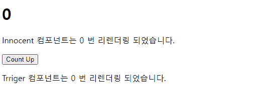
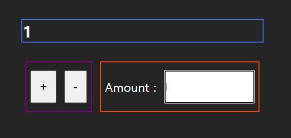
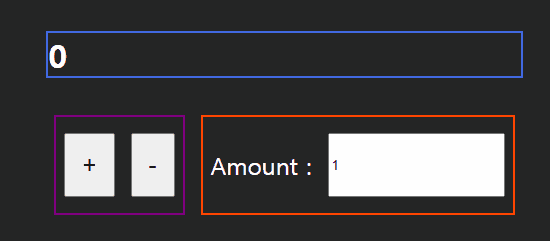

[Redux Toolkit DOCS - usage with typescript](https://redux-toolkit.js.org/usage/usage-with-typescript)

대부분의 내용은 공식문서와 지피티의 도움을 받아 작성되었습니다.

> 리덕스를 오랜만에 다시 리캡할 겸 공식문서를 읽고 있는데 알면 알 수록 매력적인 것 같습니다. :)
>
> 해당 게시글은 `React.useReducer` 를 사용해본 적이 있다는 전제조건 하에 작성되었습니다.

# Internal State vs External State

리액트의 상태값은 해당 상태의 스코프에 따라 `Internal,External` 로 나뉩니다.

```tsx title="Internal State" {4}
import React, { useState } from 'react';

const Counter = () => {
  const [count, setCount] = useState(0);

  return (
    <div>
      <p>Count: {count}</p>
      <button onClick={() => setCount(count + 1)}>Increment</button>
    </div>
  );
};

export default Counter;
```

`Internal State` 의 경우엔 컴포넌트 내부에서 정의된 상태 값으로 `useState , useReducer` 등으로 정의된 상태 값을 의미 합니다.

해당 상태 값들은 컴포넌트 내부에서만 접근 가능하며 상태의 변화를 추적하기가 비교적 쉽습니다.

상태 변경을 트리거 하는 영역들은 상태가 정의된 영역 내부에 존재하기 때문입니다.

```tsx title="External State" {3,5 , 11,12 ,17}
// App.tsx
const App = () => (
  <Provider store={store}>
    <Counter />
  </Provider>
);

...

const Counter = () => {
  const count = useSelector((state) => state.count);
  const dispatch = useDispatch();

  return (
    <div>
      <p>Count: {count}</p>
      <button onClick={() => dispatch(increment())}>Increment</button>
    </div>
  );
};

export default Counter;
```

`External State` 는 컴포넌트 외부에서 정의 된 상태값을 의미합니다. 대부분의 전역 상태 라이브러리들이 `Enternal State` 에 해당 됩니다.

대부분의 `External State` 는 `React.Context` 를 응용하여 개발 되었기 때문에 `props drilling` 없이 상태 값을 구독 하는 것을 가능하게 합니다.

## 간단한 React.Context 예시와 Context만으로 충분하지 않은 이유

```tsx title="React.Context 를 활용한 External State"{14-16,26,28}
import { createContext, Dispatch, SetStateAction } from 'react';
import { useState, useContext, useRef } from 'react';

type Counter = {
  count: number;
  setCount: Dispatch<SetStateAction<number>>;
};

const CounterContext = createContext<Counter>({ count: 0, setCount: () => {} });

const CounterProvider = ({ children }: { children: React.ReactNode }) => {
  const [count, setCount] = useState<number>(0);
  return (
    <CounterContext.Provider value={{ count, setCount }}>
      {children}
    </CounterContext.Provider>
  );
};

...

const App = () => {
  return (
    <div>
      <CounterProvider>
        <View />  // const { count } = useContext(CounterContext);
        <Innocent /> // 아무것도 구독하고 있지 않음
        <Trigger /> // const { setCount } = useContext(CounterContext);
      </CounterProvider>
    </div>
  );
};
```

다음과 같이 `CounterProvider` 하위에 존재하는 컴포넌트 중 `View , Trigger` 들은 `useContext` 를 통해 `CounterContext` 에 존재하는 상태 값들을 구독 하고 있습니다.

이 때 `Trriger` 컴포넌트에서 `count` 값을 증가 시키면 `CounterProvider` 내부에 존재하는 상태 값이 변경되고 해당 상태 값을 구독 하고 있는 값들이 리렌더링 됩니다.

다만 이는 문제가 조금 있습니다.



우리가 기대하는 것은 변경된 상태인 `count` 를 구독하고 있는 컴포넌트만 리렌더링 되길 기대하는데 `setCount` 를 구독하고 있는 `Trigger` 컴포넌트도 리렌더링 됩니다.

변경되는 상태값은 `count` 하나가 아닌 `{ count , setCount }` 객체 모두이기 때문입니다.

만약 이를 방지하고 싶다면 구독하고 있는 `Context` 들이 하나의 상태 값만을 전달해주도록 생성해야 합니다.

```tsx title="하나의 Provider 는 하나의 상태값만을 내려주도록 변경해야 한다." {4,6}#add
const CounterProvider = ({ children }: { children: React.ReactNode }) => {
  const [count, setCount] = useState<number>(0);

<SetCounterContext.Provider value={setCount}>
  <CounterContext.Provider value={count}>{children}</CounterContext.Provider>
</SetCounterContext.Provider>
```

이는 상태값이 몇 개 존재하지 않는다면 이정도 불편함을 감수하고 사용 할 수 있겠지만 사용하고자 하는 상태 값이 늘어나면 늘어 날 수록

`Provider` 들은 점점 더 많아지고 깊어질 것입니다.

```tsx title="이런식의 컴포넌트는 유지보수도 어렵고 가독성도 떨어진다."
<Provider1>
  <Provider2>
    ...
    <Provider99>
      <Provider100>{children}</Provider100>
    </Provider99>
  </Provider2>
</Provider1>
```

그 아무도 이런식의 컴포넌트를 원하진 않을 것입니다.

이런 불편함들을 해결하기 위해 다양한 해결 방법을 가진 전역 상태 관리 라이브러리들이 개발되었으며 이후 공부 할 `Redux Toolkit` 도 그 중 하나입니다.

# 바닐라 자바스크립트로 간단하게 Redux 구현해보기

`Redux toolkit` 을 공부하기 전 `Redux` 를 먼저 알아보고 `Redux toolkit` 을 알아보도록 하겠습니다.

`Redux toolkit` 은 `Redux` 에서 편리한 기능들이 내장된 라이브러리일 뿐 전체적인 개념은 모두 동일합니다.

따라서 `Redux` 의 로직만 이해한다면 `Redux toolkit` 은 쉽게 이해 할 수 있습니다.

## 사전 지식 : Flux 패턴

리덕스는 `Flux` 패턴을 사용하는 라이브러리입니다.

`useState` 를 사용하는 경우는 어떤 식의 상태가 변경될까요 ?


리덕스 공식 문서에선 기존의 `useState` 의 경우엔 `one way data flow` (양 방향 데이터 플로우)를 갖는다고 이야기 합니다.

위의 `Counter` 컴포넌트도 `count` 라는 상태 값을 가지고 있고 `setState(count => count + 1)` 라는 액션에 따라 상태가 변경되고 눈에 보이는 `View` 도 업데이트 됩니다.

이런 상태 변경 플로우는 단순하다는 장점이 존재하지만 만약 상태의 변경을 트리거 하는 컴포넌트 들이 여러 곳일 경우, 즉 **상태 변경 로직이 복잡한 경우** 에는 흐름을 추적하기 어렵게 합니다.

`Flux` 패턴은 리액트를 개발한 메타(구 페이스북) 에서 개발한 아키텍쳐 패턴으로 다음과 같은 데이터 흐름을 갖습니다.


가장 중요한 점은 중앙 집중형으로 상태들을 관리하는 `store` 가 존재하고 상태 값의 변경은 다음 과정을 통해 일어나게 됩니다.

1. 상태 변경을 유발하는 이벤트가 발생하면 `action` 객체 생성
2. `dispatcher` 가 `action` 객체를 `dispatch`
3. `reducer` 는 `dispatch` 된 `action` 객체에 따라 `store` 의 상태를 변경
4. `store` 는 변경된 상태 값을 `UI` 에게 전달

> 사실 리액트의 `useState` 도 `Flux` 패턴으로 구현 되어 있습니다. 다만 해당 과정은 라이브러리 내에 추상화 되어 있어 사용하는 입장에선 단순하게 `one way flow`를 가진 것 처럼 느껴지게 합니다.
>
> `function useState<S>(initialState: S | (() => S)): [S, Dispatch<SetStateAction<S>>];`
>
> 내부 타입 선언을 바라보면 `Flux` 패턴으로 이뤄진 것임을 알 수 있습니다. :)

## 바닐라 자바스크립트로 구현해보자

### UI 생성

우선 `UI` 부터 생성해보겠습니다.

```tsx title="@/App.tsx"
import View from './components/View';
import Counter from './components/Counter';
import Increase from './components/Increase';

const App = () => {
  return (
    <div>
      <View />
      <div className='flex'>
        <Counter />
        <Increase />
      </div>
    </div>
  );
};

export default App;
```



`View , Counter , Increase` 내부 모습은 나중 상태 관리 로직이 완성 된 후 보여드리도록 하겠습니다.

우선 세 컴포넌트 모두 하나의 `store` 내부에 존재하는 상태 값들을 구독하고 있을 예정입니다.

- `View` 는 `store.count` 를 받아 렌더링
- `Counter` 는 `store.count` 를 `store.increase` 만큼 변경
- `Increase` 는 `store.increase` 를 변경

### 타입 선언

```tsx title="@/types.d.ts"
export type State = {
  counter: number;
  increase: number;
};

export type Store = {
  state: State;
  dispatch: Dispatch<Action>;
  getState: () => State;
  subscribe: (listener: () => void) => () => void;
};

export type Action = {
  type: string;
  payload?: number;
};
```

사용 할 타입들입니다. 제일 중요한 개념은 `Store , Action` 의 타입입니다.

`Redux` 는 `store` 역할을 하는 하나의 객체에서 모든 상태 값들을 저장하고 있습니다.

상태 값을 사용하기 위해선 `store.getState()` 메소드를 통해 저장된 상태 값에 접근하고 , 상태 값 변경은 `store.dispatch(Action)` 을 통해 변경합니다.

> 엄밀히 말하면 변경하기 보다 리듀서에게 `Action` 객체를 넘기고 리듀서가 반환하는 새로운 상태 값을 갖습니다.

### 리듀서와 액션 크리에이터 메소드 생성

```tsx title="@/action.ts"
import { Action } from './types';

/* Action Type */
export const ADD = 'ADD';
export const SUBTRACT = 'SUBTRACT';
export const CHANGE_INCREASE = 'CHANGE_INCREASE';

/* Action Creator */
export const AddNumber = (): Action => {
  return {
    type: ADD,
  };
};

export const SubtractNumber = (): Action => {
  return {
    type: SUBTRACT,
  };
};

export const changeIncrease = (payload: string): Action => {
  return {
    type: CHANGE_INCREASE,
    payload: Number(payload),
  };
};
```

액션 크리에이터 함수들을 생성해줍니다. 해당 함수들은 `Dispatcher` 에게 전달 할 액션 객체를 생성하는 메소드입니다.

```tsx title="@/reducer.ts"
import { ADD, SUBTRACT, CHANGE_INCREASE } from './action';
import type { State, Action } from './types';

const appReducer = (state: State, action: Action): State => {
  switch (action.type) {
    case ADD:
      return { ...state, counter: state.counter + state.increase };
    case SUBTRACT:
      return {
        ...state,
        counter: state.counter - state.increase,
      };
    case CHANGE_INCREASE:
      return { ...state, increase: action.payload || 1 };
    default:
      return state;
  }
};

export default appReducer;
```

`dispatch` 된 액션 객체에 따라 새로운 상태 값을 반환하는 리듀서도 생성해줍니다.

### Store 생성하기

```tsx title="@/store.tsx" {14-17 , 39-43}
import { createContext, Dispatch, useReducer } from 'react';
import { State, Action, Store } from './types';
import appReducer from './reducer';

export const StateContext = createContext<Store | null>(null);
export const DispatchContext = createContext<Dispatch<Action> | null>(null);

const initialState = {
  counter: 0,
  increase: 1,
};

export const Provider = ({ children }: { children: React.ReactNode }) => {
  const [state, dispatch] = useReducer<React.Reducer<State, Action>>(
    appReducer,
    initialState,
  );
  const listeners: (() => void)[] = [];

  const store = {
    state,
    dispatch,
    getState: () => state,
    subscribe: (listener: () => void) => {
      let isSubscribed = true;

      listeners.push(() => {
        if (isSubscribed) listener();
      });

      const unsubscribe = () => {
        isSubscribed = false;
      };
      return unsubscribe;
    },
  };

  return (
    <StateContext.Provider value={store}>
      <DispatchContext.Provider value={dispatch}>
        {children}
      </DispatchContext.Provider>
    </StateContext.Provider>
  );
};
```

이후 `Provider` 컴포넌트 내부에서 이전에 만들어둔 `appReducer` 와 초기 상태값으로 `state,dispatch` 를 생성해줍니다.

이후 해당 상태 값들을 담고 있는 `store` 객체를 생성한 후 `Context` 를 통해 하위로 전달해줍니다.

> `listeners,subscribe` 의 정체는 추후 설명합니다.

```tsx title="@/Main.tsx" {1,4,6}#add
import { Provider } from './store';

ReactDOM.createRoot(document.getElementById('root')!).render(
  <Provider>
    <App />
  </Provider>,
);
```

이제 `StateContext , DispatchContext` 를 통해 `store , dispatch` 를 사용 할 수 있게 되었습니다.

### useSelector , useDispatch 훅 생성하기

```tsx title="@/hooks.tsx"
import { useContext, useSyncExternalStore } from 'react';
import { DispatchContext, StateContext } from './store';

import type { State } from './types';

export const useSelector = (selector: (state: State) => State[keyof State]) => {
  const store = useContext(StateContext);

  if (!store) {
    throw new Error('Provider 내부에 존재해야 합니다.');
  }

  const getSnapshot = () => selector(store.getState());
  return useSyncExternalStore(store.subscribe, getSnapshot);
};

export const useDispatch = () => {
  const dispatch = useContext(DispatchContext);

  if (!dispatch) {
    throw new Error('Provider 내부에 존재해야 합니다.');
  }

  return dispatch;
};
```

이후 `StateContext , DispatchContext` 를 구독하는 커스텀 훅을 생성해줍니다.

`useDispatch` 의 경우에는 아 ~ `useReducer` 로 생성된 `dispatch` 를 반환하는구나를 알 수 있습니다.

`useSelector` 의 경우가 조금 복잡한데 인수로 받은 `selector` 콜백 함수를 이용하여 `store` 에 접근하여 일명 `snapShot` 을 반환합니다.

이 때 `useSyncExternalStore` 를 통해 `store`의 상태가 변경 될 때 마다 반환 된 상태 슬라이스 (`getSnapshot` 의 반환 값) 과 이전에 반환된 슬라이스 값을 비교하고

리렌더링이 필요할 경우 리렌더링을 유발합니다.

이를 통해 `getSnapshot` 메소드가 반환하는 , `selector` 콜백 함수를 통해 구독하고 있는 `store`의 상태 슬라이스 , 상태 값이 변경되지 않았다면 리렌더링을 유발하지 않고 상태 값이 변경 되었다면 리렌더링이 일어납니다.

# 완성된 결과물

```tsx title="@/View.tsx"
import { useSelector } from '@/hooks';

const View = () => {
  const count = useSelector((state) => state.counter);

  return <h1 className='view'>{count}</h1>;
};

export default View;
```

```tsx title="@/Counter.tsx"
import { useDispatch } from '@/hooks';
import { AddNumber, SubtractNumber } from '@/action';

const Counter = () => {
  const dispatch = useDispatch();

  const handlePlus = () => {
    dispatch(AddNumber());
  };
  const handleMinus = () => {
    dispatch(SubtractNumber());
  };

  return (
    <div className='flex counter'>
      <button onClick={handlePlus}>+</button>
      <button onClick={handleMinus}>-</button>
    </div>
  );
};

export default Counter;
```

```tsx title="@/Increase.tsx"
import { changeIncrease } from '@/action';
import { useDispatch } from '@/hooks';
const Increase = () => {
  const dispatch = useDispatch();
  const handleChange = (e: React.ChangeEvent<HTMLInputElement>) => {
    dispatch(changeIncrease(e.target.value));
  };

  return (
    <div className='flex increase'>
      <label htmlFor=''>Amount : </label>
      <input type='text' defaultValue={1} onChange={handleChange} />
    </div>
  );
};

export default Increase;
```



물론 이 결과물이 `Redux` 를 아주 단순하게 작성해둔 것이지만 중앙 집권적으로 상태값을 저장하는 `store` 와 `useSelector` 훅을 통해 `store` 에 접근하는 방법, `useDispatch` 를 통해 상태를 업데이트 하는 방법 등을 이해하기엔 충분할 것입니다.
