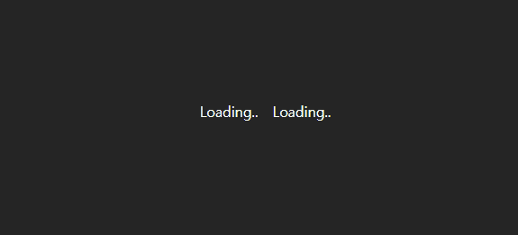

`NextJS` 를 사용하기 시작하면서 가장 느낀 점은 생각보다 웹 개발을 하는데 있어 상태 값이 필요하지 않았다는 것입니다.

물론 만들어본 것이 아직 고작 블로그 하나이긴 하지만 대부분의 상태값으로 사용 되는 것들은 라우팅 되는 경로들과 일치되어야 하는 것이기 때문에

오히려 상태 값을 정의하기보다 라우팅 되는 주소를 상태처럼 이용하는 경우가 많았습니다.

물론 이는 내가 복잡한 로직을 다루지 않았기 때문이기도 하겠지만 앞으로 만들 거라고 예상 되는 프로젝트들에선 클라이언트 상태보다는 API 요청과 관련된 서버 상태를 더욱 다루게 될 것 같았습니다.

그!래!서! 리액트 쿼리를 경험해보기로 했습니다.

리덕스 외길 인생을 걷겠느니하고 일주일간 리덕스 툴킷을 다시 공부하고 이후엔 리덕스 쿼리를 공부하겠느니 했는데 앞으로 생각보다 클라이언트 상태를 관리 할 일이 클 거 같지 않았다. 내가 인터렉티브한 웹 개발을 주로 할 것 같지도 않았기 때문입니다.

그래서 무거운 리덕스를 유지하느니보다 `Zustand , Redux Query` 를 상태 관리 스택으로 삼아야겠다 싶었습니다.

# 클라이언트 상태와 서버 상태

리액트에서 렌더링에 영향을 미치는 상태는 클라이언트 상태와 서버 상태가 존재합니다.

클라이언트 상태란 우리에게 익숙한 개념으로 현재 모달이 열려있는지, 웹 화면의 테마는 무슨 모드인지와 같이 **클라이언트 단에서 관리되는 상태** 입니다.

클라이언트 상태의 가장 큰 특징은 **상태 변화를 유발하는 근원지가 클라이언트** 라는 점입니다.

서버 상태란 **서버 단에서 관리 되는 상태** 를 의미합니다. 서버와 API 요청을 주고 받는 것이 가장 대표적인 예시일 것입니다.

서버와 API 통신을 하게 되면 상태는 서버와의 소통 과정에서 자주 변합니다.

통신을 시작하여 종료 하기 전까지 **통신 성공 여부와 관련된 상태 변화**가 적어도 4가지는 존재합니다. (`idle, loading , succed , fail`)

응답값도 서버 통신 과정 속에서 비어있거나 과거의 정보에서 최신 정보 혹은 에러 값을 받을 수 있습니다.

이렇게 서버 상태는 **상태 변화를 유발하는 근원지가 클라이언트가 아닌** 상태라는 데서 클라이언트 상태와 차이점을 갖습니다.

## 왜 두 상태를 다르게 다루는게 좋을까요 ?

이렇게 서로 다른 특징을 갖는 상태들을 동일한 메커니즘으로 관리 하지 않는 것을 추천하는 이유는 근본적으로 **두 상태들의 사용 목적이 다르고 이로 인해 중요도가 다르고 관리 방법이 다르기 때문**입니다.

클라이언트 상태는 주로 **클라이언트에 의해 발생한 이벤트** 에 대해 **클라이언트에게 보여지는 값** 이 일치하기를 기대합니다.

테마 버튼을 클릭하면 테마가 변경되고, 모달창을 닫으면 모달 창이 보여지지 않길 원합니다.

서버 상태는 **클라이언트와 서버에 의해 발생한 이벤트** 와 **서버에게 기대하는 결과** 가 일치하기를 기대합니다.

예를 들어 특정 포스트를 보고 싶을 땐 서버로부터 해당 포스트를 응답 받거나, 개인 정보를 변경하면 서버에게 변경점이 적용 되길 기대합니다.

어떤 점이 더 중요하다 이야기 할 순 없지만 서버 상태 변화는 더욱 세심하게 신경 써줘야 합니다.

예기치 못한 이유로 인해 오류가 발생 할 수도 있고, 발생한 오류를 적절하게 대처하지 않으면 사용자 경험에 있어 악영향을 끼칠 가능성이 큽니다.

따라서 관리 방법이 다른 두 상태값을 하나의 상태처럼 취급하거나, 하나의 저장소에서 관리하기 되면 관리 하기 어려워집니다.

상태를 구분하는 것도 힘들고 서로 다른 로직이 한 저장소에서 존재하게 될 경우 해당 아키텍쳐는 관리하기 어려워질 것입니다.

# 리액트 쿼리 없이 커스텀 훅으로 상태 관리 해보기

리액트 쿼리에 대해 알아보기 전, 리액트 쿼리 없이 서버 상태를 관리하는 방법을 알아봅시다.

다양한 방법이 있겠지만 가장 많이 사용되는 패턴을 사용해보겠습니다.

```tsx title="커스텀 훅으로 GET요청을 처리하는 일반적인 방법" {9-12,20-23,30,31,35,36,55}
import { useEffect, useState } from "react";

type Todo = {
  id: number;
  content: string;
};

const useFetching = <T,>({
  callbackFn,
  deps = [],
}: {
  callbackFn: () => Promise<T>;
  deps?: (string | number)[];
}): {
  data: T | [];
  error: string;
  isLoading: boolean;
  isError: boolean;
} => {
  const [data, setData] = useState<T | []>([]);
  const [error, setError] = useState<string>("");
  const [isLoading, setIsLoading] = useState<boolean>(false);
  const [isError, setIsError] = useState<boolean>(false);

  useEffect(() => {
    let mounted = true;

    const fetchData = async () => {
      try {
        setIsLoading(true);
        setIsError(false);
        const data = await callbackFn();
        setData(data);
      } catch (error) {
        setIsError(true);
        setError(
          error instanceof Error
            ? error.message
            : "Unexpected Error is ouccured"
        );
      } finally {
        if (mounted) {
          setTimeout(() => {
            setIsLoading(false);
          }, 1000);
        }
      }
      return () => {
        mounted = false;
      };
    };
    fetchData();
  }, deps);

  return { data, error, isLoading, isError };
};
```

아마 이런식으로 `useEffect` 안에서 API 통신 요청과 관련된 상태 변화들을 하는 해당 패턴을 가장 많이 사용 할 것입니다.

```tsx title="데이터 패칭 콜백함수 설정"
const ENDPOINT = "http://localhost:3000/api/dev/todo";
const fetchTodo = async (): Promise<Todo[]> => {
  const response = await fetch(ENDPOINT);
  if (!response.ok) {
    throw new Error("Fail to fetch");
  }
  const data: Todo[] = await response.json();
  return data;
};
```

```tsx title="커스텀훅으로 데이터와 로딩 상태를 받는다." {3-9}
const App = () => {
  const [text, setText] = useState<string>("");
  const {
    data: todos,
    isLoading,
    isError,
  } = useFetching<Todo[]>({
    callbackFn: fetchTodo,
  });

  if (isLoading) return <div>loading ...</div>;
  if (isError) return <div>error</div>;

  return (
    <div>
      <ul>
        {todos.map(({ id, content }) => (
          <li key={id}>{content}</li>
        ))}
      </ul>
      {/* 생략 .. */}
    </div>
  );
};

export default App;
```


이렇게 로딩 상태나 에러 등을 관리하는 커스텀훅을 생성하여 사용 할 수 있습니다.

## 커스텀훅으로 만들 수도 있는데 리액트 쿼리를 왜 쓰면 좋나요 ?

저는 여기까지만 만들고 공식 문서를 읽기 전까지 "아니 .. 커스텀훅 쓰면 되지 뭐하러 라이브러리 써서 번들 사이즈를 키우나 .." 싶었습니다.

그런데 관리해주는 상태와 매개 변수를 보면 정말 세심하게 컨트롤 할 수 있겠구나 싶습니다.

가장 기본적인 리액트쿼리의 메소드인 데이터를 받아오는 `useQuery` 훅의 사용 예시만 짧게 살펴봅시다.

```tsx title="useQuery의 반환값과 인수"
const {
  data,
  dataUpdatedAt,
  error,
  errorUpdatedAt,
  failureCount,
  failureReason,
  fetchStatus,
  isError,
  isFetched,
  isFetchedAfterMount,
  isFetching,
  isInitialLoading,
  isLoading,
  isLoadingError,
  isPaused,
  isPending,
  isPlaceholderData,
  isRefetchError,
  isRefetching,
  isStale,
  isSuccess,
  refetch,
  status,
} = useQuery(
  {
    queryKey,
    queryFn,
    gcTime,
    enabled,
    networkMode,
    initialData,
    initialDataUpdatedAt,
    meta,
    notifyOnChangeProps,
    placeholderData,
    queryKeyHashFn,
    refetchInterval,
    refetchIntervalInBackground,
    refetchOnMount,
    refetchOnReconnect,
    refetchOnWindowFocus,
    retry,
    retryOnMount,
    retryDelay,
    select,
    staleTime,
    structuralSharing,
    throwOnError,
  },
  queryClient
);
```

와우, 장난 아닙니다.

엄청나게 많은 상태들을 받아 사용 할 수도, 커스터마이징 할 수도 있습니다.

# 일단 먼저 써보자 , React Query 의 기본 개념

`Tanstack Query , 일명 React Query` 는 전역 상태 관리 라이브러리로 프로바이더 스코프 안에 존재하는 컴포넌트 안에서 데이터를 요청 할 수 있으며

인수로 전달한 `Query Key` 가 동일 하다면 다른 컴포넌트에서 요청이 완료 된 캐싱 된 데이터를 사용하는 것이 가능합니다.

즉, 서로 다른 컴포넌트에서 동일한 `API` 요청이 있을 때 매번 요청하는 것이 아닌, 이전에 응답을 받아온 응답 값을 사용 하는 것이 가능합니다.

## QueryClient

```tsx title="Context처럼 QuercyClient 인스턴스를 Provider로 내려주자" {1-2,5,7}#add
import { QueryClient, QueryClientProvider } from "@tanstack/react-query";
const queryClient = new QueryClient();

ReactDOM.createRoot(document.getElementById("root")!).render(
  <QueryClientProvider client={queryClient}>
    <App />
  </QueryClientProvider>
);
```

마치 `React.ContextAPI` 처럼 `QueryClient` 로 생성된 `client` 인스턴스를 하위로 내려줍니다.

**하위에 존재하는 컴포넌트들은 `client` 인스턴스 내에 값을 저장하거나 불러옴으로서 `API` 데이터를 전역에서 사용하는 것이 가능합니다.**

추후 이야기 할 다양한 기능들은 대부분 `client` 을 이용함으로서 사용 가능 합니다.

## useQuery

`useQuery` 는 데이터를 받아오는, `GET` 요청과 같이 서버의 데이터를 변경하지 않는 `API` 요청에 대해 사용합니다.

```tsx title="보일러플레이트 코드가 많이 줄어든 API 요청" {1,3-10}#add
import { useQuery } from "@tanstack/react-query";
const App = () => {
  const {
    data: todos = [],
    isLoading,
    isError,
  } = useQuery({
    queryKey: ["todo"],
    queryFn: fetchTodo,
  });

  if (isLoading) return <div>Loading..</div>;
  if (isError) return <div>Error is occured</div>;

  return (
    <div>
      <ul>
        {todos.map(({ id, content }) => (
          <li key={id}>{content}</li>
        ))}
      </ul>
    </div>
  );
};

export default App;
```

### @param - queryFn

`queryFn` 은 `API` 요청에 사용 할 콜백 함수를 의미합니다.

이 때 해당 콜백함수는 항상 `Promsie` 로 된 객체를 반환하거나, `Error` 객체를 반환해야 합니다.

### @param - queryKey

`queryKey` 는 캐싱에서 인식 할 값들을 담을 배열을 의미합니다.

해당 배열에는 원시값이 들어갈 수도 객체나 변수가 들어갈 수도 있습니다.

동일한 배열을 가진 경우에는 동일한 `query` 로 인식하여 서로 다른 컴포넌트에서 캐싱 된 값을 사용 할 수 있습니다.

이 때 **동일한 값들이 들어있더라도 배열의 순서가 다르다면 서로 다른 `query`** 로 인식합니다.

> 하지만 배열 내 값인 객체는 순서가 다르더라도 상관 없습니다.
>
> `[{id , content}]` 와 `[{content , id}]` 는 동일한 배열로 인식

또 배열에 담긴 값이 변경 된 경우 , 캐싱 된 데이터들에 해당 `key` 가 존재하지 않기 때문에 새롭게 렌더링을 요청하게 됩니다.

```tsx title="queryKey에 변수가 있는 경우엔 dummy 상태가 변경 될 때 마다 렌더링이 발생하게 된다." {4,10,24-28}#add
import { useState } from "react";
import { useQuery } from "@tanstack/react-query";
const App = () => {
  const [dummy, setDummy] = useState<number>(0);
  const {
    data: todos = [],
    isLoading,
    isError,
  } = useQuery({
    queryKey: ["todo", dummy],
    queryFn: fetchTodo,
  });

  if (isLoading) return <div>Loading..</div>;
  if (isError) return <div>Error is occured</div>;

  return (
    <div>
      <ul>
        {todos.map(({ id, content }) => (
          <li key={id}>{content}</li>
        ))}
      </ul>
      <button
        onClick={() => {
          setDummy((prev) => prev++);
        }}
      >
        re-render!
      </button>
    </div>
  );
};

export default App;
```

만약 서로 다른 컴포넌트에서 동일한 `queryKey` 가 존재하는 경우엔 어떻게 되는지 확인해보겠습니다.

```tsx title="기존 로직을 Todo 컴포넌트로 캡슐화했다."
const App = () => {
  return (
    <div className="flex">
      {/* 기존 코드를 캡슐화 한 Todo 컴포넌트 */}
      <Todo />
      <Todo />
    </div>
  );
};
```



하지만 그렇다고 해서 현재 네트워크 요청이 일어나지 않는 것은 아닙니다.

데이터를 캐싱 하더라도 해당 데이터가 신선한지, 혹은 캐싱 된 데이터를 사용할지에 대한 플래그를 세우지 않았기 때문입니다.

위에서 보았듯 설정 할 수 있는 값들이 무지하게 많습니다. 지금 다루려면 너무 내용이 길어질 것 같아 추후 프로젝트를 진행하며 다뤄보겠습니다.

### @return - 서버 상태 관련 프로퍼티

| 속성         | 타입       | 설명                                                                                      |
| ------------ | ---------- | ----------------------------------------------------------------------------------------- |
| `data`       | `TData`    | 쿼리 함수가 반환한 데이터입니다. 쿼리가 아직 성공하지 않았다면 `undefined`입니다.         |
| `error`      | `TError`   | 쿼리 함수가 실패한 경우 반환된 에러 객체입니다. 실패하지 않았다면 `null`입니다.           |
| `isLoading`  | `boolean`  | 쿼리가 **처음으로 데이터를 로드**할 때 `true`입니다.                                      |
| `isFetching` | `boolean`  | 쿼리가 데이터를 가져오는 중일 때 `true`입니다. (배경에서 리패칭을 포함)                   |
| `isError`    | `boolean`  | 쿼리가 실패했을 때 `true`입니다.                                                          |
| `isSuccess`  | `boolean`  | 쿼리가 성공적으로 완료되었을 때 `true`입니다.                                             |
| `status`     | `string`   | 쿼리의 현재 상태를 나타내는 문자열입니다. (`'idle'`, `'loading'`, `'error'`, `'success'`) |
| `refetch`    | `function` | 쿼리를 수동으로 다시 가져오는 함수입니다.                                                 |

다음과 같이 서버 상태와 관련된 프로퍼티들이 존재합니다.

> 더 많은 내용은 자주 써봐야 자신있게 이야기 할 수 있을 것 같습니다...

이 뿐 아니라 더 다양한 유즈 케이스가 많은데 그 또한 추후 경험해본 다음에 더 작성해보겠습니다.
(캐싱 데이터의 신선도를 확인하거나 실패 시 retry 하는 등 .. 다양한 유즈 케이스가 존재합니다.)

어쨋든 이번 첫 사용에선 , 아 ~ 서버 상태를 위한 코드들을 추상화 해놨구나 정도로만 알고 넘어가봅시다.

> 내용을 적다보니 너무 내용이 많아져서 `useMutation` 과 관련된 포스트는 추후 실제 프로젝트에서 사용한 후기와 함께 다시 적겠습니다.
