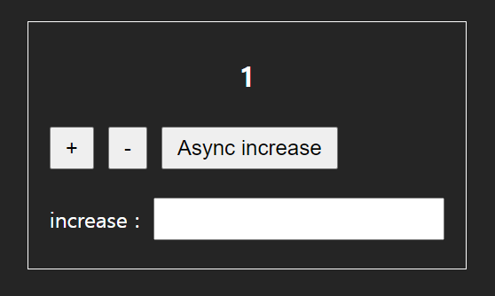
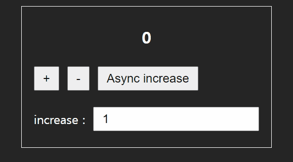
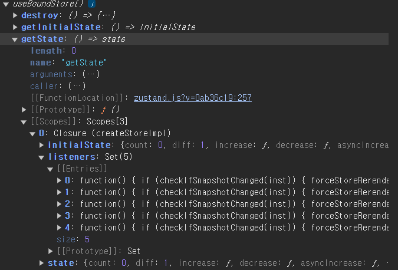
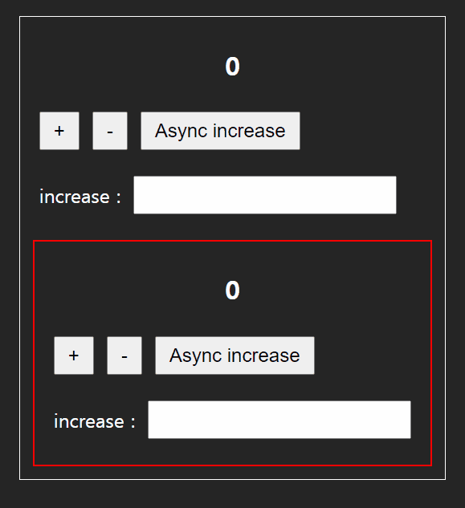

`Redux` 에 이리 치이고 저리 치이다가 전역 상태 관리 라이브러리로 `Zustand` 를 경험해보기로 하고 공식 문서를 읽어봤습니다.

전체적으로 아주 귀여운 어투로 작성 된 공식 문서입니다.

[Zustand 공식 문서](https://docs.pmnd.rs/zustand/getting-started/introduction)

상태 변경을 가장 직관적으로 이해 할 수 있는 것 중 가장 구현하기 쉬운 카운터를 예시로 작성할 것이기 때문에 UI를 생성해줍니다.



```tsx title="Counter 컴포넌트"
const Counter = () => {
  const count = 1;

  return (
    <div>
      <h1>{count}</h1>
      <div className='flex'>
        <button>+</button>
        <button>-</button>
      </div>
      <div className='flex'>
        <label htmlFor='increase'>increase : </label>
        <input type='text' />
      </div>
    </div>
  );
};

export default Counter;
```

`Zustand` 에 대한 이야기를 하기 전 우선 사용해보면서 `Zustand` 의 장점을 알아봅시다.

# 기본 Store 만들기

```tsx title="@/store/useCounter.tsx"
import { create } from 'zustand';

export type CountState = {
  count: number;
  diff: number;
  increase: () => void;
  decrease: () => void;
  asyncIncrease: () => void;
  changeDiff: (newDiff: string) => void;
};
const useCounter = create<CountState>((set) => ({
  count: 0,
  diff: 1,
  increase: () => set((state) => ({ count: state.count + state.diff })),
  decrease: () => set((state) => ({ count: state.count - state.diff })),
  asyncIncrease: async () => {
    return await new Promise(() =>
      setTimeout(() => {
        set((state) => ({ count: state.count + state.diff }));
      }, 1000),
    );
  },
  changeDiff: (newDiff) => set(() => ({ diff: Number(newDiff || 1) })),
}));

export default useCounter;
```

다음과 같이 `useCounter` 라는 훅 처럼 생긴 전역 상태 저장소를 생성해줬습니다.

매우 단순합니다. 단순히 `create` 라는 메소드에게 상태값과 상태값을 변경하는 로직이 담긴 객체를 반환하는 콜백함수를 전달해주면 끝입니다.

이 때 콜백 함수의 첫 번째 매개변수인 `set` 은 해당 `store` 의 상태에 접근하여 상태를 변경시키는 콜백 함수입니다.

`store` 를 생성하는데 있어 벌써 `Zustand` 의 특징이 보입니다.

## 특징 1. Zustand 는 심플하고 미니멀 합니다.

보면 알 수 있듯이 불필요한 보일러 플레이트 코드가 없습니다.

정말 단순하게 상태를 정의하고, 상태 변경을 트리거 하는 메소드를 정의해주면 됩니다.

그리고 눈치를 챘을지 모르겠지만 `set` 에게 전달되는 콜백 함수에서 반환되는 반환값을 살펴봅시다.

```tsx title="콜백함수의 반환값의 모양이 요상하다?"
  increase: () => set((state) => ({ count: state.count + state.diff })),
```

반환값의 양상을 보면 우리에게 익숙한 패턴이 아닙니다.

대부분 변경을 하려면 `{...state , count : state.count + state.diff}` 와 같이 `immutable` 하게 변경을 해줘야 하는데 그렇게 사용하지 않고 있습니다.

이는, `Zustand` 가 제공하는 편의성입니다.

`Zustand`도 `Immutalbe` 하게 변경합니다. 하지만 `DX` 향상을 위해 **한겹의 객체는 덮어씌워줍니다.**

그러니 위의 코드는 `{...state , count : state.count + state.diff}` 와 동일합니다.

> 물론 두 겹 이상의 계층적인 상태는 덮어씌워줘야 합니다. 다만 이 때도 가장 최상단은 자동으로 덮어씌워줍니다.

```tsx title="계층적인 형태를 다루는 예시,두 겹 이상은 다음처럼 덮어씌워줘야 합니다."
import { create } from 'zustand';

export type ComplexState = {
  user: {
    name: string;
    age: number;
  };
  settings: {
    theme: string;
  };
  updateUserName: (newName: string) => void;
  updateTheme: (newTheme: string) => void;
};

const useComplexStore = create<ComplexState>((set) => ({
  user: { name: 'John', age: 30 },
  settings: { theme: 'light' },
  updateUserName: (newName) =>
    set((state) => ({ user: { ...state.user, name: newName } })),
  updateTheme: (newTheme) =>
    set((state) => ({ settings: { ...state.settings, theme: newTheme } })),
}));
```

# 컴포넌트에서 전역 상태 사용하기

좀 더 전역 상태 관리 라이브러리임을 알기 쉽게 이전에 만들어둔 `Counter` 컴포넌트를 기능 별로 나눠보았습니다.

```tsx title="훅을 사용하듯 store에서 필요한 값만 뺴와 사용하자"
import useCounter from '@/store/useCounter';

const CountView = () => {
  const count = useCounter((state) => state.count);
  return <h1>{count}</h1>;
};

const CountButton = () => {
  const increase = useCounter((state) => state.increase);
  const decrease = useCounter((state) => state.decrease);
  const asyncIncrease = useCounter((state) => state.asyncIncrease);

  return (
    <div className='flex'>
      <button onClick={increase}>+</button>
      <button onClick={decrease}>-</button>
      <button onClick={asyncIncrease}>Async increase</button>
    </div>
  );
};

const CountChange = () => {
  const changeDiff = useCounter((state) => state.changeDiff);
  const handleChange = (e: React.ChangeEvent<HTMLInputElement>) => {
    changeDiff(e.target.value);
  };

  return (
    <div className='flex'>
      <label htmlFor='increase'>increase : </label>
      <input type='text' onChange={handleChange} />
    </div>
  );
};

const Counter = () => {
  return (
    <div>
      <CountView />
      <CountButton />
      <CountChange />
    </div>
  );
};

export default Counter;
```

이 얼마나 사용하기 간단한가요 , `Redux Toolkit` 에선 `useSelector` 와 같은 훅을 사용해줘야했다면 그저 단순하게 `store` 에 직접 접근하여 값을 뺴오면 됩니다.

또 충격적 사실은, `Context` 역할을 하는 `Provider` 가 없이도 상태를 공유하는 것이 가능합니다.

`Zustand` 는 `React.ContextAPI` 가 아닌 **싱글톤 패턴과 클로저** 를 이용해 상태 값을 관리 합니다.

`create` 메소드로 생성된 `store` 는 상위 컨텍스트에서 상태 값들을 저장하고 사용 할 땐 상위 컨텍스트에 존재하는 상태값을 꺼내와 사용하게 됩니다.

또 , 싱글톤 패턴을 이용하기 때문에 사용처에서 모두 동일한 저장소를 이용하는 것이 가능합니다.

> 진짜 대박인 것 같습니다.



## 특징 2: 의존성이 존재하지 않으며 선택적 구독을 지원한다.

이전 포스트에서 말했듯 `React.ContextAPI` 의 경우에는 구독하고 있는 `Context` 에 `N` 개의 상태가 있을 때 하나의 값만 사용하더라도

해당 `Context` 가 리렌더링 되면 사용중인 상태 변화 유무와 상관없이 리렌더링이 일어났습니다.

하지만 `state => state.count` 와 같이 콜백 함수를 통해 원하는 값만 가져오는 형태는 사용하고자 하는 상태 값 변화에만 영향을 받습니다.

```tsx title="store를 console.dir로 확인해보자"
console.dir(useCounter);
```



`store` 에서 상태를 가져오는 `getState` 메소드를 확인해보면 클로저로 상위에 존재하는 `state` 들을 바라보고 있고

상태를 불러 올 때 만약 `snapShot` 이 변경되었다면 구독 하고 있는 컴포넌트들의 렌더링을 유발하는 `checkifsnotChanged` 메소드를 담은 배열 `listeners` 가 존재하는 모습을 볼 수 있습니다.

이로 인해 `Context` 가 불필요하며 선택적 구독을 통해 불필요한 리렌더링을 유발하지 않습니다.

## 특징 3: Zustand 는 유연하다.

위처럼 `useCounter` 와 같이 `store` 에 직접 접근하여 상태 값을 받아오는 경우도 존재하지만 `Zustand` 는 상태값을 원하는 방식으로 커스터마이징 하는 것이 가능합니다.

그 중 몇 가지 방법만 먼저 알아봅시다.

`store` 가 존재한다는 점에서 `Redux Toolkit` 과 유사한 부분이 있지만 `reducer` 패턴을 이용하지 않는다는 편리함이 존재합니다.

하지만 만약 상태 변화의 흐름을 알고 싶다면, `reducer` 를 생성해주고 사용해주면 됩니다 !

```tsx title="setter method를 생성해둔 리듀서에게 전달하도록 하여 Flux 패턴을 이용하는게 가능합니다."
import { create } from 'zustand';

type State = {
  count: number;
};

type Actions = {
  increment: (qty: number) => void;
  decrement: (qty: number) => void;
};

type Action = {
  type: keyof Actions;
  qty: number;
};

const countReducer = (state: State, action: Action) => {
  switch (action.type) {
    case 'increment':
      return { count: state.count + action.qty };
    case 'decrement':
      return { count: state.count - action.qty };
    default:
      return state;
  }
};

const useCountStore = create<State & Actions>((set) => ({
  count: 0,
  dispatch: (action: Action) => set((state) => countReducer(state, action)),
}));
```

# store 모습 변경하기

만약 `store` 에서 인수를 꺼내오는 `useCounter(state => state.SOMETHING)` 방식이 불편하다 느껴지면 `store` 자체를 다르게 변경 할 수 있습니다.

`Zustand` 공식문서에서 소개하는 방법을 보여드리겠습니다.

```tsx title="@/custom.tsx"
import { StoreApi, UseBoundStore } from 'zustand';

type WithSelectors<S> = S extends { getState: () => infer T }
  ? S & { use: { [K in keyof T]: () => T[K] } }
  : never;

export const createSelectors = <S extends UseBoundStore<StoreApi<object>>>(
  _store: S,
) => {
  const store = _store as WithSelectors<typeof _store>;
  store.use = {};
  for (const k of Object.keys(store.getState())) {
    (store.use as any)[k] = () => store((s) => s[k as keyof typeof s]);
  }
  return store;
};
```

별거 없습니다. `createSelecotr` 는 `store.use` 라는 프로퍼티에 `create`로 생성된 `store` 들의 프로퍼티 명으로 상태를 꺼내오는 `store` 생성기를 만들어줍니다.

```tsx title="store를 이용하는 다른 방법" {4}#remove {5}#add
export const counterStore = createSelectors(useCounter);
...
const CountView = () => {
  // const count = useCounter((state) => state.count);
  const count = counterStore.use.count();
  return <h1>{count}</h1>;
};
```

# 의존성 주입하기

`Zustand` 의 상태들은 `Context` 가 필요하지 않고 전역에서 접근 가능한 상태 저장소입니다.

따라서 어떤 환경에서도 영향을 받지 않는다는 장점이 존재하지만 가끔씩은 의존성을 주입하고 싶은 경우들이 있습니다.

예를 들어 특정 컴포넌트 하위에서만 접근 가능하게 하고 싶다거나, 상위에서 결정된 값을 이용해 상태를 형성하고 싶다거나와 같이 말입니다.

```tsx title="useCounter를 한 곳에서만 쓰고 싶은 경우" {7-9}
import Counter from './components/Counter';
const App = () => {
  return (
    <div className='wrapper'>
      <Counter />
      {/* 만약 같은 로직을 사용하는 컴포넌트가 존재한다면 ? */}
      <div className='wrong'>
        <Counter />
      </div>
    </div>
  );
};

export default App;
```



가장 쉽게 이 문제를 해결하는 방법은 각 영역에서 사용 할 `useCounter` 를 각기 다른 두 개를 만들어주는 방법입니다. (`useCounter1 , useCounter2 ..` 이런식으로)

하지만 이렇게 만들어도 사용하는 사람에 따라 예상치 못한 휴먼 에러가 발생 할 수 있습니다.

`useCounter2` 를 불러와야 하는데 `useCounter1` 을 불러온다거나 이런 식으로 말입니다.

이 때, `React.ContextAPI` 를 이용하여 의존성을 주입하여 문제를 해결 할 수 있습니다.

## Context 로 store 를 내려주자

```tsx title="store를 Context로 내려주자"
import { createContext, useContext } from 'react';
import useCounter from './useCounter';

const CounterContext = createContext<typeof useCounter | null>(null);
export const CounterProvider = ({
  children,
}: {
  children: React.ReactNode;
}) => {
  return (
    <CounterContext.Provider value={useCounter}>
      {children}
    </CounterContext.Provider>
  );
};

export const useCounterContext = () => {
  const _useCounter = useContext(CounterContext);
  if (!_useCounter) {
    throw new Error('Counter 컨텍스트 내에서만 사용해야 합니다.');
  }

  return _useCounter;
};
```

```tsx title="Context 외부에선 해당 store에 접근하지 못하는 모습"
import Counter from './components/Counter';
import { CounterProvider } from './store/Provider';
const App = () => {
  return (
    <div className='wrapper'>
      <CounterProvider>
        <Counter />
      </CounterProvider>
      <div className='wrong'>
        <Counter /> {/* 해당 부분에서 Error 가 발생한다. */}
      </div>
    </div>
  );
};

export default App;
```

이렇게 사용해주게 되면 해당 `store` 에 `React.ContextAPI` 의존성을 주입하여 의도하지 않은 곳에서 `store` 에 접근하는 행위를 방지해줄 수 있습니다.

## 초기값을 외부에서 주입 받아 store 생성하기

```tsx title="store의 초기값이 외부에서 주입된다면 ?" {6,7}
import Counter from './components/Counter';
import { CounterProvider } from './store/Provider';
const App = () => {
  return (
    <div className='wrapper'>
      <h1>오늘의 초기값은 5!</h1>
      <CounterProvider externalInitalValue={5}>
        <Counter />
      </CounterProvider>
    </div>
  );
};

export default App;
```

만약 외부에서 스토어의 초기값이 결정되는 경우엔 어떻게 해야 할까요 ?

가장 단순하게 해결 하는 방법은 다음과 같을 것입니다.

```tsx title="useEffect 로 store의 값을 변경하기" {9-11}#add
const CounterContext = createContext<typeof useCounter | null>(null);
export const CounterProvider = ({
  children,
  externalInitalValue,
}: {
  children: React.ReactNode;
  externalInitalValue: number;
}) => {
  useEffect(() => {
    useCounter.setState((prev) => ({ ...prev, count: externalInitalValue }));
  }, [externalInitalValue]);

  return (
    <CounterContext.Provider value={useCounter}>
      {children}
    </CounterContext.Provider>
  );
};
```

하지만 이 방법이 모범적이지 않은 이유는 이는 `externalInitalValue` 로 상태를 변경 시켜줬을 뿐 실제 초기값으로 이용한 것은 아닙니다.

`useCouter.getInitalValue` 를 호출하여 초기 값을 살펴보면 여전히 `count` 의 초기값은 `0` 입니다.

```tsx title="초기값은 여전히 0이다." {3}
console.dir(useCounter.getInitalState())

{count: 0, diff: 1, increase: ƒ, decrease: ƒ, asyncIncrease: ƒ, …}
```

이를 해결하기 위해선 정말 말 그대로 , 해당 초기값을 이용해 `store` 를 동적으로 생성해줘야 합니다.

```tsx
import { create } from 'zustand';
type CounterState = {
  count: number;
  diff: number;
};

type CounterStore = {
  increase: () => void;
  decrease: () => void;
  asyncIncrease: () => void;
  changeDiff: (newDiff: string) => void;
} & CounterState;

export const createDependentStore = (
  externalInitalValue: Partial<CounterState>,
) => {
  const initalState: CounterState = {
    count: 0,
    diff: 1,
  };

  return create<CounterStore>((set) => ({
    ...initalState,
    ...externalInitalValue,
    increase: () => set((state) => ({ count: state.count + state.diff })),
    decrease: () => set((state) => ({ count: state.count - state.diff })),
    asyncIncrease: async () => {
      return await new Promise(() =>
        setTimeout(() => {
          set((state) => ({ count: state.count + state.diff }));
        }, 1000),
      );
    },
    changeDiff: (newDiff) => set(() => ({ diff: Number(newDiff || 1) })),
  }));
};
```

다음과 같이 `externalInitalValue` 를 받아 `store` 를 반환해주는 `createDependendStore` 메소드를 생성해줍니다.

```tsx title="외부에서 props로 초기값을 주입 받아 store를 생성하자" {8-10,12}
export const CounterProvider = ({
  children,
  externalInitalValue,
}: {
  children: React.ReactNode;
  externalInitalValue: number;
}) => {
  const counterStore = useRef(
    createDependentStore({ count: externalInitalValue }),
  );
  return (
    <CounterContext.Provider value={counterStore.current}>
      {children}
    </CounterContext.Provider>
  );
};
```

다음과 같이 외부에서 값을 받아 `store` 를 동적으로 생성하여 전달해줄 수 있습니다.

공식문서에서 소개한 내용 중 약 70% 정도를 흐름을 따라가며 실습해봤습니다.

이후 문서에선 `slice pattern` 이나 미들웨어를 사용하는 방법 , `NextJS` 에서 사용하는 방법 등에 대한 이야기가 있는데 이는 나중에 프로젝트를 진행하며 더 공부하고 포스팅해보도록 하겠습니다.

공부 하면서 느낀건 정말 말 그대로 사용하기 쉽구나 ! 라는 걸 느꼈습니다. 그리고 마스코트가 너무 귀엽습니다 ..
