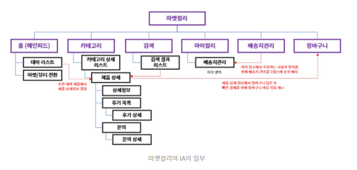
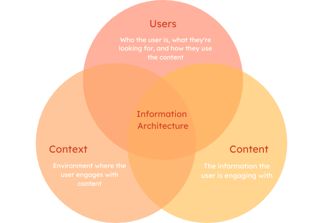

이번 팀원들과 프로젝트를 시작하게 되면서 프로젝트에 필요한 지식들을 하나씩 배워 가고 있다.

현재 프로덕트에 대한 콘센서스를 맞춰가는 단계에서 이후 작성 할 개발 문서들에 대해서 이론적 지식들을 쌓아가며 배운 점을 이번 포스트에 기록한다.

# 프로젝트에서 개발 문서가 필요하고 중요한 이유

개발 문서는 프로젝트의 결과물 뿐 아니라 개발 과정에도 영향을 미친다.

`One Source of Truth` 라는 단어가 있다. 이는 단일화 된 정보 출처를 통해 데이터의 정확성과 일관성을 보장하는 것을 의미하는데 개발 문서가 정확히 그 역할을 한다.

진행하고자 하는 프로젝트의 개발문서를 통해 모든 팀원들이 정의된 개발 문서를 통해 협업함으로서 커뮤니케이션을 효율적으로 하고 일관성과 품질을 보장 할 수 있다.

또, 개발 문서를 작성해나가는 과정을 통해 개발하고자 하는 기능을 명확히 정의하는 것이 가능하다.

명확하게 정의된 기능들을 통해 프로젝트에 소요 되는 자원들을 정의하고 발생 할 수 있는 잠재적 위험을 확인 및 대응 할 준비를 할 수 있다.

요약하자면 프로젝트 시작 전 작성하는 개발문서는 팀원들간의 협업에 도움을 주고 개발하고자 하는 사항을 개발 전에 정의하여 자원 배분 및 전체적인 프로젝트의 흐름을 모두가 공유 할 수 있도록 도와준다.

# IA 란 무엇일까 ?

`IA (information Architecture)` 는 말 그대로 정보 구조로 정보를 사용자에게 전달하기 위한 구조를 의미한다.

`IA` 는 서비스의 **뼈대가 되는 정보**이기 때문에 프로젝트 기획 전 가장 먼저 작성해야 하는 개발문서이다.

웹 사이트 개발에서 `IA` 의 주 목적은 **정보를 효과적인 구조로 나눠 전달함으로서 사용자에게 효율적으로 제공** 함에 있지만 `IA` 를 작성해나가는 단계에서 **제공해야 하는 정보나 기능** 들도 함께 정의된다.

## IA는 왜 필요할까 ?

**1. 정보 구조의 체계화를 통한 UX 향상 및 기능 정의**



정보를 계층적이고 논리적으로 구성하여 사용자들이 원하는 정보를 쉽게 찾을 수 있도록 돕는다.

논리적이고 계층적으로 나뉜 정보 구조를 통해 사용자는 정보를 효과적으로 전달 받을 수 있고 개발자는 구현해야 하는 기능들을 구조화 된 아키텍쳐를 통해 파악 할 수 있다.

**2. 프로젝트 계획 및 일정 관리**

정의 된 `IA` 를 통해 프로젝트의 전체 구조와 필요한 컴포넌트, 기능을 정의하기 때문에 프로젝트에 소요 될 자원에 대해 계획 할 수 있게 만든다.

**3. 유지보수와 확장성**

작성된 `IA` 는 작성 후에도 개발 단계에서 버전을 올려가며 변경 될 수 있다. 개발하며 요구 사항이 매 번 바뀌기 때문이다.

이 때 이전에 작성 된 `IA` 를 통해 일관된 정보 구조를 유지하며 기능을 수정해나가는 것이 가능하며 협업 시에도 유용한 가이드를 제공한다.

# IA는 어떻게 작성할까 ?

우선 `IA` 를 작성하기 위해선 `IA` 에 관여하는 외부요소를 먼저 생각 한 후 작성해야 한다.

## IA에 영향을 미치는 외부 요소



프로젝트에서 전달하고자 하는 정보 구조를 작성 할 때 다음과 같은 외부 요소들을 고려하여 구축해야 한다.

- **사용자**

  - 사용자가 서비스를 찾은 목적이 무엇인가 ?
  - 어떻게 사용자의 목적을 만족 시킬 것인가 ?
  - 목적을 달성하기 위한 기술은 무엇이 필요할 것인가 ?
  - 구현하고자 하는 기술은 난이도가 어떤가 ?

- **컨텐츠**

  - 제공하고자 하는 컨텐츠는 어떤 정보를 담고 있는가 ?
  - 제공하고자 하는 정보의 크기는 어떠한가 ?
  - 크기에 따라 정보를 어떤 식으로 제공 할 것인가 ?

- **맥락 (Context)**
  - 비즈니스 목표가 무엇인가 ? (해당 프로젝트를 통해 달성하고자 하는 팀의 목표)
  - 프로젝트와 관련된 정책 및 법은 어떠한가 ?
  - 프로젝트를 진행하기 위한 자원은 충분한가 ?

## IA의 작성 흐름

해당 외부 요소들을 모두 만족하는 기능들로 이뤄진 `IA` 를 작성해보자

**1.정보 계층 / 구조화**

전달하고자 하는 정보를 계층을 나눠 구조화 한다. 주로 카테고리를 나누는 작업이 해당된다.

위 마켓컬리 예시를 통해 생각해보자

전달하고자 하는 정보는 마켓컬리 내에 존재하는 상품이지만 테마 별, 카테고리 별로 상품을 조직화 해둔 모습을 볼 수 있다.

다만 구조화 방식에는 정답이 없다. 제품에 중점을 맞춰 구조화 할 수도 있고 개발하고자 하는 프로젝트의 성질에 따라 **사용자의 이용 흐름, 방문 목적, 기능의 특성** 에 따라 구조화 할 수 있다.

해당 단계에선 주로 텍스트를 통해 정보를 조직화 한다.

> 정보 조직화의 예시
> 주요 카테고리 : 신선식품 , 가공 식품 , 생활 용품 ... etc
> 신선식품 서브 카테고리 : 과일 , 채소 , 육류 ... etc

**2.정보 흐름 설계**

계층화 된 정보들을 통해 효과적으로 정보를 전달하기 위해 **사용자가 해당 정보에 접근하기 위한 방법과 흐름을 설계**한다.

위 마켓컬리 예시에선 _테마리스트 , 카테고리 상세 리스트_ 를 통해 구조화 된 정보에 접근하기 위한 방법을 설계 했다.

해당 단계에선 메뉴 트리를 사용하여 탐색 하는 흐름을 시각적으로 나타 낼 수 있다.

```css title="메뉴 트리의 예시"
[홈]
  ├── [신선식품]
  │     ├── [과일]
  │     ├── [채소]
  │     ├── [육류]
  │     ├── [수산물]
  │     └── [유제품]
  ├── [가공식품]
  │     ├── [간편식]
  │     ├── [조미료]
  │     ├── [냉동식품]
  │     ├── [과자]
  │     └── [음료]
  ├── [생활용품]
  ├── [주방용품]
  └── [건강식품]
```

**3. 기능 정의**

다음 단계에선 정의 된 메뉴트리에서 필요한 기능을 테이블 형태로 정의한다.

이 때 협업을 원활하게 하기 위해 필요한 기능에 대해 `ID` 를 계층적으로 부여하고 추가적인 정보를 넣어 작성해줄 수 있다.

| 기능 ID | 기능 이름          | 설명                                                        | 관련 페이지/섹션           | 우선순위 | 예상 개발 시간 | 담당자 |
| ------- | ------------------ | ----------------------------------------------------------- | -------------------------- | -------- | -------------- | ------ |
| 1       | 검색 기능          | 사용자가 원하는 상품을 검색할 수 있는 기능                  | 메인 페이지, 상품 리스트   | 높음     | 2주            | 홍길동 |
| 1.1     | 검색 자동완성      | 사용자가 검색어를 입력할 때 자동으로 추천어를 보여주는 기능 | 검색창                     | 중간     | 1주            | 홍길동 |
| 2       | 카테고리 필터링    | 사용자가 카테고리를 통해 상품을 필터링할 수 있는 기능       | 상품 리스트                | 중간     | 1주            | 이영희 |
| 2.1     | 가격 필터링        | 사용자가 가격 범위에 따라 상품을 필터링할 수 있는 기능      | 상품 리스트                | 중간     | 1주            | 이영희 |
| 3       | 장바구니           | 사용자가 선택한 상품을 장바구니에 담을 수 있는 기능         | 상품 상세 페이지, 장바구니 | 높음     | 3주            | 박철수 |
| 3.1     | 장바구니 수량 조절 | 장바구니에 담긴 상품의 수량을 조절할 수 있는 기능           | 장바구니                   | 중간     | 1주            | 박철수 |
| 4       | 사용자 리뷰        | 사용자가 상품에 대한 리뷰를 작성하고 읽을 수 있는 기능      | 상품 상세 페이지           | 낮음     | 2주            | 김민수 |
| 4.1     | 리뷰 평점          | 사용자가 리뷰에 평점을 부여할 수 있는 기능                  | 상품 상세 페이지           | 낮음     | 1주            | 김민수 |
| 5       | 결제 시스템        | 사용자가 상품을 결제할 수 있는 기능                         | 결제 페이지                | 높음     | 4주            | 정미영 |
| 5.1     | 결제 수단 선택     | 결제 시 다양한 결제 수단을 선택할 수 있는 기능              | 결제 페이지                | 중간     | 2주            | 정미영 |

# 출처

[신입 디자이너를 위한 IA](https://brunch.co.kr/@a7d5f8c018934f3/3)

[The Diffrence Betweein IA & Navigating](https://www.nngroup.com/articles/ia-vs-navigation/)

[기능명세서 앱 기획하기](https://minery.tistory.com/8)

[서비스의 구조와 동선 설계, IA](https://brunch.co.kr/@mildwhales/17)

```

```
