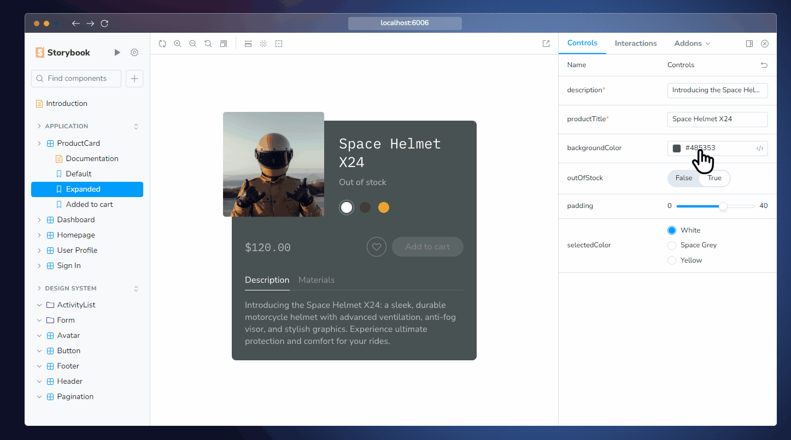

본격적으로 프로젝트를 시작하기 전 정신 상태를 무장하기 위해서 기술들에 대해서 곰곰히 생각하고 있다.

이번에 곰곰히 생각해보려고 하는 내용은 프론트엔드에서의 테스트 코드에 대한 이야기이다.

# 테스트가 개발에서 가지는 의미는 무엇일까 ?

테스트는 여러 문맥에 따라 다르게 정의 될 수 있지만 개발 환경에서의 테스트는 다음을 의미한다.

**"테스트란 애플리케이션이 요구하는 동작을 올바르게 수행하는가를 검증하는 행위"**

테스트 코드를 배워야겠다고 느꼈던 가장 큰 동기는 **"코드를 작성 한 후 코드가 잘 작동할지 어떻게 판단해 ? 기도를 하니?"** 라는 문구를 본 이후였을 것이다.

코드 작성자도 모든 케이스에 대해 대비 할 정도로 완벽 할 수 없으며 가장 이성적인 일을 하면서 가장 비이성적으로 대비하는 행위는 너무나도 웃긴 모습이기 때문이다.

테스트 코드는 코드의 무결성을 입증해주는 지표가 되기 때문에 코드의 동작 스펙을 명확히 이야기 할 수 있을 뿐더러 테스트의 존재 자체만으로도 과감한 리팩토링이나 최적화를 시도해볼 수 있다는 점에서 테스트 코드는 개발에 있어 도움이 되는 존재인 것은 명확하다.

결국 테스트 코드는 본인의 코드에 대한 `Confidence` 를 높혀주기 때문에 필요하다. 무결성이 입증되지 않은 코드를 리팩토링 하거나 최적화 하는 행위를 고치기 위해선 많은 용기가 필요하다.

이처럼 낮은 자신감으로 인해 발전되지 않는 부분을 **기술 부채** 라고 한다. 테스트 코드는 기술 부채를 줄여주기 위해 꼭 필요한 요소이다.

## 애자일 개발 방법론 등장 : TDD의 부상

그럼 본격적으로 `TDD (Test Driven Development)` 가 부상하게 된 계기는 무엇일까 ?

그건 아마도 애자일 개발 방법론이 등장한 이후부터 일 것이다.

애자일 개발 방법론이란 위 이미지처럼 긴 주기를 갖는 프로젝트를 진행 할 때 `목표 설정 => 계획 => 개발 => 테스트` 와 같은 순차적인 하나의 스프린트로 진행하는 것이 아닌 반복적으로 `개발 => 테스트 => 개발 ..` 와 같이 짧고 반복적인 스프린트를 가져가는 개발 방법론을 칭한다.

애자일 개발은 개발의 텀을 짧고 반복적으로 가져감으로서 기능 요구 사항을 명확히 하여 개발 주기를 가져 갈 수 있으며 코드의 결점을 빠르게 알아채고 변경 할 수 있다.

이처럼 짧은 스프린트 기간 동안 기능 요구 사항에 대한 테스트 코드를 이용하는 개발 방법론에서 하나의 방법으로 나온 개발 방법이 `TDD` 이다.

`TDD` 는 테스트 주도 개발이란 이름에 걸맞게 기능 요구 사항에 대한 코드를 작성하기 전 테스트 코드를 먼저 작성하고 테스트 코드를 만족시키는 코드를 작성하는 방식이다.

`TDD` 는 애자일 개발 방법론과 궁합이 잘 맞기 때문에 더더욱 테스트 코드에 대한 관심이 부상했다 볼 수 있다.

# 프론트엔드에서의 테스트 코드

프론트엔드가 가지는 특이성 때문에 테스트 코드를 작성하거나 테스트 주도 개발을 할 때 신경써야 할 점들이 존재한다.

프론트엔드가 가지는 특이성이란 프론트엔드 코드 내부에 존재하는 절차 (함수) 들의 입력값과 출력값이 동일한 양상이 아니기 때문이다.

> 해당 내용은 [[2019] 실용적인 프런트엔드 테스트 전략](https://www.youtube.com/watch?v=q9d631Nl0_4) 6:00 가량쯤에 잘 설명해준다.
>
> 사실 대부분의 내용이 해당 세미나에 중점하여 작성되었다고 보아도 충분하다.

예를 들어 백엔드 단에서의 테스트 코드는 `HTTP` 요청으로 이뤄진 요청이 입력으로 들어오면 `HTTP` 요청으로 이뤄진 응답값이 반환된다는 절차가 존재 한다. 이는 입력값과 출력값이 동일한 영역이기 때문에 기능적 테스트를 하기가 용이하다.

하지만 프론트 단에서의 테스트는 유저의 인터렉션에 따른 브라우저의 렌더링 양상과 같은 **시각적 양상** 이 될 수도 있고 인터렉션에 따른 도메인 로직과 같은 **기능적 양상** 이 될 수 있기 때문에 신경써야 할 부분들이 여러가지로 존재한다.

> 프론트엔드밖에 경험해보지 않은 입장에서 적었기에 이 의견은 잘못된 의견일 수도 있다.
>
> 다만 말하고 싶은 내용은 적어도 프론트엔드에선 **시각적 양상** 과 **기능적 양상** 에 대해 모두 테스트 해야 한다는 점이다.

테스트 하고자 하는 양상에 따라 적절한 테스트 방법을 이용하는 것이 올바른 테스트 주도 개발의 시작일 것이라 생각한다.

## 시각적 요소 테스팅 : storybook

`storybook` 은 프론트엔드를 위한 테스트 라이브러리이다.

`storybook` 에선 `TDD` 를 넘어서서 `CDD (Component Driven Development)` 를 이야기 하는데 이는 비즈니스 로직과 무관하게 **상황에 따른 컴포넌트의 모습들을 제작하여 테스트하고 개발하는** 개발 방식을 이야기 한다.

컴포넌트는 `props` 나 내부 비즈니스 로직에 따라 렌더링 되는 결과가 다른데 테스트 할 때 **내부 비즈니스 테스트에 집중하기 보다 렌더링 된 결과물** 에 중점을 두고 테스트 한다.

공식 문서에서 이야기하는 스토리북이 가지는 의의는 다음과 같다.

> 📝 Develop UIs that are more durable
>
> Isolate components and pages and track their use cases as stories. Verify hard-to-reach edge cases of UI. Use addons to mock everything a component needs—context, API requests, device features, etc.
>
> ✅ Test UIs with less effort and no flakes
>
> Stories are a pragmatic, reproducible way of tracking UI states. Use them to spot-test the UI during development. Storybook offers built-in workflows for automated Accessibility, Interaction, and Visual testing. Or use stories as test cases by importing them into other JavaScript testing tools.
>
> 📚 Document UI for your team to reuse
>
> Storybook is the single source of truth for your UI. Stories index all your components and their various states, making it easy for your team to find and reuse existing UI patterns. Storybook also auto-generates documentation from those stories.
>
> 📤 Share how the UI actually works
>
> Stories show how UIs actually work, not just a picture of how they're supposed to work. That keeps everyone aligned on what's currently in production. Publish Storybook to get sign-off from teammates. Or embed them in wikis, Markdown, and Figma to streamline collaboration.
>
> 🚦Automate UI workflows
>
> Storybook is compatible with your continuous integration workflow. Add it as a CI step to automate user interface testing, review implementation with teammates, and get signoff from stakeholders.

간단한 예시를 통해 이해해보자
