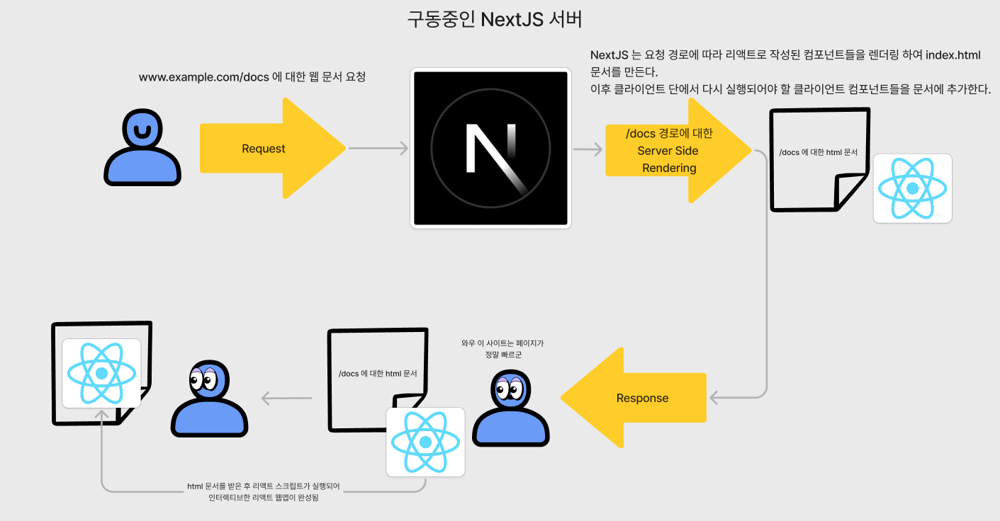

프로젝트를 진행하면서 배포와 관련된 이야기를 나누던 도중 `NextJS` 에 대한 개념이 부족한듯 하여 `NextJS` 의 코어적인 지식을 이번 기회에 공부하고 포스팅 하도록 한다.

`NextJS` 를 가장 쉽게 풀어 말하자면 **서버 단에서 구동된 리액트 앱을 반환하는 프레임워크** 라고 말 할 수 있을 것이다.

일반적으로 단순히 리액트만으로 개발된 리액트 웹앱과 `NextJS` 를 이용해 개발된 리액트 웹앱의 차이를 먼저 살펴보자

# 리액트만으로 개발된 리액트 웹앱이 index.html을 생성하는 방식

단순히 리액트만으로 개발된 웹앱의 빌드 파일은 어느 요청이든 동일한 정적인 `index.html` 파일을 전송한다.

가장 대표적인 예시로 `<div id='root'></div>` 라는 태그만이 존재하는 비어있는 `index.html` 파일에 `script` 태그에서 번들링 된 자바스크립트 파일들이 불러와지도록 생성되어 있는 정적인 문서를 말이다.

이렇게 정적으로 생성된 `index.html` 파일을 이용해 배포하게 되면 배포 서버 단에선 단순히 해당 도메인으로 접근하는 어떤 접근이든 동일한 리액트 웹을 반환하게 되고 클라이언트 단에서 리액트 웹앱이 구동되게 되면서 경로에 맞춰 라우팅 되게 된다. (여기서 라우팅 되는 경로는 서버로 요청한 `request` 상 경로가 아닌 클라이언트 단 `window.location` 에 존재하는 현재의 경로이다.)

이러한 개발 방식은 다음과 같은 단점들이 분명하게 존재한다.

## FCP (First Contentfull Paint) 의 시간이 너무 길다.

클라이언트가 `index.html` 파일을 받아 파싱하는 과정에서 어떤 일이 벌어질까를 생각해보자

파싱하는 과정에서 다음과 같은 과정을 거치게 된다. `index.html -> css -> script` 과정에서 모든 `script` 태그들이 구동되기 전까지, 즉 리액트가 실행되어 `actual dom` 이 업데이트 되기 전까진 여전히 페이지엔 비어있는 `div` 태그 하나만 존재하게 된다.

이렇게 의미있는 내용을 보기까지의 시간인 `FCP` 가 길어지게 되면 이는 `UX` 를 떨어뜨리는 요인이 된다. 리액트 웹은 이러한 문제를 해결하기 위해 최대한 `script` 태그의 실행 시간을 낮추기 위해 `lazy import` 와 같은 방법을 통해 해결하려고 한다.

하지만 이렇게 해도 근본적으로 `script` 태그가 실행되기 전까지는 빈 화면을 보게 된다는 내용은 동일하다.

## SEO 측면에서 좋지 않다.

`SEO` 를 평가하는 `robots` 들은 페이지를 평가 할 때 `script` 태그를 구동시켜 생성되는 `actual dom` 을 평가하지 않는다.

단순히 어떠한 경로에 대한 `request` 를 보냈을 때 받아지는 `index.html` 의 내용만을 이용하여 해당 문서에 대한 `SEO` 를 평가한다. (물론 이외에도 최적화 관련 평가 지표가 존재한다.)

하지만 앞서 말했듯 리액트만으로 개발된 웹앱은 어떠한 경로든 동일하게 달랑 `div` 태그 하나만 존재하게 때문에 이는 `SEO` 측면에서 매우 좋지 않다.

## 하지만 꼭 단점만이 존재하는 것은 아니다, 배포가 매우 쉽다.

리액트만을 이용한 개발에선 항상 정적인 웹문서만 전달해주면 되기 때문에 배포가 매우 쉽다는 장점이 존재한다.

단순히 요청을 받을 서버를 생성해두고 해당 서버에 요청이 들어오면 매번 동일한 `index.html` 만을 전달하면 되기 때문이다.

`AWS` 에서 리액트 웹을 배포하기 위해선 단순히 `S3 (Simple Storage Service)` 와 같은 정적 파일 서버에서 요청에 따라 빌드된 `index.html` 만을 전송하면 된다.

# NextJS가 index.html 문서를 생성하는 방식

기존 **리액트 웹앱들이 갖는 단점들인 낮은 FCP, 취약한 SEO는 모두 `index.html` 문서를 생성하기 위한 리액트의 실행이 클라이언트단에서 일어나기 때문**이다.

이에 리액트 개발자들은 **리액트의 렌더링을 클라이언트단이 아닌 서버 단에서 실행하면 어떨까?** 하는 물음을 갖고 **서버 컴포넌트** 를 개발하였다.

- [React Server Components](https://react.dev/reference/rsc/server-components#server-components-with-a-server)
- [React renderToString](https://react.dev/reference/react-dom/server/renderToString)

서버 단에서 요청이 있을 때 마다 매번 정적인 `index.html` 파일을 반환하는 것이 아닌 요청에 따라 동적으로 매번 다른 `index.html` 파일을 생성한 후 반환하는 것이다.

이는 고전적인 웹 페이지 동작 방식인 서버 사이드 렌더링의 개념과 유사하나 근본적인 다른 부분으론 **`index.html` 안에는 `SPA` 를 구동 시킬 수 있게 하는 스크립트 태그들이 여전히 존재** 한다는 것이다.

즉, 동적으로 서버 사이드 렌더링을 하여 완성된 `index.html` 파일을 받은 후에는 `SPA` 로서 작동한다는 점이다. 물론 `SPA` 처럼 작동하기 위해선 초기에 기존 리액트 웹처럼 `script` 태그들을 구동시켜야 하지만 `script` 태그가 구동되는 동안엔 완성된 `index.html` 파일을 받기 때문에 `FCP` 가 매우 높을 수 있게 되었다.

## 그렇다면 서버 컴포넌트를 렌더링 하는 서버는 어떻게 만드는데 ?

만약 `NextJS` 를 사용하지 않고 `nodejs` 환경에서 서버 컴포넌트를 렌더링하여 뷰가 완성된 `index.html` 문서를 만들기 위해선 다음과 같은 코드를 작성해야 할 것이다.

```tsx title="nodejs 환경에서 서버 컴포넌트를 렌더링하여 전송하는 방식의 예시"
// server.js
import express from 'express';
import React from 'react';
import { renderToString } from 'react-dom/server';
import App from './App.js';

const app = express();

app.use(express.static('public'));

app.get('*', (req, res) => {
  const appHtml = renderToString(<App />);

  const html = `
    <!DOCTYPE html>
    <html lang="en">
      <head>
        <meta charset="UTF-8">
        <meta name="viewport" content="width=device-width, initial-scale=1.0">
        <title>SSR with React and Node.js</title>
      </head>
      <body>
        <div id="root">${appHtml}</div>
        <script src="/bundle.js"></script> <!-- Optional: for client-side hydration -->
      </body>
    </html>
  `;

  // Send the rendered page as the response
  res.send(html);
});

const PORT = process.env.PORT || 3000;
app.listen(PORT, () => {
  console.log(`Server is listening on port ${PORT}`);
});
```

해당 태그에 존재하는 `script src = "bundle.js"` 의 경우엔 해당 문서에서 작동 할 리액트 웹의 코드들일 것이다.

그렇다면 리액트 개발자들이 서버 컴포넌트를 이용하기 위해선 `nodejs` 를 배워야 할 것일까 ?

## NextJS는 nodejs를 이용한 리액트 웹앱 개발을 도와주는 프레임워크이다.

매우 고맙게도 `Vercel` 에선 해당 과정을 도와주는 프레임워크인 `NextJS` 를 개발하였다.

근본적으로 `NextJS` 는 `nodejs` 환경에서 동적인 `index.html` 파일을 생성하게 도와주는 프레임워크이다.

`NextJS` 프레임워크 위에서 리액트 개발자는 단순히 모든 컴포넌트들을 개발하고 클라이언트 단에서 한 번 더 구동이 필요한 컴포넌트들만을 클라이언트 컴포넌트로 구분해주면 된다.

> 리액트의 컴포넌트들은 단순히 `view` 의 역할만 하는 컴포넌트도 존재하고 유저의 인터렉션이 필요하거나 브라우저 api 에 접근하는 컴포넌트들도 존재한다.
>
> 클라이언트 컴포넌트들은 주로 상태가 존재하여 유저 인터렉션에 따라 다른 값을 반환하는 컴포넌트이거나 `window` 객체에 접근하는 컴포넌트들을 의미한다.
>
> 인터렉션이 필요한 컴포넌트들은 `index.html` 의 뷰를 생성하기 위해 서버 단에서 한 번 렌더링 된 후, 클라이언트 단에서 다시 렌더링 될 필요가 있다. `SPA` 로서의 기능을 해야 하기 때문이다.

서버에서 컴포넌트를 렌더링하여 `index.html` 문서를 미리 생성해두기 때문에 사용자는 리액트 웹이 구동되기 전에 미리 `html element` 들이 작성되어 있는 문서를 받아 시각적으로 완성된 페이지를 보는 것이 가능하다.

사실 `NextJS` 가 풀스택 프레임워크라는 이름이 붙은 이유는 `nodejs`의 서버 환경에서 리액트 웹앱을 개발 할 수 있게 도와주기 때문에 `nodejs` 에서 갖는 이점을 사용 할 수 있기 때문이다.

`nodejs` 환경에서 구동되기 때문에 `API endpoint` 들을 생성하여 `DB` 와 연결만 시켜준다면 따로 엔드포인트만을 위한 서버를 생성하지 않아도 되고

`index.html` 을 생성하기 위해 `api` 요청이 필요한 경우 서버 단에서 비동기적으로 `api` 요청을 받아온 후 문서를 반환하면 되기 때문에 전통적인 리액트 웹과 같이 `index html -> react app 구동 -> fetch -> 리액트 업데이트 -> html 업데이트` 단계가 아닌 `fetch -> index.html -> react app 구동` 으로 간소화 하는 것이 가능하다.

자세한 작동 방식은 공식문서를 더 참고하도록 하고 배포와 관련하여 더 알아보자

## NextJS의 build 파일은 어떻게 생겼고 무엇을 의미할까 ?

일반적으로 `react app` 을 `build` 하면 생성되는 폴더구조는 다음과 같이 생겼다.

```bash title="react app build시 생성되는 파일들"
build/
│
├── asset-manifest.json
├── favicon.ico
├── index.html
├── logo192.png
├── logo512.png
├── manifest.json
├── robots.txt
└── static/
    ├── css/
    │   └── main.[hash].css
    ├── js/
    │   ├── main.[hash].js
    │   ├── main.[hash].js.LICENSE.txt
    │   └── runtime-main.[hash].js
    └── media/
        └── [assets].[hash].[ext]
```

이는 위에서 말했던 정적인 `index.html` 문서 하나와 같다.

```bash title="nextjs build시 생성되는 파일들"
.next/
│
├── cache/
│   └── ... (build cache for faster subsequent builds)
├── server/
│   ├── pages/
│   │   ├── _app.js
│   │   ├── _document.js
│   │   └── [dynamic routes].js
│   ├── app/
│   │   └── [new app directory structure if used]
│   ├── api/
│   │   └── [API routes].js
│   ├── chunks/
│   │   └── [code-split JS bundles].js
│   └── webpack/
│       └── [webpack runtime and related files]
├── static/
│   ├── css/
│   │   └── [stylesheets].css
│   ├── media/
│   │   └── [media files].png
│   └── chunks/
│       └── [static JavaScript bundles].js
├── types/
│   └── ... (TypeScript definitions if using TypeScript)
├── build-manifest.json
├── react-loadable-manifest.json
├── app-build-manifest.json
├── trace
└── package.json
```

`NextJS` 의 빌드 파일의 결과는 정적인 문서가 아닌 `index.html` 파일을 동적으로 생성하는 서버 코드(`server`)내부에 서버 로직과 번들링 된 리액트 코드가 존재하는 `chuncks`가 존재하며 문서를 생성하기 위한 정적인 자료들을 생성하기 위해 사용되는 `static` 폴더가 존재한다.

> `static` 폴더엔 그 뿐 아니라 빌드타임 때 빌드 된 정적인 `index.html` 문서들도 존재하지만 이 부분도 공식문서의 `SSG` 파트를 읽어보도록 하자

결국 **`NextJS` 의 빌드파일 결과물은 정적인 문서가 아닌 `NextJS` 를 실행시키기 위한 서버 코드들이다.**

해당 서버 코드를 실행하여 `NextJS` 서버를 작동하고 문서를 달라는 요청이 나타나게 되면 다음과 같이 작동하게 된다.



만약 궁금하다면 개발자 도구에서 네트워크 창을 틀고 현재 게시글을 새로고침 해보자. 도착하는 `html` 문서엔 모든 내용이 이미 추가되어 있을 것이다.

# 그렇다면 NextJS 는 어떤 식으로 배포해야 할까 ?

앞서 말했던 리액트로 만들어진 정적 문서는 단순히 해당 도메인으로 요청만 오면 만들어둔 문서를 반환하도록 하면 되었지만 `NextJS` 는 **서버를 실행시키고 외부의 요청을 `NextJS` 서버로 가도록 연결해야 한다.**
