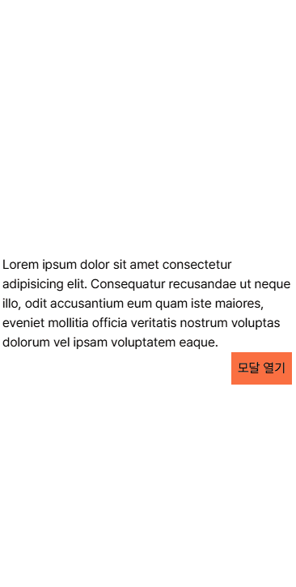
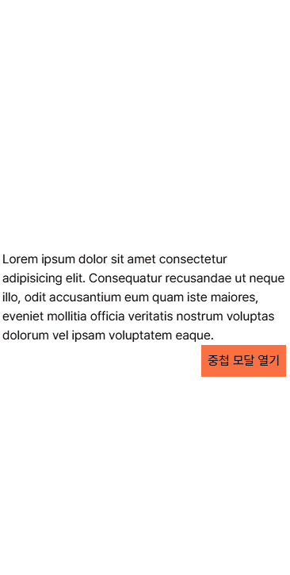
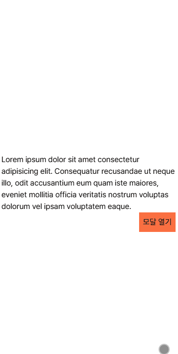

열심히 프로젝트를 진행하며 달려나가던 중 잠시 시간이 남아 모달을 관리하는 과정에서 겪었던 경험을 공유차 적어봅니다.

# 오버레이란 무엇일까 ?

오버레이(Overlay)는 **사용자가 현재 보고 있는 컨텐츠 위에 추가적인 정보를 표시하기 위해 화면의 일부 또는 전체를 덮는 레이어**입니다.

주로 사용자가 특정 동작을 수행하거나 추가 정보를 사용자에게 전달하기 위해 사용됩니다.

주로 이런 오버레이들은 모달이나 스낵바, 토스트 등을 일컫습니다. 우리에게 가장 익숙한 오버레이는 아마 모달일 것입니다.



오버레이를 만들 때 예상되는 어려움은 다음과 같았습니다.

> 이제부터 오버레이를 나타나게 트리거 하는 컴포넌트를 `Trigger` , 실제 렌더링 되는 오버레이를 `Overlay` 라고 칭하겠습니다.

1. `Trigger` 컴포넌트는 `Overlay` 를 나타나게 하지만 실제 렌더링 되는 위치는 서로 다릅니다. 예를 들어 모달 열기 버튼이 어떤 Form 에 있을 때 `Overlay` 는 Form 이 아닌 독립적인 레이어로 뷰포트에 나타나야 합니다. (필수)

2. `Trigger` 컴포넌트는 `Overlay` 내부에 존재하는 비즈니스 로직을 모르고 있어야 합니다. 예를 들어 `Trigger` 컴포넌트가 어떤 값을 입력하는 `Modal Overlay` 컴포넌트를 열었을 때 `Modal Overlay` 내부에서 값을 입력 받고 서버로 api 요청을 보내는 행위를 모르고 있어야 합니다.(필수)

3. `Overlay` 가 현재 존재하는지 존재하지 않는지의 상태를 `Trigger` 가 알고 있어야 합니다. 예를 들어 모달이 열려있다면 모달 열기 버튼은 모달 열려 있음 이라는 텍스트를 렌더링 해야 합니다. (선택)

즉 **`Trigger` 컴포넌트와 `Overlay`를 느슨하게** 연결해두고 싶었습니다.

그럼 우선 오버레이 들을 이용하는 예시들을 코드로 살펴보고 해당 방법들이 저한테 만족스럽지 않았던 이유들을 알아봅시다.

# 불편함을 느꼈던 기존의 모달 사용 방식

```tsx title="Trigger 내부에서 Overlay를 관리" {22-25}
import React, { useState } from "react";
const Trigger = () => {
  // 오버레이의 열림/닫힘 상태를 관리하는 state
  const [isOpen, setIsOpen] = useState(false);

  // 오버레이를 여는 함수
  const openModal = () => {
    setIsOpen(true);
  };

  const closeModal = () => {
    setIsOpen(false);
  }


  return (
    <div className="App">
      <h1>React Overlay Example</h1>
      {/* 오버레이 여는 버튼 */}
      <button onClick={openModal}>오버레이 열기</button>
      {/* 오버레이이 열렸을 때만 표시 */}
      {isOpen && (
        <SomethingOverlay onClose = {closeModal}/>
        </div>
      )}
    </div>
  );
};

export default App;
```

이 예시는 `Trigger` 컴포넌트 안에서 `Overlay` 컴포넌트가 호출되는 경우 입니다.

물론 css 를 좀 만져서 `absolute, top .., left .. , z-index : 9999 ` 이런식으로 독립적인 레이어처럼 띄우는 방법이 있을 수 있습니다. 혹은 리액트의 `createPortal` 을 사용 하는 방법도 있을 수 있습니다.

이 방법은 기능 상 문제가 없는 괜찮은 코드입니다.

## 느껴진 불편한 점들

다만 이 방법은 `Trigger` 컴포넌트의 의미를 애매하게 한다고 생각했습니다. `Trigger` 컴포넌트는 `Trigger` 컴포넌트와 관련된 내용만을 담고 있어야 한다고 생각했습니다.

`Trigger` 는 단순하게 `Overlay` 를 **열고 닫힘 상태값과 여는 행위** 만을 알고 있게 하고 렌더링 되는 결과물에는 단순히 `Trigger` 와 관련된 내용만을 렌더링 하게 하고 싶었습니다.

또 매번 `Trigger` 컴포넌트 안에서 오버레이를 여닫는 상태값을 정의하거나 함수를 정의해야 합니다. 이런 불편함을 해소하기 위해 **커스텀 훅을 사용** 하기로 마음 먹었습니다.

# 하나의 커스텀 훅으로 오버레이들을 관리해보자

이제부턴 이런 불편한 점들을 해결한 과정을 적어보겠습니다.


```tsx title="모달과 스낵바를 불러오는 예시 코드" {8,18}
const App = () => {
    return (
      <div>
        {/* html 태그라 가정 */}
        {/* 스크롤 위치와 상관 없이 Overlay 들이 잘 나타나는지 확인하기 위해 뷰포트 크기를 늘림 */}
        <div id="root" className="h-[200vh]">
          {/* Overlay 들이 나타날 공간 , 실제론 RouterProvider 외부에 존재한다. */}
          <OverlayPortal /> // 오버레이들을 관리하는 공간
          <div className="flex h-screen items-center justify-center">
            <div className="w-96">
              <p>
                Lorem ipsum dolor sit amet consectetur adipisicing elit.
                Consequatur recusandae ut neque illo, odit accusantium eum quam
                iste maiores, eveniet mollitia officia veritatis nostrum
                voluptas dolorum vel ipsam voluptatem eaque.
              </p>
              <div className="flex justify-end">
                <ModalTrigger /> // 모달 열기 버튼
              </div>
            </div>
          </div>
        </div>
      </div>
    );
```

위 코드는 앞서 보여드렸던 `gif` 파일을 동작하게 하는 코드 입니다. 코드를 스토리북 내에서 정의해뒀기에 `div id = root` 등이 존재하는데 실제 사용 할 때엔 컴포넌트 최상단에 `OverlayPortal` 컴포넌트를 정의해두고 사용하면 됩니다.

모달을 여는 `ModalTrigger` 컴포넌트 내부를 살펴 봅시다.

```tsx title="useOverlay 커스텀 훅을 이용하여 Trigger , Overlay 를 느슨하게 연결" {2-4}
export const ModalTrigger = () => {
  const { isOpen, onClose, handleOpen } = useOverlay(() => (
    <ConfirmModal onClose={onClose} />
  ));

  return (
    <div className='flex items-center justify-center bg-tangerine-400 px-2 py-2'>
      <button onClick={handleOpen}>{isOpen ? '열려있음' : '모달 열기'}</button>
    </div>
  );
};
```

`useOverlay` 커스텀 훅에서 반환된 `handleOpen` 이 호출되면 `useOverlay` 가 반환한 `onClose` 를 장착한 `ConfirmModal` 이 렌더링 될 것입니다.

`ModalTrigger` 컴포넌트의 반환값은 정말 `ModalTrigger` 만을 위한 값들입니다. 이에 `ModalTrigger` 를 보면 어떤 값들이 렌더링 될지 한 눈에 예상이 쉽게 됩니다.

```tsx title="ConfirmModal.tsx" {11-16 , 19-26}
interface ModalProps {
  onClose: () => Promise<void>;
}

const ConfirmModal = ({ onClose }: ModalProps) => {
  /**
   * 가끔씩 어떤 오버레이는 다른 오버레이를 호출 하기도 합니다.
   * ConfirmModal은 저장 시 저장이 완료되었단 스낵바를 렌더링 해야 합니다.
   * ConfirmModal은 트리거 되는 오버레이면서, 다른 오버레이를 트리거 하는 컴포넌트 이기도 합니다.
   */
  const { onClose: closeSnackbar, handleOpen: openSnackbar } = useOverlay(
    () => <SaveSnackbar onClose={closeSnackbar} />,
    {
      disableInteraction: false, // 스낵바의 경우엔 interaction을 중지시키지 않을 것입니다.
    },
  );

  // 모달의 비즈니스 로직과 상위에서 정의된 onClose 메소드를 사용합니다.
  const handleSave = () => {
    // 비즈니스 로직..
    onClose();
    openSnackbar(); // 다른 오버레이를 호출합니다.
  };
  const handleExit = () => {
    onClose();
  };

  return (
    <div className='absolute left-1/2 top-1/2 w-80 -translate-x-1/2 -translate-y-1/2 transform bg-grey-100 px-12 py-12'>
      <p>나가시겠습니까?</p>
      <div className='mt-2 flex justify-between border-tangerine-50 px-2 py-2'>
        <button onClick={handleSave} className='text-tangerine-500'>
          저장하고 나가기
        </button>
        <button onClick={handleExit}>그냥 나가기</button>
      </div>
    </div>
  );
};
```

이번엔 `ConfirmModal` 을 살펴봅시다. `ConfirmModal` 은 `Overlay` 컴포넌트이면서 저장되었다는 문구를 표현하는 `SaveSnackbar Overlay` 를 호출하는 `Trigger` 컴포넌트이기도 합니다.

모든 `Overlay` 들은 본인이 열고 닫힘을 관리하는 `onClose props` 를 받아 사용합니다. `Overlay` 내부에 존재하는 비즈니스 로직은 `props` 로 받은 `onClose` 를 활용해 `Overlay` 컴포넌트 내부에서 정의 합니다.

위 예시에서 저장하고 나가기를 클릭하면 서버에 저장하는 어떤 비즈니스 로직과 스낵바가 열리게 트리거 하고, 그냥 나가기 버튼을 클릭하면 본인을 닫기만 합니다.

`ConfirmModal` 의 반환값에서도 본인 자신과 관련 있는 값들만 반환합니다.

```tsx title="SaveSnackbar.tsx"
/**
 * 해당 스낵바는 노출 이후 1초 뒤 자동으로 사라집니다.
 */
const SaveSnackbar = ({ onClose }: ModalProps) => {
  useEffect(() => {
    const timerId = setTimeout(() => {
      onClose();
    }, 1000);

    return () => clearTimeout(timerId);
  }, []);

  return (
    <div className='absolute left-1/2 top-4 -translate-x-1/2 transform border px-2 py-2'>
      저장이 되었습니다
    </div>
  );
};
```

`ConfirmModal` 로 인해 트리거 된 `SaveSnackbar` 는 다음과 같이 생겼습니다.

단순히 몇 초 뒤에 사라집니다.

## useOverlay 훅을 살펴보자

```tsx title="useOverlay.ts" {9-10}
export const useOverlay = (
  createOverlayComponent: (onClose: () => Promise<void>) => JSX.Element,
  options: OverlayOptions = {},
) => {
  const [isOpen, setIsOpen] = useState<boolean>(false);
  const { disableInteraction = true, beforeClose, afterClose } = options;
  const id = new Date().getTime(); // 커스텀 훅이 호출 될 때 마다 유일한 id를 생성합니다.

  const addOverlay = useOverlayStore((state) => state.addOverlay);
  const removeOverlay = useOverlayStore((state) => state.removeOverlay);

  const onClose = async () => {
    await beforeClose?.();
    removeOverlay(id);
    setIsOpen(false);
    await afterClose?.();
  };

  const handleOpen = async () => {
    addOverlay({
      id,
      component: createOverlayComponent(onClose),
      onClose,
      options: { disableInteraction },
    });
    setIsOpen(true);
  };

  return { handleOpen, onClose, isOpen };
};
```

`useOverlay` 훅은 전역 상태 관리 저장소인 `useOverlayStore` 와 `Trigger, Overlay` 컴포넌트들을 이어주는 역할을 하는 훅입니다.

> 전역 상태 관리 저장소는 `zustand` 를 사용했습니다.

`useOverlay` 의 반환 값인 `handleOpen` 은 `useOverlayStore` 에 오버레이와 관련된 정보를 담은 `OverlayInfo` 를 추가하고 오버레이의 열림 유무를 `true` 로 변경합니다.

`onClose` 는 `useOverlayStore` 에서 오버레이를 제거하는데 이 때 두 번째 인수로 받은 `options` 에 담긴 `beforeClose , afterClose` 를 적절한 위치에서 시행합니다.

`beforeClose , afterClose` 사용 예시는 본문 마지막에 보여드리겠습니다.

정리하면 `handleOpen` 이 호출되면 `useOverlayStore` 에 컴포넌트와, 컴포넌트와 관련된 정보들이 추가 됩니다.

`onClose` 가 호출되면 `useOverlayStore` 에서 컴포넌트와 컴포넌트와 관련된 정보들에 제거 됩니다.

# useOverlay 가 사용하는 useOverlayStore

```tsx title="useOverlayStore.ts"
import { create } from 'zustand';

export interface OverlayOptions {
  disableInteraction?: boolean;
  beforeClose?: () => void | Promise<void>;
  afterClose?: () => void | Promise<void>;
}

export interface OverlayInfo {
  id: number;
  component: JSX.Element;
  onClose: () => Promise<void>;
  options: OverlayOptions;
}

interface OverlayStore {
  overlays: OverlayInfo[];
  addOverlay: (newOverlay: OverlayInfo) => void;
  removeOverlay: (id: number) => void;
}

export const useOverlayStore = create<OverlayStore>((set) => ({
  overlays: [],

  addOverlay: (newOverlay: OverlayInfo) =>
    set(({ overlays }) => ({
      overlays: [...overlays, newOverlay],
    })),

  removeOverlay: (id: number) =>
    set(({ overlays }) => ({
      overlays: overlays.filter((overlay) => overlay.id !== id),
    })),
}));
```

스토어는 정말 별게 없습니다.

`overlays` 배열에서 `OverlayInfo` 값들을 저장합니다. `OverlayInfo` 값들은 컴포넌트 및 컴포넌트 관련 정보들입니다.

다양한 `overlay` 들은 `useOverlayStore` 에 담긴 후 화면에서 렌더링 됩니다.

# useOverlayStore 를 소모하는 OverlayPortal

```tsx title="OverlayPortal.ts"
/**
 * OverlayPortal 컴포넌트는 오버레이를 렌더링합니다.
 * overlay들이 렌더링 되는 영역은 뷰포트 크기를 가진 div 입니다.
 * 따라서 overlay들은 뷰포트를 기준으로 하여 top, left, right, bottom 값으로 위치를 조정합니다.
 */
export const OverlayPortal = () => {
  const overlays = useOverlayStore((state) => state.overlays);

  const shouldDisableInteraction = overlays.some(
    ({ options: { disableInteraction } }) => disableInteraction === true,
  );

  // 떠있는 overlay 중 하나라도 interaction을 막아야 하는 경우에는 body의 스크롤을 막습니다.
  useEffect(() => {
    if (shouldDisableInteraction) {
      document.body.style.overflow = 'hidden';
    }

    return () => {
      document.body.style.overflow = 'auto';
    };
  }, [shouldDisableInteraction]);

  // 떠있는 overlay 중 하나라도 전체 뷰포트를 덮어야 하는 경우 배경색을 검정색으로 설정합니다.
  const overlayAreaBackground = shouldDisableInteraction
    ? 'bg-translucent-gray' // bg-gray-900 + opacity.32
    : '';

  if (overlays.length === 0) return null;
  return createPortal(
    <div
      className={`fixed left-0 top-0 z-[1000] h-screen w-screen ${overlayAreaBackground}`}
    >
      {overlays.map((overlayInfo) => (
        <OverlayWrapper key={overlayInfo.id} overlayInfo={overlayInfo} />
      ))}
    </div>,
    document.querySelector('#root')!,
  );
};
```

`OverlayPortal` 은 `useOverlayStore` 에 담긴 `overlays` 값들을 소모하는 컴포넌트 입니다.

이 때 `useOverlay.overlays` 배열에 아무런 값이 없다면 (렌더링 해야 하는 오버레이가 없다면) 아무런 값도 나타나지 반환하지 않고

값이 존재 한다면 뷰포트 최상단에 오버레이들을 렌더링 합니다.

이 때 오버레이의 특성에 따라 인터렉션을 막기 위해 `body` 태그의 스크롤 옵션을 막아줍니다.

> `OverlayPortal` 은 컴포넌트 최상단에 `<OverlayPortal/>` 형태로 존재하게 합니다.

# overlay들의 외부 영역인 OverlayWrapper

```tsx title="OverlayWrapper.ts"
/**
 * OverlayController 컴포넌트는 overlayInfo 에 담긴 정보에 따라 다르게 행동합니다.
 * 만약 overlay.options.disabledInteraction 이 true 일 경우엔 외부 클릭을 막습니다.
 */
const OverlayWrapper = ({ overlayInfo }: { overlayInfo: OverlayInfo }) => {
  const { component, onClose, options } = overlayInfo;
  const { disableInteraction } = options;

  // 기본적으로 발생한 Overlay가 아닌 영역을 클릭하면 Overlay를 닫습니다.
  const handleWrapperClick = (e: React.MouseEvent<HTMLDivElement>) => {
    if (e.target === e.currentTarget) {
      onClose();
    }
  };
  // 만약 disabledInteraction 이 false인 경우 (Overlay와 함께 인터렉션을 할 경우)에는
  // OverlayController 영역을 최소화 합니다.
  const overlayAreaClass = disableInteraction
    ? 'h-screen w-screen '
    : 'w-screen h-fit';

  return (
    <div
      onClick={handleWrapperClick}
      className={`absolute ${overlayAreaClass}`}
    >
      {component}
    </div>
  );
};
```

저희는 오버레이의 외부 영역을 클릭하면 오버레이들이 닫히길 원했습니다.

예를 들어 모달 외부를 클릭하면 모달이 단순히 닫히도록 말입니다.

이에 `OverlayWrapper` 컴포넌트를 만들어 오버레이를 감싸주었습니다.

이 때 오버레이 중 인터렉션을 허용하는 경우엔 `OverlayWrapper` 의 높이를 0으로 만들어 (오버레이는 `absolute, fixed` 중 하나로 생성 되기에 `h-fit` 이더라도 높이는 0입니다.) `OverlayWrapper` 영역 자체가 클릭이 안되도록 해주었습니다.

> 예시로 들었던 것에선 스낵바가 그런 예시 일 것입니다.

# 여태까지의 로직을 정리해보자

결국 아이디어는 단순합니다.

가장 원하는 행위는 `Trigger` 컴포넌트들의 반환값에서 `Overlay` 들이 눈에 보이지 않았으면 좋겠는 거였습니다. **`Trigger` 컴포넌트를 순수하게 유지하고 싶었기 때문입니다.**

`Trigger` 컴포넌트에서 `useOverlay` 로 `useOverlayStore` 값을 변화 시킬 수 있는 `handleOpen , onClose` 와 열고 닫힘 유무의 상태값인 `isOpen` 을 받아 사용합니다.

만약 `Trigger` 컴포넌트에서 `handleOpen` 이 호출되면 `useOverlayStore` 의 상태가 변화되며 오버레이들이 렌더링 됩니다.

만약 `Overlay` 나 `OverlayWrapper` 에 의해 오버레이가 닫히게 되면 `onClose` 메소드가 호출되어 `useOverlayStore` 에서 `Overlay` 가 제거되어 더 이상 렌더링 되지 않습니다.

# 다양한 사용 예시

## 중첩 모달

위에서 말했던 것 처럼 중첩 모달 또한 구현이 쉽게 됩니다.

그 이유는 모든 오버레이들이 `useOverlayStore` 내부에서 배열로 관리되기 때문에 후순으로 호출 된 `Overlay` 가 우선되어 렌더링 되기 때문입니다.



## 애니메이션 모달



모달이 열고 닫힐 때 애니메이션 효과를 주고 싶을 때에는 `options` 객체에 `beforeClose , afterClose` 등을 활용해주면 됩니다.

```tsx title="AnimationModalTrigger.tsx" {11-17}
/** Close Handler 사용 예시
 * 24/09/05 추가 된 closeHandler 사용 예시입니다.
 * 오버레이의 경우 마운트 되기 전,후에 작업 하고 싶은 내용들이 존재 할 수 있습니다.
 * 예를 들어 애니메이션 효과를 위해 클래스 명을 추가하고 제거하거나, 오버레이가 떠있는 시간을 서버에게 전송하거나 싶을 수 있습니다.
 * 그 때 사용하는 option 이 closeHandler 입니다.
 */
export const AnimationModalTrigger = () => {
  const { isOpen, onClose, handleOpen } = useOverlay(
    () => <AnimationModal onClose={onClose} />,
    {
      beforeClose: async () => {
        const modal = document.getElementById('animation-modal')!;
        modal.style.transition = 'opacity 1s ease-in-out';
        modal.style.opacity = '0';
        await new Promise((resolve) => setTimeout(resolve, 1000));
      },
    },
  );

  return (
    <div className='flex items-center justify-center bg-tangerine-400 px-2 py-2'>
      <button onClick={() => (isOpen ? onClose() : handleOpen())}>
        {isOpen ? '열려있음' : '모달 열기'}
      </button>
    </div>
  );
};
```

다음과 같이 `beforeClose` 메소드로 애니메이션 효과를 주고 나면 `useOverlay` 훅에서 정의된 `handleClose`로 인해 다음과 같이 작동하게 됩니다.

```tsx title="useOverlay.ts 의 일부" showLineNumbers{12} {14,17}
// useOverlay 의 일부
const onClose = async () => {
  await beforeClose?.(); // 애니메이션 작동
  removeOverlay(id);
  setIsOpen(false);
  await afterClose?.();
};
```

애니메이션 말고도 다양한 옵션들을 추가하여 사용 할 수 있습니다.

> 오버레이가 열리기 전과 후의 액션은 오버레이 내부에서 `css` 나 `useEffect` 를 이용해 정의해야 합니다.
