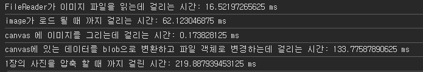

# 겪었던 문제 사항


현재 문제를 겪었던 부분은 핸드폰의 이미지 파일을 서버로 보내는데에서 시작했습니다.

우선 기본적으로 이미지 압축을 알아보기 전 어떻게 브라우저의 `input` 태그가 파일을 받아 읽고 , 브라우저가 렌더링 하는지를 먼저 알아봅시다.

# input tag 의 type=file

```tsx title="type=file input의 기본적인 사용법"
<input type='file' id='avatar' name='avatar' accept='image/png, image/jpeg' />
```

`input` 에선 `file` 타입을 통해 브라우저 외부에 존재하는 실제 사용자 파일 시스템에 접근 합니다.

이 때 `accept` 에 존재하는 파일 유형만 가져 올 수 있도록 할 수 있습니다.

이후 브라우저 외부에서 선택 된 파일은 브라우저 **메모리에 임시 저장** 되게 됩니다.

# 메모리에 임시 저장 된 파일을 렌더링 하는 방법

브라우저에서 이미지를 렌더링 하는 방법은 `img` 태그와 어트리뷰트인 `src` (경로) 값을 사용 하여 렌더링 할 수 있습니다.

브라우저 메모리에 저장 된 파일 객체를 `img` 태그로 렌더링 하기 위해선 다음과 같은 절차가 필요 합니다.

```tsx title="File 객체를 url로 변경해 렌더링 하는 방법"
import React, { useState } from 'react';

const PostLoading = () => {
  const [imageUrl, setImageUrl] = useState<string | null>(null);

  const handleFileChange = (event: React.ChangeEvent<HTMLInputElement>) => {
    const file = event.target.files?.[0];
    if (file) {
      const reader = new FileReader();
      reader.onloadend = () => {
        setImageUrl(reader.result as string);
      };
      reader.readAsDataURL(file);
    }
  };

  return (
    <div className='mt-24'>
      <input type='file' accept='image/*' onChange={handleFileChange} />
      {imageUrl && }
    </div>
  );
};
```

처음엔 의문이 들었습니다. 갑자기 파일 리더는 왜 나오고 `url` 형태론 왜 바꾸지 ?

> `FileReader` 를 사용하지 않고 핸들 체인지에서 직접 파일 객체에 접근 한 후 `URL.createObjectURL` 을 사용해도 됩니다.
>
> 예시를 작성하고 보니 밑의 예시에선 그냥 `URL.createObjectURL`을 사용했더군요

그 이유는 다음과 같습니다.

`FileReader`는 메모리에 저장 된 파일의 내용을 비동기적으로 읽고, 읽을 수 있는 형식으로 변환 가능한 API입니다.

읽을 수 있는 형식이란 이미지 파일을 이진수 형태인 `Blob` 형태나, 참조 가능한 `URL` 을 의미 합니다.

`reader.readAsDataURL(file)` 는 파일 객체를 브라우저에서 참조 가능한 `url` 형태로 변환하는데 이 `url` 은 `base64` 형태로 인코딩 된 **파일 객체가 존재하는 메모리 상 주소** 를 가리킵니다.


```tsx title="File 객체를 url로 변경해 렌더링 하는 방법 2"
const PostLoading = () => {
  const [imageUrl, setImageUrl] = useState<string | null>(null);
  const handleFileChange = (event: React.ChangeEvent<HTMLInputElement>) => {
    const file = event.target.files?.[0];
    if (file) {
      const reader = new FileReader();
      reader.onloadend = () => {
        setImageUrl(reader.result as string);
      };
      reader.readAsDataURL(file); // 1. 비동기적으로 파일을 URL 형태로 읽는다.
    }
  };

  return (
    ...
      {imageUrl && } // 2. 읽은 파일의 메모리상 주소를 이용해 렌더링 한다.
  );
};
```

렌더링 할 때는 브라우저 메모리에 존재하는 파일의 주소를 `src` 경로에 넣어줌으로서 메모리에 있는 파일을 렌더링 하는 것이 가능 합니다.

# 문제로 돌아와보자


위 컴포넌트는 위에서 설명한 로직을 이용해 이미지를 스토어에 저장 합니다.

다른 코드들이 존재하지만 압축에 관련되어 설명하게 코드를 간략하게 줄입니다.

```tsx title="컴포넌트 내부에서 새로운 파일을 업로드 하는 핸들러"
  const handleChange = async ({
    target,
  }: React.ChangeEvent<HTMLInputElement>) => {
    const { files: newFiles } = target;
    ...
    const _newFiles = [...newFiles]
    setImages([
      ...images,
      ..._newFiles.map((file) => ({
        name: file.name,
        url: URL.createObjectURL(file),
        file,
      })),
    ]);
   ...
```

## 문제는 파일 용량

문제는 파일 용량이였습니다.

저희가 만들고 있는 프로젝트는 모바일 기기를 타겟으로 하였기 때문에 대부분 모바일에서 저장 된 파일을 전송하게 될 것인데

대부분의 핸드폰으로 촬영한 사진의 크기는 약 `3000px * 4000px` 정도의 크기를 가집니다.

사진 하나당 원시 이미지의 크기는 각 픽셀 하나당 `1byte * 3` (RGB 채널 하나당 1byte) 로 한다면 `36,000,000 byte` , 약 `35,156 kb (34mb)` 정도의 크기입니다.

이는 압축하지 않은 원본 파일의 크기이지만 대부분의 이미지 형식인 `JPEG , PNG` 는 기본적으로 압축을 적용하기에 1/10 크기인 2~3mb 정도의 크기를 가지더군요

하지만 이정도의 용량도 너무 크다고 느껴졌습니다.

모바일 기기의 가로 길이의 크기는 대부분 400 _ 800px 정도밖에 되지 않는데 `3000px _ 4000px` 이나 되는 길이의 사진을 서버에 저장하고 , 불러오는 것은 비용적으로나 사용자 경험으로나 부정적인 영향을 가져오기 때문입니다.

## 사진을 압축해보자

사진을 압축하는 방법 중 가장 직관적이면서 효과가 좋은 것은 사진의 크기를 줄이는 것입니다.

사진의 크기를 줄이겠다면, 어떤 식으로 줄여야 할까요 ?

정적으로 파일의 크기를 보고 `N px * K px` 로 줄이겠어! 하게 된다면 다양한 문제가 발생 할 수 있습니다.

- `N - 1 px * K - 1px` 이지만 파일 용량은 매우 큰 경우 -> 사진 압축이 일어나지 않습니다.
- `N + 1 px * K + 1 px` 이지만 파일 용량은 매우 작은 경우 -> 사진 압축이 일어나지만 효과적이지 않습니다.
- `N + 1000px * K px` 인 경우 (가로로 찍은 사진의 경우) -> 기존 사진의 비율을 유지하지 못한 채로 사진이 변경되게 됩니다.

그래서 선택한 방법은 사진의 크기가 아닌, 사진 용량에 비례하여 사진을 압축하는 것이였습니다.

**이미지의 용량이 N kb 이상이면 가로 세로의 크기를 K 배 줄이자!**

그렇게 하게 되면 이미지의 원본 비율은 유지 하면서 원하는 용량까지 효과적으로 압축 할 수 있을 것입니다.

### compressFileImage

```tsx title="shared/lib/image.ts"
interface compressFileImageOptions {
  maxSize: number;
  compactSize: number;
  quality: number;
  extension: 'jpeg' | 'webp' | 'png';
}
type compressFileImage = (
  file: File,
  options?: compressFileImageOptions,
) => Promise<File>;

const defaultCompressOptions: compressFileImageOptions = {
  maxSize: 2 ** 20, // 최대 파일 크기 1MB
  compactSize: 2 ** 10 * 100, // 압축 후 최대 파일 크기 100KB
  quality: 0.7,
  extension: 'webp',
};

/**
 * compressFileImage 은 File 객체를 options 에 설정된 maxSize 보다 작은 크기로 압축하고 extension 확장자로 변환하여 저장합니다.
 * canvas 를 이용해 이미지를 압축하며 , 파일의 너비와 높이를 원 사이즈 / compactSize 만큼의 비율로 크기를 줄입니다.
 *
 * 2024/10/11 업데이트
 * 파일이 너무 크거나 손상된 경우엔 이미지 업로드를 거부하도록 합니다.
 * 만약 파일은 문제 없으나 canvas 를 사용하지 못하는 경우엔 원본 파일을 반환합니다.
 * @param file 압축할 파일
 * @param options maxSize: 압축할 파일의 최대 크기, compactSize: 압축된 파일의 최소 크기 , quality: 압축 품질, extension: 압축할 파일의 확장자
 */
export const compressFileImage: compressFileImage = async (file, options) => {
  const { maxSize, compactSize, quality, extension } = {
    ...defaultCompressOptions,
    ...options,
  };

  if (file.size <= maxSize) {
    return file;
  }
  const image = new Image();
  const reader = new FileReader();
  /**
   * FileReader 는 비동기적으로 load 되고 비동기적으로 데이터를 읽습니다.
   * result 는 reader 가 읽은 데이터를 base64 로 인코딩한 문자열 입니다.
   * 2024/10/11 에러 시 reject 처리 추가
   */
  const result = await new Promise<string>((resolve, reject) => {
    reader.readAsDataURL(file);
    reader.onload = () => resolve(reader.result as string);
    reader.onerror = (error) => reject(error);
  });

  const canvas = document.createElement('canvas');
  const context = canvas.getContext('2d');

  /* 만약 canvas 를 사용 못하는 환경이라면 원본 파일을 반환 합니다. */
  if (!context) {
    return file;
  }

  /**
   * 이미지의 src 를 base64 로 인코딩된 문자열로 설정합니다.
   * 이로 인해 canvas 에 해당 이미지를 그릴 수 있습니다.
   */
  image.src = result;
  /**
   * 이미지가 load 될 때 까지 프로미스 체인을 진행하지 않고 기다립니다.
   */
  await new Promise<void>((resolve) => {
    image.onload = () => resolve();
  });
  /**
   * 원본 이미지를 인수로 선택한 compactSize 만큼의 비율로 줄입니다.
   * compactSize 는 인수로 받은 압축된 파일의 최대 용량 입니다.
   */
  const ratio = Math.sqrt(compactSize / file.size);
  const { width, height } = image;
  canvas.width = width * ratio;
  canvas.height = height * ratio;
  context.drawImage(image, 0, 0, canvas.width, canvas.height);

  const compressedFile: Promise<File> = new Promise((resolve) => {
    canvas.toBlob(
      (blob) => {
        /* blob 생성에 실패하면 원본 데이터를 resolve 합니다. */
        if (!blob) {
          resolve(file);
          return;
        }
        resolve(
          new File([blob], file.name, {
            type: `image/${extension}`,
            lastModified: Date.now(),
          }),
        );
      },
      `image/${extension}`,
      quality,
    );
  });

  return compressedFile;
};
```

코드에 대한 장황한 설명은 주석으로 대체 합니다. :)

정말 로직은 단순 합니다.

파일을 인수로 받아서 이미지를 줄여둔 canvas 에 그리고 다시 그린 파일을 저장해 반환 합니다.

사실 `image` 태그를 만들거나, 파일 리더로 파일을 읽거나 이런 비동기적인 행위들이 상당히 많이 일어나는데 `async/await` 를 이용한 꼼수 처리로 최대한 읽기 쉽게 작성해봤습니다.

호호 사실은 코파일럿에게 맡겨두고 너의 창의성을 발휘해봐라 했더니 매우 창의적으로 콜백 지옥으로 이뤄진 코드를 리팩토링 해주더군요

해당 함수는 모두 비동기적인 처리로 일어나기 때문에 반환 값은 `Promise<File>` 이란 점을 염두해주세요

## 낙관적 업데이트를 해보자

하나의 사진을 압축하는데 걸리는 시간은 꽤나 오래 걸립니다.



사진 한 장당 대략 0.2 초 정도 걸리네요

저희는 5장의 사진을 업로드 할 수 있으니 파일 업로드 후 압축이 일어난 후에 사진을 옆에 띄우게 된다면 1초 후에나 띄우게 될 것입니다.

이에 낙관적 업데이트를 사용하기로 하였습니다.


> 사용한 전역 관리 라이브러리는 `zustand` 입니다.

스토어 내부에서 일어나는 일은 다음과 같습니다. 스텝 바이 스텝으로 먼저 설명하고 전체 코드를 후에 붙이겠습니다.

```tsx title="인수로 들어오는 images의 타입"
export interface FileInfo {
  name: string;
  url: string;
  file: File;
}
```

우선 인수로 받는 `images` 의 타입은 위와 같습니다.

```tsx title="1. 사진이 제거된 경우엔 이미지 압축을 시행하지 않음"

setImages: async (images) => {
    /**
     * 사진이 추가되지 않고  사진이 삭제 된 경우엔 압축을 시작하지 않고 종료합니다.
     */
    if (images.length < get().images.length) {
      set({ images, isCompressing: false, inputKey: get().inputKey + 1 });
      return;
    }
```

> `isCompressing` 은 압축되지 않은 파일이 제출 되는 것을 막기 위해 만들은 상태입니다.
> `inputKey` 는 현재 주제와 상관없기에 따로 설명하지 않겠습니다. 요약하면 액츄얼 돔에 마운트 된 인풋 태그가 스토어 내부에 저장된 파일들의 변화에 반응 할 수 있도록 하기 위한 값입니다.

```tsx title="2. 동기적으로 낙관적 업데이트 시행 후 이미지 압축 시작" showLineNumbers{10}
/* 동기적으로 압축 예정인 이미지 파일을 업데이트 합니다. */
set({ images, isCompressing: true, inputKey: get().inputKey + 1 });

const compressedFiles = await Promise.allSettled(
  images.map(({ file }) => compressFileImage(file)),
);
```

동기적으로 압축 예정인 이미지 파일을 이용해 상태 변경 합니다.

이를 통해 컴포넌트는 원본 파일의 `url` 을 가지고 화면에 즉시 렌더링 됩니다.

`compressedFiles` 는 `Promise.allSettled` 를 이용해 비동기적으로 모든 파일들을 압축 하여 `PromiseSettledResult<File>[]` 형태를 가집니다.

`PromiseSettledResult` 는 `fulfilled` 된 경우엔 `status , value` 값을 가지며 `rejected` 된 경우엔 `status , reason` 값을 가집니다.

```tsx title="3. reject 된 이미지 필터링 하기" showLineNumbers{17}
/* 이미지 압축 실패 했던 내역에 대한 로그 남기기 */
compressedFiles
  .filter((result) => result.status === 'rejected')
  .forEach((result, index) => {
    console.error(
      `${images[index].name}을 압축하는데 실패했습니다.`,
      result.reason,
    );
  });

const resolvedImages = compressedFiles
  .map((result, index) => ({
    ...images[index],
    file: result.status === 'fulfilled' ? result.value : images[index].file,
  }))
  .filter((_, index) => compressedFiles[index].status === 'fulfilled');
```

모든 이미지들의 압축이 종료 되었다면 압축에 실패한 경우를 제외하고 모두 필터링 합니다.

필터링 한 이미지 파일들을 이용해 압축된 이미지로 업데이트 된 `images` 객체를 만듭니다.

```tsx title="압축된 파일을 이용해 스토어 값을 업데이트 하고 isCompressing false로 변경"
    /**
     * 압축에 실패한 경우엔 input key를 증가 시켜 다시 마운트 합니다.
     * input 이 업데이트 되었을 때의 순간과 압축이 완료된 순간이 다를 수 있기 때문입니다.
     */
    if (resolvedImages.length < images.length) {
      set({
        images: resolvedImages,
        isCompressing: false,
        inputKey: get().inputKey + 1,
      });
      return;
    }
    set({
      images: resolvedImages,
      isCompressing: false,
    });
  },
```

이후 압축된 파일을 이용해서 상태를 다시 업데이트 합니다. 짝짝짝

과연 효과는 좋을까요 ?

# 이미지 압축을 시행 한 후 얻은 결과 : 사진 한 장 기준


와우 무려 크기를 `2076kb` 부터 `48kb` 까지 줄여버렸습니다. 무려 원본 용량의 0.02배 🎆🎆

그럼 사진의 화질은 저하 되었을까요 ?


짝짝짝 이정도면 훌륭 하다고 생각 합니다. 위의 사진이 원본 , 아래 사진이 압축이 일어난 사진 입니다.

당연히 파일의 용량이 줄어들었기 때문에 사진을 제출하거나 , 가져오는데 있어서 걸리는 시간도 매우 단축 되었습니다.
