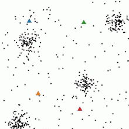

# 지도를 이용하는 프로젝트에서 가장 골치를 썩게 하는 클러스터링 문제

사실 지도를 이용하는 프로젝트에서 필수적으로 해결해야 하는 중요한 문제 입니다.

지도를 이용하는 대부분의 프로젝트가 그렇듯 저희도 구글맵 api 를 기반으로 하여 `lat , lng` (위경도) 값을 이용하여 마커들을 지도에 렌더링 합니다.


이 때 보고 있는 지도 부분에서 마커 개수가 매우 많음에도 불구하고 클러스터링이 일어나지 않는다면 심한 렉과 함께 매우 흉물스러운 지도를 보게 될 것 입니다.

마커 하나당 html 태그의 길이가 10줄일 경우 마커가 100 개만 존재하더라도 액츄얼 돔에는 1000 줄의 태그가 추가되고 지도가 이동 할 때 마다 1000개에 대한 레이아웃 과정이 일어나게 되니 렉이 심해질 수 밖에 없습니다.

그!래!서! 우리는 마커들을 자기들끼리 모여있는 부분을 찾아 적절하게 클러스터링 해줘야 합니다.

# 우리의 목표 : 근접한 위경도를 가진 애들끼리 묶자

우리는 지도라는 2차원 평면에서 lat , lng 좌표를 가진 마커들을 묶고 싶습니다.

그러면 가까운 놈들끼리는 하나의 그룹으로 묶어 지도의 나타내고 싶습니다.

이제부턴 묶인 그룹을 **군집(cluster)** 라고 표현 하겠습니다.

# 첫 번째로 시도한 방법 : KMeans 알고리즘

클러스터링과 관련되어 시도해 볼 수 있는 방법 중 가장 만만한게 `K-Means` 알고리즘일 겁니다.



[위키백과 KMeans](https://ko.wikipedia.org/wiki/K-%ED%8F%89%EA%B7%A0_%EC%95%8C%EA%B3%A0%EB%A6%AC%EC%A6%98)

<br/ >

알고리즘을 간단하게 설명하면 마커들을 묶을 군집의 개수를 정하고 임의의 부분에 군집들의 좌표를 지정합니다.

이후 각 마커들에 대해 군집까지의 거리를 계산하고 가장 가까운 군집에 해당 마커를 포함 시킵니다.

이후 각 군집들은 모인 마커들의 좌표를 이용해 군집의 좌표를 재조정 합니다. (다양한 방법이 있지만 저희는 마커 좌표의 평균으로 재조정했습니다.)

군집의 좌표가 재조정 되었다면 재조정 된 군집의 중심을 이용해 전체 마커들에 대해서 위 과정을 반복 합니다.

위 이미지를 보면 각 군집의 중심 좌표인 삼각형 모양이 지속적으로 이동하는 모습을 볼 수 있습니다.

이후 군집 재조정은 군집들의 중심 좌표가 변경되지 않을 때 까지 일어납니다.

> 
>
> 군집의 중심 좌표가 변경되지 않았다는 것은 이동 전에 모집한 마커와 이동 후에 모집한 마커들이 모두 같다는 것을 의미하고
>
> 그 말은 재조정 후 다시 모집 하더라도 결과가 동일하다는 것을 의미 합니다.
>
> 이에 더 이상 이동이 일어날 필요가 없다면 최적의 군집으로 간주하고 과정을 멈춥니다.

간단히 코드만 담아보자면 다음과 같습니다. `Marker[]` 의 배열에서 `numOfCluster` 개수 만큼의 클러스터를 생성하는 코드 입니다. 현재는 사용하지 않는 코드이기에 상당 부분을 생략하고 주석으로 대체 합니다.

```tsx title="useClustering"
// 마커들을 클러스터링 하기 위한 Cluster class
export class Cluster<T extends Marker> {
  ...
}

export const useKMeansClustering = <T extends Marker>() => {
  // 지도의 확대 수준과 지도의 반경에 대한 상태, 움직임이 일어날 때 마다 변경 됩니다.
  const { zoom, bounds } = useMapStore((state) => state.mapInfo);

 // API 요청이 변경 될 때 마다 캐싱된 값을 변경하기 위해 사용하는 ref
  const clusterKey = useRef<string>("");
  // 지도 이동 시 마다 값 비싼 클러스터링 연산을 시행하지 않기 위해 데이터를 캐싱해두는 ref
  const cachedMarkerIdsMap = useRef<CachedMarkerIdsMap>({});
  const cachedClusteredMarkersMap = useRef<CachedClusterdMarkersMap<T>>({});
  const cachedSingleMarkersMap = useRef<CachedSingleMarkersMap<T>>({});

  const getClusteredMarkers = (
    markers: T[],
    _clusterKey: ClusterKey = ""
  ): { clusteredMarkers: Cluster<T>[]; singleMarker: T[] } => {
    // 만약 클러스터 키가 변경된 경우 캐싱된 데이터를 초기화 합니다.
    if (JSON.stringify(_clusterKey) !== clusterKey.current) {
    ...
    }


    // 전체 마커에 대해 지도 내부에 있는 마커를 필터링 하고 이전에 사용되지 않은 마커를 필터링 합니다.
    const innerBoundaryMarkers = markers.filter(filterInnerBoundary);
    const nonCachedMarker = filterNonCachedMarker(innerBoundaryMarkers);

    // 이전에 캐싱 해둔 클러스터 중 현재 바운더리 내부에 있는 클러스터만 필터링 합니다.

    // 이전에 캐싱 해둔 싱글마커 중 현재 바운더리 내부에 있는 마커만 필터링 합니다.

    // 클러스터를 생성 할 마커들이 없다면 캐싱 된 데이터들을 반환하고 종료 합니다.

    // 줌 레벨에 따라 numOfCluster 를 고르고 Marker[] 에서 랜덤한 마커들의 위치로 초기 군집 위치를 생성 합니다. 이렇게 생성된 클러스터들을 clusters 라는 배열에 담습니다.

    // 클러스터링을 시행하는 반복문
    let isChanged = true;
    while (isChanged) {
      clusters.forEach((cluster) => cluster.clearMarke문s());

      nonCachedMarker.forEach((marker) => {
        const [, closestClusterIndex] = clusters.reduce(
          ([minDistance, minClusterIndex], cluster, index) => {
            const distance = cluster.calculateDistance(marker);
            return distance < minDistance
              ? [distance, index]
              : [minDistance, minClusterIndex];
          },
          [Infinity, -1]
        );
        // 가장 가까운 클러스터에게 마커를 추가합니다.
        clusters[closestClusterIndex].addMarker(marker);
      });
      // 클러스터의 중심점을 재조정합니다.
      // 이 때 모든 클러스터의 중심점이 재조정 되지 않았다면 반복문을 종료 합니다.
      isChanged = clusters.some((cluster) => cluster.revalidateCluster());
    }

    // 클러스터링 된 마커들과 단일 마커들을 구분지어 반환 합니다.
    // 이 때 생성된 클러스터들은 캐싱해두도록 합니다.
    clusteredMarkers = [...clusteredMarkers, ...cachedClusteredMarkers];
    singleMarker = [...singleMarker, ...cachedSingleMarkers];

    cachedClusteredMarkersMap.current[zoom] = clusteredMarkers;
    cachedSingleMarkersMap.current[zoom] = singleMarker;

    return { clusteredMarkers, singleMarker };
  };

  return getClusteredMarkers;
};
```

지도의 움직임에 따라 서로 다른 클러스터를 생성하는 `getClusteredMarkers` 메소드를 `Marker[]` 를 반환하는 리액트 쿼리문의 `select` 부분에 적용해줌으로서 매번 클러스터링이 된 마커들을 받아 렌더링 하도록 해주었습니다.


마커 500개에 대해서 클러스터링을 시행한 결과물입니다.

확대 수준이 변경 될 때 마다 군집의 개수를 다르게 하여 클러스터링을 매번 시행했고

지도가 이동 할 때에도 이전에 생성된 군집을 제외하고 새롭게 지도에 나타난 마커에 대해 클러스터링을 시행했습니다.

사실 이렇게 보면 잘 작동하는 것만 같이 보입니다.

다만 몇 가지 치명적인 문제들이 존재 했는데 그건 바로 **연산이 너무 오래 걸린다는 점**이였습니다.


KMeans 알고리즘은 각 K 개의 군집들의 분산이 어느정도 수준으로 적어 질 때 까지 지속적으로 반복하게 됩니다.

위의 코드에서 `isChanged = clusters.some((cluster) => cluster.revalidateCluster());` 부분이 false 일 때 까지 무한정 군집을 재형성 하는 모습을 볼 수 있었습니다.

그럼 생각해봐야 합니다. 마커 개수가 N 개 이고 생성해야 할 군집의 개수가 K 개라면 적어도 연산은 `O(N * K * 최적의 반복 횟수)` 회가 됩니다.

최적의 반복 횟수는 N,K 가 늘어날 수록 더 커지게 될 가능성이 있습니다. 계산해야 하는 마커들과 최적의 군집을 형성하기 위한 군집의 개수가 늘어나니까요

마커 개수와 군집 개수가 얼마 되지 않았을 땐 금방 수렴했으나 실제로 가장 최적의 반복 횟수를 찾기 위해 3000 개의 마커에 대해 40 개의 군집이 모두 완벽하게 형성 될 때 까지 연산을 해보면 7초가 걸리더군요

마커가 5000개가 넘어가게 되니 무한루프에 빠져서 브라우저가 뻗어버리기도 했고요

> 다만 이 부분은 각 군집 별로 최적의 반복 횟수를 어느정도 적정선에서 짤라주었다면 해결 되었을 수도 있습니다.
>
> 저흰 우선 모든 군집이 움직이지 않는 SUUUUUUPER BEST일 때 까지 반복해서 그렇습니다 하하

적절한 통계지식과 기가 막힌 알고리즘으로 코드를 짰다면 K means 알고리즘을 이용한 클러스터링은 올바른 방법이 됐을 수도 있지만 저희는 우선 해당 알고리즘을 사용하지 않기로 했습니다.

우선 마커들을 클러스터링 하는데 있어서 마커들의 분포를 정확하고 엄밀하게 표현해야 할 만큼의 필요성을 못느끼기도 했고

기가 막힌 통계학 지식도 부족하고 기가 막힌 알고리즘을 짤 자신이 없었기도 했습니다 호호 그래서 더 빠르고 단순한 방법을 사용하기로 했습니다.

저희가 원하는건 단순히 **서로 인접한 마커들이 적당히 모여있고 적당히 모여있는 공간을 확대 하면 내부 마커들을 보고싶은거**였기 때문입니다.

# 사용하기로 결정한 방법 : 타일링


만약 지도를 `X * Y` 개의 영역으로 구분 한 후 각 마커들이 어떤 타일에 존재 해야 하는지만 계산하고 각 타일별로 평균으로 군집화 하면 어떨까 ? 하는 생각이 들더군요

그러면 연산 횟수는 단순히 마커 N 개의 위치를 적절히 인덱싱을 통해 해당되는 타일에 추가해주고

`X * Y` 개의 타일에 대해 내부에 존재하는 마커들의 위치 평균으로 군집을 형성해주기만 하면 됩니다.

사실 전체 타일들의 평균 값을 계산하는건 그냥 전체 마커들의 개수만큼의 연산이 들어가는 것이기에 `O(2N)` 수준의 연산만 하면 됩니다.

결과물부터 먼저 봐보도록 하겠습니다 정말 빠른지


와우 진짜 무지하게 빠릅니다

테스트에 사용한 목업 데이터에서 마커들은 지도 내부에서 균등한 분포로 나타나기에 지금처럼 각 타일마다 군집들이 존재해 마치 바둑판마냥 보이는군요

좀 더 리얼한 모습을 볼 수 있게 마커를 1000 개정도로 변경해보면 이런 모습입니다.


# Tile 클래스

```tsx title="Tile"
/**
 * @description 지도의 경계를 나타내는 타입으로 현재 보고 있는 지도 전체의 바운더리를 의미 합니다.
 */
type MapBounds = MapCameraChangedEvent["detail"]["bounds"];
/**
 * @description 타일의 경계를 나타내는 타입으로 해당 타일의 바운더리를 의미 합니다.
 */
type TileBounds = MapCameraChangedEvent["detail"]["bounds"];
/**
 * @description 마커를 나타내는 타입으로 해당 마커의 위도, 경도, 마킹 아이디, 미리보기 이미지를 의미 합니다.
 */
interface Marker extends LatLng {
  markingId: number;
  previewImage: string;
}

export class Tile {
  bounds: TileBounds;
  markerCount: number = 0;
  position: LatLng = { lat: 0, lng: 0 };

  markerMap: Map<Marker["markingId"], boolean> = new Map();

  previewImage: Marker["previewImage"] = "";
  markingId: Marker["markingId"] = 0;

  constructor(bounds: TileBounds) {
    this.bounds = bounds;
  }

  addMarker({ lat, lng, previewImage, markingId }: Marker) {
    if (this.markerCount < 1) {
      this.previewImage = previewImage;
      this.markingId = markingId;
    }

    this.markerMap.set(markingId, true);
    this.markerCount += 1;

    this.position = {
      lat: this.position.lat + (lat - this.position.lat) / this.markerCount,
      lng: this.position.lng + (lng - this.position.lng) / this.markerCount,
    };
  }
}
```

지도의 영역별로 존재 할 타일 클래스를 생성해줍니다. 되게 단순합니다 타일의 영역과 내부에서 저장 할 마커들을 담을 자료구조를 가지고 있습니다.

# useTiling 훅

훅 내부에서 사용된 메소드들은 본문 최하단에 코드를 두도록 하겠습니다.

흐름만 주석으로 설명합니다 호호

```tsx title="useTiling 훅"
export const useTiling = () => {
  const bounds = useMapStore((state) => state.mapInfo.bounds);
  const zoom = useMapStore((state) => state.mapInfo.zoom);

  // 지도 영역을 채울 타일을 담는 2차원 배열
  const tiles = useRef<Tile[][]>([]);
  // 지도를 이동할 때 마다 군집이 새로 생성되지 않도록 이전에 생성된 타일들을 저장하는 ref
  const cachedTiles = useRef<Tile[]>([]);
  // 캐시된 타일을 초기화 하는 상황에 영향을 미치는 요소들을 저장하는 ref
  // 예를 들어 줌 레벨이 바뀌면 캐ㅅ 변경해야 합니다.
  // 혹은 외부에서 주입하는 타일링 키가 변경되면 캐시된 타일도 모두 지워야 합니다.
  const previousZoom = useRef<number>(zoom);
  const tilingKey = useRef<TilingKey>("");

  const getTiles = (_markers: Marker[], _tilingKey: TilingKey = "") => {
    // 만약 줌이 변경되었거나 타일 키가 변경된 경우엔 캐시된 타일을 초기화 합니다.
    const stringfiedTilingKey = JSON.stringify(_tilingKey);
    if (
      zoom !== previousZoom.current ||
      stringfiedTilingKey !== tilingKey.current
    ) {
      cachedTiles.current = [];
      tilingKey.current = stringfiedTilingKey;
    }
    previousZoom.current = zoom;

    // 지도가 이동했더라도 여전히 지도 내부에 존재하는 타일을 필터링 합니다.
    const intersectedCachedTiles = cachedTiles.current.filter((tile) =>
      filterIntercsectedTiles(bounds, tile.bounds)
    );

    // 전체 마커들 중 현재 지도 내부에 있는 마커를 필터링 합니다.
    const innerBoundaryMarkers = _markers.filter((marker) =>
      filterInnerBoundary(marker, bounds)
    );

    // 현재 지도 내부에 있으면서 캐싱된 타일에 포함되지 않는 마커를 필터링 합니다.
    // 이 마커들을 이용해 새롭게 타일들을 생성합니다.
    const markers = innerBoundaryMarkers.filter(({ markingId }) => {
      return !intersectedCachedTiles.some((tile) =>
        tile.markerMap.has(markingId)
      );
    });

    if (markers.length < 1) {
      return cachedTiles.current;
    }

    // 줌 레벨에 따라 타일 개수를 결정합니다. numOfTiles 의 타입은 [number , number] 입니다.
    const TileZoomLevel = Math.floor(zoom) as TileZoomLevel;
    const numOfTiles = NUM_OF_TILE_MAP[TileZoomLevel];

    // 전체 지도의 크기를  타일 개수로 나눠 타일의 가로 세로 길이를 계산합니다.
    const tileArea = getTileArea(bounds, numOfTiles);

    // tileArea 만큼의 크기를 가진   Tile[][] 형태의 배열을 생성해줍니다.
    tiles.current = createTiles(bounds, numOfTiles);

    // 각 lat , lng 값을 이용해 Tile[][] 배열에서 해당하는 타일을 찾아 값을 추가 합니다.
    markers.forEach((marker) => {
      const [lngIndex, latIndex] = calculateTileIndex(marker, tileArea, bounds);
      tiles.current[lngIndex][latIndex].addMarker(marker);
    });

    // 캐싱 된 타일과 함께 타일을 반환합니다. 이 때 생성된 타일은 다시 캐싱해두도록 합니다.
    const newTiles = tiles.current.flat().concat(intersectedCachedTiles);

    cachedTiles.current = newTiles;

    return newTiles;
  };

  return getTiles;
};
```

로직이 매우 단순하고 간단해졌습니다.

머리가 지끈거리는 통계학적 지식도 필요하지 않습니다.

단순히 지도에서 마커가 존재하는 위치로 해당하는 타일을 추가해줄 뿐입니다.

구우우웃 ~~~~-

# 전체 코드

```tsx title="tile.ts"
import { useRef } from "react";
import { MapCameraChangedEvent } from "@vis.gl/react-google-maps";
import { useMapStore } from "@/features/map/store";
import { NUM_OF_TILE_MAP } from "../constants";

/**
 * @description 지도의 경계를 나타내는 타입으로 현재 보고 있는 지도 전체의 바운더리를 의미 합니다.
 */
type MapBounds = MapCameraChangedEvent["detail"]["bounds"];
/**
 * @description 타일의 경계를 나타내는 타입으로 해당 타일의 바운더리를 의미 합니다.
 */
type TileBounds = MapCameraChangedEvent["detail"]["bounds"];
/**
 * @description 마커를 나타내는 타입으로 해당 마커의 위도, 경도, 마킹 아이디, 미리보기 이미지를 의미 합니다.
 */

interface LatLng {
  lat: number;
  lng: number;
}
interface Marker extends LatLng {
  markingId: number;
  previewImage: string;
}

export class Tile {
  bounds: TileBounds;
  markerCount: number = 0;
  position: LatLng = { lat: 0, lng: 0 };

  markerMap: Map<Marker["markingId"], boolean> = new Map();

  previewImage: Marker["previewImage"] = "";
  markingId: Marker["markingId"] = 0;

  constructor(bounds: TileBounds) {
    this.bounds = bounds;
  }

  addMarker({ lat, lng, previewImage, markingId }: Marker) {
    // 처음 삽입되는 마커의 썸네일과 마킹 아이디를 저장 합니다.
    if (this.markerCount < 1) {
      this.previewImage = previewImage;
      this.markingId = markingId;
    }

    this.markerMap.set(markingId, true);
    this.markerCount += 1;

    this.position = {
      lat: this.position.lat + (lat - this.position.lat) / this.markerCount,
      lng: this.position.lng + (lng - this.position.lng) / this.markerCount,
    };
  }
}

type TileZoomLevel = keyof typeof NUM_OF_TILE_MAP;
type NumOfTiles = (typeof NUM_OF_TILE_MAP)[TileZoomLevel];

/**
 * TileArea
 * @description 각 타일 별 위도, 경도의 길이를 나타내는 타입입니다.
 */
interface TileArea {
  width: number;
  height: number;
}
const getTileArea = (
  bounds: MapBounds,
  [numOfRowTiles, numOfColTiles]: NumOfTiles
): TileArea => {
  return {
    width: (bounds.east - bounds.west) / numOfRowTiles,
    height: (bounds.north - bounds.south) / numOfColTiles,
  };
};

/**
 * @description 지도의 바운더리와 타일의 개수를 받아 numOfRowTiles x numOfColTiles 타일을 생성합니다.
 */
const createTiles = (bounds: MapBounds, numOfTiles: NumOfTiles): Tile[][] => {
  const { width, height } = getTileArea(bounds, numOfTiles);
  const [numOfRowTiles, numOfColTiles] = numOfTiles;
  const { west, south } = bounds;

  const createTile = (rowIndex: number, colIndex: number): Tile => {
    return new Tile({
      east: west + width * (rowIndex + 1),
      west: west + width * rowIndex,
      north: south + height * colIndex,
      south: south + height * (colIndex + 1),
    });
  };

  return Array.from({ length: numOfRowTiles }, (_, lngIndex) =>
    Array.from({ length: numOfColTiles }, (_, latIndex) =>
      createTile(lngIndex, latIndex)
    )
  );
};

/**
 * calculateTileIndex
 * @description 마커의 위도, 경도와 타일의 위도, 경도 길이를 받아 해당 마커가 속한 타일의 인덱스를 반환합니다.
 * 타일의 인덱스를 계산하는 방법은 다음과 같습니다.
 * 1. 전체 맵의 위도로부터 현재 마커의 위도와 경도를 뺍니다. 해당 값은 위경도 시작점으로부터 마커까지의 거리를 나타냅니다.
 * 2. 해당 거리를 타일의 길이로 나눠 몫을 구합니다. 해당 몫은 마커가 속한 타일의 인덱스를 나타냅니다.
 */
const calculateTileIndex = (
  { lat, lng }: Marker,
  { width, height }: TileArea,
  { west, south }: MapBounds
) => {
  const lngIndex = Math.floor((lng - west) / width);
  const latIndex = Math.floor((lat - south) / height);
  return [lngIndex, latIndex];
};

const filterInnerBoundary = ({ lat, lng }: LatLng, bounds: MapBounds) => {
  return (
    lat < bounds.north &&
    lat > bounds.south &&
    lng < bounds.east &&
    lng > bounds.west
  );
};

const filterIntercsectedTiles = (
  mapBounds: MapBounds,
  bounds: Tile["bounds"]
) => {
  return (
    mapBounds.north > bounds.south &&
    mapBounds.south < bounds.north &&
    mapBounds.east > bounds.west &&
    mapBounds.west < bounds.east
  );
};

type TilingKey = string | { [key: string]: number } | undefined;

export const useTiling = () => {
  const bounds = useMapStore((state) => state.mapInfo.bounds);
  const zoom = useMapStore((state) => state.mapInfo.zoom);

  const tiles = useRef<Tile[][]>([]);
  const cachedTiles = useRef<Tile[]>([]);
  const previousZoom = useRef<number>(zoom);
  const tilingKey = useRef<TilingKey>("");

  /**
   * @description 마커들을 받아 해당 마커들을 타일에 분배합니다.
   * @returns 2차원 배열로 분배된 타일들을 1차원 배열로 반환합니다.
   */
  const getTiles = (_markers: Marker[], _tilingKey: TilingKey = "") => {
    // 만약 줌이 변경되었거나 타일 키가 변경된 경우엔 캐시된 타일을 초기화 합니다.
    const stringfiedTilingKey = JSON.stringify(_tilingKey);
    if (
      zoom !== previousZoom.current ||
      stringfiedTilingKey !== tilingKey.current
    ) {
      cachedTiles.current = [];
      tilingKey.current = stringfiedTilingKey;
    }
    previousZoom.current = zoom;

    const intersectedCachedTiles = cachedTiles.current.filter((tile) =>
      filterIntercsectedTiles(bounds, tile.bounds)
    );

    const innerBoundaryMarkers = _markers.filter((marker) =>
      filterInnerBoundary(marker, bounds)
    );

    const markers = innerBoundaryMarkers.filter(({ markingId }) => {
      return !intersectedCachedTiles.some((tile) =>
        tile.markerMap.has(markingId)
      );
    });

    if (markers.length < 1) {
      return cachedTiles.current;
    }

    const TileZoomLevel = Math.floor(zoom) as TileZoomLevel;
    const numOfTiles = NUM_OF_TILE_MAP[TileZoomLevel];

    const tileArea = getTileArea(bounds, numOfTiles);

    tiles.current = createTiles(bounds, numOfTiles);

    markers.forEach((marker) => {
      const [lngIndex, latIndex] = calculateTileIndex(marker, tileArea, bounds);
      tiles.current[lngIndex][latIndex].addMarker(marker);
    });

    const newTiles = tiles.current.flat().concat(intersectedCachedTiles);

    cachedTiles.current = newTiles;

    return newTiles;
  };

  return getTiles;
};
```

