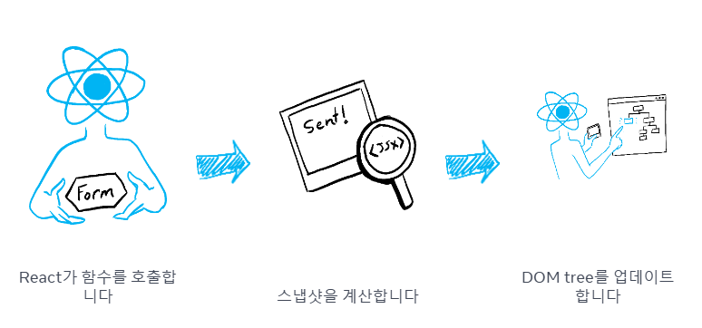

이번 포스트는 프로젝트를 진행하며 겪었던 저의 지식 부재에 대한 경험담입니다.

# 문제를 겪은 상황

저희 프로젝트에선 스낵바를 열고 닫는 행위를 전역 스토어의 `addOveray` 라는 메소드로 마운트 하고 `removeOverlay` 라는 메소드로 언마운트 시키는 로직을 이용하고 있습니다.


```tsx title="스낵바를 여닫는 useSnackbar 훅의 초기 구현체"
export const useSnackBar = () => {
  const addOverlay = useOverlayStore((state) => state.addOverlay);

  const handleOpenSnackbar = (
    text: React.ReactNode,
    snackbarOptions?: Omit<SnackBarProps, "children">
  ) => {
    addOverlay({
      id: SNACKBAR_ID,
      component: <Snackbar {...snackbarOptions}>{text}</Snackbar>,
      options: {
        disableInteraction: false,
      },
    });
  };

  return handleOpenSnackbar;
};
```

스낵바를 열고자 하는 곳에선 `handleOpenSnackbar(보여주고자 하는 텍스트)` 를 호출해 스낵바를 열게 됩니다. (스낵바 내부에는 `removeOverlay` 가 버튼에 부착되어 있습니다.)

이는 스낵바가 한 번에 하나만 나타나게 된다면 전혀 문제가 없는 부분입니다.

하지만 이런 시나리오를 생각해봐야 합니다.

_만약 스낵바가 여러 번 떠야 한다면? 혹시 다른 내용의 스낵바가 떠야 한다면?_


현재의 코드는 여러 에러가 동시 다발적으로 일어나 여러 스낵바를 띄우는 경우의 문제를 대처하지 못하고 있습니다.

이에 저희는 **스낵바는 한 번에 하나의 스낵바만이 띄워져있어야 해! 라는 규칙을 설정**했습니다.

그렇다면 우리는 `handleOpenSnackbar` 를 호출하여 스낵바를 띄우는 `addOvelray` 를 호출하기 전 기존에 존재하는 스낵바를 제거하는 `removeOverlay` 를 호출 한 후 `addOverlay` 를 호출해야 합니다.

따라서 리액트스럽게 생각 안하고 별 생각 없이 작성한 이 코드는 정상적으로 동작하지 않습니다.

```tsx title="스낵바를 여닫는 useSnackbar 훅의 초기 구현체" {8}#add
export const useSnackBar = () => {
  const addOverlay = useOverlayStore((state) => state.addOverlay);

  const handleOpenSnackbar = (
    text: React.ReactNode,
    snackbarOptions?: Omit<SnackBarProps, "children">
  ) => {
    removeOverlay(SNACKBAR_ID);

    addOverlay({
      id: SNACKBAR_ID,
      component: <Snackbar {...snackbarOptions}>{text}</Snackbar>,
      options: {
        disableInteraction: false,
      },
    });
  };

  return handleOpenSnackbar;
};
```


# 리액트의 상태 변경 방식은 비동기적인 방식

사실 리액트를 조금이라도 써본 분이라면 위 코드가 왜그렇게 얼토당토없는 코드인지 단번에 이해했을 것입니다.


위 코드는 마치 이것과 같습니다.

```tsx title="스냅샷을 바보같이 찍는 예시"
const [number, setNumber] = useState(1);
const handleClick = () =>
  // handleClick이 처음으로 호출 된다면
  setNumber(number + 1); // number가 1인 형태로 큐에 저장
  setNumber(number * 2); // number가 1인 형태로 큐에 저장
};
```

이렇게 숫자를 1 더하고 2 를 곱하고 싶은 상황에서 위 이벤트 핸들러가 시행되면 숫자는 단순히 2 만 곱해지게 될 것입니다.

그 이유는 리액트의 **상태 변경은 비동기적으로 변경 될 상태들을 큐에 담아두고 일괄적으로 큐에 저장된 업데이트들을 처리하기 때문**입니다.

추상화 된 형태인 `setState` 는 사용 할 때 'ㅋㅋ 아 상태를 변경시키라고' 라는 생각으로 간단히 생각하게 되지만 사실 리액트의 상태 변경 내부에는 이보다 더 복잡한 로직들이 존재 합니다.

> 호출이 되고나면 상태 변경이 예정된 컴포넌트를 virtual dom 에서 수정이 일어나야 할 컴포넌트로 업데이트 하고 업데이트 된 컴포넌트들을 따라 virtual dom을 다시 생성하고 다시 생성된 virtual dom 과 이전의 virtual dom을 비교(diffing)해서 actual dom 을 업데이트 해야 할 사항들만을 업데이트 하고 ...

만약 `setState` 가 동기적으로 처리 된다면 리액트가 자랑하는 `diffing algorithm` 을 사용하는 이유가 없을 것입니다. 그냥 `actual dom` 을 직접 조작하는 행위보다 오히려 더 성능이 안좋을 것입니다. 바로 액츄얼돔을 조작하는 것보다 가상돔을 업데이트 하는 불필요한 단계가 존재하니까요.

따라서 리액트는 상태 변경 업데이트들을 비동기적으로 큐에 담아두고 **상태 변경들을 처리 해야 할 적절한 타이밍이 오면 그 때 상태 변경들을 일괄적**으로 처리하는 방식을 택하였습니다.

그럼 우리가 맨 처음에 시행했던 바보같은 첫 번째 코드가 정상적으로 동작하지 않은 이유는 너무나도 쉽습니다.

```tsx title="스낵바를 여닫는 useSnackbar 훅의 초기 구현체" {8}#add
export const useSnackBar = () => {
  const addOverlay = useOverlayStore((state) => state.addOverlay);

  const handleOpenSnackbar = (
    text: React.ReactNode,
    snackbarOptions?: Omit<SnackBarProps, "children">
  ) => {
    removeOverlay(SNACKBAR_ID);

    addOverlay({
      id: SNACKBAR_ID,
      component: <Snackbar {...snackbarOptions}>{text}</Snackbar>,
      options: {
        disableInteraction: false,
      },
    });
  };

  return handleOpenSnackbar;
};
```

상태 변경 업데이트 큐에서 `handleOpenSnackbar`가 호출되어 스낵바의 열림 상태를 `close, open` 으로 업데이트 하는 것이 큐에 담겼을 때 최종적인 스낵바의 상태는 가장 마지막에 호출된 `open` 형태로 존재하게 됩니다.

따라서 리액트는 `스낵바의 상태는 이전에도 open이였는데 이번에도 open 이니 업데이트가 일어날 필요가 없겠군..` 이라 생각하고 스낵바의 업데이트가 일어나지 않게 된 것입니다.

> 위에서 든 `setNumber` 의 해결 방식으론 상태 변경을 함수로 처리하는 방법이 존재합니다. 가장 일반적인 방법입니다.

# 우리가 문제를 해결하기 위해 선택했던 바보같은 선택 1 : 상태 변경을 이벤트 루프로 보내버리기

저희가 원하는 흐름은 스낵바의 상태를 `close` 로 먼저 변경하여 액츄얼돔의 상태를 변경 시키고 그 이후 `open` 으로 변경하여 액츄얼 돔을 다시 업데이트 하는 것이였습니다.

즉 **상태 변경을 동기적으로 호출 순서에 맞춰 변경**하고 싶은 것입니다.


```tsx title="상태 변경을 이벤트 루프로 보내버리기" {10-18}#add
export const useSnackBar = () => {
  const addOverlay = useOverlayStore((state) => state.addOverlay);

  const handleOpenSnackbar = (
    text: React.ReactNode,
    snackbarOptions?: Omit<SnackBarProps, "children">
  ) => {
    removeOverlay(SNACKBAR_ID);

    setTimeout(() => {
      addOverlay({
        id: SNACKBAR_ID,
        component: <Snackbar {...snackbarOptions}>{text}</Snackbar>,
        options: {
          disableInteraction: false,
        },
      });
    }, 0);
  };

  return handleOpenSnackbar;
};
```

가장 처음으로 든 생각은 애초에 상태 변경 업데이트 자체를 이벤트 루프로 보내버려 , `removeOverlay` 에 대한 상태 변경 및 액츄얼 돔 업데이트가 일어난 후 `addOverlay` 를 이벤트 루프에서 콜스택으로 다시 돌아왔을 때 `addOverlay` 로 상태를 변경시키는 방식을 선택했었습니다.

사실 이 코드도 100% 문제 없이 잘 동작합니다.

마이크로태스트 큐로 보내진 `addOverlay` 는 콜스택에 올라간 상태 변경에 의해 처리 되는 다양한 로직들이 모두 실행된 후 콜스택에 올라온 후 실행 될 것이기 때문입니다.

하지만 코드에서 나는 코드 스멜을 참을 수가 없습니다.. 너무나도 리액트스럽지 않고 억지스럽게 끼어맞춘 느낌이 강하게 들기 때문입니다.

# 우리가 문제를 해결하기 위해 선택했던 바보같은 선택 2 : flushSync 를 이용하기

그러면 리액트에서 제공하는 내부 메소드인 `flushSync` 를 이용하여 처리 해보았습니다.

```tsx title="flushSync를 이용해 동기적으로 업데이트 하기" {8-10}#add
export const useSnackBar = () => {
  const addOverlay = useOverlayStore((state) => state.addOverlay);

  const handleOpenSnackbar = (
    text: React.ReactNode,
    snackbarOptions?: Omit<SnackBarProps, "children">
  ) => {
    flushSync(() => {
      removeOverlay(SNACKBAR_ID);
    });

    addOverlay({
      id: SNACKBAR_ID,
      component: <Snackbar {...snackbarOptions}>{text}</Snackbar>,
      options: {
        disableInteraction: false,
      },
    });
  };

  return handleOpenSnackbar;
};
```

이것도 사실은 아주 잘 동작합니다.

`flushSync` 자체가 콜백 메소드 내부에 존재하는 상태 변경 업데이트를 동기적으로 처리하게 하기 때문입니다.

즉 리액트는 `flushSync` 가 호출되게 되면 큐에 담겨진 모든 작업을 강제로 처리하고 actual dom 을 동기적으로 업데이트 하게 됩니다.

이후 액츄얼 돔의 업데이트가 종료되면 나머지 상태 변경들을 다시 큐에 담고 처리하게 됩니다.

사실 여기만 보고 와우 드디어 해결했군 이렇게 생각했습다..만 공식문서에 가면 무시무시해보이는 경고문들이 보입니다.


대규모 상태 업데이트를 `flushSync` 를 이용하게 되면 리액트의 최적화 된 스케줄링 업데이트를 무시하고 업데이트 하기 때문에 성능이 저하 될 수 있다는 단점이 존재합니다.

사실 저희단에서는 그다지 큰 상태 업데이트가 아니기에 해당되는 부분은 없지만 찜찜한 부분은 **리액트의 상태 변경 로직을 무시하고 써야 할 만큼 이 방법이 최선일까?** 라는 물음이 생기게 됩니다.

위 두가지 방식들은 오히려 상태변경의 흐름을 추적하기 어렵게 만들고 있었습니다.

그 때 깨달은 사실은 우리가 상태 변경을 **선언적으로하지 않고 명령적으로 하고 있다** 라는 것입니다.

# 우리가 문제를 해결하기로 선택한 최선의 선택 : 선언적으로 상태 변경 하기

위에서 상태 변경 로직을 짤 때 머리속에 존재하는 흐름은 이랬습니다.

`handleOpenSnackbar 가 클릭 되면 , 스낵바의 상태를 close 로 하고 , open 으로 만들자`

과연 이런 방식이 선언적인 방식이였을까 ? 라고 생각하면 아닌 거 같습니다.

이렇게 명령형으로 처리하려고 하다보니 `setTimeout` 이나 `flushSync` 같은 방법들을 찾고 있었더군요.

오히려 상태를 선언적인 방식으로 관리 한다면 이렇게 생각하는 것이 올바르다 느꼈습니다.

`1. handleOpenSnackbar가 클릭 되면 스낵바의 상태를 close로 만들고 새로 열릴 스낵바 내부의 옵션 상태를 변경하자`
`2. 스낵바 내부의 옵션 상태가 변경되면 변경된 상태로 스낵바의 상태를 open으로 만들자`

즉 상태 변경 단계를 선언적으로 생각하고 나면 상태 변경이 어떻게 흘러가는지 추적하기 쉬워보일 것이라 생각들었습니다.

그래서 우리는 이렇게 코드를 수정했습니다.

```tsx title="상태 변경을 동기적인 것처럼 선언형으로 변경하기" {4-6, 8-19 , 27-31}#add
export const useSnackBar = () => {
  const addOverlay = useOverlayStore((state) => state.addOverlay);
  const removeOverlay = useOverlayStore((state) => state.removeOverlay);
  const [snackbarProps, setSnackbarProps] = useState<SnackBarProps | null>(
    null
  );

  useEffect(() => {
    if (snackbarProps === null) return;

    const { children, ...snackbarOptions } = snackbarProps;
    addOverlay({
      id: SNACKBAR_ID,
      component: <Snackbar {...snackbarOptions}>{children}</Snackbar>,
      options: {
        disableInteraction: false,
      },
    });
  }, [snackbarProps]);

  const handleOpenSnackbar = (
    children: React.ReactNode,
    snackbarOptions?: Omit<SnackBarProps, "children">
  ) => {
    removeOverlay(SNACKBAR_ID);

    setSnackbarProps({
      ...snackbarOptions,
      children,
    });
  };

  return handleOpenSnackbar;
};
```

상태의 변경을 선언적으로 처리했습니다.

1. `handleOpenSnackbar` 를 클릭하면 스낵바의 상태를 close 로 변경하고 인수로 받은 props 로 `snackbarProps` 의 상태를 변경 합니다.

2. `snackbarProps` 의 상태가 변경되면 변경된 상태를 이용해 스낵바의 상태를 open 으로 변경합니다.

이렇게 처리하고 나니 상태 변경의 처리 흐름이 추적하기 쉬워지고 좀 더 리액트스러워진 느낌이 듭니다.

사실 `useEffect` 내에서 상태를 변경시키는 행위 자체도 지양해야 한다는 여러 포스트들이 존재하지만 최악보단 차악이 낫다고 생각이 들어 이 방식을 저희는 현재 채택했습니다.

> 포스트를 쓰는 지금 시점에서 `useEffect` 가 아닌 `useLayoutEffect` 를 쓰면 더 낫지 않을까 ? 라는 생각도 드네요

이번 작업을 기점으로 하여 여태 상태 변경들을 내가 명령형으로 처리하고 있는건 아닌지, 과연 선언적으로 처리하고 있는게 맞는지에 대한 의문을 가지고 기존의 코드들을 모두 다시 돌아볼 예정입니다.

