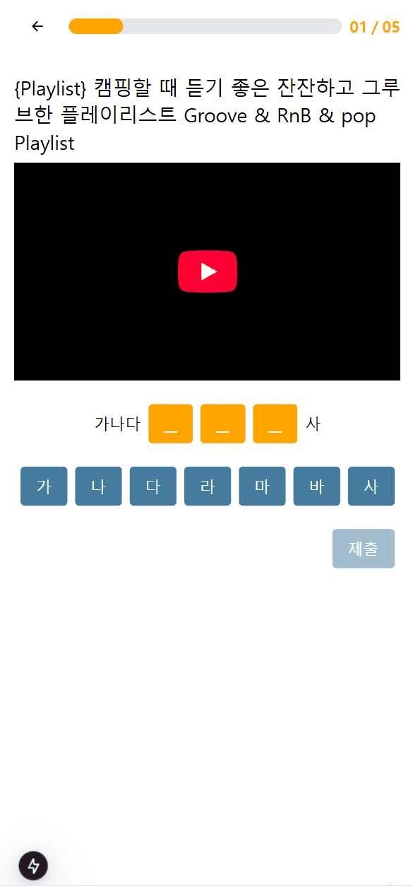
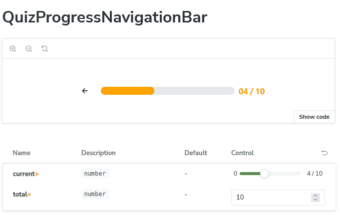

# 글을 들어가며

현재 스터디에서 어린이를 위한 AI 교육 플랫폼에 관심 있는 백엔드 개발자분과 사이드 프로젝트의 MVP 를 이번주에 만들어봤다.

만들어 보기 전 최근 함수형 프로그래밍 방식에 관심이 생겨 `쏙쏙 들어오는 함수형 코딩` 책을 읽고 있었다.

함수형 프로그래밍의 개념은 리액트와 매우 결이 비슷한데 이를 이용해 리액트의 추상화 수준을 컨트롤 해보기로 했다.

책에서 소개하는 예시가 리액트 컴포넌트를 구성하는 예시와 매우 유사했기 때문이다.

> 사실상 그럴 수 밖에 없는게 리액트의 컴포넌트 자체가 함수이기 때문이기도 하다.

# 책에서 소개하는 계층형 설계의 예시

컴포넌트로 들어가기 전 책에서 이야기하는 계층형 설계 예시를 들어보자

해당 책에선 가장 낮은 추상화 수준을 가진 자바스크립트 언어들로만 하드 코딩된 코드를

추상화 된 여러 메소드들로 나눠 리팩토링 해나가는 과정을 설명한다.

밑 예시는 하드 코딩된 코드를 추상화 된 메소드들로 리팩토링 한 이후의 코드를 흉내내봤다.

- 상황

물품을 판매하는 어떤 회사에서 다음과 같은 코드를 작성하고자 하려고 한다고 한다.

- 가입한지 1년이 넘은 사용자가 장바구니에 물건을 100 달러 이상 담으면 10% 할인을 받는다.

이러한 로직을 슈도 코드로 작성해보면 다음과 같이 작성할 수 있다.

```ts title="장바구니에 물건을 담는 슈도 코드"
const 장바구니에 물건 담기 = (장바구니 , 물건 아이디, 유저 아이디)=>{

  const 물건 가격  = 물건 가격 구하기(물건 아이디);
  const 총 장바구니 금액 = 총합계산(...장바구니, 물건.가격)

  if (총 장바구니 금액 > 100달러){
    const { 유저 가입일 } = 유저정보 불러오기(유저 아이디);

    if (유저 가입일 > 1년){
      장바구니에 물건 담기(장바구니, 물건);
      const 할인된 금액 = 가격 계산하기(총 장바구니 금액, 10%);
      장바구니 가격 업데이트 하기 (장바구니, 할인된 금액);
      return;
    }
  }

  장바구니에 물건 담기(장바구니, 물건);
  장바구니 가격 업데이트 하기 (장바구니, 총 장바구니 금액);
}
```

위 함수에 사용된 로직들을 종류와 계층으로 나눠보자

- 장바구니 (비즈니스 로직)
  - 물건 (비즈니스 로직)
  - 유저 (비즈니스 로직)
    - 가격 계산 (유틸적인 도메인 로직)

장바구니에 어떤 로직을 추가하기 위해 하위 계층에 존재하는 물건과 유저에 대한 메소드를 호출했고

어떤 가격을 계산하기 위한 `가격 계산` 과 같은 유틸적인 메소드를 호출했다.

여기서 세 가지 내용을 알 수 있다.

1. 높은 수준의 어떤 함수는 하위 수준의 함수들을 호출하여 로직을 수행한다. (장바구니 로직은 물건, 유저, 가격 계산이란 요소들의 조합으로 구성 되어있다)
2. 낮은 수준의 어떤 함수는 높은 수준의 함수를 호출 할 수 없다. (예를 들어 물건 정보를 불러오는 함수는 장바구니에 물건을 담는 함수를 호출 할 수 없다. 장바구니 자체가 물건들의 조합으로 이뤄져있기 때문이다.)
3. 서로 같은 수준의 함수는 다른 종류의 함수를 호출 할 수 없다. (예를 들어 유저 정보 불러오기 함수는 물건 불러오기 함수와 관련이 없기에 호출 할 수 없다.)

FSD를 접해봤던 사람들은 위 3가지 로직이 FSD 에서 말하는 레이어,슬라이스의 규칙과 같다는 것을 쉽게 알 수 있을 것이다.


> - 레이어
>
> 레이어를 다룰 때의 중요한 점은 한 **레이어의 구성 요소는 반드시 아래에 있는 레이어의 구성 요소만 알수있고 임포트할 수 있다**는 것입니다.
>
> - 슬라이스
>
> 다음은 슬라이스입니다. 슬라이스는 **비즈니스 도메인별로 코드를 분할**합니다.
>
> **슬라이스는 같은 레이어 안에서 다른 슬라이스를 참조할 수 없으며**, 이 규칙은 높은 응집도와 낮은 결합도를 유지하는 데 도움이 됩니다.
>
> [FSD Document](https://feature-sliced.design/kr/docs/get-started/overview#layers)

위 예시를 FSD 에서 말하는 레이어의 기준으로 생각해보면

가격을 계산하는 유틸 메소드 등은 shared 레이어에 해당 할 것이고

물건 , 유저들의 정보는 entities 레이어에 해당 할 것이다.

여러 도메인들이 조합되어서 만들어진 장바구니란 함수는 widget 레이어에 해당 할 것이다.

컴포넌트로 생각하고, 장바구니 페이지를 구성한다고 생각해보면

**장바구니라는 widget은 entities 혹은 features 에서 생성된 물건,유저 정보들을 담은 컴포넌트들의 조합으로 만들 수 있겠구나!** 라는 결론에 도달했다.

오마이갓 , 이전 프로젝트에서 내가 사용한 FSD 가 어정쩡 하고 이상했던 것이 layer 의 개념을 이상하게 이해하고

계층형 설계를 하지 못했기 때문이란 것을 깨달았다.

계층형 설계를 하게 되면 추상화는 자연스럽게 되게 된다.

장바구니 메소드에선 물건과 관련된 메소드인 물건 가격 구하기, 유저 정보와 관련된 유저 정보 불러오기 등 메소드들의 내부 구현이 어떻게 되든 상관 없이

그저 결과만 아용하여 장바구니와 관련된 로직을 시행하기 때문에

장바구니 계층과 하위 계층인 물건, 유저 계층 사이에 **추상화의 벽**이 생기게 된다.

# 위 예시를 머리속에 담아두고 페이지를 구성해보자



대충 주제는 어린이를 위해 만든 AI 동화나 뉴스를 비디오로 제공하고

해당 내용과 관련 있는 퀴즈를 풀어보는 페이지를 만들어보았다. (아직 API 구현 전이라 퀴즈와 비디오, 제목들은 예시 데이터다.)

전체적인 포맷은 듀오링고를 참고했고 끔찍한 디자인은 우선 덮어두고 구성 요소를 생각해보자

위 위젯은 다음 3가지 비즈니스 로직을 다루고 있다.

- progress : 진척도와 관련된 정보를 관리하는 컴포넌트로 상단의 바, 상단 오른쪽에 존재하는 진행도 표시 컴포넌트
- video : 비디오와 관련된 정보를 관리하는 컴포넌트로 비디오를 표시하는 컴포넌트
- quiz (features) : 퀴즈 풀이 게임과 관련된 컴포넌트, 위 예시에선 빈칸 채우기가 이에 해당한다.

위 3가지 도메인들은 서로간의 관계가 없는 도메인이지만

어떤 퀴즈 주제를 풀고 있는지에 따라 퀴즈와 관련된 진척도 (progress) , 해당 퀴즈와 관련된 동영상 (video) , 해당 주제 퀴즈에 대한 퀴즈 게임 (quiz) 가 결정되며 조합된다.

# entities , features 를 이용하여 Widget 구성 하기

이에 따라 위젯을 구성해보면 다음과 같다.

```tsx title="widgets/quiz/ui/QuizWidget" {31-38}#point
import { BlankQuiz } from "@/features/quiz/ui";
import type { ValidDateExpression } from "@/entities/date/types";
import { ProgressBar, ProgressCounter } from "@/entities/progress/ui";
import { useGetQuizByCategory } from "@/entities/quiz/api";
import { YoutubeVideo } from "@/entities/video/ui";

export const QuizWidget: React.FC<QuizWidgetProps> = ({ category, date }) => {
  const [page, setPage] = useState<number>(1);
  const query = useGetQuizByCategory({ category, date, page });
  const handlePage = (callback: SetStateAction<number>) => setPage(callback);

  return (
    <QuizWidgetContainer>
      <Suspense fallback={<div>...loading</div>}>
        <QuizProgressNavigationBar query={query} />
        <QuizVideo query={query} />
        <ConditionalQuizFool query={query} handlePage={handlePage} />
      </Suspense>
    </QuizWidgetContainer>
  );
};

// 기타 코드들 ..

const QuizProgressNavigationBar: React.FC<QuizItemProps> = ({ query }) => {
  const { totalPage, currentPage } = use(query.promise);

  return (
    <Flex gap="sm" align="center" as="nav" className="w-full">
      <BackwardButton />
      <ProgressBar
        current={currentPage}
        total={totalPage}
        classNames={{
          total: "h-4",
        }}
      />
      <ProgressCounter current={currentPage} total={totalPage} />
    </Flex>
  );
};
```

```tsx title="entities/progress/ui/ProgressBar"
// 하위 레이어는 단순히 props만을 받아 본연의 역할을 수행 한다.
export const ProgressBar: React.FC<ProgressBarProps> = ({
  current,
  total,
  classNames = {},
}) => {
  return (
    <div
      ...
    >
      <div
        ...
        style={{
          width: `${(current / total) * 100}%`,
        }}
      ></div>
    </div>
  );
};
```

최대한 `entities , features` 레이어에 `progress , quiz , video` 슬라이스에 외부 데이터를 props로 받도록 하는 헤드리스 컴포넌트 형태로 생성해준 후

`widget` 레이어에서 하위레이어의 컴포넌트에 데이터를 주입한 컴포넌트로 감싼 후 조합해주었다.

# 왜 entities , features 레이어의 컴포넌트들을 헤드리스로 만들었을까 ?

나는 무조건 데이터 주입은 `widget , pages` 와 같이 상단에서 주입하도록 하는 것이 좋다고 생각했다.

이러한 결론을 내린 이유는 다음과 같다.

1. 하위 레이어의 정체성을 명확히 할 수 있다.

하위 레이어에서 API 로직을 제거하고 단순히 props 로 받도록만 하게 되면 컴포넌트들은 매우 단순하게 **외부에서 어떤 데이터를 주입 받아 렌더링 한다.** 라는 매우 단순한 역할만을 수행하게 된다.

만일 내부에서 API 를 호출하여 데이터를 직접 주입하게 된다면 하위 레이어에 정의 된 본인의 로직 뿐 아닌 부가적인 로직을 함께 수행하게 되어 너무 무거워진다.

모든 API 로직을 상위 레이어에서 처리함으로서 **상위 레이어의 정체성 또한 데이터를 받아와 하위 레이어를 조합하여 렌더링 한다.** 라는 로직이 명확해질수 있다.

2. 데이터를 props 로 받게 되면 테스트하기가 쉬워진다.

API 로직을 하위 레이어에서 제거하게 되면 스토리북 같은 곳에서 UI 테스트 코드를 작성할 때

API 모킹이니 이런거 신경 쓸 필요 없이 단순히 props 만 주입하면 되기 때문에 테스트 코드 작성이 매우 쉬워진다.



# entities , features 레이어 구분 방법

예전 FSD 를 접했을 때 레이어 구분 방법이 너무 어렵게 느껴졌다.

FSD 도큐먼트에선 entities , features 레이어를 다음과 같이 설명한다.

- entities : 이 세계를 이루는 모든 것
- features : 외부 세계와 인터렉션이 일어나는 모든 것

이 설명이 너무나도 추상적이어서 어떤 컴포넌트가 entities 레이어에 속하는지 features 레이어에 속하는지 판단하기가 어려웠다.

하지만 entities , features 레이어 자체를 단순히 하나의 하위 레이어면서 **독립적인 기능을 가져 인터렉션을 하는가 마는가?** 란 기준으로

두 레이어를 나누도록 하니 두 경계가 명확해졌다.

인터렉션에 의해 변하는 컴포넌트는 **state를 가지고 있는 컴포넌트** 라고 나는 정의하고 만들어봤다.

예를 들어 위 예시에서 단순히 진행 정도를 props로 받아 렌더링 하는 ProgressBar 컴포넌트는 entities 레이어에 속하게 되고

사용자 클릭에 따라 빈 칸을 채우는 BlankQuiz 컴포넌트는 features 레이어에 속하게 된다.

이렇게 레이어를 나누게 되면 추상화 수준을 높일 수 있게 되며 각 레이어들을 다음과 같은 기준으로 나눌 수 있게 된다.

1. 하위 레이어는 외부에서 데이터를 주입 받는 헤드리스 컴포넌트로 만들어진다.
   - entities : 단순히 props 만을 받아 렌더링 하는 컴포넌트
   - features : 상태를 가지고 인터렉션에 의해 변하는 컴포넌트
2. 상위 레이어는 하위 레이어들에게 데이터를 주입하고 조합하여 렌더링 하는 역할을 한다.
   - widgets : entities , features 레이어의 컴포넌트들을 조합하여 렌더링 하는 컴포넌트, 하위 레이어 컴포넌트들에게 데이터를 주입한다.
   - pages : widgets 레이어의 컴포넌트들을 조합하여 렌더링 하는 컴포넌트, 하위 레이어 컴포넌트들에게 데이터를 주입한다.

짝짝짝 드디어 FSD의 레이어 구분 방법의 감을 좀 잡은거 같다.

# 마치며

아직 쏙쏙 들어오는 함수형 코딩을 절반 밖에 읽지 못했지만 정말 좋은 책인 거 같다.

리액트의 추상화 수준을 높이기 위해 함수형 프로그래의 개념을 적용해보고 싶었는데 이번 기회에 그런 생각을 해보게 되었다.

사람들이 리액트와 함수형 프로그래밍 사고의 관계에 대해서 많이 이야기하는 이유가 있구나 싶다.
