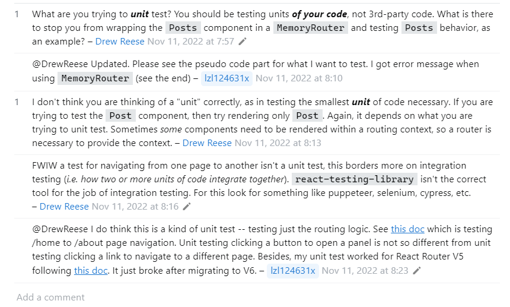

저번 게시글에서 `TDD` 에 대한 개념과 `Jest` 기본 문법을 살펴봤다. [프론트엔드에서 테스트 코드를 사용해야 하는 이유와 사용 예시 - 이론편](https://www.abonglog.me/post/454446)

백문이 불여일견이라고 직접 사용해보자

# 시나리오를 가정하기

만들고자 하는 프로덕트를 가정해보자

> "애봉님, 간단한 투두리스트 프로젝트를 개발해주세요. 로그인 이후에만 접근 가능한 투두 리스트 페이지를 생성해주시고, 로그인이 되지 않은 상태에선 로그인 페이지로 리다이렉션 해주세요 , 필요한 테스트는 알잘딱하게 해주세요"

> 라이브러리는 `react-router-dom, zustand , react-query` 를 사용 할 예정이다.

# 뼈대 생성하기

`TDD` 를 한다고 해서 모든 일을 하기 전 테스트 코드를 작성하는 것은 아니다. (사람 마다 다를 수 있지만)

나는 우선 가볍게 뼈대를 먼저 생성하려고 한다. 여기서 의미하는 뼈대는 만들어야 하는 파일들을 미리 생성해두고 내부 구현은 해두지 않는 상태를 의미한다.

```tsx title="프로젝트 뼈대"
📦src
 ┣ 📂components
 ┣ 📂feature
 ┃ ┣ 📂login
 ┃ ┃ ┣ 📜api.tsx
 ┃ ┃ ┣ 📜Login.tsx
 ┃ ┃ ┗ 📜store.tsx
 ┃ ┗ 📂todo
 ┃ ┃ ┣ 📜api.tsx
 ┃ ┃ ┣ 📜store.tsx
 ┃ ┃ ┗ 📜Todo.tsx
 ┣ 📂page
 ┃ ┣ 📂login
 ┃ ┃ ┗ 📜page.tsx
 ┃ ┣ 📂todo
 ┃ ┃ ┗ 📜page.tsx
 ┃ ┗ 📜page.tsx
 ┣ 📂router
 ┃ ┗ 📜router.tsx
 ┣ 📂__test__
 ┣ 📜App.tsx
 ┣ 📜index.css
 ┣ 📜main.tsx
```

다음과 같은 파일 구조와 기본적인 컴포넌트들의 모습만 생성해준 후 테스트 코드를 작성해보자

각 컴포넌트들은 `UI` 만 존재 할 뿐 어떤 기능도 하지 않는다.

# 라우팅과 관련된 테스팅은 하지 말아야겠다.

사실 맨 처음엔 `MainPage` 에서 `react-router-dom` 의 라우팅에 대한 테스트를 작성하려고 했었다.

그런데 계속 테스트 이후 현재 경로가 초기화가 되지 않아서 이것 저것 만져보다가 스택 오버 플로우에서 나와 비슷한 문제를 겪고 있는 질문글을 보았다.



이 때 어떤 댓글에서 유닛 테스트를 너는 잘못 하고 있다라는 글을 보고 맞는 말인거 같아서 컴포넌트의 로직에 집중하려고 한다.

`jest` 한 번 써봐야지! 하는 마음에 테스트코드를 작성하다가 호다닥 다음 단계로 넘어가려 한다.

# 로그인 컴포넌트

## 렌더링 관련 테스트 코드 작성

```tsx title="@/__test__/Login.test.tsx"
import Login from '@/feature/login/Login';

describe('Login Form이 렌더링 되었을 때', () => {
  it('ID가 입력되지 않았다면 제출 버튼은 비활성화 되어 있어야 한다.', () => {});
  it('PASSWORD가 입력되지 않았다면 제출 버튼은 비활성화 되어 있어야 한다.', () => {});
  it('ID,PASSWORD가 모두 입력 되었다면 제출 버튼은 활성화 되어 있어야 한다.', () => {});
});
```

우선 테스트 코드 내부 구현 전 문구로 먼저 표시만 해보자

테스트 코드를 작성 할 때 비슷한 맥락의 테스트 코드들을 `describe` 블록으로 묶는 것이 가능하다.

이제 테스트 코드를 작성해보자

```tsx title="렌더링 관련 테스트 코드"
import Login from '../feature/login/Login';
import { render, screen, waitFor } from '@testing-library/react';
import userEvent from '@testing-library/user-event';

const renderSetup = () => {
  render(<Login />);
  const $idInput = screen.getByTestId('id');
  const $passwordInput = screen.getByTestId('password');
  const $submitButton = screen.getByTestId('submit');
  const exampleString = 'test-test';
  return { $idInput, $passwordInput, $submitButton, exampleString };
};

describe('Login Form이 렌더링 되었을 때', () => {
  it('ID가 입력되지 않았다면 제출 버튼은 비활성화 되어 있어야 한다.', async () => {
    const { $idInput, $passwordInput, $submitButton, exampleString } =
      renderSetup();
    await userEvent.type($idInput, '');
    await userEvent.type($passwordInput, exampleString);
    await expect($submitButton).toBeDisabled();
  });
  it('PASSWORD가 입력되지 않았다면 제출 버튼은 비활성화 되어 있어야 한다.', async () => {
    const { $idInput, $passwordInput, $submitButton, exampleString } =
      renderSetup();
    await userEvent.type($passwordInput, '');
    await userEvent.type($idInput, exampleString);
    await expect($submitButton).toBeDisabled();
  });
  it('ID,PASSWORD가 모두 입력 되었다면 제출 버튼은 활성화 되어 있어야 한다.', async () => {
    const { $idInput, $passwordInput, $submitButton, exampleString } =
      renderSetup();
    await userEvent.type($passwordInput, exampleString);
    await userEvent.type($idInput, exampleString);
    expect($submitButton).toBeEnabled();
  });
});
```

다음과 같이 렌더링 관련 테스트 코드를 작성해주었다.

테스트코드에 사용된 `userEvent` 객체로 `@testing-library/user-event` 에서 제공하는 이벤트들을 담은 객체이다.

이 때 `userEvent` 의 이벤트들은 모두 비동기 함수이며 컴포넌트의 리렌더링도 비동기처리로 이뤄지기 때문에 `async/await` 로 감싸줘 올바른 처리를 위해서 `async/await` 를 이용해주었다.

> 단순한 처리에선 사용하지 않아도 된다고 하긴 하는데 나는 사용해주었다.

이제 해당 테스트 양식에 맞게 컴포넌트를 작성해주자

```tsx title="입력값에 따라 submit 버튼의 disabled 속성을 변경해주었다."
const Login = () => {
  const [id, setId] = useState<string>('');
  const [password, setPassword] = useState<string>('');

  const typeId = (e: React.ChangeEvent<HTMLInputElement>) => {
    setId(e.target.value);
  };
  const typePassword = (e: React.ChangeEvent<HTMLInputElement>) => {
    setPassword(e.target.value);
  };

  const isDisabled = !id || !password;

  return (
    <form action='' className='wrapper'>
      <div className='flex'>
        <label htmlFor='id'>ID : </label>
        <input type='text' id='id' data-testid='id' onChange={typeId} />
      </div>
      <div className='flex'>
        <label htmlFor='password'>Password : </label>
        <input
          type='text'
          id='password'
          data-testid='password'
          onChange={typePassword}
        />
      </div>
      <button data-testid='submit' disabled={isDisabled}>
        Login!
      </button>
    </form>
  );
};

export default Login;
```

```bash
 PASS  src/__test__/Login.test.tsx
  Login Form이 렌더링 되었을 때
    √ ID가 입력되지 않았다면 제출 버튼은 비활성화 되어 있어야 한다. (205 ms)
    √ PASSWORD가 입력되지 않았다면 제출 버튼은 비활성화 되어 있어야 한다. (93 ms)
    √ ID,PASSWORD가 모두 입력 되었다면 제출 버튼은 활성화 되어 있어야 한다. (122 ms)
```

## API 요청 별 테스트 코드 작성

```tsx
describe('로그인 요청을 보냈을 때', () => {
  it('제출 버튼을 클릭 하면 API요청이 올바르게 전송 된다.', () => {});

  it('서버 오류가 발생하면 적절한 오류 메시지가 표시된다.', () => {});
  it('네트워크 문제가 발생하면 적절한 오류 메시지가 표시된다.', () => {});
});
```

우선 테스트 할 목록들을 먼저 정의해준다.

이 부분은 예상보다 복잡한 부분들이 있기 때문에 하나씩 살펴보며 작성해보자

다만 `API` 요청 부분의 테스트 코드를 작성하기 전 미리 짚고 가야 할 내용들이 있다.

### fetch 와 Jest 모킹

> [[JEST] 📚 모킹 Mocking 정리 - jest.fn / jest.mock /jest.spyOn
출처: https://inpa.tistory.com/entry/JEST-📚-모킹-mocking-jestfn-jestspyOn [Inpa Dev 👨‍💻:티스토리]](https://inpa.tistory.com/entry/JEST-%F0%9F%93%9A-%EB%AA%A8%ED%82%B9-mocking-jestfn-jestspyOn)
> 해당 블로그에 매우 잘 설명되어 있다. 볼 때 마다 아주 대단하다고 생각하는 블로그이다.
>
> `jest` 에선 모킹 (Mocking) 이라는 개념이 존재한다.

이는 말 그대로 목업 함수를 생성하는 , 즉 가짜 버전의 함수를 생성하는 것이다.

가짜 버전의 함수를 생성하는 모킹 작업이 왜 필요한가를 생각해봐야 한다.

내가 진행하고자 하는 `Unit test` 는 어떤 것을 검증하고 싶은 것일까 ?

프론트엔드에서의 단위 테스트는 다른 써드 파티 라이브러리들의 기능이 잘 작동하는지를 확인하고 싶은 것이 아닌, **입력 값이 주어졌을 때 원하는 결과값이 등장하는가?** 를 알고 싶은 것이다.

만약 `API` 요청과 관련된 테스트코드를 작성하고 싶을 때 , 백엔드단에서 `API` 에 관련된 코드가 아직 진행이 되지 않았다면 ? 나는 `API` 와 관련된 테스트 코드를 작성 할 수 없다. 이를 방지하기 위해 테스트 코드를 작성하기 위해 부랴부랴 `API` 명세서부터 생성하는 것 또한 올바르지 않다.

혹은 준비가 되었음에도 불구하고 `fetch` 메소드는 다양한 환경에 영향을 받는다. 네트워크 상황이 좋지 않아 응답값이 늦게 올 수도 있고 백엔드단에서의 문제로 인해 테스트가 실패하여 테스트 실패의 책임을 명확하게 하기 어려울 수 있다.

이에, 테스트 하고자 하는 기능이 다른 기능들과 엮여 있을 경우 정확한 테스트가 힘들기 때문에 **의존성이 있는 기능들을 가짜로 대체하여 의존성을 제거하는 것이다.**

### 제출 버튼을 클릭 하면 올바르게 API요청이 전송 된다.

테스트 코드를 작성해보자

```tsx title="API 요청 전송 여부 테스트 코드" {5,11-20}
describe('로그인 요청을 보냈을 때', () => {
  it('제출 버튼을 클릭 하면 API요청이 올바르게 전송 된다.', async () => {
    const { $idInput, $passwordInput, $submitButton } = apiRenderSetup();
    const ENDPOINT = 'http://localhost:3000/api/dev/auth';
    global.fetch = jest.fn();

    await userEvent.type($idInput, 'user');
    await userEvent.type($passwordInput, 'password');
    await $submitButton.click();

    await waitFor(() => {
      expect(global.fetch).toHaveBeenCalledTimes(1);
    });

    expect(global.fetch).toBeCalledWith(ENDPOINT, {
      method: 'POST',
      headers: {
        'Content-Type': 'application/json',
      },
      body: JSON.stringify({
        id: 'user',
        password: 'password',
      }),
    });
  });
```

해당 테스트 코드를 살펴보면 `global.fetch` 를 목업 함수로 변경한 모습을 볼 수 있다.

이를 통해 테스트 환경에서 `fetch` 메소드가 시행 될 땐 위에서 목업한 메소드가 호출된다.

`jest.fn` 은 목업한 메소드를 반환하는데 위에선 기본 `API` 인 `global.fetch` 를 목업 메소드로 변경해두었기 때문에 호출 된 해당 목업 함수가 아래와 같은 인수들을 가지고 호출 되었는지를 `toBeCalledWith` 를 통해 확인 할 수 있다.

> 이 때 타입스크립트는 기존 `global.fetch` 의 타입을 알고 있기 때문에 `jest.fn` 으로 생성된 목업 함수도 기존 `global.fetch` 의 타입을 기존으로 사용한다.

테스트 코드를 작성하였으니 기능을 추가해보자

```tsx title="@/App.tsx" {4,5,7-9,12,14}#add
import { RouterProvider } from 'react-router-dom';
import router from './router/router';

import { QueryClientProvider, QueryClient } from '@tanstack/react-query';
const client = new QueryClient();

export const QueryStore = ({ children }: { children: React.ReactNode }) => (
  <QueryClientProvider client={client}>{children}</QueryClientProvider>
);

const App = () => (
  <QueryStore>
    <RouterProvider router={router} />
  </QueryStore>
);
export default App;
```

```tsx title="@/feature/login/api.tsx"
import { useMutation } from '@tanstack/react-query';

const useAuth = () => {
  const mutation = useMutation({
    mutationFn: async ({ id, password }: { id: string; password: string }) => {
      const response = await fetch('http://localhost:3000/api/dev/auth', {
        method: 'POST',
        headers: {
          'Content-Type': 'application/json',
        },
        body: JSON.stringify({ id, password }),
      });
      if (!response.ok) {
        throw new Error(response.statusText);
      }
      const data = await response.json();
      return data;
    },

    onError: () => {},
    onSuccess: () => {},
  });

  return mutation;
};

export default useAuth;
```

```tsx title="Login 컴포넌트, submit 버튼이 눌리면 POST요청을 보낸다."
import { useState } from 'react';
import useAuth from './api';

const Login = () => {
  const [id, setId] = useState<string>('');
  const [password, setPassword] = useState<string>('');
  const mutation = useAuth();

  const typeId = (e: React.ChangeEvent<HTMLInputElement>) => {
    setId(e.target.value);
  };
  const typePassword = (e: React.ChangeEvent<HTMLInputElement>) => {
    setPassword(e.target.value);
  };

  const isDisabled = !id || !password;

  return (
    <section className='wrapper'>
      <div className='flex'>
        <label htmlFor='id'>ID : </label>
        <input type='text' id='id' data-testid='id' onChange={typeId} />
      </div>
      <div className='flex'>
        <label htmlFor='password'>Password : </label>
        <input
          type='text'
          id='password'
          data-testid='password'
          onChange={typePassword}
        />
      </div>
      <button
        data-testid='submit'
        disabled={isDisabled}
        onClick={() => {
          mutation.mutate({ id, password });
        }}
      >
        Login!
      </button>
    </section>
  );
};

export default Login;
```

> **Login 컴포넌트에서 `QueryStore` 컨텍스트에 감싸져있기 때문에 테스트 환경에서도 `QueryStore` 컨텍스트로 감싼 후 렌더링 하는걸로 수정해줬다.**

### 로그인에 성공하여 토큰이 발급되면 세션 저장소에 상태가 저장된다.

```tsx title="로그인 성공 시 상태 저장에 관련된 테스트 코드"
describe('로그인 요청을 보냈을 때', () => {
  ...
  describe('로그인에 성공하면.', () => {
    it('세션 스토어에 전송 받은 토큰이 저장된다.', async () => {
    });

    it('세션 스토어에 전송 받은 유저 이름이 저장된다.', async () => {
    });
  });
```

이제 이 부분과 관련된 테스트 코드를 작성해주도록 하자.

> 사실 이 부분은 이전에 아이디와 패스워드 모두 검증하는 테스트 코드로 이뤄져있었지만
>
> 사실 그 부분은 백엔드단에서 시행해야 하는 API 테스트 코드라 생각하였기 때문에 다음처럼 간단하게 변경해주었다.

토큰을 저장할 `SessionStore` 를 `Zustand` 로 우선적으로 생성해주자

전역 상태 저장소를 우선 생성해둬야 테스트 코드에서 해당 전역 상태 저장소를 불러와 사용 할 수 있기 때문이다.

```tsx title="@/feature/login/store.tsx"
import { create } from 'zustand';

type State = {
  token: string;
  userName: string;
};

type Action = {
  setToken: (newToken: string) => void;
  setUserName: (userName: string) => void;
};

const useTokenStore = create<State & Action>((set) => ({
  token: '',
  userName: '',
  setToken: (newToken) => set({ token: newToken }),
  setUserName: (userName) => set({ userName }),
}));

export default useTokenStore;
```

다음과 같이 저장소를 생성해주었다. 이제 마저 테스트 코드를 작성해주자

```tsx title="로그인 성공 시 상태 저장에 관련된 테스트 코드" {4-15 , 22-25, 34-36}
describe('로그인에 성공하면', () => {
  beforeEach(() => {
    global.fetch = jest.fn(() =>
      Promise.resolve({
        ok: true,
        json: () =>
          Promise.resolve({ token: 'example-token', userName: 'useruser' }),
      }),
    ) as jest.Mock;
  });

  afterEach(() => {
    (global.fetch as jest.Mock).mockClear();
  });

  it('세션 스토어에 전송 받은 토큰이 저장된다.', async () => {
    const { $idInput, $passwordInput, $submitButton } = apiRenderSetup();
    await userEvent.type($idInput, 'useruser');
    await userEvent.type($passwordInput, 'password');
    await userEvent.click($submitButton);

    await waitFor(() => {
      const sessionStore = useSessionStore.getState();
      expect(sessionStore.token).toBe('example-token');
    });
  });

  it('세션 스토어에 전송 받은 유저 이름이 저장된다.', async () => {
    const { $idInput, $passwordInput, $submitButton } = apiRenderSetup();
    await userEvent.type($idInput, 'useruser');
    await userEvent.type($passwordInput, 'password');
    await userEvent.click($submitButton);

    await waitFor(() => {
      const sessionStore = useSessionStore.getState();
      expect(sessionStore.userName).toBe('useruser');
    });
  });
});
```

테스트코드에서 `beforeEach , afterEach` 를 통해 해당 `describe` 블록 내부에 존재하는 `it` 메소드들이 시행될 때 목업 함수를 생성하고 지워주었다.

생성된 목업 함수는 데이터베이스와 `API` 통신을 마친 후 받는 응답값을 표현한 목업 함수 구현이다.

이 때 좀 더 살펴봐야 할 것이 `waitFor` 인데 이는 `@testing-library/reac` 에서 제공하는 메소드이다.

```tsx title="waitFor 의 내부 모습"
function waitFor<T>(
  callback: () => T | Promise<T>,
  options?: {
    container?: HTMLElement;
    timeout?: number;
    interval?: number;
    onTimeout?: (error: Error) => Error;
    mutationObserverOptions?: MutationObserverInit;
  },
): Promise<T>;
```

`waitFor` 은 내부 콜백 함수가 `truthy`한 값을 반환 할 때 까지 `timeout` 동안 `interval` 간격으로 `callback` 함수를 시행한다.

기본 값은 `1000ms` 간 `50ms` 간격으로 `callback` 함수를 시행한다.

그 이유는 비동기처리들로 인해 원하는 결과값이 테스트 시점 이후에 시행 될 수도 있기 때문이다.

> 예전에도 앞서 말했지만 상태 변경은 비동기적으로 처리된다.

테스트 코드가 작성 되었으니 기능을 구현하러 가보자

내가 원하는 기능은 로그인이 성공하면 `Zustand` 로 생성한 상태 저장소에 토큰값과 유저 이름이 저장되는 것이다.

```tsx title="React Query 내부에서 Zustand 의 상태 값을 변경하자" {29-33}#add
import { useMutation } from '@tanstack/react-query';
import useSessionStore from './store';

type UserSession = {
  userName: string;
  token: string;
};

const useAuth = () => {
  const sessionStore = useSessionStore();

  const mutation = useMutation({
    mutationFn: async ({ id, password }: { id: string; password: string }) => {
      const response = await fetch('http://localhost:3000/api/dev/auth', {
        method: 'POST',
        headers: {
          'Content-Type': 'application/json',
        },
        body: JSON.stringify({ id, password }),
      });
      if (!response.ok) {
        throw new Error(response.statusText);
      }
      const data = await response.json();
      return data;
    },

    onError: () => {},
    onSuccess: (data: UserSession) => {
      sessionStore.setToken(data.token);
      sessionStore.setUserName(data.userName);
    },
  });

  return mutation;
};

export default useAuth;
```

다음처럼 `mutation` 이 성공적으로 일어나고 나면 `onSuccess` 메소드를 통해 `Zustand` 로 생성된 `sessionStore` 내부에 상태 값을 저장해주자

### 서버나 네트워크로 인해 로그인에 실패하면

이번엔 서버나 네트워크 문제로 인해 로그인에 실패한 테스트 케이스를 작성해보자

````tsx title="네트워크나 서버로 인한 문제에 대한 테스트 케이스 종류"
describe('로그인 요청을 보냈을 때', () => {
  ...
  describe('로그인에 다음과 같은 이유로 실패하면', () => {
    describe('(네트워크나 서버 문제)', () => {
      it('서버 오류로 실패한 경우 동일한 요청을 성공 할 때 까지 3회 재전송 한다.', () => {});
      it('네트워크 문제가 발생하면 동일한 요청을 성공 할 때 까지 3회 재전송 한다.', () => {});
      it('최종적으로 로그인에 실패하면 에러 메시지를 alert 창을 이용해 띄운다.', () => {});
    });
    ```
````

### 3회 재전송 테스트 코드 작성

```tsx title="3회 재전송 테스트 코드"
const afterSubmitSetup = async ({
  id,
  password,
}: {
  id: string;
  password: string;
}) => {
  const { $idInput, $passwordInput, $submitButton } = apiRenderSetup();
  await userEvent.type($idInput, id);
  await userEvent.type($passwordInput, password);
  return { $idInput, $passwordInput, $submitButton };
};
...

 describe('로그인에 다음과 같은 이유로 실패하면', () => {
    describe('(네트워크나 서버 문제)', () => {
      it('서버 오류로 실패한 경우 동일한 요청을 성공 할 때 까지 3회 재전송 한다.', async () => {
        global.fetch = jest.fn(() => {
          return Promise.resolve({
            ok: false,
            status: 500,
            message: '서버에서 오류가 발생했습니다.',
          });
        }) as jest.Mock;

        const inputExample = { id: 'user', password: 'password' };
        await afterSubmitSetup(inputExample);
        await waitFor(() => {
          expect(global.fetch).toBeCalledTimes(3);
        });
      });
      it('네트워크 문제가 발생하면 동일한 요청을 성공 할 때 까지 3회 재전송 한다.', async () => {
        global.fetch = jest.fn(() => {
          return Promise.resolve({
            ok: false,
            status: 500,
            message: '네트워크 문제가 발생했습니다..',
          });
        }) as jest.Mock;

        const inputExample = { id: 'user', password: 'password' };
        await afterSubmitSetup(inputExample);
        await waitFor(() => {
          expect(global.fetch).toBeCalledTimes(3);
        });
      });
```

다음과 같이 전송에 실패하는 `API` 요청을 목업 데이터로 생성해두고 만약 제출에 실패했다면 `API` 요청이 3회 호출 되는지 확인하는 테스트코드를 작성해주었다.

이제는 조금씩 익숙해져가는 것 같다.
