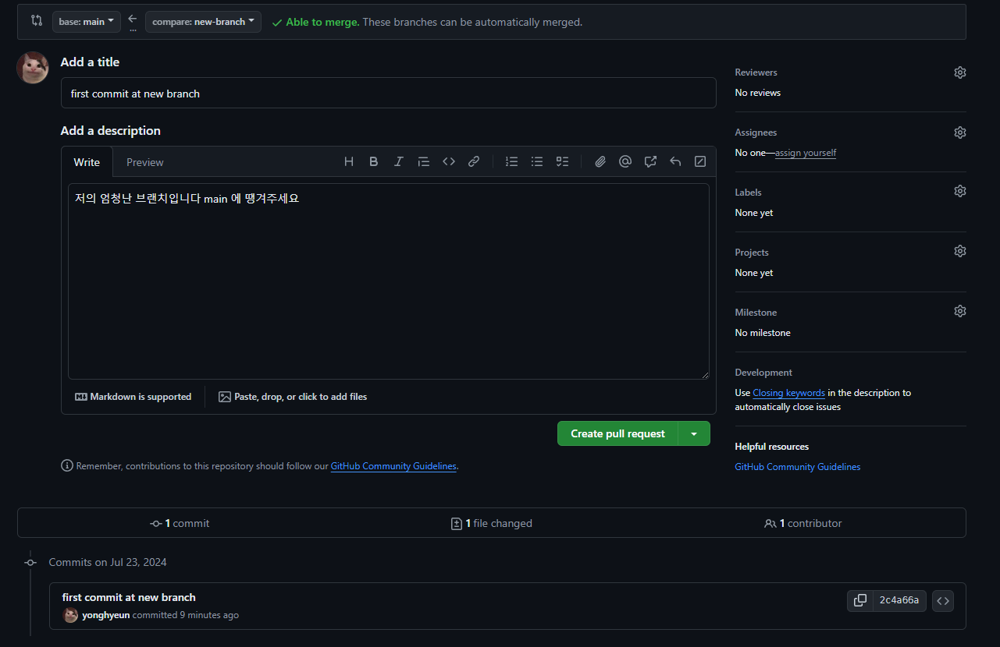
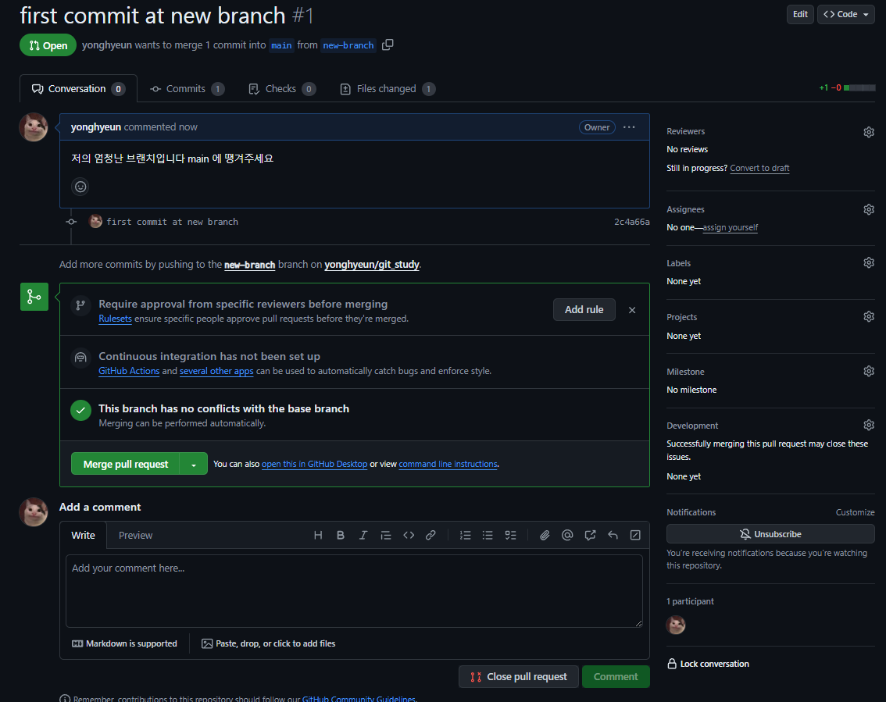
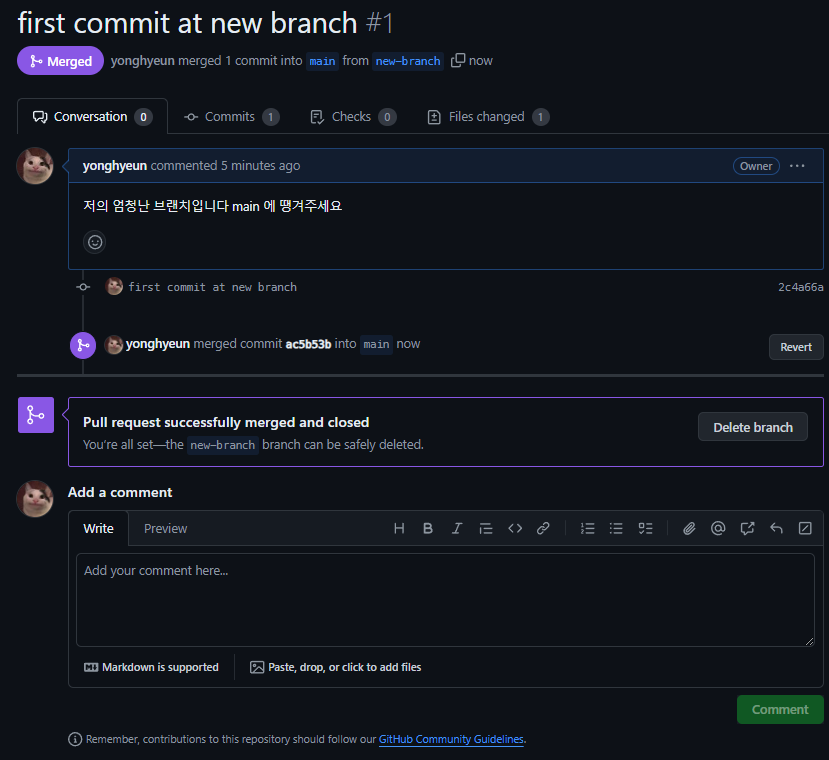
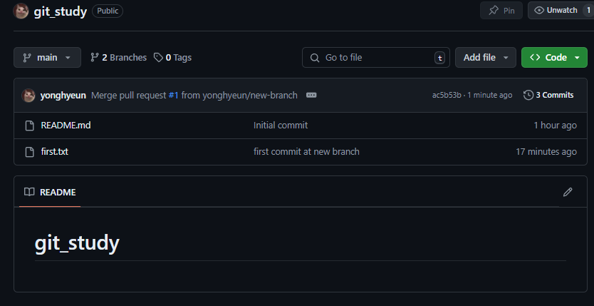

팀프로젝트 시 깃허브를 활용하는 방법을 알아보자

# 기본 설정

기본 설정은 `github` 가 터미널 환경에 설치가 되어 있고 초기 설정이 되지 않았음을 가정한다.

```bash title="user 정보 local git에 추가"
$ git config --global user.name "yonghyeun"
$ git config --global user.email "ttddcc119@naver.com"
```

다음과 같이 `local` 에서 사용하는 `git` 에서 `user.name , email` 을 전역으로 설정해준다.

설정된 정보들은 커밋에서 변경 사항을 일으킨 유저의 정보를 표현하기 때문에 필요하다.

잘 설정되었나 확인하고 싶다면 다음과 같이 확인 가능하다.

```bash title="--global --list 혹은 --l"
$ git config --global --list
user.email=ttddcc119@naver.com
user.name=yonghyeun
...
```

# 원격 저장소 (remote / origin) 과 local git 연결하기

이후 `Github` 에서 생성된 원격 저장소의 주소를 `clone` 하여 연동 할 로컬 폴더에서 다음과 같이 클론을 진행한다.

```bash title="clone"
git clone '원격 저장소 주소'
```

해당 행위는 해당 폴더에 원격 저장소인 `Github` 에서 생성한 레파지토리의 파일의 복사본을 생성한다.

이후 로컬에서 레파지토리의 파일에 접근하여 추가 및 수정을 통해 파일을 변경하고 레파지토리에 변경 내역을 보내 파일 버전을 저장한다.

로컬 폴더에서 일어난 행위의 변화들은 로컬 `git`의 `git add , git commit` 등을 이용해 `working directory , staging area` 로 보낼 수 있다.

이후 `git push` 를 통해 `staging area` 에 존재하는 파일의 변화들을 등록된 `commit message` 들과 함께 원격 저장소인 `Github Repository` 에 보낼 수 있다.

| working directory | staging area | Repository |
| ----------------- | ------------ | ---------- |
| git add           | git commit   | git push   |

하지만 사실 현재 사용한 `git push` 의 경우엔 다음과 같은 명령어들이 생략되어 있는 상태이다.

`git push` 만 입력하면 입력되는 값은 `git push origin main` 으로 `git push 원격저장소 브랜치이름` 이다.

> `git clone` 을 하게 되면 원격 레파지토리는 `origin` 이란 이름으로 접근 가능하다.

**`staging area` 에 존재하는 변경 사항들을 `Repository` 로 보내는 행위는 원격 저장소인 `origin` 에 어떤 `branch` 의 변경 사항을 보내느냐를 의미**한다.

# Github의 버전 관리 방식


깃허브는 버전을 버전이 변경될 때 변경 사항만 따로 저장하는 것이 아닌 이전 변경 사항 전체를 스냅샷 형태로 관리 한다.

그 말은 즉 매 버전을 시작할 때 마다 이전 버전의 완전한 상태를 무결한 채로 가진 채로 개발을 시작 할 수 있음을 보장한다는 것이다.

깃은 변경 사항을 `working directory => stage area => repository` 로 옮길 경우 이전에 저장했던 스냅샷간의 비교를 통해 변경 사항을 저장한다.

> [Github 의 스냅샷 방식에 대한 내용](https://coding-lks.tistory.com/162)
> 해당 블로그에서 깃허브의 스냅샷 방식에 대해 자세히 설명한다. 스냅샷 방식으로 버전을 관리함에도 불구하고 용량이 적게 유지하는 방법은 보면 매우 신기하다 !

# branch에 대한 개념


`branch` 는 다음과 같은 이유로 협업에서 사용된다.

- **코드베이스를 안전하게 유지하기 위해**

`main` 브랜치는 프로젝트 배포에 사용되는 브랜치로 항상 무결한 상태를 유지해야 한다.

하지만 매번 개발 시 마다 `main branch` 에서 작업을 진행하게 될 경우 배포 파일의 무결성을 유지하기 힘들다.

즉, 코드 베이스를 손상 시킬 위험 없이 코드 베이스의 복사품인 `branch` 에서 작업을 진행하고 진행된 작업 사항을 테스트 하여 코드 베이스에 병합하여 개발 단위들을 안전하게 유지하는 것이 가능하다.

그 뿐 아니라 개발 단위 별 `branch` 를 나눠 개발하게 되면 개발의 흐름을 추적하기 쉬워진다.

- **병렬 개발을 가능하게 하기 위해**

위에서 말했듯 개발 단위마다 `branch` 를 나눠 개발을 하게 될 경우 독립적인 개발을 병렬적으로 하는 것이 가능하다.

- **개발의 컨텍스트 전환**

위에서 말한 개발 단위 별 `branch` 를 생성하여 개발을 하게 되면 개발자는 `branch` 를 이동해나가며 서로 다른 개발 단위를 옮겨 다니며 작업을 수행하는 것이 가능하다.

이는 작업중이던 개발 사항을 잠시 멈춘 후 다른 개발 단위를 개발하는 것을 가능케 한다.

# 협업에서의 branch 사용법

```bash title="branch 사용방법"
$ git branch new-branch

$ git switch new-branch
Switched to branch 'new-branch'

/* first.txt 파일을 생성 후 add, commit */

$ git add .

$ git commit -m 'first commit at new branch'
[new-branch 2c4a66a] first commit at new branch
 1 file changed, 1 insertion(+)
 create mode 100644 first.txt

/* 원격 저장소에 해당 branch push */
$ git push origin new-branch
```

다음과 같이 `branch` 를 생성 한 후 생성된 `branch` 로 이동하여 `staging area` 에 변경 사항을 보낸 후 `git push origin new-branch` 를 통해 원격 저장소에 해당 `branch` 를 `push` 한다.


이렇게 `branch` 를 원격 저장소로 보내는 행위는 레파지토리에도 `new branch` 를 생성하겠다는 것을 의미한다.

이 때 **원격 저장소에 해당 `branch` 가 존재 하지 않을 경우엔 새로운 `branch` 가 생성되었다고 알리고 `pull request` 를 보내겠느냐는 알림이 생성된다.**

## pull request ?

`pull request` 란 깃허브에서 제공하는 기술로 특정 브랜치의 변경 사항을 다른 특정 브랜치로 병합하겠냐를 묻는 행위를 의미한다.

전형적으로는 배포에 사용되는 코드베이스인 `main` 브랜치를 향하는 경우가 잦다.

`pull request` 는 다음과 같은 주요 컨셉을 갖는다.

- **진행하고자 하는 변경 사항을 문서화** 한다.
- 팀원간 병합하고자 하는 브랜치의 **변경 사항을 확인하여 코드리뷰를 진행하는 것을 가능하게 한다.**

위에서 `pull request` 를 눌러보자





이 때 팀원들간의 코드 리뷰 문화에 따라 다르겠지만 코드 베이스에 코드를 병합하기 전 코드 리뷰를 통해 해당 코드를 병합 할지 말지를 판단한다.





## pull request 가 일어난 후 해야 할 일들

`pull request` 는 변화가 일어난 `branch` 의 모든 변경 사항들을 `main (원격 저장소) branch` 에 적용하는 행위이다.

이 때 병합이 일어난 `branch` 는 로컬 , 원격 저장소에서 모두 제거해주는 것이 모범 사례로 생각된다.

그 이유는 작업이 일어나고 있는 `branch` 와 작업이 완료된 `branch` 를 나눔으로서 저장소를 깨끗하게 유지하기 위함이다.

> 또 다음 글인 커밋 컨벤션에서 이야기 하겠으나 매번 `pull request` 로 브랜치의 병합이 일어날 때마다 해당 `branch` 의 커밋 메시지들이 덮어씌워질 수도 있다.

### 병합이 일어난 branch 제거하기

```bash title="branch 제거"
ttddc@yonghyeun MINGW64 ~/OneDrive/바탕 화면/gitstudy/git_study (new-branch)
$ git switch main
Switched to branch 'main'
Your branch is up to date with 'origin/main'.

ttddc@yonghyeun MINGW64 ~/OneDrive/바탕 화면/gitstudy/git_study (main)
$ git branch -d new-branch
Deleted branch new-branch (was 2c4a66a).

ttddc@yonghyeun MINGW64 ~/OneDrive/바탕 화면/gitstudy/git_study (main)
$ git push origin --delete new-branch
To https://github.com/yonghyeun/git_study.git
 - [deleted]         new-branch
```

다음과 같이 로컬 환경의 `branch` 와 원격 저장소의 `branch` 모두를 제거해준다.

> 로컬에서의 브랜치 제거는 `git branch -d [브랜치이름]` 혹은 `git branch -D [브랜치 이름]` 으로 한다.
>
> `-d` 는 `merge` 가 일어난 브랜치를 대상으로 , `-D` 는 `merge` 유무와 상관없이 강제로 제거한다.

### 로컬의 main 브랜치를 원격 브랜치와 병합하기

이후 원격 저장소에 일어난 변경 사항을 로컬 저장소에도 적용하기 위해 `git pull` 을 사용한다.

`branch` 를 사용하여 `pull request` 를 보낼 때 가장 자주 일어나는 충돌 문제 중 하나가 병합 후 로컬 저장소에서 원격 저장소의 변경 사항을 불러오지 않은채로 개발을 하다 발생한다.

# branch 를 사용 할 때 가장 자주 겪는 문제와 해결법

## 헉, branch 가 아니라 main branch 에서 작업하고 commit 해버렸어요

열심히 작업한 후 커밋을 했는데 알고보니 `branch` 를 생성하고 작업한게 아니라 `main` 브랜치에서 작업한 경우 다음과 같이 변경 할 수 있다.

```bash title="커밋된 작업 내역을 working directory로 변경하기"
git reset --soft [commit hash]
```

`git log` 로 `staging area` 에 존재하는 변화 중 `working directory` 로 돌릴 작업 커밋의 번호를 이용하여 `git reset --soft` 를 이용한다.

> `commit hash` 는 `git log` 를 통해 확인하거나, `HEAD^(접근하고자 하는 커밋 해쉬의 순서)` 를 통해 접근 할 수 있다.

현재 커밋 된 작업이 하나라면 `git reset --soft HEAD^` 를 통해 마지막 커밋을 `working directory` 로 변경 할 수 있다.

```bash title="working directory로 돌아온 모습"
git reset --soft HEAD^

$ git status
On branch main
Your branch is up to date with 'origin/main'.

Changes to be committed:
  (use "git restore --staged <file>..." to unstage)
        new file:   example.txt
```

이제 이렇게 `working directory` 에 존재하는 변경 사항을 `branch` 로 옮겨 커밋 하기 위해 `stash` 를 이용하여 임시로 저장한다.

```bash title="git stash는 working directory에 있는 작업내역을 임시로 저장한다."
$ git stash -m 'example.txt추가'
Saved working directory and index state On main: example.txt추가

$ git stash list
stash@{0}: On main: example.txt추가
```

`stash` 로 저장된 임시 작업 사항들은 어떤 `branch` 에서든 `git stash pop` 과 같은 커맨드로 꺼내올 수 있다.

```bash title="branch로 이동 후 stash에 존재하는 작업 사항을 꺼내와 커밋"
$ git checkout -b branch-1
Switched to a new branch 'branch-1'

$ git stash pop
On branch branch-1
Changes to be committed:
  (use "git restore --staged <file>..." to unstage)
        new file:   example.txt

$ git commit -m 'example.txt 를 branch 에서 커밋!'
[branch-1 a40bf38] example.txt 를 branch 에서 커밋!
 1 file changed, 0 insertions(+), 0 deletions(-)
 create mode 100644 example.txt

$ git push origin branch-1
```

다음처럼 임시로 저장된 `stash list` 에서 `pop` 을 통해 꺼내오거나 `stash pop stash@{번호}` 로 꺼내올 수 있다.

##
