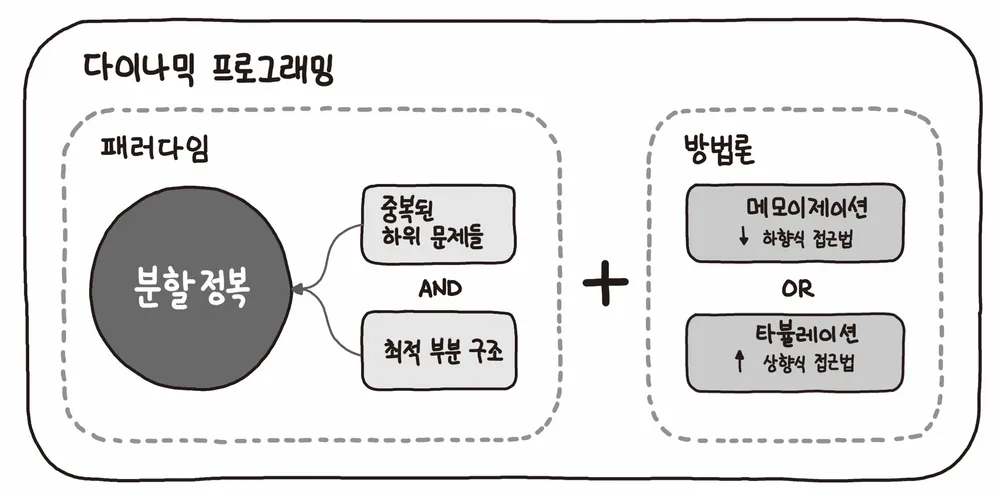

# 동적 계획법의 개념을 알기 전 문제를 먼저 마주 보기

동적 계획법에 대해 이야기로만 들어보고 실제 공부 해보기 전 solvedAC 에 존재하는 문제들을 풀다가

해당 종류의 문제를 먼저 마주치게 되었다.

[백준 -계단 오르기 2579](https://www.acmicpc.net/problem/2579)


해당 문제는 시작지점 부터 최정상까지 계단을 다음과 같은 규칙을 지키며 걸어 갈 때 가장 높은 점수를 얻을 수 있는 방법이 무엇인지 물어본다.

- 계단은 한 번에 최대 두 계단까지 오를 수 있다.
- 계단은 연속적으로 두 개의 계단만 밟을 수 있다.
- 마지막 계단은 반드시 밟아야 한다.

그러니 계단이 있을때 4 번 계단 까지 가는 방법은 1,3-4 를 밟거나 1-2 , 3,4 를 밟는다는 것이다.

# 동적 계획법의 개념

동적 계획법이란 알고리즘 설계 기법의 일환으로 최적화 기법의 일환이다.

영어로 DynamicProgramming 이기에 한국말로 동적 계획법으로 해석되어 사용 되지만 이광근 교수의 저서에서 본질적인 의미를 살려 `기억하며 풀기` 로 번역하여 사용했는데

이것이 더 의미에 맞는다 생각된다.



동적 계획법의 접근 방식은 주어진 문제를 잘게 나눠 문제를 풀이하는 분할 정복 알고리즘과 유사하지만

이전에 구해둔 풀이를 이용한다는 점에 있어서 차이가 있다.

> 이에 왜 기억하며 풀기가 더 적절한 예시인지 와닿는다.

# 동적 계획법이 유효한 범위

큰 문제가 여러 개의 중복된 문제로 나눠지며 해결 방법이 동일 하며 (Overlapping Subproblem)

최적 부분 구조란 큰 문제의 최적해가 작은 문제의 최적해를 이용해 구할 수 있는 경우 (Optimal Substructure)를 말한다.

가장 대표적인 예시인 피보나치 수열을 가지고 생각해보자

피보나치 수열은 다음과 같은 점화식을 가지고 있다.

```bash title="피보나치 수열 점화식"
F(n) = F(n - 1) + F(n - 2); , n > 1
```

예를 들어 F(5) 를 구하기 위해선 F(4) 와 F(3) 을 구해야 하며 이하 F(4),F(3) 을 구하기 위해선 F(3),F(2) , F(2),F(1) 을 구해야 한다.

F(5) 라는 해는 F(4) 와 F(3) 을 이용하여 구할 수 있으며 이는 최적 부분 구조를 가지고 있으며

각 문제의 해결 방법이 동일하다.

# 동적 계획법을 시행하는 방법

재귀적으로 해결하는 탑다운 방식과 반복문을 통해 해결하는 바텀업 방식이 존재한다.

다시, 피보나치 예시를 통해 알아보자

```ts title="바텁업 방식을 이용한 피보나치 수열"
const fibo = (n: number): number => {
  const dp = new Array(n + 1).fill(0);
  dp[1] = 1;
  for (let i = 2; i <= n; i++) {
    dp[i] = dp[i - 1] + dp[i - 2];
  }
  return dp[n];
};
```

바텀업 방식은 F(N) 을 구하기 위해 가장 낮은 단계부터 해를 구해나가며 큰 문제를 해결하는 방식이다.

```ts title="탑다운 방식을 이용한 피보나치 수열"
const memo = [0, 1];
const fibo = (n: number): number => {
  if (memo[n] !== undefined) return memo[n];
  memo[n] = fibo(n - 1) + fibo(n - 2);
  return memo[n];
};
```

탑 다운 방식은 F(N) 을 구할 때 N 부터 시작하여 지역 최적 해가 구해져있는 값 까지으로 함수를 재귀적으로 호출 하고

호출 된 재귀 함수에서 구해둔 지역 최적해를 이용하여 이전 호출 스택에서 해당 값을 이용하여 해결하는 방식이다.

둘다 아이디어는 같으나 구현 방식이 다르며 장단점이 다르다.

- 바텀업 방식

  - 코드를 실행하는 호출 스택이 하나만 존재하기 때문에 메모리를 적게 사용한다.
  - 실행시간도 탑다운 시간에 비해 적다. 탑다운 방식의 경우에는 여러 호출 스택을 이동해야 하기 때문에 컨텍스트 스위칭 시간이 존재 한다.
  - 탑다운 방식에 비해 코드 구현 할 양이 많다.

- 탑다운 방식
  - 코드를 재귀적으로 호출 하기 때문에 호출 스택이 많아 메모리를 많이 사용한다.
  - 바텀업 방식에 비해 코드 구현 할 양이 적다.

> 개인적으로 난 바텀업 방식이 훨씬 나은 거 같다.
> 재귀는 항상 볼 때마다 너무 복잡하게 느껴진다.

# 위 문제를 점화식으로 표현해보자

결국 최적 부분 구조라는 것은 점화식으로 표현 가능하다는 것인데, 위 구조를 점화식으로 표현하고 코드로 구현해보자

F(i) : i 번째 계단의 값
G(i) : i 번째 계단까지 올랐을 때의 최대 값 (지역 최적해)

i가 1 일때 G(1) = F(1)

i가 2 일때 G(2) = F(1) + F(2)

i가 3 일때 G(3) = max(F(1) + F(3), F(2) + F(3)) = max(F(1) , F(2)) + F(3))

i가 3일때 부턴 가능한 경우의 수가 두 가지로 나뉘어 지지만 현재 까진 이전 값을 이용해 최대 값을 구하는게 가능하다.

i가 4일때 G(4) = max(F(1) + F(3) , F(1) + F(2)) + F(4) = max(G(1) + F(3) , G(2)) + F(4)

i가 5일때 G(5) = max(F(1) + F(2) + F(4) , G(3)) + F(5) = max(G(2) + F(4) , G(3)) + F(5)

이 때부터 패턴이 보이기 시작한다.

i가 4이상 일 때 가능한 수는 max(G(i-2), G(i-3) + F(i-1)) + F(i) 이다.

# 바텀업 방식으로 점화식을 문제로 코드로 표현해보기

```tsx title="바텀업 방식 풀이"
const [N, ...stairs] = require("fs")
  .readFileSync(process.platform === "linux" ? "./dev/stdin" : "./input.txt")
  .toString()
  .split("\n")
  .map(Number);

const dp = new Array(N).fill(0);

dp[0] = stairs[0];
dp[1] = stairs[0] + stairs[1];
dp[2] = Math.max(stairs[0], stairs[1]) + stairs[2];

for (let index = 3; index < N; index++) {
  const first = dp[index - 2] + stairs[index];
  const second = dp[index - 3] + stairs[index - 1] + stairs[index];

  dp[index] = Math.max(first, second);
}

console.log(dp[N - 1]);
```

# 탑다운 방식으로 점화식을 문제로 표현해보기

```tsx title='탑다운 방식 풀이'
const [N, ...array] = require("fs")
  .readFileSync("./input.txt")
  .toString()
  .split("\n")
  .map(Number);

const dp = new Array(N).fill(null);

dp[0] = array[0];
dp[1] = array[0] + array[1];
dp[2] = Math.max(array[0], array[1]) + array[2];

const solve = (i) => {
  // 이미 계산되어 있으면 그대로 반환
  if (dp[i] !== null) {
    return dp[i];
  }

  dp[i] = Math.max(solve(i - 2), solve(i - 3) + array[i - 1]) + array[i];
  return dp[i];
};

console.log(solve(N - 1));
```

점화식으로 풀지 않고 그냥 일반적인 생각으로 풀려고 했더니 더 머리 속에서 그려지지 않았던 것 같다.

당분간은 DP 문제를 점화식을 세워가며 푸는 연습을 해야겠다.
