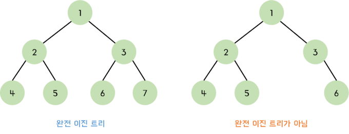
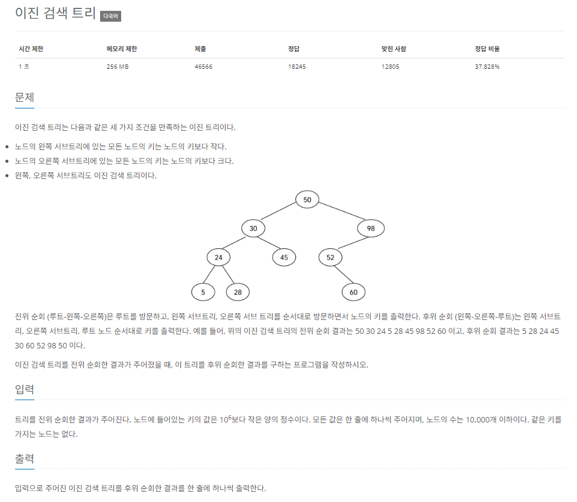

# 이진트리 자료구조는 무엇일까 ?

이진트리 **자료구조는 노드들이 트리 모양으로 게층적인 구조를 이루는 자료구조이다.** 이 때 이진 트리라는 이름에서 알 수 있듯이 각 노드들은 필연적으로 0개 또는 2개 이하의 자식 노드를 가지고 있는 형태이다.



이진 트리에서 자식 노드가 존재하지 않는 노드를 `leaf node` 라고 하는데 `leaf node` 를 제외한 모든 노드들이 2개의 자식 노드를 가지고 있는 경우를 완전 이진 트리 , 그렇지 않다면 불완전 이진 트리라고 한다.

이진 트리 자료구조에서 **루트 노드를 M , 좌측 서브 트리를 L , 우측 서브트리를 R 이라고 둔다면 이진 트리 자료구조는 (M,L,R) 의 조합으로 표현 가능** 하다.

> 이진 트리는 여러 서브 트리들의 조합으로 볼 수 있다.
>
> 예를 들어 위 이미지의 완전 이진 트리는 루트 노드인 1 을 기준으로 [2,4,5] 로 이뤄진 좌측 서브트리 , [3,6,7] 로 이뤄진 우측 서브트리로 이뤄져있다.
>
> 또 [2,4,5] 라는 좌측 서브트리는 2라는 루트 노드와 4라는 좌측 서브트리 , 5라는 우측 서브트리로 이뤄져있다.
>
> 결국 트리들은 여러 트리들의 조합으로 표현 가능하다.

이진 트리 자료구조가 왜 필요한지에 대해 알기 이전에 이진 트리의 특성들에 대해서 먼저 알아보고 가자

# 이진 트리의 속성

[위키백과 - 이진 트리](https://ko.wikipedia.org/wiki/%EC%9D%B4%EC%A7%84_%ED%8A%B8%EB%A6%AC) 를 참고했다.

## 이진 트리의 높이

노드 개수가 n인 이진 트리의 높이를 **h 로 둔다면 이진 트리 자료구조의 높이는 `[log_2^n] + 1` 로 정의** 할 수 있다.

> `[]` 은 정수 형변환을 의미한다.

그 이유에 대해 생각해보자면 루트 노드가 존재하는 이진 트리의 경우 레벨이 내려 갈 때 마다 (루트 노드를 첫 번째 레벨, 이하의 레벨을 두,세 번째 레벨로 불러보자) 각 레벨 별 노드의 개수가 2의 제곱만큼 늘어나기 때문이다.

예를 들어 노드 개수가 8인 이진 트리의 높이는 4이다.

이렇게 높이가 노드 개수에 비해 기하급수적으로 적다라는 사실은 이진 트리의 자료구조가 데이터를 탐색하거나 삽입, 연산 하는데 있어 배열에 비해 많은 시간을 단축 시킬 수 있다는 장점을 가져온다. 해당 내용은 추후 설명하도록 하겠다.

## 이진 트리 노드의 개수

위에서 이진 트리의 높이 h에 대해 정의했다.

그렇다면 h를 알고 있을 때 이진 트리 노드의 총 개수나 레벨 별 개수를 아는 것은 간단하다.

모든 `leaf node` 가 존재하는 완전 이진 트리의 경우 높이가 h 일 때 트리의 노드 총 개수는 2^h - 1개이다.

또, 레벨을 l 이라고 뒀을 때 , l 의 노드의 개수는 2^(l-1) 개임을 쉽게 알 수 있다.

# 이진 트리 자료구조가 갖는 속성

그렇다면 이진 트리 자료구조가 갖는 속성이 무엇일까 ?

이진 트리 자료구조는 다음과 같은 기능에 특화되어 있다.

## 효율적인 검색이 가능하다

이진 트리 자료구조를 생성 할 때 루트 노드와 서브 트리 간의 조건을 두고 해당 조건에 따라 자료구조를 생성하였을 때 효율적인 검색을 가능하게 한다.

예를 들어 다음과 같은 이진 트리가 존재한다고 가정해보자

```json title="왼쪽 서브트리는 루트 노드보다 작은 값들이 존재하고 , 오른쪽 서브트리는 루트 노드보다 큰 값들이 존재한다."
        15
       /  \
      10   20
     / \   / \
    8  12 17 25
            \
            19
```

이 때 이진 트리에서 어떤 값 X 를 찾기 위한 최대 연산의 횟수는 몇 번일까 ?

정답은 O(log n) 이다.

그 이유는 O(h) 로 본다면 더 명확해지는데 특정 조건에 따라 레벨을 내려가며 탐색해 나가면 되기 때문에 루트 노드부터 시작 할 때 전체 높이를 탐색 하기만 하면 되기 때문이다.

```json title="해당 이진 트리를 탐색하는 과정의 시각화"
Step 1: Start at Root (15)
         15
       /    \
     10      20
    /  \    /  \
   8   12  17   25
              \
              19

Step 2: Move to Right Child (20)
         15
           \
            20
           /  \
         17   25
           \
           19

Step 3: Move to Left Child (17)
           20
           /  \
         17   25
           \
           19

Step 4: Move to Right Child (19)
           17
             \
             19
```

만약 해당 자료구조가 정렬되지 않은 배열의 경우에는 O(n) 만큼의 시간이 걸리는데 이에 비해 더 효과적인 시간 복잡도를 갖는다.

## 계층적 데이터 표현

이진 트리 자료구조의 모습을 살펴보면 계층적인 자료구조의 모습을 볼 수 있다.

대표적인 비선형 자료 구조의 일종으로 생성자가 원하는 논리에 맞게 계층적으로 자료구조를 정렬 시키는 것이 가능하다.

## 우선순위 큐 및 힙

이진 트리의 종류인 우선순위 큐 혹은 힙의 경우엔 부모 노드가 자식 노드보다 값이 큰 경우 (Max Heap) , 부모 노드가 자식 노드보다 값이 작은 경우 (Min Heap) 로 나눠 효과적으로 정렬 된 값들을 유지하며 삽입 및 삭제가 가능하다.

해당 내용은 [자료구조 - 힙 (heap) make heap 연산](https://velog.io/@yonghyeun/%EC%9E%90%EB%A3%8C%EA%B5%AC%EC%A1%B0-%ED%9E%99-heap-makeheap-%EC%97%B0%EC%82%B0) 에서 자세히 설명되어 있다.

트리 자료구조는 각 노드 들이 연결 리스트 형태로 연결 되어 있는 형태이기 때문에 값을 삭제하거나 추가 하는 연산은 O(1) 만큼의 시간 복잡도 만을 갖는다.

이 때 추가 된 값에서 정렬된 트리의 상태를 유지하는 정렬 과정은 단순히 O(n log n) 만큼의 시간을 갖기에 정렬된 자료 구조의 형태를 유지하는 것이 가능하다.

> 우선순위 큐 및 힙에 관련된 내용은 추후 포스팅 하도록 하겠다. :)

# 이진 트리의 순회 (traversal)

이진 트리 자료구조를 생성 하는 법을 공부 하기 전, 이진 트리의 순회 방법을 먼저 설명하도록 하겠다.

이후 이진 트리 순회로 탐색 된 결과를 이용해 이진 트리를 생성하고 , 생성된 이진 트리에서 다양한 순회 방법을 하는 방법을 설명하도록 하겠다.

이진 트리의 순회는 다음 3가지 방법으로 순회 할 수 있다.

각 순회 방식에선 트리가 특정한 논리 구조를 갖는 BST = (M,L,R) 로 이뤄져있다고 가정한다.

> 해당 notaion 은 이진 트리 BST 가 루트 노드 (M) , 좌측 서브 트리 (L) , 우측 서브 트리 (R) 로 이뤄져있다는 것을 의미한다.

**순회는 이진 트리를 탐색하며 값들을 반환하는 과정을 의미한다.**

```json title="순회 할 트리 구조의 예시"
        15
       /  \
      10   20
     / \   / \
    8  12 17 25
            \
            19
```

- 전위 순회 (preorder traversal) : 전위 순회는 트리를 순회 할 때 (M -> L -> R) 순서로 순회 한다는 것을 의미한다. 위 트리를 전위 순회 한다면 반환 되는 값은 [15,10,8,12,20,17,19,25] 이다.

- 중위 순회 (inorder traversal) : 중위 순회는 트리를 순회 할 때 (L -> M -> R) 순서로 순회 한다는 것을 의미 한다. 위 트리를 중위 순회 한다면 반환 되는 값은 [8,10,12,15,19,17,20,25] 이다.

- 후위 순회 (postorder traversal) : 후위 순회는 트리를 순회 할 때 (L -> R -> M) 순서로 순회 한다는 것을 의미 한다. 위 트리를 후위 순회 한다면 반환 되는 값은 [8,12,10,19,17,25,20,15] 이다.

이름에서 알 수 있듯 순회 할 때 루트 노드를 우선 순회 할 것인지, 중간에 순회 할 것인지, 가장 마지막에 순회 할 것인지에 따라 이름이 다르다.

이진 트리는 순회 되어 반환 된 값을 통해 이진 트리를 생성하는 것을 가능하게 한다. 이러한 경우를 백준 문제 풀이를 통해 풀어보고 만들어진 자료 구조를 통해 이진 트리의 순회와 자료 구조를 살펴보자

## 예시를 통해 알아볼 백준 문제



[백준 문제 - 이진 검색 트리](https://www.acmicpc.net/problem/5639)

```dotnetcli title="예제 입력"
50
30
24
5
28
45
98
52
60
```

스텝 별로 하나 씩 작성해나가보자

### Step 1. 생성자와 buildTree 메소드 생성

```jsx title="Step 1. BST 생성자와 buildTree 메소드 생성"
const fs = require('fs');
const filePath =
  process.platform === 'linux' ? '/dev/stdin' : __dirname + '/input.txt';
let inputs = fs.readFileSync(filePath, 'utf-8').trim().split('\n');
const preorder = inputs.map(Number); // [50,30,24,5,28,45,98,52,60]

/* BST = (M,L,R) */
function BST(key) {
  this.root = key;
  this.left = null;
  this.right = null;
}

function buildTree(preorder, start, end) {
  const rootIdx = start;
  const root = new BST(preorder[rootIdx]);

  if (start > end) {
    return null;
  }

  return root;
}
```

우선 `BST` 생성자 함수와 아직 미완성인 `buildTree` 메소드를 정의해주었다.

`buildTree` 는 재귀 함수인데 재귀 함수를 생성 할 때 개인적으로 나는 재귀 함수 메소드의 반환 값들을 먼저 정의해두는 편이다.

그리고 해당 메소드의 정의를 미리 정해둔다. 만약 그렇지 않고 재귀 함수를 생성하다 보면

_"음.. 이럴 경우엔 재귀 함수를 호출 하고 .. 그러면 이 안에 들어가서 이 안에서 또 뭘 호출 하고 .. 뭐 탈출하고 .."_

이런 식으로 혼자 혼란스러워지기 때문이다.

**`buildTree` 메소드는 전위 순회 결과를 담은 배열에서 가장 `start` 번 째 원소를 기준으로 하여 `BST` 를 반환 하는 메소드이다.**

이 때 `start` 가 `end` 보다 작다면 `null` 값을 반환한다.

### Step 2. buildTree 메소드에서 left , right 를 재귀적으로 호출하여 추가

```jsx title="재귀적으로 left , right 추가하기" {16-22 , 27-30}#add
/* BST = (M,L,R) */
function BST(key) {
  this.root = key;
  this.left = null;
  this.right = null;
}

function buildTree(preorder, start, end) {
  const rootIdx = start;
  const root = new BST(preorder[rootIdx]);

  if (start > end) {
    return null;
  }

  let splitIdx = start + 1;
  while (preorder[splitIdx] < preorder[rootIdx] && splitIdx <= end) {
    splitIdx++;
  }

  root.left = buildTree(preorder, rootIdx + 1, splitIdx - 1);
  root.right = buildTree(preorder, splitIdx, end);

  return root;
}

const START = 0;
const END = preorder.length - 1;
const tree = buildTree(preorder, START, END);
console.log(tree);
```

```dotnetcli title="생성된 트리 구조"
BST {
  root: 50,
  left: BST {
    root: 30,
    left: BST { root: 24, left: [BST], right: [BST] },
    right: BST { root: 45, left: null, right: null }
  },
  right: BST {
    root: 98,
    left: BST { root: 52, left: null, right: [BST] },
    right: null
  }
}
```

이후 `root` 노드의 `left , right` 를 재귀적으로 `buildTree` 를 호출하여 생성해준다.

전위 순회된 배열에서 `root` 노드의 `left , right` 를 나누는 `splitIdx` 는 필연적으로 `root` 노드보다 값이 첫 번째로 큰 값의 인덱스이다.

즉 , `root.left` 에 해당하는 트리는 `rootIdx + 1 ~ splitIdx -1` 까지의 배열로 생성된 트리이고 `root.right` 에 해당하는 트리는 `splitIdx ~ end` 까지의 배열로 생성된 트리이다.

> 현재 이진 트리가 B = (M,L,R) 에서 L 은 M 보다 작고 R 은 M 보다 항상 크게 생성 된 자료 구조임을 생각하자

그렇게 `left , right` 를 나누는 `splitIdx` 를 반복문으로 찾아주고 `left , right` 에 해당하는 다른 `BST` 를 생성하여 붙여준다.

재귀 함수라서 복잡하게 느껴지곤 하는데 그저 단순히 `buildTree` 를 `BST` 를 반환하는 함수라고 생각한다면 단순히 `root.left , right` 에 서브 트리들을 붙여 반환하는 메소드임을 알 수 있다.

### Step 3. tree 를 후위 순회 해보자

그렇다면 이렇게 생성된 tree 값들을 후위 순회 해보도록 하자

후위 순회는 `L -> R -> M` 형태로 순회하며 값을 반환한다. (문제에선 로그하면 되기 때문에 로그 해보자)

```jsx title="미완성인 postOrder , 하지만 postOrder 함수의 역할을 생성하기 전에 미리 생각해보자"
function postOrder(tree) {
  console.log(tree.root);
}
```

재귀적으로 `postOrder` 를 호출 하기 전 `postOrder` 의 정의를 미리 생각해두자

`postOrder` 는 **트리를 순회 하며 루트 노드를 로그하는 함수인데, 왼쪽 서브 트리와 오른쪽 서브 트리를 후위 탐색 한 후에 루트 노드를 로그하는 함수이다.** 라고 정의했다.

그렇다면 해당 정의에 맞춰 함수를 완성해보자

```tsx title="완성된 postOrder 메소드" {2-7}#add
function postOrder(tree) {
  if (tree.left) {
    postOrder(tree.left);
  }
  if (tree.right) {
    postOrder(tree.right);
  }

  console.log(tree.root);
}
postOrder(tree);
```

```dotnetcli title="postOrder 함수의 실행 결과"
5
28
24
45
30
60
52
98
50
```

정의에 맞춰 `postOrder` 메소드를 완성해주었다. 왼쪽 서브 트리가 존재한다면 왼쪽 서브 트리를 후위 탐색 하고 , 오른쪽 서브트리가 존재한다면 오른쪽 서브 트리를 후위 탐색 한 후 마지막으로 루트 노드를 로그 하도록 생성해주었다.

### Step 4. 그렇다면 전위 순회와 중위 순회도 가능할까 ?

물론이다. 위에서 말했던 것 처럼 순회 메소드들의 정의를 미리 내려두고 정의에 따라 코드를 생성해두면 쉽게 해줄 수 있다.

```jsx title="전위 순회 및 중위 순회도 후위 순회를 생성해줬던 것 처럼 쉽게 재귀적으로 생성해줄 수 있다."
function preOrder(tree) {
  console.log(tree.root);

  if (tree.left) {
    preOrder(tree.left);
  }
  if (tree.right) {
    preOrder(tree.right);
  }
}

function inOrder(tree) {
  if (tree.left) {
    inOrder(tree.left);
  }

  console.log(tree.root);

  if (tree.right) {
    inOrder(tree.right);
  }
}

preOrder(tree);
console.log('-------------------');
inOrder(tree);
```

```dotnetcli title="전위 순회 , 중위 순회의 값"
50
30
24
5
28
45
98
52
60
-------------------
5
24
28
30
45
50
52
60
98
```
