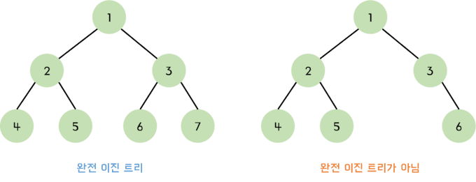

이전 챕터에선 이진 트리의 정의에 대해 알아보고 간단하기 이진 트리를 구현하는 방법에 대해 공부해보았다.

이번 챕터에선 탐색 , 삽입 , 삭제 연산이 존재하는 이진 트리를 구현해보자

# 노드 생성하기

이진 트리는 비선형 연결리스트의 형태로 `left, right , parent` 를 갖는 노드들이 2차원의 형태로 연결되어 있는 모습이다.



이진 트리를 구성하는 노드 생성자를 우선적으로 생성해주자

```tsx title="이진 트리의 노드 역할을 하는 Node 생성자"
class Node {
  constructor(key) {
    this.key = key;
    this.left = this.right = this.parent = null;
  }
}
```

여기서 노드는 본인의 루트 노드인 `key` 와 `L,R subtree` 를 갖는 조그만 이진 트리의 형태로 볼 수도 있다.

# 이진 트리 클래스 생성하기

```tsx title="이진 트리 클래스의 초기 모습"
class BinarySearchTree {
  constructor() {
    this.root = null; /* root 는 위에서 선언한 Node의 타입이여야 함 */
  }
}
```

하나씩 기능을 추가해나가보도록 하자

# 삽입 기능 추가하기

## 유틸 메소드들 추가하기

### findLocation

우선 삽입 및 검색을 하기 위해선 노드를 전체적으로 탐색하는 메소드가 필요하다.

`findLocation` 메소드를 정의해 노드를 순회 할 수 있도록 해주자

```tsx title="fildLocation 메소드 추가" {8-99}#add
class BinarySearchTree {
  constructor() {
    this.root = null;
  }

  /* findLocation 은 해당 key를 갖는 node를 발견하면 해당 node를 반환하고 
  존재하지 않을 경우엔 마지막 탐색이 일어난 노드의 부모 노드를 반환함 */
  findLocation(key) {
    if (!this.root) {
      return null;
    }

    let searchTarget = this.root;
    let parent = searchTarget.parent;

    while (searchTarget !== null && searchTarget.key !== key) {
      parent = searchTarget;
      searchTarget =
        key < searchTarget.key ? searchTarget.left : searchTarget.right;
    }

    return searchTarget?.key === key ? searchTarget : parent;
  }
}
```

`findLocation` 메소드는 이진트리에서 `key` 값인 노드를 반환하는 메소드이다.

이 때 만약 해당 `key` 값이 존재한다면 찾은 노드를 반환하고 , 존재하지 않는다면 마지막으로 탐색이 일어났던 노드 (`parent`)를 반환한다.

반복문을 돌다보면 `searchTarget` 이 `null` 이 될 수도 있기 때문에 `?` 연산자를 이용하여 반환해주도록 한다.

> `parent` 노드를 반환하는 이유는 추후 `insert` 메소드에서 요긴하게 사용되기 때문이다.

### preorder

디버깅을 위해 트리를 전위 순회 하는 메소드를 추가해주도록 하자

```tsx title="전위순회하는 preorder 메소드" showLineNumbers{31}
  preorder(node = this.root) {
    process.stdout.write(`${node.key},`);
    if (node.left) {
      this.preorder(node.left);
    }
    if (node.right) {
      this.preorder(node.right);
    }
  }
```

전위 순회에 대한 내용은 이전 포스트를 참고하도록 하자 :)

### linkingNode , unLinkingNode

```tsx title="linkingNode , unLinkingNode" showLineNumbers{41}
  linkingNode(parent, node) {
    if (!parent) {
      this.root = node;
      return;
    }

    if (parent.key === node.key) {
      return;
    }

    if (node.key < parent.key) {
      parent.left = node;
    } else {
      parent.right = node;
    }
    node.parent = parent;
  }

  unLinkNode(parent, node) {
    if (!parent) {
      this.root = null;
      return;
    }
    if (node.key < parent.key) {
      parent.left = null;
    } else {
      parent.right = null;
    }
    node.parent = null;
  }
```

해당 메소드들은 어떤 `parent` 노드들에 대해서 특정 `node` 를 서브트리로 연결하거나 , 삭제하는데 사용되는 메소드들이다.

각 메소드들에서 `parent` 와 `node` 의 값이 같을 경우나 , `parent` 가 `null` 일 때 (`this.root === null`) 어떤 처리를 하는지 염두하고 넘어가도록 하자

## 삽입 기능 추가하기 : insert

```tsx title="insert 메소드" showLineNumbers{72}
  insert(key) {
    const node = new Node(key);
    const parent = this.findLocation(key);
    this.linkingNode(parent, node);
  }
```

위에서 정의한 `findLocation` 메소드와 `linkingNode` 메소드를 이용해 삽입 기능을 구현해주었다.

`linkingNode` 로 인해 `parent === null` 인 경우엔 루트 노드에 추가되고 아닌 경우엔 적절히 조건에 맞게 `parent` 의 자식 노드로 추가해준다.

```tsx title="insert 기능이 잘 작동하는지 확인"
const bst = new BinarySearchTree();

bst.insert(2);
bst.insert(1);
bst.insert(3);
bst.preorder(); // 2 1 3
```

## 검색 기능 추가하기 : search

`search` 메소드는 위에서 정의한 `findLocation` 메소드를 이용해주면 된다.

```tsx title="search 메소드, 값이 존재하지 않을 경우 null 반환" showLineNumbers{62}
  search(key) {
    const target = this.findLocation(key);
    return target.key === key ? target : null;
  }
```

이렇게 기본적인 삽입 및 검색 기능을 구현해줬다.

탐색 및 삽입의 시간 복잡도는 이진 트리의 높이를 `h` 라고 뒀을 때 `O(h)` 에 해당한다.

단순히 높이 만큼만 내려가며 탐색하면 되기 때문이다.

# 삭제 연산

이진 트리의 삭제 연산은 `leftSubtree` 를 삭제하고자 하는 노드에 서브 트리를 병합하는 `deleteByMerging` 메소드와

삭제하고자 하는 노드에 `leftSubtree` 의 가장 큰 값을 복사하여 사용하는 `deleteByCopying` 메소드가 존재한다.

삭제 연산을 하기 전, 이진 트리의 모습을 생성해주도록 하자

```tsx title="삭제 연산 시연에 사용 될 이진 트리를 전위순회한 모습"
const bst = new BinarySearchTree();

[15, 4, 2, 20, 17, 19, 18, 16, 32].forEach((key) => bst.insert(key));
bst.preorder(); // 15,4,2,20,17,16,19,18,32,
```

````json title ="이진 트리를 시각화하여 생성한 모습"
        15
       /  \
      4    20
     /    /  \
    2    17   32
        / \
       16  19
          /
         18
         ```
````

현재 삭제 연산을 시행 할 이진 트리의 모습은 위와 같다.

## deleteByMerging

이제 `deleteByMerging` 을 구현해보자

용어를 우선 정리해보자

- 삭제하고자 하는 노드 : `deleteTarget`
- `deleteTarget` 의 왼쪽 서브트리 : `leftSubtree`
- `deleteTarget` 의 오른쪽 서브트리 : `rightSubtree`
- 서브트리 `X` 의 노드 중 가장 큰 값인 노드 : `X_maxLeaf`

다음과 같은 용어일 때 `deleteByMerging` 메소드는 다음과 같은 스텝을 밟는다.

1. `deleteTarget` 노드 위치에 `leftSubtree` 을 병합한다.
2. `leftSubtree_max` 의 오른쪽 서브트리에 `rightSubtree` 를 병합한다.

항상 `leftSubtree_maxLeaf` 의 값은 `rightSubtree` 의 루트 노드보다 작다는 것을 인지하자 , 또 `leftSubtree_maxLeaf` 는 오른쪽 서브트리를 갖지 않는 마지막 오른쪽 `leaf node` 라는 것도 인지하자

```tsx title="deleteByMerging" showLineNumbers{83}
  findMaxLeaf(rootNode) {
    let MaxLeaf = rootNode;

    while (MaxLeaf.right !== null) {
      MaxLeaf = rootNode.right;
    }
    return MaxLeaf;
  }

  deleteByMerging(key) {
    if (!this.root) {
      return;
    }
    const deleteTarget = this.search(key);

    if (!deleteTarget) {
      return;
    }

    const parent = deleteTarget.parent;
    const leftSubtree = deleteTarget.left;
    const rightSubtree = deleteTarget.right;

    if (!parent) {
      /* 지우고자 하는 노드가 root Node라면 */
      this.root = null;
    }

    if (!leftSubtree && !rightSubtree) {
      /* 지우고자 하는 노드가 leaf Node라면 */
      this.unLinkNode(parent, deleteTarget);
      return;
    }

    if (leftSubtree && !rightSubtree) {
      /* 지우고자 하는 노드가 leftSubtree 만 존재한다면 */
      this.linkingNode(parent, leftSubtree);
      return;
    }
    if (!leftSubtree && rightSubtree) {
      /* 지우고자 하는 노드가 rightSubtree 만 존재한다면 */
      this.linkingNode(parent, rightSubtree);
      return;
    }

    /* 지우고자 하는 노드가 leftSubtree, rightSubtree 모두가 존재한다면 */
    const LeftNodeMaxLeaf = this.findMaxLeaf(leftSubtree);

    this.linkingNode(parent, leftSubtree);
    this.linkingNode(LeftNodeMaxLeaf, rightSubtree);
  }
```

위와 같이 `findMaxLeaf , deleteByMerging` 메소드를 구현해주었다.

만약 지우고자 하는 노드 `deleteTarget` 이 서브트리를 갖지 않는 경우엔 단순히 `deleteTarget.parent` 와 링크를 끊어주면 되고

서브트리가 하나만 존재하는 경우엔 존재하는 서브트리를 `deleteTarget` 부위로 병합해주면 된다.

신경 써야 하는 것은 서브트리가 두 가지가 모두 존재 할 때 인데 위에서 설명한 것가 같이

`leftSubtree` 를 `deleteTarget` 부위로 병합 한 후 , `LeftNodeMaxLeaf` 에 `rightSubtree` 를 병합해주면 된다.

```tsx title="deleteByMerging 전 후 전위순회 값 결과"
[15, 4, 2, 20, 17, 19, 18, 16, 32].forEach((key) => bst.insert(key));
bst.preorder(); // 15,4,2,20,17,16,19,18,32
bst.deleteByMerging(20);
bst.preorder(); // 15,4,2,17,16,19,18,32,
```

```json title="기존 서브트리"
        15
       /  \
      4    20
     /    /  \
    2    17   32
        / \
       16  19
          /
         18
```

```json title="deleteByMerging(20) 을 시행한 후의 서브 트리"
        15
       /  \
      4    17
     /    /  \
    2    16   19
              / \
            18  32
```

## deleteByCopying

`deleteBycopying` 은 `mergy` 와 다르게 `LeftNodeMaxLeaf` 값을 `deleteTarget` 의 값에 덮어씌운다.

즉 `deleteTarget.key = LeafNodeMaxLeaf.key` 로 덮어 씌운다.

코드와 함께 살펴보자

```tsx title="deleteByCopying" showLineNumbers{135}
  deleteByCopying(key) {
    if (!this.root) {
      return;
    }
    const deleteTarget = this.search(key);

    if (!deleteTarget) {
      return;
    }

    const parent = deleteTarget.parent;
    const leftSubtree = deleteTarget.left;
    const rightSubtree = deleteTarget.right;

    if (!leftSubtree && !rightSubtree) {
      /* 지우고자 하는 노드가 leaf Node라면 */
      this.unLinkNode(parent, deleteTarget);
      return;
    }

    if (!leftSubtree && rightSubtree) {
      this.linkingNode(parent, rightSubtree);
      return;
    }

    /* leftSubtree 가 존재하는 경우 로직이 존재 */
    const LeftNodeMaxLeaf = this.findMaxLeaf(leftSubtree);
    deleteTarget.key = LeftNodeMaxLeaf.key;

    if (leftSubtree.left) {
      this.linkingNode(LeftNodeMaxLeaf.parent, LeftNodeMaxLeaf.left);
    }
  }
```

`deleteByCopying` 은 `leftSubtree` 가 존재하는 경우의 로직이 존재한다.

`LeftNodeMaxLeaf` 값을 지우고자 하는 값의 `key` 값에 복사 한 후 `LeftNodeMaxLeaf.left` 의 값들을 `LeftNodeMaxLeaf.parent.right` 값에 연결해주면 된다.

```tsx title="deleteByCopying(20) 을 시행한 후 전위순회 한 결과"
[15, 4, 2, 20, 17, 19, 18, 16, 32].forEach((key) => bst.insert(key));
console.log('기존 서브 트리를 전위 순회한 결과');
bst.preorder(); // 15,4,2,20,17,16,19,18,32,
console.log('\n deleteByCopying 시행한 결과');
bst.deleteByCopying(20);
bst.preorder(); // 15,4,2,19,17,16,18,32,
```

```json title="기존 이진 트리"
       15
       /  \
      4    20
     /    /  \
    2    17   32
        / \
       16  19
          /
         18
```

```json title="deleteByCopying(20) 을 시행한 결과"
        15
       /  \
      4    19
     /    /  \
    2    17   32
        / \
       16  18
```

## 두 삭제 연산의 시간 복잡도

두 연산의 시간 복잡도는 모두 `O(h)` 이다.

가장 최악의 경우에 `LeftSubtreeMaxLeaf` 가 최 하단 `leafnode` 에 존재 할 경우 모든 높이를 탐색해줘야 하기 때문이다.

탐색 이후엔 단순히 연결 리스트들을 연결하는 작업이라 탐색까지의 시간만이 성능에 큰 영향을 미친다.

## 그럼 두 삭제 연산은 어떤 점에서 다를까 ?

`deleteByMerging , deleteByCopying` 의 가장 큰 특징은 기존 트리의 모습을 얼만큼 유지하느냐이다.

```json title="기존 서브트리"
        15
       /  \
      4    20
     /    /  \
    2    17   32
        / \
       16  19
          /
         18
```

```json title="deleteByMerging(20) 을 시행한 후의 서브 트리"
        15
       /  \
      4    17
     /    /  \
    2    16   19
              / \
            18  32
```

```json title="deleteByCopying(20) 을 시행한 결과"
        15
       /  \
      4    19
     /    /  \
    2    17   32
        / \
       16  18
```

확실히 `deleteByMerging` 의 경우보다 `deleteByCopying` 의 경우가 기존 이진 트리의 모습을 많이 유지하는 모습을 볼 수 있다.

`deleteByMerging` 은 구현하기가 간편하나 시행 할 수록 `rightSubtree` 의 깊이가 점점 깊어지는 모습을 볼 수 있을 것이다.

> 위 예시에서 레벨 2에 해당하는 노드들을 deleteByMerging` 으로 지속적으로 삭제한다고 생각해보자
>
> `20 -> 17 -> 16` 이런식으로 말이다.

`deleteByCopying` 은 구현하기가 어려우나 전체적인 균형잡힌 이진 트리의 기존 깊이를 유지하는 모습을 볼 수 있다.

> 위 예시에서 레벨 2에 해당하는 노드들을 deleteByMerging` 으로 지속적으로 삭제한다고 생각해보자
>
> `20 -> 19 -> 18` 이런식으로 말이다.
