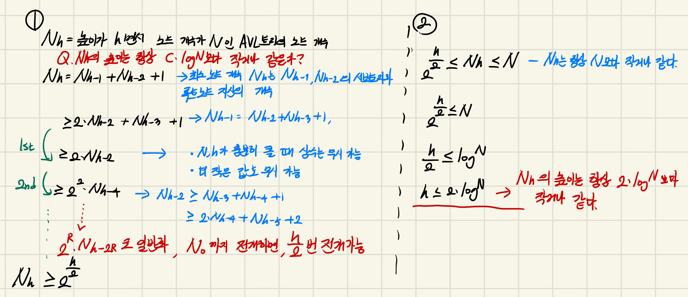

# AVL 트리란

`AVL` 트리란 1962년 세 학자가 개발한 이진 트리의 일종으로 학자의 첫 이름들을 인용한 이름을 갖는 트리를 의미한다.

`AVL` 트리가 등장한 이유를 알기 전 기존 이진 트리가 가지는 단점을 먼저 알아보자

## 이진트리의 시간 복잡도는 이진 트리 높이에 종속적이다.

이전 포스팅인 [이진 트리 구현](https://www.abonglog.me/post/543443) 에서는 이진 트리의 높이를 h 라고 했을 때 모든 행위의 시간 복잡도는 O(h) 만큼 걸린다고 했었다.

단순히 트리의 깊이 만큼만 탐색하면 되기 때문이다.

노드 개수가 `N` 인 이진 트리 `T` 가 있을 때 `T` 가 가질 수 있는 가장 낮은 높이와 높은 높이를 알아보자

가장 낮은 높이를 가질 때는 높이가 `log N` 에 해당한다.

이는 모든 `leaf node` 들이 동일한 레벨에 존재 하는 완전 이진 트리 형태일 때를 의미한다.

```json title="높이가 log N 인 이진 트리"
        4
       / \
      2   6
     / \ / \
    1  3 5  7
```

`T` 가 가질 수 있는 가장 높은 높이를 가질 때의 높이는 `N` 이다.

새롭게 삽입 되는 노드들이 모두 `T` 의 `leaf node` 위치에 삽입 되는 경우이다.

```json title="높이가 N인 이진 트리"
1
 \
  2
   \
    3
     \
      4
       \
        5
         \
          6
           \
            7
```

두 이진 트리는 모두 동일한 노드 들을 이용하여 만들어졌음에도 불구하고 트리의 모양과 높이가 다르다.

이런 이유가 발생하는 이유는 **노드들의 삽입 순서에 따라 트리의 높이가 결정**되기 때문이다.

```tsx title="삽입 순서에 따라 이진 트리의 높이가 결정되는 예시"
class Node {
  constructor(key) {
    this.key = key;
    this.left = this.right = null;
  }
}

class BST {
  constructor() {
    this.root = null;
  }

  preorder(node) {
    if (!node) {
      return;
    }
    process.stdout.write(`${node.key},`);
    this.preorder(node.left);
    this.preorder(node.right);
  }

  insert(node, key) {
    if (!this.root) {
      this.root = new Node(key);
      return;
    }

    if (node === null) {
      return new Node(key);
    }

    if (key < node.key) {
      node.left = this.insert(node.left, key);
    } else if (key > node.key) {
      node.right = this.insert(node.right, key);
    } else {
      return;
    }
    return node;
  }
}

const minTree = new BST();
const maxTree = new BST();

[4, 2, 6, 1, 3, 5, 7].forEach((key) => minTree.insert(minTree.root, key));

console.log('높이가 log N인 이진 트리');
minTree.preorder(minTree.root); // 4,2,1,3,6,5,7

[1, 2, 3, 4, 5, 6, 7].forEach((key) => maxTree.insert(maxTree.root, key));
console.log('\n높이가 N인 이진 트리');
maxTree.preorder(maxTree.root); // 1,2,3,4,5,6,7
```

간단한 이진 트리를 구현해보고 삽입되는 노드들의 순서에 따라 트리의 높이가 어떻게 결정되는지를 확인 할 수 있다.

> 재귀를 이용하여 트리를 구현하는 코드를 검색하다가 보았는데 정말 너~무 아름다워서 이번에 사용해봤다.

## 이진 트리의 높이가 길어지는 이유

위 예시에서 보았듯 **이진 트리의 높이가 길어지는 이유는 트리에 노드가 삽입 될 때, 트리의 균형과 상관 없이 삽입** 되기 때문이다.

여기서 말하는 트리의 균형은 트리를 `T` , 트리의 루트와 서브트리들을 `M,L,R` 이라고 뒀을 때

`L` 의 높이와 `R` 의 높이 차이가 1 이하인 경우를 의미한다.

간단히 노드가 3개 이하인 트리의 경우로 이야기 해보면 다음과 같다.

```json title="L과 R의 높이 차이가 0 (균형)"
  2
 / \
1   3
```

```json title="L과 R의 높이 차이가 1 (균형)"
  2
 /
1
```

```json title="L과 R의 높이 차이가 1을 초과함 (불균형)"
    3
   /
  2
 /
1
```

## AVL 트리는 노드를 삽입 후 균형이 잡혀있지 않는다면 트리를 변경한다.

`AVL` 트리는 이렇게 불균형적인 이진 트리로 인해 높이가 길어지는 것을 방지하기 위해

노드를 삽입 한 후, 삽입된 노드가 불균형적인 모습을 보일 때 트리의 모양을 변경해 균형 잡힌 트리로 수정한다.

```json title="노드가 삽입 된 후 트리의 균형이 깨졌을 때"
    3
   /
  2
 /
1 (새로 삽입 된 노드)
```

```json title="트리의 모양을 균형 잡히게 수정한다."
  2
 / \
1   3
```

이렇게 AVL 트리는 트리들을 균형 잡히게 유지함으로서 항상 높이가 `log N` 에 근접 하게 만들어준다.

### AVL 트리의 높이가 항상 log N에 근접한가에 대한 증명



높이가 h 이면서 노드 개수가 N 인 AVL 트리의 최소 노드 개수를 이용하여 높이 h의 최대값의 범위를 구하는 과정이다.

항상 AVL 트리의 높이는 `2 log N` 보다 작거나 같다는 것을 증명 할 수 있다.

# AVL 트리가 균형잡힌 트리를 유지 하는 방법 : 회전

위에선 AVL 트리가 균형 잡힌 트리를 유지함으로서 높이를 `2 logN` 이하로 유지 한다는 사실을 알았다.

그렇다면 어떻게 균형 잡힌 트리를 유지하는지를 알아보자

## 회전이 한 번만 필요한 경우

**AVL 트리는 회전을 통해 균형 잡힌 트리를 유지** 한다.

우선 가장 간단한 예시로 먼저 알아보자

```json title="left rotation이 필요한 상황"
    x
     \
      y
       \
        z
```

위와 같이 불균형적인 트리가 존재 할 때 불균형적인 트리의 루트인 `x`에 대해 `left rotation` 을 시행 할 수 있다.

> `left , right` 는 모두 회전 방향을 의미한다.
>
> 주 개념은 동일하기에 이번 단계에선 `left` 만을 이용해 설명한다.

`rotation` 이란 말 그대로 트리의 모습을 90도 회전 시키는 것으로 `x < y < z` 성질을 유지하면서 트리의 모습을 변경 시키는 것이다.

해당 성질을 유지하면서 균형잡힌 트리를 유지하기 위해선 다음과 같은 스텝들이 필요하다.

1. `y.left = x`
2. `x.right = null`
3. `x.parent.left | right = y`

```json title="left rotation을 시행 한 후의 모습"
    y
   / \
  x   z
```

시행 후엔 트리의 전체 높이가 이전보다 줄어든 모습을 볼 수 있다.

이번엔 좀 더 복잡한 예시로 알아보자

```json title="left rotation이 필요한 상황 2"
    x
     \
      y
     / \
    w   z
```

이번에는 `y.left` 도 존재하는 경우이다.

이번엔 `x < w < y < z` 성질을 만족하면서 불균형 트리의 루트 노드인 `x` 에 대해 회전을 시켜보자

```json title="left rotation을 시행 한 후의 모습"
    y
   / \
  x   z
   \
    w
```

`x < w < y < z` 성질을 만족하면서 `y` 를 루트 노드 자리로 옮기기 위해선 `w` 노드의 위치를 변경 시켜줘야 한다.

이 때 `x < w` 이기 때문에 `x.right = w` 를 추가해주면 된다.

## 회전이 두 번 필요한 경우

이번엔 회전이 두 번 필요한 경우를 알아보자

```json title="회전이 두 번 필요한 경우 (RL)"
  x
   \
    z
   /
  y
```

위와 같은 경우는 회전이 두 번 필요한 경우이다.

`x < y < z` 성질을 만족하면서 이진 트리를 회전 시켜야 한다.

이 때 만약 회전을 두 번 하지 않고 위처럼 `x` 에 대해 `left rotation` 만 실행하면 다음과 같은 모습이 된다.

```json title="회전을 한 번만 시키면 여전히 불균형한 트리의 모습을 보인다."
    z
   /
  x
   \
    y
```

이렇게 회전을 한 번만 켰을 경우 여전히 불균형한 이유는 `x < y < z` 에서 회전이 일어나 변경이 된 노드인 `z` 는 여전히 `x,y < z` 라는 성질이 존재하기 때문이다.

따라서 균형잡힌 트리의 모습을 하기 위해선 `x < y < z` 성질을 효과적으로 이용하기 위해선 루트 노드 자리에 `y` 가 들어갈 수 있도록 변경해줘야 한다.

```json title="1. z에 대해 right rotation"
  x
   \
    y
     \
      z
```

```json title="2. x에 대해 left rotation"
  y
 / \
x   z
```

# AVL 트리를 구현해보자

위 예시를 통해 `AVL` 트리가 어떻게 균형 잡힌 트리를 유지하는지를 알 수 있었다.

그렇다면 회전 메소드와 삽입 메소드를 구현해보도록 하자

## AVLNode 생성자

```tsx title="AVLNode"
class AVLNode {
  constructor(key) {
    this.key = key;
    this.left = this.right = this.parent = null;
    this.height = 1;
  }
}
```

`AVLTree` 에 들어갈 노드 생성자를 생성해주도록 하자

여기서 `height` 는 루트노드부터 `left,right subtree` 의 높이 중 가장 큰 값을 의미 한다.

## 유틸 메소드 생성하기

```tsx title="AVLTree의 초기 모습, preorder, printPreorder"
class AVLTree {
  constructor() {
    this.root = null;
  }

  preorder(node) {
    if (!node) {
      return;
    }
    process.stdout.wirte(`${node.key},`);
    this.preorder(node.left);
    this.preorder(node.right);
  }

  printPreorder() {
    this.preorder(this.root);
  }
}
```

이번에 구현 할 `AVLTree` 는 재귀함수를 이용하여 구현 할 거라 복잡하여 스텝을 하나 씩 밟아가며 포스팅 하려 한다.

우선은 디버깅 할 수 있도록 `preorder , printPreorder` 를 생성해주었다.

## BST 형태로 insert 기능 추가하기

```tsx {19-48}#add title="BST와 기능이 같은 insert 메소드"
class AVLTree {
  constructor() {
    this.root = null;
  }

  preorder(node) {
    if (!node) {
      return;
    }
    process.stdout.write(`${node.key},`);
    this.preorder(node.left);
    this.preorder(node.right);
  }

  printPreorder() {
    this.preorder(this.root);
  }

  insert(node, key) {
    if (!this.root) {
      this.root = new AVLNode(key);
      return;
    }

    if (node === null) {
      return new AVLNode(key);
    }

    if (node.key === key) {
      return;
    }
    if (key < node.key) {
      node.left = this.insert(node.left, key);
    } else {
      node.right = this.insert(node.right, key);
    }

    return node;
  }

  add(key) {
    this.insert(this.root, key);
  }
}

const avl = new AVLTree();
[1, 2, 3, 4, 5, 6, 7].forEach((key) => avl.add(key));
avl.printPreorder(); // 1,2,3,4,5,6,7
```

우선 `BST` 때와 동일한 `insert` 기능을 우선적으로 구현해주자

재귀적으로 `insert` 메소드를 호출하는 것인데 해당 부분을 조금만 더 설명하자면

`this.root` 부터 시작하여 `leaf node` 에 도착 할 때 까지 `insert` 메소드를 재귀적으로 호출하고 만약 `leaf node` 에 도달하였다면 `new AVLNode(key)` 를 삽입한다.

`leaf node` 에 도달하기 전에 들렸던 노드들은 삽입이 일어난 노드로 업데이트 해줄 수 있도록 메소드 가장 마지막 줄에 `return node` 를 추가해줌으로서 업데이트 해준다.

```json title="return node 덕분에 다음과 같은 업데이트가 가능하다."
node.right = this.insert(node.right , key)
           = node.right // leaf node에 값이 추가된 이후의 node.right
```

## rotation 기능 추가하기

현재의 메소드는 `BST` 형태와 동일하다.

그렇다면 균형 잡힌 트리를 유지하기 위한 메소드와 추가적인 기능들을 추가해주자

이제 할 것은 업데이트 이후에, 해당 노드가 밸런스가 맞는지를 확인하고 만약 밸런스가 맞지 않는다면 회전 시켜 트리의 밸런스를 유지하는 것이다.

```tsx title="rotation 기능이 추가된 AVL tree"
class AVLNode {
  constructor(key) {
    this.key = key;
    this.left = this.right = this.parent = null;
    this.height = 1;
  }
}

class AVLTree {
  constructor() {
    this.root = null;
  }

  preorder(node) {
    if (!node) {
      return;
    }
    process.stdout.write(`${node.key},`);
    this.preorder(node.left);
    this.preorder(node.right);
  }

  printPreorder() {
    this.preorder(this.root);
  }

  getHeight(node) {
    return node ? node.height : 0;
  }

  getMaxHeight(node) {
    return Math.max(this.getHeight(node.left), this.getHeight(node.right)) + 1;
  }

  getBalance(node) {
    return this.getHeight(node.left) - this.getHeight(node.right);
  }

  leftRotate(node) {
    const parent = node.parent;
    const rightChild = node.right;
    const leftGrandChild = rightChild.left;

    // 1. rotation
    rightChild.left = node;
    node.right = leftGrandChild;

    // 2. pointing from child to parent
    rightChild.parent = parent;
    node.parent = rightChild;
    if (leftGrandChild) {
      leftGrandChild.parent = node;
    }

    // 3. pointing from parent to child
    if (parent) {
      if (node === parent.left) {
        parent.left = rightChild;
      } else {
        parent.right = rightChild;
      }
    } else {
      this.root = rightChild;
    }

    // 4. updateHeight
    node.height = this.getMaxHeight(node);
    rightChild.height = this.getMaxHeight(rightChild);

    return rightChild;
  }

  rightRotate(node) {
    const parent = node.parent;
    const leftChild = node.left;
    const rightGrandChild = leftChild.right;

    // 1. rotation
    leftChild.right = node;
    node.left = rightGrandChild;

    // 2. child to parent pointing
    leftChild.parent = parent;
    node.parent = leftChild;
    if (rightGrandChild) {
      rightGrandChild.parent = node;
    }

    // 3. parent to child pointing
    if (parent) {
      if (node === parent.left) {
        parent.left = leftChild;
      } else {
        parent.right = leftChild;
      }
    } else {
      this.root = leftChild;
    }

    // 4. updateHeight
    node.height = this.getMaxHeight(node);
    leftChild.height = this.getMaxHeight(leftChild);

    return leftChild;
  }

  insert(node, key) {
    if (!this.root) {
      this.root = new AVLNode(key);
      return;
    }

    if (node === null) {
      return new AVLNode(key);
    }

    if (node.key === key) {
      return;
    }

    if (key < node.key) {
      node.left = this.insert(node.left, key);
      node.left.parent = node;
    } else {
      node.right = this.insert(node.right, key);
      node.right.parent = node;
    }

    node.height = this.getMaxHeight(node);
    const balance = this.getBalance(node);

    /* 회전이 한 번만 필요한 경우 */
    if (balance > 1 && key < node.left.key) {
      return this.rightRotate(node);
    }
    if (balance < -1 && key > node.right.key) {
      return this.leftRotate(node);
    }
    /* 회전이 두 번 필요한 경우 */
    if (balance > 1 && key > node.left.key) {
      node.left = this.leftRotate(node.left);
      return this.rightRotate(node);
    }

    if (balance < -1 && key < node.right.key) {
      node.right = this.rightRotate(node.right);
      return this.leftRotate(node);
    }

    return node;
  }

  add(key) {
    this.insert(this.root, key);
  }
}

const avl = new AVLTree();
[1, 2, 3, 4, 5, 6, 7].forEach((key) => avl.add(key));
avl.printPreorder(); // 4,2,1,3,6,5,7
```

코드가 매우 길어서 조금 어지럽긴 하지만 스텝 바이 스텝으로 알아가보자

### 사용된 유틸 메소드

```tsx title="rotation에 사용된 유틸 함수들" showLineNumbers{27}
  getHeight(node) {
    return node ? node.height : 0;
  }

  getMaxHeight(node) {
    return Math.max(this.getHeight(node.left), this.getHeight(node.right)) + 1;
  }

  getBalance(node) {
    return this.getHeight(node.left) - this.getHeight(node.right);
  }
```

해당 함수들은 특정 노드의 높이와 균형 여부를 알기 위해 사용된 메소드이다.

`getMaxHeight` 메소드의 경우에는 `left,right` 서브 트리 높이의 최대값과 본인 루트 노드를 더해 최대 높이를 구해준다.

`getBalance` 는 `node.left - node.right` 값을 반환하는데 반환 값들의 의미는 다음과 같다.

1. `getBalance < -1` : `right subtree` 가 `left subtree` 보다 무겁다.

2. `getBalance > 1` : `left subtree` 가 `right subtree` 보다 무겁다.

3. `-1 <= getBalance <= +1` : 현재 `node` 는 `AVLTree` 성질을 만족한다.

### 로테이션 메소드

```tsx title="leftRotate" showLineNumbers{39}
 leftRotate(node) {
    const parent = node.parent;
    const rightChild = node.right;
    const leftGrandChild = rightChild.left;

    // 1. rotation
    rightChild.left = node;
    node.right = leftGrandChild;

    // 2. pointing from child to parent
    rightChild.parent = parent;
    node.parent = rightChild;
    if (leftGrandChild) {
      leftGrandChild.parent = node;
    }

    // 3. pointing from parent to child
    if (parent) {
      if (node === parent.left) {
        parent.left = rightChild;
      } else {
        parent.right = rightChild;
      }
    } else {
      this.root = rightChild;
    }

    // 4. updateHeight
    node.height = this.getMaxHeight(node);
    rightChild.height = this.getMaxHeight(rightChild);

    return rightChild;
  }
```

`rotation` 메소드 중 `left rotation` 만 살펴보자

해당 메소드는 위에서 설명했던 `rotation` 과정을 코드로 표현 한 것이다.

추가적으로 들어간 것은 부모 노드가 포인팅하는 자식 노드를 변경 시켜주는 로직과 높이를 업데이트 하는 로직이다.

이 때 높이를 업데이트 할 때 `node , rightChild` 순으로 업데이트 해줘야 한다.

그 이유는 `getMaxHeight` 는 자식 노드의 높이를 토대로 계산이 되는데 만약 `rightChild` 를 먼저 높이를 계산한다면 회전 전의 `node` 의 높이를 토대로 계산 되기 때문이다.

반환값으론 위치가 변경된 노드, 즉 `rotation` 을 시킨 후의 노드를 반환하는 것을 꼭 기억하자

### insert 메소드 안에서 회전 시키기

```tsx title="회전 기능이 추가 된 insert" {17,20,23,24,27-42}#add
 insert(node, key) {
    if (!this.root) {
      this.root = new AVLNode(key);
      return;
    }

    if (node === null) {
      return new AVLNode(key);
    }

    if (node.key === key) {
      return;
    }

    if (key < node.key) {
      node.left = this.insert(node.left, key);
      node.left.parent = node;
    } else {
      node.right = this.insert(node.right, key);
      node.right.parent = node;
    }

    node.height = this.getMaxHeight(node);
    const balance = this.getBalance(node);

    /* 회전이 한 번만 필요한 경우 */
    if (balance > 1 && key < node.left.key) {
      return this.rightRotate(node);
    }
    if (balance < -1 && key > node.right.key) {
      return this.leftRotate(node);
    }
    /* 회전이 두 번 필요한 경우 */
    if (balance > 1 && key > node.left.key) {
      node.left = this.leftRotate(node.left);
      return this.rightRotate(node);
    }

    if (balance < -1 && key < node.right.key) {
      node.right = this.rightRotate(node.right);
      return this.leftRotate(node);
    }

    return node;
  }
```

`insert` 메소드에서 추가된 코드들을 하이라이팅 해주었다.

우선 `node.left = this.isnsert(..)` 에서 `parent` 를 다시 한 번 포인팅 해주는 모습을 볼 수 있는데 그 이유는 회전이 일어나지 않은 채로 재귀 함수가 종료되는 경우에는

`parent` 가 `null` 인 상태이기 때문이다.

> `BST` 에선 `parent` 노드가 중요하지 않았지만 `AVL` 에선 회전으로 인해 `parent` 노드가 포인팅 하는 자식 노드가 변경 되기 때문에 신경 서줘야 한다.

이후 하단 회전이 필요한 경우에 따라 `rotate` 메소드들을 호출한다.

회전이 한 번만 필요한 경우는 위에서 설명했던 다음 케이스들을 의미한다.

```json title="Right Rotation이 필요한 경우"
    z
   /
  y
 /
x
```

```json title="Left Rotation이 필요한 경우"
x
 \
  y
   \
    z
```

회전이 두 번 필요한 경우는 해당 케이스들을 의미 한다.

```json title="Left Rotation , Right Rotation이 필요한 경우"
    z
   /
  x
   \
    y
```

```json title="Right Rotation , Left Rotation이 필요한 경우"
x
 \
  z
 /
y
```

각 조건문 안에서 회전이 일어난 후의 노드를 반환함으로서 재귀함수 내에서 본인을 호출한 호출자에게 회전이 일어난 노드를 전달해준다.

# AVL 트리의 결과를 보자

```json title="BST 트리의 모양"
1
 \
  2
   \
    3
     \
      4
       \
        5
         \
          6
           \
            7
```

```json title="AVL 트리의 모양"
    4
   / \
  2   6
 / \ / \
1  3 5  7
```

모두 동일한 순서로 삽입 되었음에도 불구하고 `AVL` 트리는 높이가 `log N` 인 트리를 유지해주는 모습을 볼 수 있다.

`insert` 메소드 안에서 회전이나 높이를 구하는 등의 연산은 모두 상수 시간에 가능하기 때문에 시간 복잡도가 크게 늘어나지 않은 채로 모든 연산의 시간 복잡도를 `O(logN)` 으로 유지 할 수 있다.
