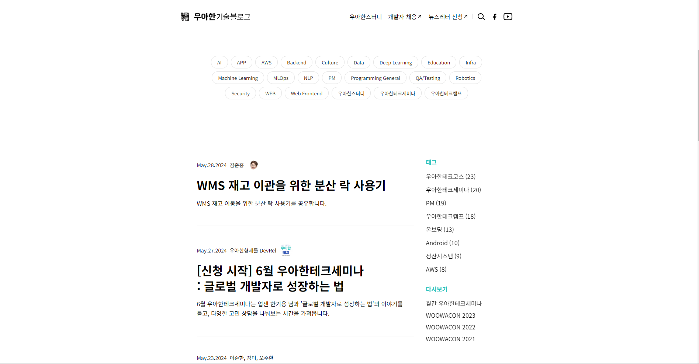
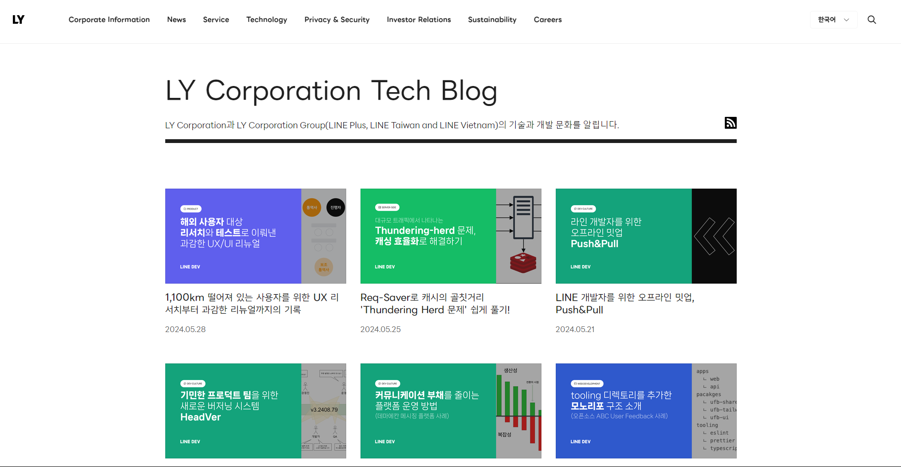
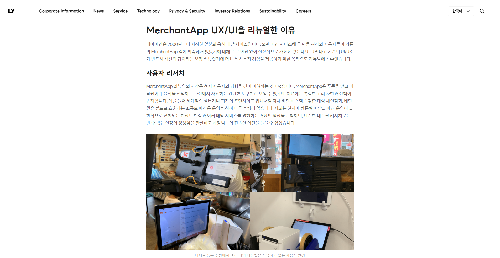
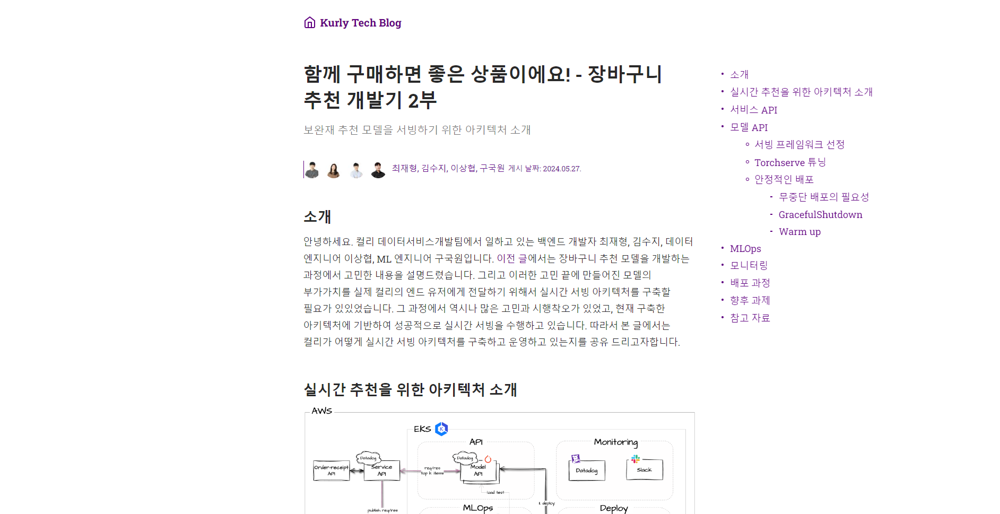
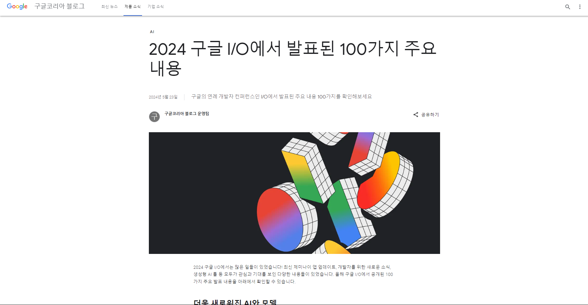
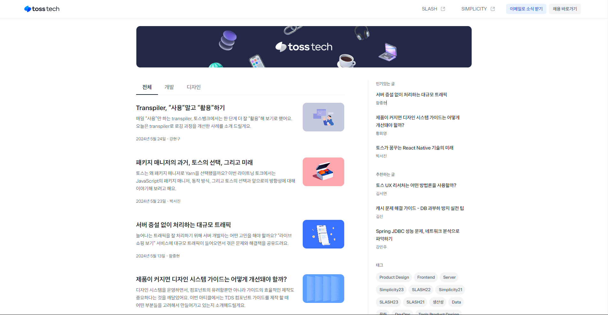
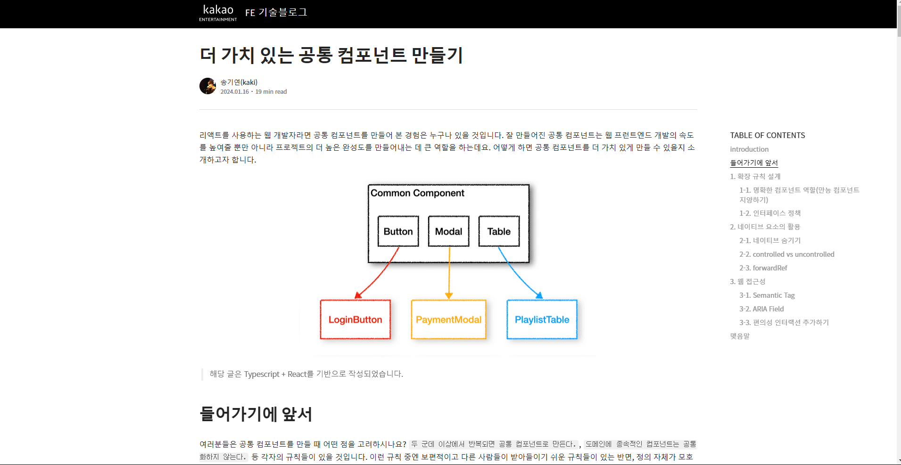

# 홈페이지 디자인

---

이전 `docs` 에서 `git flow branch` 전략을 이용한 `CI` , `Vercel` 을 이용한 `CD` 에 대해 공부했다.

물론 제대로 된 `CI` 를 위해선 `dev branch -> release branch -> main branch` 로 넘어갈 때 테스트 코드를 사용해서 테스트를 통과해야만 `main branch` 로 병합되도록 해야 하는데

우선은 추후 복잡한 기능들을 추가 할 떄 넣기로 하고 지금은 디자인만 우선 해보려 한다.

# 어떤 `UI` 라이브러리를 쓸까 ?

---

직접 스타일드 컴포넌트를 이용해서 만들까도 생각했지만 지금은 프로토타입 단계라 생각하고 `tailwind` 를 쓰기로 했다.

`tailwind` 를 쓰면 동일한 디자인 패턴으로 작성된 클래스명을 쓸 수 있기 때문에 일관된 디자인을 유지 할 수 있다.

> _물론 공식문서를 보고 클래스명을 찾아 다녀야하는 런닝커브가 좀 있다 .. 나는 완전 끼고 산다 😂_

### 필요한 라이브러리 설치하기

> _사실 생각해보니 나는 `nextJS` 앱을 만들 때 이미 `tailwind` 를 사용하기로 해뒀기 때문에 밑의 과정은 필요가 없었다._ > _바로 `configuration file` 초기화 하기 부터 봐도 될 것 같다._

---

```bash
$ npm install -D tailwindcss postcss autoprefixer
```

- `-D` : 예전부터 개발모드로 `install` 한다는 것이 어떤 뜻인지 궁금했는데 이는 **개발시에만 필요한 라이브러리**나 도구로 런타임시 필요하지 않은 라이브러리로 설치 할 떄 사용한다고 한다.

```tsx
  "dependencies": {
    /* 일반 모드는 dependencies 에 설치 됨 */
    "next": "14.2.3",
    "react": "^18",
    "react-dom": "^18"
  },
  "devDependencies": {
    "@types/node": "^20",
    "@types/react": "^18",
    "@types/react-dom": "^18",
    "autoprefixer": "^10.4.19",
    "eslint": "^8",
    "eslint-config-next": "14.2.3",
    /* 개발모드로 설치된 것들은 devDependencies에 */
    "postcss": "^8.4.38",
    "tailwindcss": "^3.4.3",
    "typescript": "^5"
  }
```

- `tailwind`

유틸리티 우선의 `CSS` 프레임 워크로 다양한 유틸리티 클래스를 제공하여 `tailwind` 에서 제공하는 유틸리티 클래스를 이용하여 스타일을 빠르고 유연하게 바꿀 수 있다.

- `postcss`

`CSS` 를 변환하고 확장하기 위한 도구로 `CSS` 를 최적화 하기 위한 다양한 플러그인들을 제공한다.

이후에 나올 `autoprefixer` 도 `postcss` 의 플러그인중 하나이다.

최적화를 위한 기능 중 예시는 사용하지 않는 스타일 속성을 빌드 시 제거하는 트리쉐이킹등이 있다.

- `autoprefixer`

`autoprefixer` 는 `postcss` 의 플러그인 중 하나로 말 그대로 자동으로 접두사를 붙여준다.

브라우저간 스타일 속성이 최근 브라우저에 맞춘 스타일 속성이 구형 브라우저에는 적용이 되지 않을 수 있다.

이 때 `autoprefixer`는 오래된 브라우저를 위해 자동으로 `-wewbkit-flex` 라는 접두사를 붙여 다양한 브라우저에서도 호환 가능하게 해준다.

### `Configuration File` 초기화하기

---

```bash
$ npx tailwindcss init -p

Created Tailwind CSS config file: tailwind.config.js
Created PostCSS config file: postcss.config.js
```

초기화를 통해 `tailwind , postcss` 의 `config` 파일들을 생성한다.

> ### `config` 파일 ?
>
> `config` 파일은 소프트웨어나 프로그램의 설정을 정의하고 관리하기 위한 파일이다.
> 해당 파일들을 설정함으로서 동작하는 방식을 사용자가 원하는대로 조정 할 수 있다.

```tsx
/* tailwind.config.ts */
import type { Config } from 'tailwindcss';

const config: Config = {
  content: [
    /* tailwind 가 스타일을 적용할 파일들 */
    './src/components/**/*.{js,ts,jsx,tsx,mdx}',
    './src/app/**/*.{js,ts,jsx,tsx,mdx}',
  ],
  theme: {
    extend: {},
  },
  plugins: [],
};
export default config;
```

`tailwind` 의 `config` 를 설정해준다. 나는 따로 테마나 플러그인을 사용하지 않을 것이기 때문에 나머지 장소는 비워주었다.

```js
/* postcss.config.mjs */
import tailwindcss from 'tailwindcss';
import autoprefixer from 'autoprefixer';

export default {
  plugins: [tailwindcss, , autoprefixer],
};
```

### `tailwind CSS` 적용하기

---

`NextJS` 에서 `root layout` 에서 `import` 해서 사용할 , 즉 `globals.css` 파일에서 `tailwind` 를 불러와줘야 한다.

```tsx
/* app/layout.tsx */
import './globals.css';
...
```

모든 파일에 적용될 `root layout` 에서 사용하는 `css` 파일에 다음과 같이 설정한다.

```css
@tailwind base; // base style 을 css에 삽입
@tailwind components; // components style 을 css에 삽입
@tailwind utilities; // utilities style 을 css 에 삽입
```

이는 `tailwind` 에서 사용하는 특별한 지시어로 `tailwind` 의 핵심 기능들을 `CSS` 파일에 삽입하는 역할을 한다.

# 디자인 레퍼런스들 찾아보기

---

오케이 ~ 이제 준비는 끝났으니 어떻게 디자인 할지 찾아봐야겠다.

- **우아한 형제들 기술 블로그**
  

우아한 형제들 기술 블로그는 상단에 있는 태그 목록들을 클릭하면 태그 목록들을 만족하는 게시글들만 가져 올 수 있다.

되게 직관적이고 좋은 것 같다.

- **네이버 라인 기술 블로그**
  
  

- **컬리**
  
  

- **구글 코리아**
  

- **토스**




- **카카오**




블로그를 만들기 위해 필요한 페이지는 크게 두 가지인 것 같아 중요하다 생각하는 두 개의 페이지만을 가져왔다.

### 전체적인 특징

---

전체적인 특징으로는 모두 좌,우 여백이 매우 낭낭하다는 것이다.

어차피 사람의 시선은 중앙에서 머무르기 때문에 컨텐츠르 받아들일 떄 시선을 좌 우로 많이 움직이는 것보다 좁은 영역으로 가둠으로서 집중력을 높힐 수 있기 때문이다.

또 , `GNB (Global Naviation Bar)` 이 존재한다는 점이 전체적인 특징이라 생각된다.

### 게시글을 모아두는 페이지

---

게시글을 모아두는 페이지는 두 종류가 있는 것 같다.


썸네일을 크게 하여 마치 쇼핑몰처럼 제목과 썸네일만 존재하는 페이지


썸네일을 작게하고 게시글들을 리스트 형태로 존재하는 페이지

나는 게시글들을 리스트 형태로 존재하는 형태로 구성하고 , 태그 별 혹은 시리즈 별로 게시글 리스트를 필터링 하는 방식을 사용하려 한다.

제목과 썸네일만 존재하는 페이지의 경우에는 게시글의 내용을 강조하기 위해서 썸네일을 매번 만들어야 하는데 썸네일을 매번 이쁘게 만들 자신이 없기 때문이다.

또 , 제목과 요약글로 이뤄진 게시글 리스트가 훨씬 보기에 어떤 게시글인지 파악하기가 쉬운듯 싶어서 말이다.

### 글 본문을 담는 페이지

---

글 본문은 대부분 비슷하다. 글 본문엔 인디게이터가 존재하는 곳이 있고 존재하지 않는 곳이 있었는데 나는 인디게이터를 추가해주려 한다. :)

<<<<<<< HEAD
대부분의 디자인 레퍼런스는 우아한 기술 블로그를 참고하여 만들도록 하자 화이
=======
대부분의 디자인 레퍼런스는 우아한 기술 블로그를 참고하여 만들도록 하자 화이팅
>>>>>>> release/hotpix
