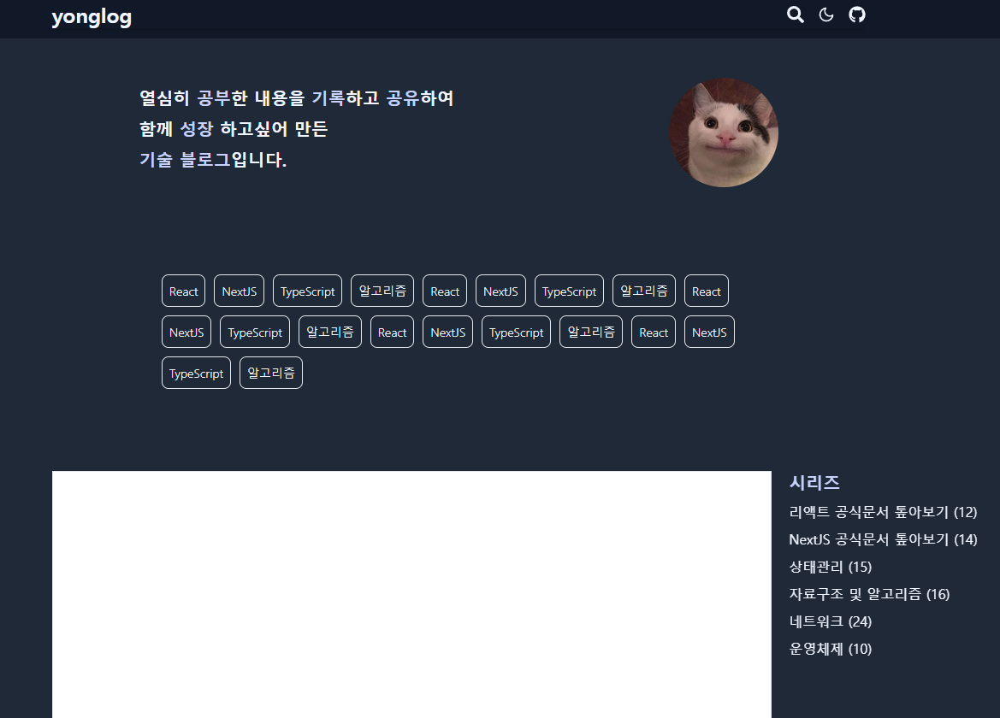
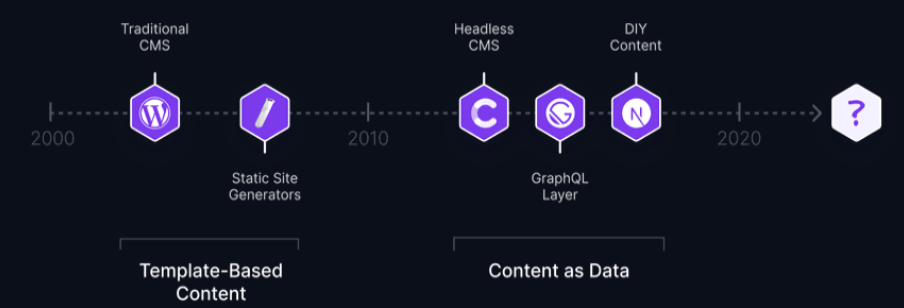
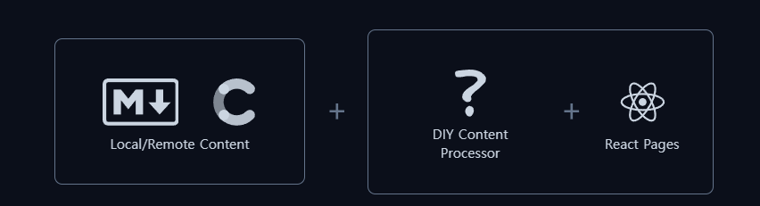
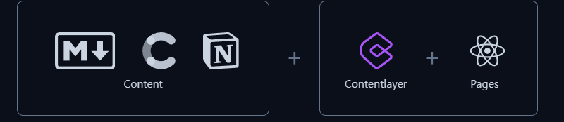

이전 `docs` 과정까진 `/` 경로에 대한 `layout, page` 를 정의했다.

이제 하얀 부분에 들어갈 컴포넌트를 정의해줘야 하는데 하얀 부분은 내 포스팅 된 게시글들의 리스트를 이용해 구성하려 한다.

그렇다면, 포스팅된 게시글들의 리스트를 만들기 위해 포스트들을 구성해줘야 하기에 포스팅에 사용할 `MDX` 의 개념에 대해 공부하도록 하자

우선적으로 나는 `contentLayer` 라는 라이브러리를 이용하려 한다. 그렇기에 `ContentLayer` 의 공식문서에서 설명하는 개념과 철학에 대해 공부해보자

# `Content` 를 이용해 작업하는 것이 가지는 의미

---

🪢 <a href = 'https://contentlayer.dev/blog/working-with-content-is-hard-for-developers'>Why Working with Content is Hard for Developers</a>

`ContentLayer` 의 `why contentLayer ?` 문서를 참고하였다.

`MDX` 는 사실 `Content` 를 이용해 작업하기 위한 도구에 불과 할 뿐 **중요한 점은 코드가 아닌 순수한 `text` 파일들을 이용해 코드에 이용한다는 것**일 것이다.

`ContentLayer` 의 공식문서에선 `Content` 들을 이용해 작업하는 단계들을 시대적 흐름에 따라 소개하고 `ContentLayer` 의 장점을 설명한다.

## `What is CMS ?`

---



해당 도식화는 시대적 흐름의 따른 `CMS` 의 변경사항이다.

그렇다면 `CMS` 는 무엇일까 ?

`CMS` 는 `Content Management System` 이다.

결국은 `Content` 들을 어떻게 관리하고 어떻게 이용할 것인지에 대한 관리 체계를 의미한다.

이제 굵직굵직하게 `CMS` 들의 변화와 `ContentLayer` 의 철학을 살펴보자

> 모든 내용들을 작성하진 않을것이다. 하지만 내용이 매우 좋으니 개인적으론 해당 문서를 읽어보는 것을 추천한다. :)

## 프론트엔드가 발전하기 전, `Template-Based Content`

---


2000년대 초, 첫 웹은 `Template-Based CMS` 로 이뤄졌다.

즉 , `Content` 만을 저장하는 `DB` 를 따로 두고, 제작할 `html` 의 템플릿들을 정의한다.

이후 , 클라이언트의 요청에 따라 `Server Side Templates` 를 이용해 `Content` 와 `Template` 를 결합하여 `html` 문서를 생성하여 전송했다.

전통적인 `CMS` 방식의 가장 큰 문제는 `Content` 와 `Server Side Template` 이 종속성을 갖는다는 것이다.

모두 하나의 거대한 `App` 하나에서 관리되었기 때문에 , 만약 `Content DataBase` 의 수정이 일어나면 템플릿을 변경해야 하고 , 템플릿을 변경하면 `Content DataBase` 등을 수정해줘야 했다.

## 프론트엔드가 발전하던 중 ,`Content as Data`

---

위의 `Template-Based CMS` 이후 리액트와 같이, 자바스크립트 언어의 비중이 늘어났을 때부터 `Content` 를 `Data` 처럼 이용하는 것이 가능해졌다 .


`CMS` 만을 위한 `DB` 를 따로 두고 , 프론트엔드 단에서 `API` 를 이용해 `Content` 를 불러와 `Data` 처럼 사용하는 방식이다.

위 방식은 `CMS` 와 프론트엔드 작업의 종속성을 제거시켜 `CMS` 를 `Headless` 하게 만들었다.

> ### `Headless?`
>
> `Headless` 는 `backend-only` 를 의미한다. 즉 프론트엔드 단의 로직과 충돌하지 않는 방식으로 , 위의 `Headless CMS` 는 완전히 프론트엔드단의 로직에 종속되지 않는다.
>
> 프론트엔드단과 `CMS` 는 `API` 와 종속성을 갖고 있을 뿐 프론트엔드 로직에는 영향을 끼치지 않는다.

`headless` 한 `CMS` 는 `CMS` 와 프론트엔드 로직의 충돌 없는 확장성을 가져왔다.

하지만 이러한 `headless CMS` 는 장점만 존재하는 것이 아니였다.

우선 `CMS` 와 프론트엔드가 단절되어있기 때문에 프론트엔드 단에서 기대하는 컨텐츠가 `Content DB` 에 존재하는 것을 확신 할 수 없었고

`CMS` 와 프론트 단이 잘 작동하는지를 확인하기 위해선 배포 후, `API` 요청 이후에나 확인 할 수 있었다.

## 모던 프론트엔드 프레임 워크를 이용 ,`Content Processing`

---



`NextJS` 의 경우엔 앱 라우팅을 통해 프론트엔드 단에 `Content` 를 둔 후 서버에서 렌더링 할 때 해당 `Content` 를 `Data` 로 가져와 렌더링 할 때 사용했다.

> `API` 를 이용해 `Content` 를 호출해 사용한다는 것은 동일하다. 하지만 `Content` 가 위치하는 곳이 프론트엔드 단과 가까우며 , `SSR` 을 이용했다는 점에서 모던 프론트엔드 프레임 워크라고 설명했다.
>
> > _물론 같은 로컬 파일에 두는 것 뿐 아니라 외부에서 `API` 요청을 통해 가져 올 수도 있다._

이는 `Headless` 한 `CMS` 를 유지하면서도 `SSR` 기법을 이용하기 때문에 배포 전에도 결과물을 확인하는 것이 가능했다.

하지만 `NextJS` 에서 `Content` 를 가져와 렌더링에 사용하기 위해선 해당 `Content` 를 전처리 하는 과정들이 필요했다.

**이런 과정은 보일러플레이트 코드를 늘릴 뿐더러 개발자들이 사용하기 위한 런닝커브가 존재했다.**

## `ContentLayer` 두두등장 , `Contentlayer Makes Content Easy for Developers`

---



`ContentLayer` 는 `Content` 를 가져와 코드에 이용 할 때 필요한 과정들을 쉽게 설정 할 수 있도록 도와주는 라이브러리이다.

주요 특징은 다음과 같다.

- `import` 를 통해 `Content` 를 불러오는 것이 가능하다. (로컬 파일의 경우)
- `Content` 의 `meta-data` 를 이용해 `Validation` 이 가능하다.
- 타입스크립트와 호환이 잘 되어 , `Validation` 이 가능하다.
- 개발 시 `live re-loading` 이 가능하다. 즉 `Content` 가 변경되거나 코드가 변경되었을 때의 수정 사항을 개발 시 즉각적으로 알 수 있다.
- 증분적 `build` 가 가능하다 .

```arduino
Before:
[Build All Content] -> [Deploy]

After:
[Detect Change] -> [Build Changed Content] -> [Deploy]
```

증분적 `build` 란 배포 시 모든 데이터를 이용해 배포하는 것이 아닌, 변경된 사항에 대해서만 이용해 배포하는 것이다.

이를 통해 `build` 하는 시간을 높힐 수 있다.

- 병렬적 `build` 가 가능하다 .

```aduino
Before:
[Task 1] -> [Task 2] -> [Task 3] -> [Deploy]

After:
[Task 1] + [Task 2] + [Task 3] (executed in parallel) -> [Deploy]
```

또 , 병렬적인 `build` 가 가능하기에 배포 시간이 높아진다.

**즉 `ContentLayer` 는 `Content` 를 모던 프레임워크에서 `Contet` 를 다루기 위한 설정, 사용, 배포를 도와주는 라이브러리이다.**
